# Software Architecture Document (Lite): Spec Kitty Design System

| Field | Value |
|---|---|
| **Status** | Accepted |
| **Date** | 2026-05-01 |
| **Owner** | Stijn Dejongh |
| **Version** | 1.0 |
| **Scope** | Repository-level architecture for `spec-kitty-design` |
| **Related ADRs** | The whole of [`decisions/`](decisions/), indexed with each record's current status in [the architecture README's ADR table](README.md#decisions-adrs). No range is written out here — see the note below |
| **Related spec** | `kitty-specs/design-system-monorepo-infra-ci-scaffold-01KQHEEJ/spec.md` |

> **On the Related ADRs row (#201).** This row read `ADR-001 through ADR-005` — a hand-written
> range, in the document the architecture README calls *"Start here"*, against a directory that
> now holds fifteen records. It was not a scoped statement about what informed v1.0: this
> document's own body cites eight records outside that range, added by commits well after the
> 2026-05-01 date in the header, so the range had already been outgrown by the text beneath it. It is the fifth instance of the shape #193 measured and #199 removed elsewhere, and the
> last one anybody had found. The row now points at the table `scripts/check-adr-index.mjs`
> holds to `decisions/` in both directions — a row for every record, a record for every row, and
> the Status column transcribed from each record's own — which is the same move
> `elements-first-programme.md` made for the identical reason, and #197's ruling.
>
> Identifiers: this document writes the older padded `ADR-001` form in several places. No record's
> own H1 uses it except the ADR-003 addendum's, but it is not a dead identifier — it appears
> across a dozen files, including ADRs citing their siblings — so it is left alone here. That is a
> style question, not a rename, and not this note's subject.

---

## 1. Purpose and Scope

This document describes the architecture of the Spec Kitty Design System — a multi-framework, publishable design system for the Spec Kitty ecosystem and Priivacy-ai organisation. It covers system boundaries, package topology, bounded contexts, quality attributes, and the risk landscape at a level sufficient to guide implementation without prescribing implementation details.

**What this document is not:**
- An implementation guide (see `kitty-specs/` mission specs)
- A per-component specification (see Storybook once built)
- A live changelog (see `CHANGELOG.md` and ADRs)

**Architectural vision:** The design system is *token-first, framework-progressive*. The `@spec-kitty/tokens` CSS custom property layer is the long-lived, framework-agnostic foundation. Since ADR-8 the component layer is a **custom element**, which is the platform rather than a framework, so there is no adapter to age out. Framework packages still exist where a consumer needs one — `@spec-kitty/react` for JSX typing — but they are **generated from the Custom Elements Manifest**, not hand-maintained, and a wrapper is published only when a consumer exists. The original vision described Angular and future targets as short-lived lifecycle adapters; ADR-8 kept the reasoning and removed the hand-maintenance. When a framework ages out, only its adapter package changes — the token layer is untouched.

---

## 2. C4 Level 1: System Context

> Source: [`assets/c4-l1-system-context.mmd`](assets/c4-l1-system-context.mmd)

### Actor and system roles

| Entity | Role |
|---|---|
| Application Developer | Imports `@spec-kitty/elements` and `@spec-kitty/tokens` — the elements are custom elements, so no framework wrapper is required; builds SK dashboard, custom apps |
| React Developer | May additionally import `@spec-kitty/react` for JSX typing and typed refs. Optional: React 19 uses custom elements natively |
| Static/HTML Developer | Links `@spec-kitty/tokens` via CDN or file; no build step required |
| AI Coding Agent | Reads `SKILL.md` and `doctrine/` artifacts to generate brand-compliant output |
| `@spec-kitty` npm scope | Package registry; single distribution channel for all publishable artifacts |
| GitHub Pages | Public Storybook hosting; auto-deployed on merge to `main` |
| Marketing site (`spec-kitty.ai`) | Source of canonical `--sk-*` token values; must be reconciled with Claude Design reference (FR-034) |
| Claude Design reference (`tmp/`) | Authoritative visual baseline for v1; gitignored; not distributed |
| `spec-kitty` repo | Primary downstream consumer; dashboard UI overhaul (#650) |
| Future docsite | Secondary downstream consumer; docsite refresh (#648) |

---

## 3. C4 Level 2: Package / Container View

> Source: [`assets/c4-l2-package-topology.mmd`](assets/c4-l2-package-topology.mmd)

### Package responsibilities

| Package | Responsibility | Consumers |
|---|---|---|
| `@spec-kitty/tokens` | Single source of truth for all `--sk-*` visual values; zero-build-step distribution | All other packages; any HTML/CSS surface |
| `@spec-kitty/styles` | The CSS source of record, plus **generated** static HTML | Static HTML surfaces, Jekyll/Hugo themes, any JS project |
| `@spec-kitty/elements` | The Lit custom elements — the component layer since ADR-8 — and the **authored** markup module every static form is generated from | Every consumer; no framework wrapper required |
| `@spec-kitty/react` | **Generated** React wrappers, for JSX typing and typed refs. Never hand-edited; CI fails on drift | React applications that want typing (optional) |
| Storybook | Living documentation; visual regression CI surface; multi-framework renderer; deployed to GitHub Pages | Contributors, component consumers, CI |
| `doctrine/` | Brand voice + visual identity governance for AI agents; org-layer doctrine bundle; SKILL.md | AI agents working on any Priivacy-ai project |
| CI pipeline | Quality enforcement: CVE scan, linting, a11y, visual regression, cross-browser, Lighthouse, SBOM | Every PR and release |

### Dependency rules

1. `@spec-kitty/tokens` has **no** dependencies on other packages in this repo.
2. `@spec-kitty/styles`, `@spec-kitty/elements` and `@spec-kitty/react` depend on `@spec-kitty/tokens` as a peer dependency only — they do **not** bundle token values.
3. No framework package depends on another framework package.
4. `doctrine/` is an independent directory with no npm dependency on any package.
5. Storybook is a development tool; it is **not** a dependency of any published package.

---

## 4. Bounded Contexts

> Source: [`assets/bounded-context-map.mmd`](assets/bounded-context-map.mmd)

**Package dependency chain:**

> Source: [`assets/package-dependency-graph.mmd`](assets/package-dependency-graph.mmd)

### 4.1 Token Authority Context

**Purpose:** Own all `--sk-*` CSS custom property definitions. The single source of truth for every visual decision in the ecosystem.

**Inbound:** Token schema decisions (ADR-003); value reconciliation from marketing site CSS (FR-034)
**Outbound:** `@spec-kitty/tokens` npm package; CDN-hosted CSS file

**Invariant:** No token value is defined outside this context. All other contexts consume tokens by name reference, never by hardcoded value (C-003, C-009, SK-D01).

**Ubiquitous language:** design token, custom property, `--sk-*` namespace, token catalogue, semantic pair (surface + foreground)

---

### 4.2 Component Library Context

**Purpose:** Provide framework-specific component implementations that express the design language for their target rendering environment. Owns rendering ergonomics; does not own visual values.

**Sub-contexts:**
- **Custom Elements** (`@spec-kitty/elements`) — targets the platform, not a framework. Lit is a build-time dependency with no LTS obligation, which is what ADR-8 bought
- **HTML/JS Primitives** (`@spec-kitty/styles`) — framework-agnostic; no build step required for consumers

**Inbound:** Token authority context (token values); Storybook stories (documentation obligation)
**Outbound:** One published custom-element package, plus a generated wrapper only where a consumer needs one (ADR-8)

**Invariant:** Components render visual state using `--sk-*` tokens exclusively. Components do not override token values (ADR-001).

---

### 4.3 Documentation and Visual Regression Context

**Purpose:** Provide the authoritative public reference for design system consumers; serve as the CI visual regression surface.

**Inbound:** Stories from all component packages; token catalogue for "Getting Started" reference
**Outbound:** GitHub Pages public URL (auto-deployed on `main`); PR preview deployments (NFR-008); visual baseline snapshots for CI

**Dual-role tension:** The Storybook serves both consumers (reference documentation) and CI (regression baseline). These two roles require different freshness semantics — documentation reflects released content; regression reflects `HEAD`. This tension is acknowledged; resolution is deferred to CI configuration.

---

### 4.4 Doctrine Bundle Context

**Purpose:** Provide brand governance artifacts that AI agents load as governance context when working on any Priivacy-ai project.

**Inbound:** Brand voice rules and visual identity constraints (distilled from Claude Design reference README and `colors_and_type.css`)
**Outbound:** `doctrine/` directory (org-layer source for spec-kitty #832 `fetch`); enhanced `SKILL.md` (agent skill)

**Invariant:** Doctrine artifacts follow the spec-kitty shipped YAML schema and pass `charter synthesize --dry-run` validation. Illustration content boundary (SK-D02) is encoded as a directive, not just prose.

---

### 4.5 Supply Chain and Release Context

**Purpose:** Ensure every artifact that leaves the repository is traceable, CVE-free, and provenance-attested.

**Key controls:** `npm audit --audit-level=high`, `npm ci --ignore-scripts`, Actions SHA pinning, `npm publish --provenance`, CycloneDX SBOM, Dependabot (FR-040–046, C-009)

**Residual risk acceptance:** Formally documented in ADR-005. Reviewed and accepted by maintainer 2026-05-01.

---

## 5. Quality Attributes

> Token namespace overview — Source: [`assets/token-schema-categories.mmd`](assets/token-schema-categories.mmd)

Assessed using the AMMERSE framework. Full analysis in [`quality-attribute-assessment.md`](quality-attribute-assessment.md).

| Attribute | Rating | Key factor |
|---|---|---|
| **Agile** (adaptability) | +0.5 | Additive framework targets; token layer stable across framework churn |
| **Minimal** (simplicity) | +0.3 | CSS custom properties are native browser tech; no build step for token consumers. Offset by monorepo tooling complexity |
| **Maintainable** | +0.6 | Clear package boundaries; semantic token naming; ADRs document all key decisions |
| **Environmental** (fit) | +0.7 | WCAG 2.1 AA hard gate; dark mode default; no emoji; matches existing marketing site token language |
| **Reachable** (feasibility) | +0.4 | Infrastructure-first scope limits v1 blast radius; token reconciliation (FR-034) is the highest-risk pre-gate |
| **Solvable** (problem fit) | +0.8 | Directly addresses documented pain (#338, #646, #650); token authority eliminates root cause of brand drift |
| **Extensible** | +0.7 | Additive package model; org-layer doctrine distribution forward-compatible with #832 |

---

## 6. Risk Landscape

> Supply chain control layers — Source: [`assets/supply-chain-security-controls.mmd`](assets/supply-chain-security-controls.mmd)

Full risk register in [`risk-register.md`](risk-register.md). Top-5 prioritised risks:

| # | Risk | Impact | Likelihood | Primary mitigation |
|---|---|---|---|---|
| R01 | `@spec-kitty` npm scope not owned before publishing infrastructure is built | Critical | Medium | Pre-flight check before any release pipeline work (ADR-005) |
| R02 | Token reconciliation (FR-034) reveals significant drift between Claude Design reference and live marketing site | High | Medium | FR-034 is a pre-implementation gate; ADR-003 |
| R03 | ~~Angular LTS rotation breaks `@spec-kitty/angular` consumers mid-dependency window~~ **RETIRED by ADR-8** — no framework runtime, and `packages/angular` was deleted in #102 | — | — | No longer applicable; retained as the record of a risk that was discharged rather than mitigated |
| R04 | CI pipeline exceeds 10-minute NFR-002 as component count grows | Medium | High | FR-035 path-scoped CI triggering from day one |
| R05 | Storybook major version upgrade breaks CI visual regression baseline | Medium | High | Storybook pinned; Dependabot major bumps excluded from auto-merge |

---

## 7. Architectural Decision Index

The index is [the architecture README's ADR table](README.md#decisions-adrs). It carries one row
per record in [`decisions/`](decisions/), transcribes each record's own **Status** field, and
`scripts/check-adr-index.mjs` fails CI when a record has no row, a row points at no record, or a
row's Status disagrees with the record's own. Read the Status column with the records: the
README's *"What a Status obliges"* note states what `Accepted` and `Proposed` each require, under
the #200 ruling.

> **On this section (#226).** It held a second ADR index — a 13-row `ADR | Decision | Status`
> table, hand-maintained and held by no gate, in the document the architecture README calls
> *"Start here."* Measured at removal, against the fifteen records on disk: **two rows were
> missing entirely** (ADR-14, and the ADR-003 addendum), and **two Status cells asserted
> `Accepted` over a record whose own header reads `Proposed`** (ADR-12 and ADR-13). Two further
> cells had been wrong for ADR-9 and ADR-11, and stopped being wrong in the commit before this
> one, when the operator's ruling on #200 ratified both — which is the argument against a second
> index rather than for one: an ungated table is right or wrong by coincidence.
>
> Correcting the two cells and leaving the table ungated is what produced #226, and #193 before
> it. So the table is gone rather than fixed, which is the answer this repository has reached at
> `elements-first-programme.md:5`, at `llms.txt`/`llms-full.txt` (#197), at this file's
> **Related ADRs** row (#201), here, and at `CLAUDE.md`'s own "ADR index" line — that last one
> found while writing this note, still reading "eight ADRs" against fifteen records, and
> repointed in the same commit. Five is the number of instances **found**, not a proof that none
> remain: every one of them was found by someone looking for something else.
>
> **The Decision column.** The removed table was `ADR | Decision | Status`; the gated one is
> `ADR | Title | Status`, and a Title is a transcribed H1, not a decision — ADR-9's row read
> "Open shadow roots; consumers restyle through `::part()`" where the gated table reads "Shadow
> DOM, the Styling API, and Label Ownership". Those one-line glosses live in `llms-full.txt` §2,
> which carries a `**Decision:**` line for 13 of the 15 records. **Two have none:** ADR-10, whose
> section states its rulings as numbered clauses instead, and the ADR-003 addendum. So for ADR-10
> the single-sentence "what did this decide" gloss this table used to carry now exists on no
> surface this section points at. Recorded rather than reconstructed here: writing one would be
> authoring a summary, which is what an index is not for.
>
> **The two `Superseded by ADR-013` cells.** ADR-006 and ADR-007 carried that phrase here, and
> the gated table does not use it — it transcribes each record's own Status, and neither record
> says `Superseded`. That is editorial content, not a transcription, so it was checked before
> being removed rather than after. It survives in three places: `llms-full.txt` states **both**
> halves in prose ("ADR-6 and ADR-7 are superseded on the framework question … summarised as the
> record of why the catalogue looks as it does, not as current guidance"), on a surface
> `scripts/check-llms-adr-surface.mjs` holds; ADR-13's own record states the ADR-6 half in its
> **Technical Story** and **More Information**; and `system-context-canvas.md` records it as a
> discharged assumption. Nothing was written into ADR-006's or ADR-007's Status field to replace
> it — ADR-13 supersedes ADR-6 by its own text and never names ADR-7, so a `Superseded` status in
> either record would be a ruling nobody made, which the gate would then faithfully transcribe.

---

## 8. Key Constraints Reference

Constraints that have significant architectural consequence (full list in mission spec):

| Constraint | Implication |
|---|---|
| C-003 / C-009: no hardcoded values; no `*`/`latest` specifiers | Token authority rule is enforceable by linting; every value traces to `@spec-kitty/tokens` |
| ~~C-007: Angular targets current LTS~~ **RETIRED by ADR-8** — the component layer is a custom element with no framework runtime, so there is no LTS rotation to track; `packages/angular` was deleted in #102 | — |
| C-008: illustrations excluded from software packages | Enforced as SK-D02 directive; CI must gate on presence of illustration assets in distribution output |
| FR-034 pre-implementation gate | No token package implementation begins before token schema ADR value reconciliation is complete |
| ADR-005 pre-flight: scope ownership | `@spec-kitty` npm scope must be confirmed owned before any publishing CI work |

---

## 9. Open Questions

| Question | Owner | Status |
|---|---|---|
| Which monorepo orchestrator: nx or turborepo? | Maintainer | Deferred to planning |
| PR preview deployment tooling: Chromatic vs Netlify vs Surge? | Maintainer | Deferred to planning (NFR-008 acknowledged) |
| Token value reconciliation result: how many discrepancies between `tmp/` and live site? | Maintainer | Pre-implementation gate; FR-034 |
| OKLCH vs hex/hsl for token values? | Maintainer | Deferred to ADR-003 addendum |
| `@spec-kitty` npm scope: owned/available? | Maintainer | Pre-flight check; blocks release pipeline work |
