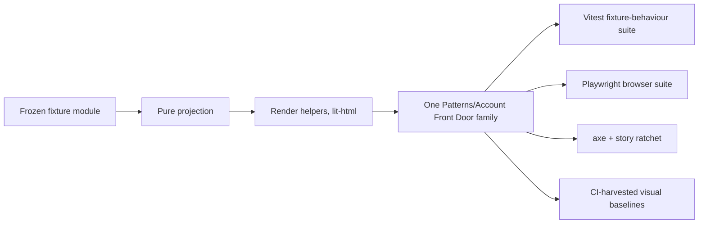

# Implementation Plan: Account Front Door Pattern Stories

**Branch**: `mission/account-front-door-pattern-stories` (handle `account-front-door-pattern-stories-01M26B1M`, topology `single_branch`)
**Date**: 2026-09-11
**Spec**: [`spec.md`](./spec.md) — authored `dac543da` on this branch (the pre-rebase hash `9cb153c7` names the same content before the branch was replayed onto the current train tip)
**Base**: `train/elements-first` @ `0a232a01` — re-fetched 2026-09-11, `origin/train/elements-first` and the local base are the same commit
**Input**: GitHub issue `spec-kitty/spec-kitty-design#355`, child of epic `#352`, tracking `#125`. Design authority: `ux_redesign/families/06-account-front-door` (read-only).

## Summary

Publish one Storybook-only pattern family that proves six representative Family 6 compositions from
surfaces the design system already ships, native semantic HTML, immutable frozen fixtures, pure
display projections and pattern-local layout. The mission adds a fixture module, a stories module,
a Vitest fixture-behaviour suite, a Playwright browser suite, visual baselines, ratchet entries and
one documentation section. It publishes no runtime component.

**The spec was authored on 2026-09-10 while every dependency was unmerged, and says so: FR-029 and
SC-015 make a dated reconciliation the first act of implementation.** That reconciliation is
performed below, at the plan point-cut, against `train/elements-first@0a232a01`. Every dependency
the spec treated as provisional has landed. **Fifteen of the spec's assumptions differ from what
shipped. The repository wins in all fifteen; each is named with its file below, and the
requirements it touches are amended here rather than during implementation.**

The mission still ships as **one Work Package and one PR** (C-017). The phased-delivery clause
FR-030 and the no-baselines-before-merge clause C-012/NFR-010 are now **satisfied at the start**
rather than sequenced through the work package: nothing is deferred, because nothing is unmerged.



---

## Part 0 — Contract reconciliation (FR-029, SC-015)

**Performed**: 2026-09-11, in `/home/jeroennouws/dev/spec-kitty-design-missions/355`.
**Method**: `git fetch origin train/elements-first` (tip unchanged at `0a232a01`); direct reading of
every composed surface's stylesheet, markup source, element source, published story fixtures and
`docs/design-system/using-components.md` section; `gh issue view` for each dependency.

### 0.1 Dependency block, re-derived

| Surface | Issue | Issue state 2026-09-11 | On the train at `0a232a01`? | Evidence |
|---|---|---|---|---|
| `.sk-public-header` | #353 | **CLOSED** | Yes | `packages/styles/src/public-header/sk-public-header.css` + 8 exemplar `.html` files + 13 ratcheted story ids |
| `sk-site-footer` compact | #354 | **CLOSED** | Yes | `packages/elements/src/site-footer/sk-site-footer.markup.ts` (`SITE_FOOTER_AXES`), `sk-site-footer.ts` (`slot name="compact-links"`), `packages/styles/src/site-footer/sk-site-footer.css:186-235` |
| `sk-boundary-page` | #303 | **CLOSED** | Yes | `packages/styles/src/boundary-page/sk-boundary-page.css` + 11 exemplars; follow-up #356 also **CLOSED** |
| `.sk-input` / `sk-form-input` contract | #321 | OPEN (issue), **code landed** | Yes | `packages/styles/src/form-field/sk-form-field.css:34-92` — the `min-block-size: var(--sk-space-9)` comment cites #321 and the CI-rendered work-explorer baselines |
| `--sk-border-control-invalid` / `--sk-fg-error` | #350 | **CLOSED** | Yes | `packages/tokens/src/tokens.css:219,259` (dark) and `:467,480` (light); consumed at `sk-form-field.css:26-27,81-83,122-124` |
| `sk-theme-toggle` | #323 | OPEN (issue), **code landed** | Yes | `packages/elements/src/theme-toggle/` (element, `theme-preference.ts`, `theme-story-environment.fixture.ts`), `packages/styles/src/theme-toggle/sk-theme-toggle.css`, 7 ratcheted ids |
| `.sk-radio-choice-group` | #336 | OPEN (issue), **code landed** | Yes | `packages/styles/src/radio-choice-group/` + 8 exemplars + 14 ratcheted ids; merged as `0a232a01` (PR #366) |
| static `sk-action-row` form | #307 | **CLOSED** | Yes | `packages/styles/src/action-row/` + generated `action-row/static/sk-action-row.static.css` |
| `.sk-button--secondary` border defect | #155 | **OPEN — unfixed** | Defect present | `packages/styles/src/button/sk-button.css:51-58`: `border-color: var(--sk-border-default)` |

**Bottom line reversal.** The spec's "eight of nine hard dependencies remain unmerged" is obsolete.
**Eight of nine have landed.** Only #155 is still an open, unfixed defect, and it is the one
dependency whose landing was never required for composition — it changes a colour, not a contract.
Three issues (#321, #323, #336) are still open as *issues* while their code is on the train; the
tree is the authority (C-019), and the plan composes against the tree.

**Consequence for FR-030 and C-012.** Both remain in force as written, and both are now trivially
satisfied: there is no surface for which "final composition markup and final visual baselines may
not be produced". The work package is therefore **not** split into a deferrable and a blocked half.
The only live instance of C-012 is #155: see §0.3 item 15 and `[NEEDS DECISION] D-1`.

### 0.2 What the spec assumed vs. what shipped

Fifteen differences. The repository wins in every one (C-019).

| # | Spec's assumption | What actually shipped | File | Requirements affected |
|---|---|---|---|---|
| 1 | `.sk-public-header` is "six BEM classes, no custom element, 44px floor pinned on `.sk-public-header__action`" | **Correct**, and the floor is `min-block-size: var(--sk-space-9)` = **48px**, not 44px. `--sk-space-9` is `3rem` | `sk-public-header.css:73-92`; `packages/tokens/src/tokens.css:303` | FR-023, NFR-003 — the floor is satisfied by the family, not by the pattern |
| 2 | Actions may or may not carry the action class | **Every** action must carry `sk-public-header__action`, and that class is what carries the floor. Without it, a composed control has no floor at all | `docs/design-system/using-components.md:989-995` | FR-001, FR-010, NFR-003 |
| 3 | `__actions` behaviour at zero actions unstated | At zero actions the `<nav>` is **omitted entirely**, never rendered empty; the exemplar `sk-public-header-brand-only.html` shows the header with no `<nav>` at all | `sk-public-header-brand-only.html`; docs `:995` | FR-010, Edge Cases |
| 4 | Slot normalisation might be order-dependent | The normalisation is scoped `.sk-public-header .sk-public-header__action` (0,2,0) at rest, one deeper for `:hover/:active/:focus-visible`, and (0,4,0) for `[aria-current]`. It **wins in any bundle order, for `<a>`, `<button>` and composed elements alike** | `sk-public-header.css:96-168` | FR-010 — the pattern must not restate any of it |
| 5 | Compact footer links are `<li>` in a `<ul>` | Compact links are **bare `<a slot="compact-links">`**, direct children of `.sk-site-footer__row`. No `<nav>`, no heading, no `<ul>`, under any input | `sk-site-footer.ts:117-142`; `sk-site-footer.markup.ts:152-182` | FR-001 (chrome), C-015 |
| 6 | Compact link classing unstated | Each compact link must carry **both** `sk-site-footer__link` and `sk-site-footer__link--compact`; the sheet pairs the bare class with `::slotted()` because the anchor is light-DOM and does not descend from the shadow root class | `sk-site-footer.css:233-235` | FR-001 |
| 7 | Zero compact links unstated | Zero links emits **no scaffolding at all** — the slot simply has no assigned nodes. `wordmark`, `tagline` and `legal` are each rendered only when set | `sk-site-footer.ts:117-142` | Edge Cases; the P22/P23 footer supplies tagline + legal + one `Terms` link and no wordmark, exactly the Family 6 shape |
| 8 | `sk-theme-toggle` is "the corpus's `<details>` picker" | It is a **custom element rendering a shadow `<fieldset>` of three native radios** (System/Light/Dark), not a disclosure. Four labels (`label`, `system-label`, `light-label`, `dark-label`) are **required** — with any blank, `render()` returns `nothing` and no control exists | `packages/elements/src/theme-toggle/sk-theme-toggle.ts:209-362` | FR-001, FR-027, C-011 |
| 9 | Composing a theme control is inert | It is **not**: the element writes `localStorage` and mutates `documentElement`'s `data-theme` / `color-scheme`. Any story composing it **must** carry `beforeEach: isolateThemeStory` and mark the control `data-theme-control`, or state leaks across stories and corrupts every later baseline | `theme-story-environment.fixture.ts`; precedent `packages/elements/src/patterns/operational-status.stories.ts:22,46` and `operational-status.ts:394-402` | FR-001, FR-025, NFR-010 |
| 10 | `.sk-radio-choice-group` markup "entirely unknown" | It is a `<fieldset class="sk-radio-choice-group">` → `__legend` → `__options` → one `<label class="sk-radio-choice-group__choice" for=…>` per choice containing `__control` (the radio), `__label`, and an optional `__secondary-value`. `__choice` is a **three-column grid** and carries a 48px floor | `packages/styles/src/radio-choice-group/sk-radio-choice-group.css:46-92`; `-default.html` | FR-019, FR-023 |
| 11 | Validation colour is `--sk-color-red` | It is **not**, and the pattern needs no rule of its own: `.sk-form-field--error .sk-form-field__description` already resolves `--sk-fg-error`, and `.sk-input[aria-invalid="true"]` already resolves `--sk-border-control-invalid`, in both themes | `sk-form-field.css:26-27,81-83` | FR-012, NFR-007 — the pattern composes these classes and authors no error colour except on its own summary-link class, where `--sk-fg-error` is the only permitted value |
| 12 | Field-local error markup follows the shipped exemplar | The shipped exemplar puts `role="alert"` on the field-local `<span class="sk-form-field__description">`. Composing that **and** a `role="alert"` summary double-announces every error. The pattern authors the role on the summary only | `packages/styles/src/form-field/sk-form-input-error.html` | FR-011, FR-012, NFR-008 |
| 13 | `sk-copy-field` needs only a value | It ships **English defaults** for `label`, `success-message`, `manual-message`, `failure-message`. C-011 forbids a library-authored English default reaching a user-visible string, so all four must be fixture-supplied. It reports three outcomes — copied / manual / failed — never a fabricated success | `packages/elements/src/copy-field/sk-copy-field.ts:13-17,48-73` | FR-002, C-011 |
| 14 | `.sk-boundary-page` frames the card only | The frame **also owns its actions**: `.sk-boundary-page__action-group > :is(a, button)` pins `min-block-size: var(--sk-space-9)` at (0,1,1), deliberately unbeatable by a consumer class, and `:where()`-wraps a legibility floor at (0,0,0). Its contract is `<a>` **or** `<button>` only (#356). The card is `class="sk-boundary-page sk-boundary-page__stage"` on **one** node, the stage is `min-block-size: 100dvh`, and `__action-group` is a **required container that is present even when empty** | `sk-boundary-page.css:106-302` | FR-015, FR-023, SC-007, NFR-003 |
| 15 | `.sk-button--secondary`'s border defect may be compensated pattern-locally (spec `[NEEDS DECISION] D-2`, recommendation (a)) | Epic #352 **forbids it**: "The pattern must not preserve Family 6's temporary `.front-door-secondary-action` border override as a library contract" (issue #352 lines 72-73). #155 owns the defect and is still open | `packages/styles/src/button/sk-button.css:51-58`; epic #352 | The spec's D-2 recommendation is **overridden**. See `[NEEDS DECISION] D-1` below for what replaces it |

### 0.3 Three further corrections the spec could not have known

16. **The 44px trap is wider than `--sm`, and it is measurable in the corpus.** `sk-button.css`
    declares **no** `min-block-size` on `.sk-button` (base ≈42px) **or** `.sk-button--sm` (≈32px).
    Every Family 6 screen re-declares both in its own inline `<style>`:
    `P20-email-management-dark.html:622` reads
    `.sk-button{min-height:var(--sk-space-9)}.sk-button--sm{min-height:calc(var(--sk-space-8) + var(--sk-space-1))}`
    — 48px and 44px, **neither of which exists in the library sheet**. Read directly, not quoted.
    A composition reusing a `.sk-button` of **any** size outside a slot that supplies a floor must
    pin its own, on its own pattern-local class. `.sk-button` is never restyled (C-005).
17. **`.sk-button--danger-secondary` landed (#320, merged at `681c70f7`) and is exactly P20's
    `.email-remove-action`.** The corpus's local class is `color: var(--sk-on-status-danger)` with
    `:hover { background: var(--sk-status-danger) }`; the landed tone is the same two token roles
    plus a compliant `--sk-on-status-danger` border measured at 5.63–11.04:1. This **removes** one
    C-015 corpus-class borrowing outright and gives the "Remove" action a published tone that does
    **not** carry #155's defect.
18. **Every `::part()` the mission could plausibly reach is already recorded.**
    `expected-parts.json` carries `shell/header/main/content/…` for `sk-app-shell`,
    `actions/title/…` for `sk-page-header`, `footer/legal/grid/divider` for `sk-site-footer`,
    `control` for `sk-theme-toggle`, `copy-control/field/status/value` for `sk-copy-field`. FR-028's
    parts clause therefore needs **no new entry**; the ratchet is shrink-only and the mission
    adds nothing to it.

---

## Technical Context

**Language/Version**: TypeScript 5.x (ES modules), `lit` / `lit-html` templates, Storybook CSF 3 for
`@storybook/web-components`.
**Primary Dependencies** (all already on the train — no new npm dependency):
`.sk-public-header`, `sk-site-footer` (compact), `.sk-boundary-page`, `sk-theme-toggle`,
`.sk-radio-choice-group`, `.sk-form-field` / `.sk-input`, `.sk-button` (+ `--primary`, `--ghost`,
`--secondary`, `--danger-secondary`), `sk-notice`, `.sk-prose`, `sk-copy-field`, `sk-app-shell`,
`sk-page-header`, `.sk-skip-link`, `.sk-pill-tag`, plus `--sk-*` tokens including
`--sk-fg-error` and `--sk-border-control-invalid`.
**Storage**: N/A — the mission stores nothing. Fixtures are frozen in-module constants.
**Testing**: Vitest browser lane (`fixtures/elements-behaviour/src/**`, Playwright provider,
chromium locally / chromium+webkit in CI) for the pure fixture/projection contract; Playwright
(`apps/storybook/src/tests/**`) against the built Storybook for every DOM, a11y, geometry, keyboard
and network claim; `scripts/run-axe-storybook.js` for WCAG 2.1 AA plus the story ratchet.
**Target Platform**: Storybook static build; browsers Chromium + WebKit.
**Project Type**: Single repository, Nx workspace, library + Storybook app.
**Performance Goals**: `scripts/build-storybook-with-budget.mjs` must stay inside its enforced
budget (NFR-012); `scripts/measure-elements-sizes.mjs --check` must stay clean after a build
(NFR-011) — this mission adds no shipped bytes, so SIZES.md must not move.
**Constraints**: No new custom element, class family, manifest entry, React wrapper or behaviour
registration (C-001, C-002). No private-root reach, no `::part()` outside `expected-parts.json`, no
CSS for a library-owned class or bare `sk-*` type selector (C-005..C-007, enforced by
`scripts/check-pattern-composition.mjs`). Tokens-only pattern CSS (C-008, NFR-007). Every
user-visible string fixture-supplied (C-011). Train-only delivery (C-018).
**Scale/Scope**: 6 compositions → 12 frozen fixture states → **20 Storybook story ids** in one
family; ~5 new/edited files plus ratchet, docs and baselines.

## Charter Check

*GATE: passed at plan time; re-check after tasks.*

| Charter clause | How this plan satisfies it | Status |
|---|---|---|
| Story renders without console errors | Every story is a pure render of a frozen fixture; no network, no timers, no storage writes except `sk-theme-toggle`'s, which `isolateThemeStory` captures and restores | PASS |
| axe-core zero WCAG 2.1 AA violations, a failed load is a failure | NFR-001 / SC-010 via `node scripts/run-axe-storybook.js`, which also enforces the declared-story ratchet | PASS |
| Visual review against reference screenshots | Baselines generated by the CI Playwright run and harvested from its artifact (NFR-010); reviewed against the Family 6 corpus screens | PASS |
| Component documents its token dependencies | The pattern section in `docs/design-system/using-components.md` lists every `--sk-*` token the pattern's own inline `<style>` reads (FR-028, SC-019) | PASS |
| ADR-11 required behaviours, each demonstrated failing first | The mission publishes **no component**, so ADR-11's element behaviour list does not apply; `behaviours.json` gains no entry. Precedent: `pattern-repository-dossier.test.ts` is registered in neither `behaviours.json` nor `mutations.json`. FR-031/SC-016 is satisfied by a recorded red-first failure per behaviour-bearing assertion instead | PASS, with the scope stated |
| Tokens-only CSS, no hardcoded colour/spacing/type | C-008 plus the mission-owned NFR-007 assertion over the exported style string — `quality:stylelint` cannot see inside a `.ts`, and `check-pattern-composition.mjs` says in its own header that it does not duplicate that check | PASS |
| Conventional commits via commitlint | Product commits use `feat(storybook):` / `test(storybook):` / `docs:`; planning commits use the anchored `chore(spec):` exemption (C-020). `docs(spec)` and `docs(specs)` are **not** valid scopes | PASS |
| Adversarial squad closes every PR, evidence posted before merge | Squad tier C (pre-merge) per issue #355 | PASS |
| DIRECTIVE_024 locality of change / DIRECTIVE_025 Boy Scout | The diff is confined to the pattern's own surfaces (§"Files"). One in-domain debt item is identified and **deferred with rationale**: `using-components.md`'s Site footer section documents only the full presentation and still shows the `<li slot="column-one">` form — #354's compact presentation is undocumented there. Fixing another component's docs section is outside this mission's boundary; the pattern section states the compact obligations for its own composition and the gap is reported to the operator | PASS |
| DIRECTIVE_001 component boundaries / DIRECTIVE_003 decision documentation | Every architectural choice below carries its rationale and the file it was read from; genuine forks are escalated rather than silently decided | PASS |

## Project Structure

### Documentation (this mission)

```
kitty-specs/account-front-door-pattern-stories-01M26B1M/
├── spec.md              # authored, dac543da
├── plan.md              # this file
├── decisions/           # plan-interview decision moments (deferred, recorded by the CLI)
└── tasks/               # Phase 2 output — NOT created by this plan
```

`research.md`, `data-model.md`, `quickstart.md` and `contracts/` were **not** scaffolded for this
mission and are deliberately not created. The research that would populate them is already
recorded: the pre-plan dossier (screen→composition mapping, pattern idiom, truth-constraint
checklist, `sk-error-summary` analysis, red-first sketch) and Part 0 above, which is the
reconciliation `research.md` would otherwise carry. The fixture type model that would populate
`data-model.md` is in §"Fixture data model" below, where the implementer reads it alongside the
projection contract rather than in a second file.

### Source code (repository root)

```
packages/elements/src/patterns/
├── account-front-door.fixture.ts     # NEW — frozen fixtures, types, pure projection, accessor
└── account-front-door.stories.ts     # NEW — inline <style>, render helpers, 20 stories

fixtures/elements-behaviour/src/
└── pattern-account-front-door.test.ts  # NEW — Vitest: freeze, purity, truth preservation, tokens-only

apps/storybook/src/tests/
├── sk-account-front-door-pattern.spec.ts  # NEW — Playwright: DOM, a11y, geometry, keyboard, network
├── visual.spec.ts                          # EDITED — one case block for this family's baselines
└── visual.spec.ts-snapshots/               # NEW PNGs — harvested from the CI run, never local

expected-stories.json                       # EDITED — new family key + dated $comment + re-derived total
docs/design-system/using-components.md      # EDITED — one new "## Account Front Door pattern" section
```

**Structure Decision.** The pattern lives in `packages/elements/src/patterns/` and nowhere else.
That directory is named by `scripts/check-pattern-composition.mjs`'s `SCAN` glob
(`packages/elements/src/patterns/**/*.{ts,tsx,js,mjs,cjs,css}`), so a pattern authored anywhere
else is invisible to the gate that exists to police it. The two-file split (`.fixture.ts` +
`.stories.ts`) follows `repository-dossier.*`, the closest landed analog: a multi-state,
multi-surface, shell-composing pattern whose fixture module carries the types, the recursive
freeze helper, the frozen fixture map, the pure projection and a `switch` accessor, and whose
stories module carries the inline `<style>`, the `lit-html` render helpers and the story objects.

**`expected-parts.json` is not edited** (reconciliation item 18). **No file under
`packages/styles/src/` and no non-pattern `packages/elements/src/<component>/` directory is touched**
— that is C-004 arm (a), and it is also the mission's own proof that it copied nothing.

**Two paths the spec's C-004 allowlist omits and this plan adds, with reasons**:
`apps/storybook/src/tests/visual.spec.ts-snapshots/` (it is the only place a Playwright baseline
can live, and it sits under an already-allowlisted directory), and — **only if** the NFR-007
assertion cannot be expressed in the browser lane — nothing else: see §"NFR-007" for why it can.

---

## Part 1 — Architecture

### 1.1 Family shape — spec `[NEEDS DECISION] D-1` resolved

**Decision: one family, `Patterns/Account Front Door`, with all stories as siblings** — the spec's
own recommendation (a), now confirmed against the repository rather than argued from it.

Rationale, read from the tree: `work-package-views` is a single family carrying **two structurally
different shells** (an overview board and a detail page) across 15 ids, including two separate
light-mode ids (`--light-mode`, `--detail-light-mode`). That is precisely this mission's shape —
three shells (public boundary, public document, authenticated shell) under one conceptual domain —
and it is already precedented, so option (b)/(c)'s premise (that divergent DOM shapes force
separate families) is false in this repository. One family also produces **one** ratchet key, which
is what FR-028 asks for, and lets the route-aware chrome be authored once.

Consequence: `meta.title = "Patterns/Account Front Door"`, ratchet key
`account-front-door-pattern`, story ids `patterns-account-front-door--<kebab-export-name>`.

### 1.2 Module shape

`account-front-door.fixture.ts` — no `lit`, no DOM import:

- A `FrontDoorState` string union naming all twelve states.
- Narrow `readonly` interfaces per state, plus the shared `PublicChrome`, `RouteActionInventory`,
  `LinkedError`, `EmailRecord`, `LegalBlock` records.
- `deepFreezeAccountFrontDoorFixture()` — the recursive `Object.freeze` helper, exported so the
  behaviour test asserts the freeze rather than trusting it.
- `ACCOUNT_FRONT_DOOR_FIXTURES: Record<FrontDoorState, FrontDoorFixture>`, authored from small
  shared constants so every repeated display fact is written once.
- `projectAccountFrontDoor(fixture)` — the pure projection: presence and ordering decisions only.
- `fixtureForAccountFrontDoorState(state)` — a `switch` accessor, so the stories module never
  indexes the frozen map by a computed string.

`account-front-door.stories.ts`:

- `import '../<component>/sk-<component>.js'` for every composed custom element.
- `ACCOUNT_FRONT_DOOR_PATTERN_STYLE_TEXT` — the inline `<style>` body as an exported string, and
  `patternStyles` the `html`-wrapped template. Exporting the text is what makes NFR-007 testable
  from the behaviour lane without a new gate.
- Render helpers: `publicChrome()`, `compactFooter()`, `boundaryCard()`, `formField()`,
  `errorSummary()`, `installBlock()`, `cliJourney()`, `emailChoices()`, `emailActions()`,
  `legalDocument()`, `terminalState()`, `authenticatedShell()`. Each reads the projection and
  returns `TemplateResult | typeof nothing`.
- `renderAccountFrontDoor(state, options)` — the single composition root. Every story's `render:`
  is `() => renderAccountFrontDoor(<state>, …)`.
- Root markers: `data-account-front-door-pattern`, `data-front-door-state=${state}`,
  `data-render-complete="true"` — what the Playwright suite waits on and scopes axe to. Region
  markers `data-terminal-state`, `data-error-summary`, `data-provider-region`,
  `data-cooldown-region`, `data-route-class` are assertion hooks, not an API.
- `meta.excludeStories` lists every non-story export.
- `meta.beforeEach = isolateThemeStory` — **mandatory**, see reconciliation item 9.

### 1.3 Fixture data model

Twelve frozen states. Ten are published as composition stories; two (`terminal-signup-closed`,
`entry-boundary-providers`) are fixture-only arms asserted in the behaviour suite (decisions R-1
and R-2, both preserved).

| State | Screen | Published story | Carries |
|---|---|---|---|
| `landing` | P1 | yes | chrome (`sign-in` + `start-free`), hero, install commands, three journey steps, compact footer |
| `entry-boundary` | P2 (×P4) | yes | chrome (`sign-in` only), form method/action, four visible fields, CSRF placeholder, `providers: []` |
| `entry-boundary-providers` | P14/P21 shape | **no** (R-2) | identical, with a populated `providers` list |
| `submitted-validation` | P3 | yes | `entry-boundary` plus a `LinkedError[]`, retained email, cleared password, generic server rejection |
| `recovery-sent` | P10 | yes | one frozen outcome constant; **no field able to express account existence** |
| `terminal-inactive` | P22 | yes | heading + one sentence, `actionCount: 0`, chrome (`sign-in` + `start-free`) |
| `terminal-signup-closed` | P23 | **no** (R-1) | identical body, `actionCount: 0`, chrome (`sign-in` **only**) |
| `legal-published` | P16 | yes | ordered `LegalBlock[]` document |
| `legal-unavailable` | P17 | yes | one frozen refusal constant; **no `reason` field on the type** |
| `email-management` | P20 | yes | `EmailRecord[]`, declared actions, `cooldown: undefined` |
| `email-management-cooldown` | P20 messages | folded into the `LongStrings`/behaviour arms | same, with a supplied cooldown fact |
| `password-change` / `password-set` | P24 | yes (both) | differ **exactly** by the presence of the current-password field |

Type-level guarantees that make truth constraints unrepresentable rather than merely untested:

- `RecoveryOutcomeFixture` has **no** `exists`, `found`, `known` or equivalent field.
  `projectAccountFrontDoor` has no branch that could consume one. (FR-014, SC-006)
- `LegalUnavailableFixture` has **no** `reason` field. (FR-018, SC-008)
- `SignupFormFixture['fields']` is a fixed four-tuple type, and the fixture carries no
  `passwordRequirements` / `helpText` member, so copying P24's requirements list onto signup is a
  compile error. (FR-006, FR-007, SC-003)
- `EmailRecord` is `{ address, primary, verified }` plus the actions the fixture **declares**;
  nothing is inferred from the other fields. (FR-020)
- No fixture type accepts a token, session, CSRF value, clock or locale. (C-014)

**Immutability and conditional arms.** Every fixture is passed through
`deepFreezeAccountFrontDoorFixture` at module scope and the behaviour suite walks each one
recursively asserting `Object.isFrozen`. Conditional arms are expressed **as separate frozen
fixture states, never as a story-time option object** — the one exception is the presentation-only
`options` bag on `renderAccountFrontDoor` (`{ light?, open? }`), which carries no fixture fact. So
"providers present/absent" is `entry-boundary-providers` vs `entry-boundary`; "route-aware
inventory" is `terminal-inactive` vs `terminal-signup-closed`; "cooldown present/absent" is
`email-management-cooldown` vs `email-management`; "change vs set password" is two states. Each
pair is asserted in the behaviour suite as a **difference**, so neither arm can silently converge
on the other.

### 1.4 The six compositions and the surfaces each needs

**1 — Public landing slice (P1).** `patterns-account-front-door--landing`

`.sk-skip-link` → `.sk-public-header` (`__inner`, `__brand`, `__brand-context`, `__actions` as a
labelled `<nav>`, `__action` on **every** action) carrying `Sign in`, `Start free`, and
`<sk-theme-toggle class="sk-public-header__action" data-theme-control>` with all four labels from
the fixture → pattern-owned `<main id="main">` with one `<h1>`, a `.sk-button .sk-button--primary`
CTA on a pattern-local floor class, one `<sk-copy-field>` per install command with all four message
strings fixture-supplied, and a native `<ol>` CLI journey whose `<li>` count equals the fixture's
declared step count → `<sk-site-footer presentation="compact">` with `tagline` + `legal` properties
and bare `<a slot="compact-links" class="sk-site-footer__link sk-site-footer__link--compact">`.
Proves: exact copy strings, native ordered list, route-aware chrome, and zero
Platform/Docs/Pricing/profile/API-key/billing destinations anywhere in the DOM.

**2 — Entry boundary (P2, cross-checked against P4).** `--entry-boundary`

Chrome as above with the `sign-in`-only inventory →
`<div class="sk-boundary-page sk-boundary-page__stage">` → `__card` → `<h1 class="…__title">` →
`<form id class="sk-boundary-page__body" method action>` holding the CSRF placeholder
(`type="hidden" value="" data-server-owned="true"`, never populated), three `.sk-form-field` blocks
(`.sk-form-field__label` + `.sk-input` with `type`/`autocomplete`/`required` from the fixture) and a
required Terms checkbox row → `__action-group` with the submit, authored **outside** the form and
bound by `form="…"`, which is the shipped `sk-boundary-page-form-card.html` anatomy and is also
what gives the submit the frame's 48px floor for free. Provider affordances render **only** when
the fixture supplies providers — zero providers means no region and no separator, not an empty one.
The corpus's honeypot input and its JS-gated `disabled` submit are **excluded**: both are
application behaviour (C-014). The fixture may declare the submit's `disabled` state as an inert
fact; the pattern never toggles it.

*Terms control note*: a single consent checkbox is authored as a native
`<label><input type="checkbox" required>…</label>` inside a pattern-local row with its own 44px
floor. `.sk-checkbox-choice-group` is available but models a **group of choices**; using it for one
consent control would misrepresent the family.

**3 — Submitted validation (P3).** `--submitted-validation`

Composition 2 plus a consumer-authored
`<div role="alert" tabindex="-1" aria-labelledby="<title id>" data-error-summary>` wrapping a native
`<ul><li><a href="#fieldId">` list — one link per supplied error — and, on each invalid field,
`.sk-form-field.sk-form-field--error`, `aria-invalid="true"`, `aria-describedby` pointing at a
`.sk-form-field__description` carrying the **same** text as its summary link. The field-local
description carries **no** `role` (reconciliation item 12). Error colour comes from the landed
classes (item 11); the pattern's only error-coloured rule is on its own summary-link class, and
`var(--sk-fg-error)` is the only value it may use. Focus moves once, to the summary, after an
invalid submit; each summary link's activation moves focus to its field instead of navigating.
**No `sk-error-summary` element, here or anywhere in the diff** (C-003, decision R-3 preserved — the
epic's reconsideration condition, a second independent consumer, is still unmet).

**4 — Recovery and terminal (P10 + P22, with P23).** `--recovery-sent`, `--terminal-inactive`

Both use the boundary frame. `recovery-sent` renders one frozen outcome sentence. `terminal-inactive`
renders the supplied heading and one sentence inside `[data-terminal-state]` with **exactly zero**
interactive descendants — verified in the corpus: `P22`'s `<main>` region contains zero `<a>`/
`<button>` while the page chrome contains eight, so the assertion is scoped to the region, never the
page. `__action-group` is present and empty, which is the frame's required-container contract, not
an omission. The P23 arm is asserted equally actionless **and** asserted to carry a different route
inventory (`Sign in` only, because Round 23 ruled `Start free`'s destination is the closed route
being viewed) — verified directly: P23's header carries exactly one `nav-*` action.
No reactivation, appeal, support, retry, waitlist, reopening-date or notification affordance exists
in either.

**5 — Published legal (P16 + P17).** `--legal-published`, `--legal-unavailable`

Published: chrome → `<main>` → `<article class="sk-prose">` at **natural page scroll**, no boundary
frame, no inner scroller, no sticky navigation, no library-authored table of contents, status pill,
editor affordance or heading. Unavailable: the boundary frame with one generic refusal and an empty
`__action-group`.

*Document representation — decided, with rationale.* The document is supplied as an **ordered,
frozen `LegalBlock[]`** (`{ kind: 'heading' | 'paragraph' | 'list', … }`) rendered by a pure
projection into native `<h2>` / `<p>` / `<ul><li>`, **not** as an HTML string rendered through
`unsafeHTML`. Two reasons, both from the repository: `unsafeHTML` appears nowhere in `packages/`
or `apps/`, so the string form would introduce the repo's first raw-HTML injection into the one
directory a gate exists to keep honest; and C-011 requires every user-visible string to stay
translatable under #286, which a single opaque HTML blob defeats. **This amends SC-008's wording**:
"the `.sk-prose` region's rendered HTML equals the fixture's supplied document string" becomes
"the `.sk-prose` region renders exactly the supplied blocks, in order, and contains no element the
fixture did not supply". The property proved is identical; the construct is not.

**6 — Account maintenance (P20 + P24).** `--email-management`, `--password-change`, `--password-set`

`<sk-app-shell>` with `<sk-page-header>` in the `page-header` slot and one `<h1 slot="title">`.
Email management: `<form method action>` → `<fieldset class="sk-radio-choice-group">` →
`__legend` → `__options` → one `<label class="…__choice" for=…>` per address containing
`__control` (the radio, exactly one `checked`, exclusivity native), `__label` and
`__secondary-value`. **`__choice` is a three-column grid — a verified/primary fact pill must sit
inside `__label`, never as a fourth child**, or it creates an implicit column. Actions render in
the corpus-fixed order make-primary / resend-verification / remove, each carrying only the
fixture's own label and destination; `Remove` composes `.sk-button--danger-secondary`
(reconciliation item 17). The cooldown region renders **only** when the fixture supplies a cooldown
fact, as `<sk-notice announce="polite">` — absent from the DOM otherwise. *This strengthens FR-021's
"hidden and announces nothing" to "absent and therefore silent", matching the boundary frame's own
full-DOM-omission idiom; the weaker `[hidden]` form is what the corpus uses and is not adopted.*
Password maintenance: the same shell with the P24 form. **The signup prohibitions do not apply
here**: P24 legitimately carries a repeat-password field and Django's own
`password_validators_help_text_html`. FR-007's "no password confirmation, no length promise" is
scoped to the **signup** composition, and the fixture types enforce it there. `change` and `set`
differ **exactly** by the current-password field. Neither presents optional email verification as a
block on access, and neither exposes a profile, personal-API-key, billing, subscription or pricing
destination.

### 1.5 The story matrix (20 ids, one family)

| # | Export | Fixture state | Purpose |
|---|---|---|---|
| 1 | `Landing` | `landing` | composition 1 |
| 2 | `EntryBoundary` | `entry-boundary` | composition 2 |
| 3 | `SubmittedValidation` | `submitted-validation` | composition 3 |
| 4 | `RecoverySent` | `recovery-sent` | composition 4a |
| 5 | `TerminalInactive` | `terminal-inactive` | composition 4b |
| 6 | `LegalPublished` | `legal-published` | composition 5a |
| 7 | `LegalUnavailable` | `legal-unavailable` | composition 5b |
| 8 | `EmailManagement` | `email-management` | composition 6a |
| 9 | `PasswordChange` | `password-change` | composition 6b |
| 10 | `PasswordSet` | `password-set` | composition 6b′ — published, not fixture-only, because SC-009 states the change-vs-set difference as a **browser** assertion |
| 11 | `LightMode` | `submitted-validation` | the required light proof, placed on the one composition that exercises `--sk-fg-error` and `--sk-border-control-invalid` (#350) |
| 12 | `LegalLightMode` | `legal-published` | the document shell in light |
| 13 | `AccountLightMode` | `email-management` | the authenticated shell in light |
| 14 | `ForcedColors` | `submitted-validation` | state meaning without colour |
| 15 | `ReducedMotion` | `entry-boundary` | `.sk-input`'s `transition` is the only motion any composition inherits |
| 16 | `Rtl` | `email-management` | the densest bidi layout |
| 17 | `Narrow390` | `landing` | the widest composition at the narrowest width |
| 18 | `ShortViewport` | `entry-boundary` | the boundary stage is `100dvh` |
| 19 | `Zoom200` | `landing` | halved viewport emulation |
| 20 | `LongStrings` | `email-management-cooldown` | long localised strings **and** the cooldown arm in one proof |

Three light-mode ids, not one: `work-package-views` already ships `--light-mode` **and**
`--detail-light-mode` for the two shells inside one family, so per-shell light evidence is the
established shape. Each is wrapped in `class="sk-light"` — **never** `data-theme="light"`, which
`scripts/check-story-theme-wrapper.mjs` reds repo-wide on a shrink-only count.
`parameters.backgrounds.default: 'sk-light'` is set alongside it for the preview background; the
wrapper class is what actually activates the palette.

This satisfies SC-001's floor (≥9 composition stories plus the eight named proofs) with one
addition (`PasswordSet`) and one split (three light ids), both justified above.

### 1.6 Pattern-local CSS and the 44px floor

The pattern's inline `<style>` is scoped under one BEM block, `.sk-account-front-door-pattern`.
Every value is a `var(--sk-*)` token (C-008, NFR-007). It writes **no** rule naming a
library-owned class, no bare `sk-*` type selector, and no bare trailing native-tag selector standing
in for an owned class (C-005 / gate R3).

**Where the floor already exists — the pattern adds nothing:**

| Slot | Floor | Source |
|---|---|---|
| `.sk-public-header__action` | 48px | `sk-public-header.css:73-92` |
| `.sk-boundary-page__action-group > :is(a, button)` | 48px, unbeatable at (0,1,1) | `sk-boundary-page.css:266-286` |
| `.sk-radio-choice-group__choice` | 48px | `sk-radio-choice-group.css:46-69` |
| `.sk-input` | 48px | `sk-form-field.css:34-69` |
| `.sk-theme-toggle__choice` | 44px | `sk-theme-toggle.css:33-50` |
| `.sk-action-row__trigger` | 48px | `sk-action-row.css:109-128` |

**Where it does not, and the pattern must pin its own** — on its own class, never by restyling
`.sk-button` (C-005):

- the landing hero CTA and any `.sk-button` in pattern-owned document flow;
- `sk-copy-field`'s host in the install block and journey steps (the element's own control is
  inside its shadow root; the host box is the pattern's to size);
- the three email actions — **`.sk-action-row__controls` supplies no floor to its children**
  (`sk-action-row.css:220-230`), and P20's buttons are **base-size**, ≈42px, so the trap is not
  confined to `--sm`;
- the Terms consent row and any in-prose link the corpus renders as a target.

Precedents to follow, all read: `sk-confirm-dialog.css:165-174`, `sk-context-nav.css:44-56`,
`packages/styles/src/action-row/` (#307). The token is `--sk-space-9` (3rem/48px) — this repo's
only token at or above 44px, and every precedent uses it.

### 1.7 No new component, restated as a checkable list

The diff contains no `sk-error-summary`, and no auth, account, front-door, legal-page, recovery,
MFA/code-input, email-row, social-provider, password-maintenance, auth-card, auth-shell or auth-form
component under any name (C-002, C-003). Mechanically: no new directory under
`packages/styles/src/` or `packages/elements/src/<component>/`; no `packages/react/src/` change; no
`custom-elements.json` change; no `packages/styles/package.json` `exports` entry; no
`expected-parts.json` entry; `node scripts/measure-elements-sizes.mjs --check` clean after a build,
because nothing shipped changed size.

---

## Part 2 — Where the stories live, and what the gate enforces

Pattern stories live in `packages/elements/src/patterns/`. `scripts/check-pattern-composition.mjs`
scans exactly that directory (`SCAN = 'packages/elements/src/patterns/**/*.{ts,tsx,js,mjs,cjs,css}'`),
runs esbuild to strip comments with a real parse, and runs postcss over every extracted inline
`<style>`. It enforces four rules and four floors:

- **R1 — no private-root reach.** Rejects `.shadowRoot`, `shadowRoot?.`, `attachShadow(`,
  **`.renderRoot`** (Lit's own public alias — the source calls it the most important string in the
  list, because an implementer reaches for it innocently), `getRootNode(`, the property named as a
  string literal (closing bracket/`Reflect.get`/computed-key evasions, and esbuild's constant
  folding catches `"shadow" + "Root"`), and runtime CSS injection (`createElement('style')`,
  `.insertRule(`, `.replaceSync(`). `::shadow` / `/deep/` / `>>>` are rejected inside extracted
  `<style>` text only — in JS `>>>` is the unsigned right shift.
- **R2 — every `::part()` must be declared for the element it targets**, resolved from a leading
  type selector or from a class the fixture's own markup binds to exactly one `sk-` tag. This
  mission reaches only parts already recorded, so it adds no entry.
- **R3 — no duplicated component CSS**, in four spellings: a selector naming a class any
  `packages/styles/**/sk-*.css` sheet owns (class **or** `[class~=/^=/$=/*=]` form, escapes decoded
  first); a bare unscoped `sk-*` type selector; a bare trailing native-tag selector for a tag the
  fixture's own markup already puts an owned class on — **the spelling most relevant to this
  mission**, because `.sk-prose`, `.sk-form-field` and `.sk-radio-choice-group` are light-DOM
  classes on native tags and a `.x dt {}` / `.x li {}` rule restates them with the class left out;
  and `@import` / `@use` / `@charset`, which `walkRules()` never visits. **Using** an owned class in
  markup is legal composition; only writing CSS **for** it is rejected. Overriding a `--sk-*`
  custom property is explicitly not a violation (ADR-9's documented styling API).
- **R4 — floors, so the gate cannot pass vacuously.** Fewer than 3 distinct `sk-` tags composed
  across the whole directory; fewer than 20 owned classes discovered in `packages/styles`; an inline
  `<style>` that parses to zero rules; a `.ts`/`.css` that fails to parse; `expected-parts.json`
  unreadable or recording zero parts — each is a hard refusal, never a silent green.

**What the gate explicitly does not cover**, stated in its own header and therefore this mission's
to carry: `fixtures/elements-behaviour/` and `tests/browser/`; `style="…"` attributes; and
**SK-D01's tokens-only rule inside an inline `<style>` in a `.ts`** — `quality:stylelint` globs
`packages/**/*.css` and cannot see inside a `.ts`, and this gate does not duplicate the check. That
gap is exactly NFR-007.

**NFR-007, resolved without touching `scripts/`.** The stories module exports
`ACCOUNT_FRONT_DOOR_PATTERN_STYLE_TEXT` (and lists it in `meta.excludeStories`). The mission's
Vitest file asserts over that string that it contains zero `#hex` / `rgb(` / `rgba(` / `hsl(`
literals, zero `px` / `rem` length literals other than `0`, and zero raw radius, shadow,
motion-duration or z-index literals — a pure string assertion, no postcss, no new lane, no change to
any file outside the already-allowlisted set. SC-013 requires it to be **demonstrated failing**
against a deliberately injected raw literal before it is trusted.
`node scripts/check-component-token-literals.mjs <file>` remains available as a manual
cross-check; it takes explicit CSS paths, is not wired into CI, and exports nothing importable.

**The story ratchet.** `expected-stories.json` gains one key, `"account-front-door-pattern"`, with
all 20 ids, plus **one dated `$comment` entry** in the existing append-only log naming what was
added and why. `scripts/run-axe-storybook.js` enforces it: every declared id must exist in the
build, and `total` must equal the flattened length of every `byElement` list — so **`total` is
re-derived from the flattened set on every rebase and never carried as a literal**. Patterns are
outside the gate's *mandatory* `Elements/*` scope (a pattern family is a voluntary opt-in), but once
declared the ratchet is strict and shrink-only; no pre-existing id may be removed or renamed
(C-016). **Derive the 20 ids from the built Storybook index before committing them**, the way #336's
own `$comment` records doing — do not hand-write a kebab-case guess.

**ADR-11 / the mutation harness.** `pattern-repository-dossier.test.ts` is registered in neither
`behaviours.json` nor `mutations.json`; only `operational-status` is, and only because it *is*
#183's exit-criterion fixture. This mission publishes no element, so it registers no behaviour id
and adds no mutation. FR-031/SC-016's red-first evidence is a recorded failing run per
behaviour-bearing assertion, captured in the PR body.

---

## Part 3 — Truth constraints as testable requirements

Each row names the assertion, its lane, and the spec clause it discharges. "Fixture" = Vitest
behaviour lane; "Browser" = Playwright against the built Storybook.

| # | Constraint | Mechanism | Lane | Refs |
|---|---|---|---|---|
| 1 | No invented Platform / Docs / Pricing / profile / API-key / billing / subscription / pricing navigation | A standing query over every published story's DOM for a destination selector list, asserted to return zero — run for **all 20 stories**, not one | Browser | FR-004, C-013, SC-018 |
| 2 | Signup fields are exactly email, password, optional team name, required Terms | Fixed-length, fixed-membership assertion on the fixture's field tuple **plus** a DOM count assertion equal to the fixture's declared count — a count, so a silently added field fails | Fixture + Browser | FR-006, SC-003 |
| 3 | No password confirmation and no length promise **on signup** | `input[type=password]` count === 1 in the entry-boundary and validation compositions; the signup fixture type has no `passwordRequirements`/`helpText` member, so copying P24's list onto it is a compile error. **Not** asserted on the P24 compositions, which legitimately carry both | Fixture + Browser | FR-007 |
| 4 | Non-enumerating recovery / reset / duplicate / code outcomes | Structural: the fixture type carries no existence-expressing field and the projection has no branch that could read one; the visible text is a single frozen constant. Proven by the behaviour suite **and** by the absent field surviving `tsc` | Fixture | FR-014, SC-006 |
| 5 | Providers only when the fixture supplies them | Both arms: `entry-boundary` renders zero provider affordances and zero separator; `entry-boundary-providers` projects exactly the supplied list with the supplied labels and destinations | Fixture (both) + Browser (empty arm) | FR-009, SC-004, R-2 |
| 6 | Optional email verification is not an access block | The P24 fixtures carry a `verified` fact that gates no field, no form and no route; asserted as the absence of any projection branch reading it | Fixture | FR-022 |
| 7 | Actionless terminal states gain no fabricated route | `[data-terminal-state] a, [data-terminal-state] button` count === the fixture's declared action count (0); the P23 arm asserted equally actionless **and** carrying a different route inventory | Browser + Fixture | FR-015, FR-016, SC-007, R-1 |
| 8 | Legal stays consumer-supplied; the refusal has no reason to leak | The prose region renders exactly the supplied blocks in order and no element the fixture did not supply; the unavailable type has no `reason` field | Fixture + Browser | FR-017, FR-018, SC-008 |
| 9 | Storybook performs no network request and no successful-mutation theatre | A page-level request listener active for the whole of every story's interaction test, failing on any request beyond the iframe's own initial load; every `<form>` carries the fixture's own `method`/`action`, never a client-only stub; no submit handler fabricates success | Browser | NFR-006, SC-011 |
| 10 | Route-aware header inventory equals what the fixture declares | Each public fixture declares a route class and an inventory; the rendered inventory is asserted equal — covering at minimum `Sign in`+`Start free` and `Sign in`-only | Fixture + Browser | FR-010 |
| 11 | Linked error list resolves | Summary item count === the fixture's error count; every `href` resolves to a field id present in the same DOM (a dead anchor **fails** the suite); every linked field carries matching `aria-invalid`/`aria-describedby`; a query for `sk-error-summary` returns zero nodes | Browser | FR-011, FR-012, FR-013, SC-005 |
| 12 | Native single selection | Exactly one `input[type=radio]:checked` at all times, exclusivity provided by the shared `name`, not by script | Browser | FR-019, SC-009 |
| 13 | Fixed email action priority | make-primary / resend-verification / remove, in order, each with the fixture's own label and destination | Browser | FR-020 |
| 14 | Honest cooldown | The region is absent without a cooldown fact and reports only the supplied fact with one | Browser | FR-021 |
| 15 | Fixtures frozen, projections pure | Recursive `Object.isFrozen` over every fixture; a projection call is repeatable, mutates nothing and freezes nothing of the caller's; no routing, session, network, inference, arithmetic or time anywhere in the module | Fixture | FR-024, SC-002 |
| 16 | Tokens-only inline style | The exported style string carries no raw colour, length, radius, shadow, duration or z-index literal — demonstrated failing against an injected literal first | Fixture | NFR-007, SC-013 |
| 17 | Diff contains nothing copied from a dependency | Path allowlist over the mission's diff (arm a) plus a selector assertion that the pattern's style text names no dependency-owned class from the authored list (arm b) | Fixture + review | C-004, SC-014 |

---

## Part 4 — Work-package shape

**One Work Package, one PR** (C-017, and issue #355's own "one bounded Work Package and one PR").

**The argument that it does not split.** The candidate seam is the one the spec itself drew: a
deferrable half (spec, fixtures, projections, red-first tests) and a blocked half (final markup and
baselines). **That seam has closed** — Part 0 shows every composed surface is on the train, so there
is nothing left to wait for and nothing to sequence around. The remaining candidate seams are worse:

- *Split by composition* (six WPs). Every composition shares one fixture module, one projection,
  one inline `<style>` block, one ratchet key and one `$comment` entry. Six WPs would serialise on
  all five shared artefacts and produce five merge conflicts per artefact for zero parallelism.
- *Split by lane* (fixtures / stories / tests / baselines). This inverts red-first: the failing
  assertion must precede the composition it constrains, inside the same unit of review, or the
  "red for the intended reason" evidence is unverifiable at the seam.
- *Split public from authenticated.* The authenticated compositions reuse the fixture module, the
  freeze helper, the projection contract, the floor class and the ratchet key. The only thing they
  do not share is chrome.

**The internal ordering is still load-bearing**, and belongs to the WP's subtasks, not to separate
packages. It follows the landed `WP01-repository-dossier-pattern-proof` skeleton, the closest
analog: T001 establish the failing contract (the browser suite before the stories, red for a missing
story/surface rather than missing infrastructure) → T002 fixtures and projections → T003–T005 the
compositions in exit-criterion order → T006 the system-condition proofs → T007 register and document
→ T008 complete the executable evidence → T009 harvest and review the CI visual baselines →
T010 the full gate set → T011 rebase onto the current train tip and re-verify on the exact final SHA.

**Delivery shape.** One PR into `train/elements-first` (C-018), body carrying `Refs #355` and
`Refs #352`, closing neither. Squad tier C (pre-merge). Commits are coherent steps — fixture
module, stories, tests, ratchet+docs, baselines — using `feat(storybook):` / `test(storybook):` /
`docs:`. `docs(spec)` and `docs(specs)` are **not** valid scopes and red `lint-code` late;
`chore(spec):` is an anchored exemption used only for the planning artefacts in `kitty-specs/`.

---

## Part 5 — Verification plan

Exact sequence, from `/home/jeroennouws/dev/spec-kitty-design-missions/355`. **Visual baselines are
CI-authoritative: never run `--update-snapshots` locally** (NFR-010, SC-017).

```bash
# 0. Start from the real train tip and re-derive, never assume.
git fetch origin train/elements-first
git rev-parse origin/train/elements-first        # record; it moves often

# 1. Static gates — fast, run first, run often.
node scripts/check-pattern-composition.mjs --selftest
node scripts/check-pattern-composition.mjs
node scripts/check-story-theme-wrapper.mjs
node scripts/check-behaviour-fixture-imports.mjs
node scripts/check-part-ratchet.mjs
node scripts/typecheck-all.mjs
npm run quality:all                               # lint + stylelint + htmlhint
npx nx run-many --target=lint --all --skip-nx-cache   # when a cached lint result is suspect

# 2. Behaviour lane — fixtures, projections, tokens-only.
npx vitest run --project node
npx vitest run --project browser fixtures/elements-behaviour/src/pattern-account-front-door.test.ts
npx vitest run                                    # the whole suite before handoff

# 3. Build Storybook, then everything that reads the build.
node scripts/build-storybook-with-budget.mjs      # enforced budget (NFR-012)
node scripts/gate-selftest.mjs
node scripts/run-axe-storybook.js                 # WCAG 2.1 AA + the story ratchet

# 4. Browser lane. Port 6006 is shared with sibling missions — take the lock, never kill a pid.
flock /tmp/sk-design-pw-6006.lock \
  npx playwright test apps/storybook/src/tests/sk-account-front-door-pattern.spec.ts --project=chromium
flock /tmp/sk-design-pw-6006.lock npx playwright test

# 5. Derived-artifact integrity. BUILD FIRST — measure-elements-sizes reads dist/ and never builds it.
PROJECTS="$(node scripts/release-graph.mjs --projects)"
npx nx run-many --target=build --projects="$PROJECTS" --skip-nx-cache
node scripts/measure-elements-sizes.mjs --check    # must be clean: this mission ships no bytes
node scripts/build-react-wrappers.mjs --check
node scripts/build-element-markup.mjs --check
node scripts/build-elements-css.mjs --check
node scripts/check-release-graph.mjs

# 6. Ratchet arithmetic — re-derive, never carry a literal.
python3 - <<'PY'
import json; d=json.load(open('expected-stories.json'))
n=sum(len(v) for v in d['byElement'].values())
print('flattened', n, 'declared total', d['total'], 'MATCH' if n==d['total'] else 'MISMATCH')
PY

# 7. Baselines: push, let CI's visual-regression job produce them, harvest the PNGs from the
#    run's artifact, commit them. Never `--update-snapshots` locally.
```

`npx playwright test` is long-running; run it in the foreground or under an explicit wait, and
**never end a turn waiting on a background process**.

---

## Part 6 — Implementation constraints for the implementer

1. **Port 6006 is shared.** Serialise every Playwright/Storybook invocation behind
   `flock /tmp/sk-design-pw-6006.lock`. Never kill a process you did not start — a sibling
   mission's Storybook on 6006 produces false failures that look like real defects.
2. **`--skip-nx-cache` on nx gate targets.** A cached `analyze`/`build` makes a `--check` compare a
   stale artifact against itself and hides real drift.
3. **Build before `measure-elements-sizes.mjs`.** It reads `dist/` and never builds it; a stale
   local measure reads as CI non-reproducibility. Never commit packed or gzipped sizes.
4. **Re-derive ratchet totals from the flattened id set on every rebase.** The train moved eleven
   times during the sibling missions. `expected-stories.json`'s `total` is a computed number, never
   a literal you carry forward.
5. **The train moves; re-fetch before implementing and again before handoff.** Two mission PRs are
   open against it right now — **#409 `mission/cli-auth-pattern-stories`** and **#368
   `mission/connector-section-navigation`**. #409 is a sibling *pattern* mission and will contend
   for `expected-stories.json`, `visual.spec.ts` and the `Patterns/` namespace. Rebase onto the
   real tip and re-verify on the exact final SHA (T011), and expect the ratchet arithmetic to
   change under you.
6. **Visual baselines are CI-authoritative.** Harvest the PNGs from the CI run's artifact. A local
   `--update-snapshots` is never acceptable, and a locally-produced baseline must not be committed.
7. **`isolateThemeStory` is not optional.** Any story composing `<sk-theme-toggle>` needs
   `meta.beforeEach: isolateThemeStory` and `data-theme-control` on the element, or the control
   writes `localStorage` and `documentElement`'s theme and corrupts every later story and baseline.
8. **`class="sk-light"`, never `data-theme="light"`.** `check-story-theme-wrapper.mjs` reds the
   latter repo-wide on a shrink-only count, and `data-theme` on a wrapper activates nothing.
9. **Commit in coherent steps** and never end a turn waiting on a background process. Verify a
   long-running command with `pgrep` before assuming it is gone.
10. **Read each composed sheet's own contract; never copy another's.** `sk-action-row.css`'s header
    says this explicitly about `:host` declaration sets, and it generalises: the floors, the slot
    normalisations and the absence contracts differ per family.
11. **Never restyle `.sk-button`** and never reintroduce `.front-door-secondary-action`. Corpus
    class names (`topnav`, `logo`, `nav-actions`, `brand-context`, `auth-card`, `auth-main`,
    `legal-prose`, `address-row`, `address-radio`, `front-door-secondary-action`) stay out of the
    repository; recompose the anatomy through published surfaces and pattern-local BEM (C-015).

---

## Complexity Tracking

| Violation | Why needed | Simpler alternative rejected because |
|---|---|---|
| Three `LightMode`-class story ids instead of one | The family carries three structurally different shells (public boundary, public document, authenticated shell); one light proof would leave two shells unevidenced | A single id was rejected because `work-package-views` already ships two light ids for two shells in one family — per-shell light evidence is the landed shape, not an invention |
| A tenth composition story (`PasswordSet`) beyond the spec's nine | SC-009 states the change-vs-set difference as a browser assertion, which needs both to render | A fixture-only arm was rejected because it would leave SC-009's browser clause unsatisfiable without a hidden-form trick |
| `LegalBlock[]` instead of the spec's "supplied document string" | C-011's translatability requirement and the absence of any `unsafeHTML` precedent in the repository | The string + `unsafeHTML` form was rejected because it introduces the repo's first raw-HTML injection into the one directory a gate exists to keep honest, and defeats per-string translation |

---

## Implementation Concern Map

> Concerns are **not** work packages. `/spec-kitty.tasks` translates these into the single WP's
> subtasks; do not label them with WP ids or sequencing language.

### IC-01 — Contract reconciliation and its consequences

- **Purpose**: carry Part 0's fifteen-plus-three corrections into every downstream artefact, so no
  fixture, class name or assertion is written against a contract that landed differently.
- **Relevant requirements**: FR-029, SC-015, C-012, C-019.
- **Affected surfaces**: the whole mission; specifically the header/footer/boundary/radio/theme
  composition points and the error-colour decision.
- **Sequencing/depends-on**: none — it is already done, and is re-run at rebase time.
- **Risks**: the train moves; #409 and #368 are open against it. Re-derive, never assume.

### IC-02 — The frozen fixture family and its pure projection

- **Purpose**: make every truth constraint **unrepresentable** rather than merely untested — no
  existence field on recovery, no reason field on the refusal, no requirements field on signup.
- **Relevant requirements**: FR-006, FR-007, FR-009, FR-014, FR-016, FR-018, FR-020, FR-024.
- **Affected surfaces**: `packages/elements/src/patterns/account-front-door.fixture.ts`.
- **Sequencing/depends-on**: IC-01.
- **Risks**: a convenience field added "just for the story" reopens a constraint the type closed.

### IC-03 — Public chrome, composed once

- **Purpose**: one route-aware header/footer helper shared by compositions 1–5, honouring the
  every-action-carries-`__action` obligation, the omit-the-`<nav>`-at-zero-actions rule, the bare
  `<a slot="compact-links">` shape, and the theme-toggle isolation contract.
- **Relevant requirements**: FR-001, FR-010, FR-025, FR-027, NFR-008.
- **Affected surfaces**: `account-front-door.stories.ts` render helpers; `meta.beforeEach`.
- **Sequencing/depends-on**: IC-02.
- **Risks**: theme state leaking across stories; a composed control silently losing its floor by
  omitting `sk-public-header__action`.

### IC-04 — Boundary compositions: entry, validation, recovery, terminal, refusal

- **Purpose**: the four boundary-framed states plus the linked error list as consumer semantics.
- **Relevant requirements**: FR-005, FR-008, FR-011, FR-012, FR-013, FR-014, FR-015, FR-016, FR-018.
- **Affected surfaces**: render helpers; the Playwright suite's focus and count assertions.
- **Sequencing/depends-on**: IC-03.
- **Risks**: double-announcement if the field-local description keeps the exemplar's `role="alert"`;
  a dead summary anchor passing as a rendered link.

### IC-05 — Document and authenticated compositions

- **Purpose**: `.sk-prose` at natural page scroll, and the app-shell account surfaces with native
  single selection, fixed action priority, honest cooldown and the change/set password pair.
- **Relevant requirements**: FR-017, FR-019, FR-020, FR-021, FR-022, C-013.
- **Affected surfaces**: render helpers; the radio-group grid constraint; `.sk-button--danger-secondary`.
- **Sequencing/depends-on**: IC-02.
- **Risks**: a fourth child in `__choice` breaking the three-column grid; `[NEEDS DECISION] D-2`
  unresolved at implementation time.

### IC-06 — Pattern-local layout and the 44px floor

- **Purpose**: one tokens-only inline `<style>` under one BEM block, pinning a floor exactly where
  no composed slot supplies one, and nowhere else.
- **Relevant requirements**: FR-023, NFR-003, NFR-005, NFR-007, C-005, C-008.
- **Affected surfaces**: `ACCOUNT_FRONT_DOOR_PATTERN_STYLE_TEXT`.
- **Sequencing/depends-on**: IC-03, IC-04, IC-05.
- **Risks**: writing a rule for a library-owned class, or a bare trailing tag selector that restates
  one — the R3 spelling this composition is most exposed to.

### IC-07 — Evidence: red-first, a11y, geometry, keyboard, network, visual

- **Purpose**: every behaviour-bearing assertion demonstrated failing for the intended reason before
  the code that makes it pass; then axe, overflow, gutters, targets, focus, forced colours, reduced
  motion, RTL, zoom, long strings and zero network across all 20 stories.
- **Relevant requirements**: FR-026, FR-027, FR-031, NFR-001..NFR-006, NFR-008, NFR-013, SC-010, SC-011, SC-016.
- **Affected surfaces**: `apps/storybook/src/tests/sk-account-front-door-pattern.spec.ts`,
  `fixtures/elements-behaviour/src/pattern-account-front-door.test.ts`.
- **Sequencing/depends-on**: the failing contract precedes IC-04/IC-05; the completion follows them.
- **Risks**: an assertion that passes vacuously over an empty selector — every count assertion is
  anchored to a fixture-declared number, never to "at least one".

### IC-08 — Registration, documentation and baselines

- **Purpose**: the ratchet key with a re-derived total and a dated `$comment`; the pattern section in
  `using-components.md` naming what the pattern composes, what the consumer supplies, and what it
  deliberately does **not** do; CI-harvested visual baselines.
- **Relevant requirements**: FR-028, NFR-010, NFR-011, SC-001, SC-017, SC-019.
- **Affected surfaces**: `expected-stories.json`, `docs/design-system/using-components.md`,
  `apps/storybook/src/tests/visual.spec.ts` + `visual.spec.ts-snapshots/`.
- **Sequencing/depends-on**: everything above.
- **Risks**: a hand-written story id that the built index does not produce; a literal `total`;
  a locally-produced baseline.

---

## Open decisions *(escalated — not decided by this plan)*

**[NEEDS DECISION] D-1 — Which button tone carries the corpus's secondary actions, now that the
compensation is forbidden and #155 is still open.**

*Context.* Every Family 6 screen applies `.front-door-secondary-action`
(`border-color: var(--sk-fg-subtle)`) alongside `.sk-button--secondary`, because
`.sk-button--secondary`'s own border is the 1.17:1 / 1.48:1 defect #155 exists to fix and has not
fixed. The spec's `[NEEDS DECISION] D-2` recommended reproducing that compensation on a
pattern-local class. **Epic #352 forbids it**: "The pattern must not preserve Family 6's temporary
`.front-door-secondary-action` border override as a library contract." So the spec's recommendation
is overridden and the question is what replaces it — which the epic does not settle.

Two positions in the corpus use the secondary tone: the header's `Start free`, and P20's
`Re-send Verification`. The header position is already resolved by the repository and needs no
decision: `.sk-public-header`'s own exemplars and its documented canonical example render public
route actions as bare `.sk-public-header__action` anchors, and the action slot normalises
`border-block-end-color: transparent` over any composed control — so composing the header actions
the way the header family itself ships them sidesteps #155 entirely and is anatomically faithful.
**That leaves exactly one undecided position: P20's `Re-send Verification`.**

*Options:*
(a) compose `.sk-button .sk-button--secondary` bare, and record the known open #155 defect in the
pattern's documentation section;
(b) substitute `.sk-button--ghost`, which has no border and therefore no 1.4.11 exposure;
(c) hold composition 6's secondary action until #155 lands.

*Recommendation:* **(a)**. It keeps the approved visual hierarchy (primary / secondary / danger)
intact, which (b) flattens; it adds no compensation, which the epic forbids; it ships no new
mechanism; and the defect is pre-existing, library-owned and already tracked. axe does not detect
non-text contrast reliably, so the story will not red — which is precisely why the documentation
entry naming the open defect is part of the recommendation, not an afterthought. (c) is rejected
because it re-opens the phased delivery Part 0 just closed, for a colour.

*Why it is not decided here:* it decides whether this mission ships a story carrying another
issue's known, open accessibility defect. That is a programme-level call, not an architectural one.

**[NEEDS DECISION] D-2 — Whether composition 6 must compose `sk-action-row` (#307) at all.**

*Context.* Issue #355's composition contract names "#336/#307" for composition 6, and the spec
carries #307 as a satisfied dependency for "composition 6's email action row". Read against what
shipped, the two do not fit together. `.sk-action-row` models **an identity row with a primary
`__trigger` and trailing `__controls`** — `sk-action-row.css:109-128,220-230`. P20's anatomy is a
native radio **choice group** (`.sk-radio-choice-group`, #336) for selection, followed by a flat
flex row of three submit buttons (`.address-actions`) that act on whatever is selected. There is no
identity row and no trigger. Composing `sk-action-row` here would either duplicate the selection
affordance the radio group already provides, or demote the radio group to a row control.

*Options:*
(a) compose the three actions as a pattern-local `__email-actions` flex row of `.sk-button`s with a
pattern-local 44px floor, and do not compose `sk-action-row` in this mission;
(b) render each email address as a static `sk-action-row` whose `__trigger` is the address and whose
`__controls` hold the actions — uses #307, but abandons `.sk-radio-choice-group` and P20's native
single-selection, which FR-019 requires;
(c) keep the radio group and place the three actions inside one `sk-action-row`'s `__controls`,
inventing a row title for the trigger.

*Recommendation:* **(a)**. FR-019 is explicit that selection is a native fieldset of radios with
native exclusivity, which rules out (b). (c) requires a library-authored row title the fixture does
not supply, which C-011 forbids, and would compose a row whose trigger does nothing. (a) is
corpus-faithful and composes #336 exactly as it shipped. The cost is that the mission composes no
`sk-action-row`, which the issue's contract names — an issue-vs-repository tension, and C-019 says
the repository wins, but dropping a named dependency is not an architect's call to make silently.

*Why it is not decided here:* it drops a surface the issue's composition contract names. That is a
scope decision the operator owns.
