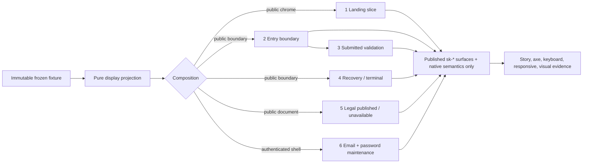

# Mission Specification: Account Front Door Pattern Stories

**Mission Branch**: `mission/account-front-door-pattern-stories` (mission handle `account-front-door-pattern-stories-01M26B1M`)
**Target Branch**: `train/elements-first`
**Created**: 2026-09-10
**Status**: Draft
**Input**: GitHub issue `spec-kitty/spec-kitty-design#355`, child of epic `#352`, tracking `#125`. Design authority: the Opus-approved Team Kitty Family 6 corpus at `ux_redesign/families/06-account-front-door` (`FAMILY.yaml`: `opus: approved_round_02`, `lynn: pending`).

## Purpose and evidence

Publish a **Storybook-only** representative pattern corpus that proves the approved Family 6 account and public front-door compositions from surfaces the design system already publishes, native semantic HTML, immutable frozen fixtures, pure display projections, and pattern-local layout. The mission ships fixtures, pure render helpers, Storybook stories, pattern-local layout, tests and baselines. **It publishes no runtime component** — no auth, account, front-door, legal-page, recovery, MFA/code-input, email-row, social-provider, error-summary or password-maintenance element, class family, manifest entry or React wrapper.

Six compositions are the whole matrix. They are the smallest coherent set that exercises every truth constraint the epic names, and they deliberately do **not** replicate all 24 corpus screens.

| # | Composition | Grounding screens | Proves |
|---|---|---|---|
| 1 | Public landing slice | P1 | Real install command/copy control, three-step CLI journey, route-aware public chrome, no invented navigation |
| 2 | Entry boundary | P2 (default), cross-checked against P4 | Signup/sign-in form shape, native labels/autocomplete, CSRF placeholder, required Terms, conditional providers |
| 3 | Submitted validation | P3 | Native linked error list + field-local errors + retained input, without an `sk-error-summary` API |
| 4 | Recovery and terminal | P10 (+ P9 request context), P22, P23 | Non-enumerating recovery outcome; honest actionless terminal state with zero fabricated routes |
| 5 | Published legal | P16, P17 | Server-supplied `.sk-prose` at natural page scroll; generic fail-closed 404 that never discloses a reason |
| 6 | Account maintenance | P20, P24 | Email selection/actions/cooldown; authenticated password maintenance shell; no profile/API-key/billing navigation |

Where issue text and this repository disagree, **the repository wins**. Two such corrections were found while authoring this spec and are recorded in "Repository corrections to the issue's premises" below.

## Dependency block *(mandatory — provisional pending merge)*

Every dependency contract named below is **provisional pending merge into `train/elements-first`**. State observed **2026-09-10** in checkout `/home/jeroennouws/dev/spec-kitty-design-missions/355` via `gh issue view <n> --repo spec-kitty/spec-kitty-design`, `gh pr list --repo spec-kitty/spec-kitty-design --limit 100 --state open`, and direct inspection of `origin/train/elements-first` at tip `e3eeeb22`.

| Surface | Issue | PR | State observed 2026-09-10 | What #355 needs from it | If it lands differently |
|---|---|---|---|---|---|
| `.sk-public-header` styles-only family (six BEM classes, no custom element, 44px floor pinned on `.sk-public-header__action`) | #353 | none | Issue OPEN, no PR. Nothing matching `public-header` exists in the train tree. | Route-aware public chrome for compositions 1–5; the `__action` class that carries the 44px floor over `sk-button--sm` | Class names, the action-slot contract, or the floor mechanism change → the header fixture, the route-aware inventory assertion and the target-size assertion all retarget |
| `sk-site-footer` compact presentation (`presentation` as a non-variant `_AXES` entry; compact link region slots bare `<a>`; no `:host([attr])` rule) | #354 | none | Issue OPEN, no PR. `sk-site-footer` is on the train, but `grep -c compact packages/styles/src/site-footer/sk-site-footer.css` returns `0`. | The compact public/account footer for compositions 1–5 | The property/axis name or link-region shape changes → the footer arm of every public fixture retargets; the full three-column stories must stay byte-identical either way |
| `sk-boundary-page` styles-only frame | #303 | #357 `mission/boundary-page-styles` → `train/elements-first`, OPEN | Issue OPEN, PR open and unmerged. Nothing matching `boundary-page` in the train tree. | The centred boundary frame for compositions 2, 3, 4 and the P17 arm of 5 | Frame class or slot shape changes → the boundary wrapper in four compositions retargets |
| `.sk-button--secondary` border affordance defect | #155 | none | Issue OPEN, defect unfixed. `.sk-button--secondary` exists at `packages/styles/src/button/sk-button.css:51` with the failing border. | Secondary actions in the public header and in composition 6's email actions | If #155 changes `.sk-button--secondary`'s border tone, every baseline containing a secondary action moves. See `[NEEDS DECISION] D-2`. |
| `.sk-input` / `sk-form-input` contrast and touch-target contract | #321 | #339 `mission/form-input-contrast-touch-target-contract`, OPEN | Issue OPEN, PR open and unmerged. Both `.sk-input` and `sk-form-input` exist today; the contract does not. | Field geometry and boundary contrast in compositions 2, 3 and 6 | Control geometry changes → the 44px assertions and every form baseline move |
| light-theme `[aria-invalid]` border contrast | #350 | none | Issue OPEN, **no PR**. Verified **not** folded into #339: #321's own spec says "Not fixed here — flagged so it is not discovered later", and #350's body says "#321 deliberately did not touch it". | Composition 3's error state inside the required `LightMode` story | Fixing it changes `--sk-color-red` or adds a light-theme override → composition 3's light baseline moves |
| `sk-theme-toggle` | #323 | none | Issue OPEN, no PR. Nothing matching `theme-toggle` in the train tree. | The theme-preference control inside public chrome (1–5) and the P20/P24 chrome | Element tag or API differs from the corpus's `
` picker → the chrome fixture and the theme-preference keyboard assertion retarget |
| `.sk-radio-choice-group` native radio styles | #336 | none | Issue OPEN, no PR. Only `checkbox-choice-group` exists (`packages/styles/src/checkbox-choice-group/`). | Composition 6's exactly-one email selection | The radio-group markup contract is entirely unknown → composition 6's fixture shape is provisional and its markup cannot be finalised before #336 lands |
| static `sk-action-row` form | #307 | #331, **MERGED 2026-09-10T18:41:13Z** | Issue **CLOSED / COMPLETED**. Present on `origin/train/elements-first` at `e3eeeb22`. | Composition 6's email action row | **Satisfied.** No longer a block. |

**Bottom line: eight of the nine hard dependencies named by the issue remain unmerged, and none of the eight is present on `train/elements-first`.** Only two of the eight (#303 via PR #357, #321 via PR #339) even have an open implementation PR; five (#353, #354, #155, #323, #336) have no PR at all, and #350 has no PR and is confirmed not covered by #339. One dependency — #307 — landed during this mission's specify phase, which is itself evidence that this table decays and must be re-derived, not trusted.

**Schedule risk, recorded not resolved.** The operator authorised this mission to proceed ahead of Lynn's verdict for a 2026-09-15 deadline (issue #355, "Throughput and boundary"). Five blocking surfaces have not started implementation. The mission's own delivery shape (below) absorbs this by sequencing the work package, not by weakening any acceptance criterion.

**Consequences carried into requirements:** re-verification before implementation is FR-029 and its acceptance gate is C-012; the prohibition on copying an unmerged dependency's CSS or API is C-004 with two checkable mechanisms; the split between what may be built now and what must wait is FR-030.

## Repository corrections to the issue's premises

1. **#307 is done.** The issue lists `#307` among the surfaces final implementation "hard-depends" on. It is closed as completed and PR #331 merged into `train/elements-first` on 2026-09-10. Checked: `gh issue view 307`, `gh pr view 331`, and `git log --oneline -1 origin/train/elements-first` (`e3eeeb22 Merge pull request #331 from spec-kitty/mission/action-row-static-form`). The hard-dependency count is eight, not nine.
2. **The 44px shortfall is not confined to `.sk-button--sm`.** Checked `packages/styles/src/button/sk-button.css`: the base `.sk-button` rule (lines 10–32) declares `padding: var(--sk-space-3) var(--sk-space-7)`, `font-size: var(--sk-text-base)`, `line-height: 1`, `border: 1px solid` and **no** `min-block-size`; with `--sk-space-3: 0.75rem` and `--sk-text-base: 1rem` (`packages/tokens/src/tokens.css:236,220`) that computes to 42px. `.sk-button--sm` (lines 73–76) reduces padding to `--sk-space-2` (0.5rem) at `--sk-text-sm` (0.875rem), computing ~32px. Neither meets the 44px floor. The corpus screens only appear to meet it because each screen's inline `<style>` re-declares heights that do not exist in the library sheet. Any composition reusing a `.sk-button` of any size must therefore pin its own floor on its own pattern-local class, following `packages/styles/src/confirm-dialog/sk-confirm-dialog.css:165-174` and `packages/styles/src/context-nav/sk-context-nav.css:44-56` — and, since #307 merged, `packages/styles/src/action-row/` (commit `6132cd43`, "pin sk-action-row's trigger to a real 44px floor"). `.sk-button` itself is never restyled.

## Decisions resolved from the corpus

**R-1 — The actionless terminal state is grounded in P22, with P23 carried as a second frozen fixture of the same composition.** The issue names "P10 + P22" and flags P23 as an open alternative. The corpus settles it: `UX-DECISION-REPORT.md` Round 23 rules that P23 must "Reuse P22's neutral, icon-free terminal composition", making P22 the canonical composition and P23 a fixture-level variation of it, not a seventh composition. Two further corpus facts make carrying P23 worthwhile rather than redundant: `COPY-CATALOG.md:472` records that P23 "is currently unreachable … there's no live trigger today", so P22 is the reachable state and must be the published story; and `DESIGN.md:31` / `SCREEN-MATRIX.md:37-38` record that the two states carry **different** route-aware public actions (P22: `Sign in` + `Start free`; P23: `Sign in` only, because Round 23 rules that `Start free`'s destination is the closed route already being viewed). P23 therefore doubles as the second arm of the route-aware header inventory the epic separately requires. Resolution: P22 is the published terminal story; P23 is a second frozen fixture state of the same composition, asserted in the fixture-behaviour suite for both zero-action-ness and its distinct action inventory, and is **not** an additional Storybook story.

**R-2 — Both provider arms are proven as fixture inputs, not as an extra story.** The truth constraint "providers appear only when fixture configuration supplies them" can only be half-proven from an absence. P2's own markup records the empty arm (`get_socialapps` is empty for this local default: no provider controls or separator), and P14/P21 evidence the populated arm but are outside the mandated six. Resolution: the entry-boundary fixture family carries both a `providers: []` and a populated-`providers` arm, both asserted in the fixture-behaviour suite; only the empty arm is published as a Storybook story. This keeps the "smallest coherent matrix" intact while making the conditionality checkable in both directions, and publishes no social-provider surface.

**R-3 — `sk-error-summary` is not created.** Epic #352 records that P3 is its only consumer. P3's linked error list is a plain `
` wrapping a native `<ul><li><a href="#field-id">` list, paired with `.sk-form-field--error`, `aria-invalid` and `aria-describedby` on each field — all already-published concepts plus native HTML. No second independent consumer exists in the landed patterns or in the in-flight programme, so the epic's own reconsideration condition is unmet.

## User Scenarios & Testing *(mandatory)*

### User Story 1 - Read the public front door without invented product surface (Priority: P1)

As someone arriving at the public Team Kitty front door, I see the real proposition, the real install commands and the real three-step CLI journey inside route-aware public chrome, and nothing the product does not have.

**Why this priority**: Composition 1 is the only composition that proves the public chrome, the copy control and the "no invented navigation" constraint together; the other public compositions inherit its chrome.

**Independent Test**: Render the landing story, assert the install block's command count and the journey's step count against the fixture, assert the copy control requests the exact fixture string, and assert zero elements match any Platform/Docs/Pricing navigation selector.

**Acceptance Scenarios**:

1. **Given** the P1-grounded landing fixture, **When** the story renders at 1440px in the default dark theme, **Then** the public header, brand anchor, route actions, theme-preference control, hero install block, three-step CLI journey and compact footer are composed from published surfaces and native semantics only.
2. **Given** the same fixture, **When** the install commands render, **Then** each is a copy control carrying the exact command string the fixture supplies, and a copy result reports only the real outcome — never a success that did not happen.
3. **Given** the same fixture, **When** the CLI journey renders, **Then** it is a native ordered list whose step count equals the fixture's declared step count.
4. **Given** the same fixture, **When** the whole composition is queried for navigation destinations, **Then** no Platform, Docs, Pricing, profile, API-key or billing destination exists anywhere in the rendered DOM.

---

### User Story 2 - Enter the product through an honest boundary (Priority: P1)

As someone signing up or signing in, I meet a labelled native form whose field set, Terms requirement, CSRF placeholder and provider affordances are exactly what the application supplies — no more.

**Why this priority**: Composition 2 carries the largest cluster of truth constraints (field membership, no password confirmation, no length promise, conditional providers, route-aware actions) and is the base composition 3 mutates.

**Independent Test**: Render the entry-boundary story and assert the form's method/action, an exact field-membership set, exactly one password input, the required Terms control, the empty server-owned CSRF placeholder, and provider affordance counts against both fixture arms.

**Acceptance Scenarios**:

1. **Given** the P2-grounded default fixture, **When** the story renders, **Then** the form carries the fixture's own `method` and `action`, and its visible field set is exactly email, password, optional team name and the required Terms agreement.
2. **Given** the same fixture, **When** the password field renders, **Then** exactly one password input exists in the composition and no password-confirmation field and no password-length promise appears anywhere in it.
3. **Given** a fixture supplying zero providers, **When** the story renders, **Then** zero provider affordances and zero provider separator exist; **Given** a fixture supplying providers, **When** the same composition renders, **Then** exactly the supplied providers appear, each with the supplied label and destination.
4. **Given** the sign-in shape cross-checked against P4, **When** the route-aware public actions render, **Then** the action inventory matches the fixture's declared route class and no action is library-authored.

---

### User Story 3 - Recover from a rejected submission (Priority: P1)

As someone whose submission was rejected, I get a focusable linked list of the real errors, the same message beside each field, and my retained input — with no diagnosis the application did not supply.

**Why this priority**: Composition 3 is the mission's proof that a linked error summary is achievable as consumer semantics, which is the epic's stated reason for refusing `sk-error-summary`.

**Independent Test**: Render the submitted-validation story, drive an invalid submit, assert focus lands on the alert region, assert the summary item count equals the fixture's error count, assert every summary link resolves to a field id present in the same DOM with matching `aria-invalid`/`aria-describedby`, and assert no custom error-summary element exists.

**Acceptance Scenarios**:

1. **Given** the P3-grounded fixture, **When** the form is submitted invalid, **Then** a native `role="alert"` region with `tabindex="-1"` receives focus and lists one native link per supplied error.
2. **Given** the same state, **When** each summary link is activated by keyboard, **Then** focus moves to the matching field, whose error text equals the summary link's text.
3. **Given** the same state, **When** the fields re-render, **Then** the submitted email value is retained and the password value is not.
4. **Given** the same state, **When** the composition is queried for an `sk-error-summary` custom element, **Then** none exists, in this composition or anywhere in the mission's diff.
5. **Given** a server-shaped generic rejection, **When** it renders, **Then** its message names no specific cause and does not reveal whether an account exists.

---

### User Story 4 - Meet a recovery outcome and a terminal state that tell the truth (Priority: P2)

As someone recovering an account, or holding an account the product has closed, I get an outcome that cannot be read as "this address exists", and a terminal state that offers no route the product does not have.

**Why this priority**: Non-enumeration and the absence of fabricated recovery are the epic's two strongest security-shaped truth constraints, and the corpus grounds both in real backend settings rather than UI convention.

**Independent Test**: Render the recovery-sent and terminal stories; assert the recovery outcome's visible text is a single frozen constant with no existence-dependent branch representable in the fixture type; assert the terminal state contains zero links and zero buttons inside its own region.

**Acceptance Scenarios**:

1. **Given** the P10-grounded recovery fixture, **When** the outcome renders, **Then** its visible text is identical for every input the fixture type can express, and the fixture type has no field that could distinguish an existing from a non-existing address.
2. **Given** the P22-grounded terminal fixture, **When** the story renders, **Then** the terminal region contains the supplied heading and sentence and exactly zero interactive descendants.
3. **Given** the P23 terminal fixture arm, **When** it is projected, **Then** it is likewise actionless and its route-aware public action inventory differs from P22's exactly as the corpus records.
4. **Given** either terminal fixture, **When** the composition renders, **Then** no reactivation, appeal, support, retry, waitlist, reopening-date or notification affordance exists.

---

### User Story 5 - Read published legal prose, or be refused without explanation (Priority: P2)

As a reader, I get the server's legal document rendered as continuous prose at natural page scroll; if it is unavailable I get one generic refusal that never says why.

**Why this priority**: This composition proves `.sk-prose` renders arbitrary consumer HTML untouched, and proves the fail-closed refusal has no reason branch to leak.

**Independent Test**: Render the legal-published story and compare the prose region's rendered HTML against the fixture's supplied document string; render the unavailable story and assert its markup is invariant because the fixture type has no reason field.

**Acceptance Scenarios**:

1. **Given** the P16-grounded fixture, **When** the document renders, **Then** the `.sk-prose` region contains the supplied document exactly, with no library-authored table of contents, status pill, editor affordance or heading the fixture did not supply.
2. **Given** the same fixture, **When** the page is scrolled, **Then** the document scrolls with the page — no inner scroll container, no sticky navigation.
3. **Given** the P17-grounded unavailable fixture, **When** it renders, **Then** one generic refusal appears and the composition exposes no field, branch or string that distinguishes absent, draft, restricted or wrong-locale.

---

### User Story 6 - Maintain an account without meeting a surface the product excludes (Priority: P2)

As a signed-in person, I select an email address, act on it, see an honest cooldown, and maintain my password inside the authenticated shell — and I never meet profile, API-key or billing navigation.

**Why this priority**: Composition 6 is the only authenticated composition and the only exercise of the radio-choice and static action-row surfaces; it also carries the reserved-surface exclusion proof.

**Independent Test**: Render the email-management and password-maintenance stories; assert native single-selection, the action order the corpus fixes, a cooldown region that is hidden until its fixture selects it, the change-vs-set password field difference, and zero reserved-surface destinations.

**Acceptance Scenarios**:

1. **Given** the P20-grounded fixture, **When** the address list renders, **Then** it is a native fieldset of radios in which exactly one input is checked, enforced by native exclusivity rather than script.
2. **Given** the same fixture, **When** the address actions render, **Then** they appear in the corpus-fixed priority order — make-primary, resend-verification, remove — and each is a real control carrying the fixture's own label and destination.
3. **Given** a cooldown fixture, **When** it renders, **Then** the status region reports only the supplied cooldown fact; **Given** the default fixture, **Then** the region is hidden and announces nothing.
4. **Given** the P24-grounded change-password fixture, **When** it renders, **Then** a current-password field is present; **Given** the set-password fixture, **Then** it is absent, and neither presents optional email verification as a block on access.
5. **Given** either authenticated fixture, **When** the composition is queried, **Then** no profile, personal-API-key, billing, subscription or pricing destination exists.

---

### User Story 7 - Trust the family across system conditions (Priority: P2)

As a design-system maintainer, I can evaluate every representative composition in light mode, forced colours, reduced motion, RTL, at narrow and short viewports, at 200% zoom and under long localised strings, without any of those proofs claiming product approval.

**Why this priority**: A single ideal dark screenshot proves nothing durable; these proofs are where composition defects that survive the happy path surface.

**Independent Test**: Exercise the dedicated proof stories at each mode and width, asserting overflow, focus visibility, target size and non-colour state meaning.

**Acceptance Scenarios**:

1. **Given** the required `LightMode` story wrapped in `class="sk-light"`, **When** each family renders, **Then** every surface remains legible using published tokens — and this is a compatibility proof only; **it is explicitly not approval of Team Kitty's deferred light redesign**, which `DESIGN.md` records as "Light mode remains deferred."
2. **Given** 1440px, 390px, the documented layout threshold edges, a short viewport and a 200%-zoom emulation, **When** each composition renders, **Then** gutters are equal and narrow, no page-level horizontal overflow occurs, no focus ring is clipped, and every interactive target measures at least 44×44 CSS px.
3. **Given** forced colours and reduced motion, **When** each composition renders, **Then** every state meaning, focus indication and boundary survives without depending on colour or motion.
4. **Given** RTL direction and long localised strings substituted for every user-visible string, **When** each composition renders, **Then** layout holds and no string is clipped or truncated without an accessible full value.

---

### User Story 8 - Land the work against contracts that actually exist (Priority: P1)

As the implementer of this mission, I reconcile this specification against `train/elements-first` before I compose anything, so that no fixture, class name or assertion is written against a contract that never landed or landed differently.

**Why this priority**: Eight of the mission's nine named dependencies were unmerged when this spec was authored, and one (#307) changed state during authoring. Every other user story's acceptance depends on this one running first.

**Independent Test**: Re-fetch `origin/train/elements-first`, re-run the dependency table's presence checks, and record a dated reconciliation naming every row that changed and every requirement affected — before any composition markup is written.

**Acceptance Scenarios**:

1. **Given** the dependency block above, **When** implementation begins, **Then** `origin/train/elements-first` is re-fetched, each surface's presence is re-checked in the tree, each issue and PR state is re-read, and the reconciliation is recorded with its date.
2. **Given** a dependency that landed with a different contract, **When** the reconciliation runs, **Then** the affected requirements are amended before composition markup is written, not after.
3. **Given** a dependency still unmerged at reconciliation time, **When** implementation proceeds, **Then** only the deferrable half — specification, immutable fixture selection, pure projections and red-first tests — is built, and no final composition markup or visual baseline is produced for that surface.
4. **Given** any dependency branch, **When** the mission's diff is inspected, **Then** it contains no CSS rule and no API copied from that branch.

### Edge Cases

- The clipboard rejects a copy request: the result region reports failure and never announces success.
- An install command or a legal document contains long unbroken text: it wraps or scrolls locally without page-level horizontal overflow at 390px and at 200% zoom.
- A route-aware fixture supplies zero public actions: the action region is absent from the DOM entirely rather than rendering an empty navigation landmark.
- A form is submitted with several fields invalid at once: the linked list renders all of them in one pass, and focus moves once.
- A summary link points at a field id that is not in the DOM: this must fail the suite, not render a dead anchor.
- Two terminal fixtures (P22, P23) share one composition but differ in public action inventory: neither gains an action, and the inventories do not converge.
- A legal document fixture is empty: the prose region is absent rather than rendering an empty landmark.
- The cooldown region has no cooldown fact: it is hidden and announces nothing rather than announcing an empty string.
- The email fixture supplies exactly one address: single-selection still holds and the remove action still reflects only what the fixture supplies.
- Forced colours and reduced motion are active simultaneously with RTL at 390px.
- A dependency lands with a renamed class between spec and implementation: the reconciliation catches it before markup is written.

## Requirements *(mandatory)*

### Functional Requirements

| ID | Title | User Story | Priority | Status |
|----|-------|------------|----------|--------|
| FR-001 | Landing slice composition | As a design-system maintainer, I want the P1 public landing slice — public header, brand, route actions, theme preference, hero install block, CLI journey, compact footer — composed as one Storybook story from published surfaces and native semantics. | High | Open |
| FR-002 | Exact install-command copy control | As a visitor, I want each install command delivered by the published copy control carrying the fixture's exact string, with feedback that reports only the real clipboard outcome. | High | Open |
| FR-003 | Three-step CLI journey as a native ordered list | As a visitor, I want the CLI journey rendered as a native `<ol>` whose step count equals the fixture's declared count, with each step's commands supplied by the fixture. | High | Open |
| FR-004 | No invented product navigation | As a reviewer, I want a standing assertion that no Platform, Docs, Pricing, profile, API-key, billing or subscription destination exists in any composition. | High | Open |
| FR-005 | Entry-boundary default composition | As a design-system maintainer, I want the P2 signup/sign-in boundary composed inside the boundary frame with native labels, `autocomplete`, and the fixture's own `method`/`action`. | High | Open |
| FR-006 | Exact signup field membership | As a reviewer, I want the signup fixture's visible field set asserted as an exact set — email, password, optional team name, required Terms — by a fixed-membership and count assertion, not a contains-check. | High | Open |
| FR-007 | No password confirmation, no length promise | As a reviewer, I want exactly one password input in the entry boundary, and no password-requirements text on the signup composition, enforced by the fixture type having no such field. | High | Open |
| FR-008 | Server-owned CSRF placeholder | As a reviewer, I want the CSRF hidden input preserved as a server-owned, empty placeholder that the pattern never populates. | High | Open |
| FR-009 | Conditional provider affordances, both arms | As a reviewer, I want an empty-provider fixture to render zero provider affordances and zero separator, and a populated-provider fixture to render exactly the supplied providers — both asserted, only the empty arm published as a story (decision R-2). | High | Open |
| FR-010 | Route-aware public action inventory | As a design-system maintainer, I want each public fixture to declare its route class and its action inventory, and an assertion that the rendered inventory equals the declared one, covering at minimum the `Sign in`+`Start free` and `Sign in`-only classes the corpus records. | High | Open |
| FR-011 | Native linked error list | As a person with a rejected submission, I want a native `role="alert"` region with `tabindex="-1"` that receives focus and lists one native link per supplied error, each resolving to a field id present in the same DOM. | High | Open |
| FR-012 | Field-local errors and retained input | As a person with a rejected submission, I want each invalid field to carry the error modifier, `aria-invalid` and `aria-describedby` pointing at field-local text equal to its summary link's text, with the submitted email retained and the password not. | High | Open |
| FR-013 | No error-summary component | As a reviewer, I want a standing negative assertion that no `sk-error-summary` custom element exists anywhere in the mission's diff or rendered output. | High | Open |
| FR-014 | Structurally non-enumerating outcomes | As a security-minded reviewer, I want recovery, reset, duplicate-account and code-request outcomes rendered from a single frozen constant, with the fixture types carrying no field that could express whether an account exists. | High | Open |
| FR-015 | Actionless terminal state | As a reviewer, I want the P22 terminal composition to contain exactly zero interactive descendants in its own region, asserted as a zero count against a fixture-declared action count. | High | Open |
| FR-016 | Second terminal fixture arm (P23) | As a reviewer, I want P23 carried as a second frozen fixture of the terminal composition, asserted actionless and asserted to carry its own distinct public action inventory, without becoming an additional Storybook story (decision R-1). | Medium | Open |
| FR-017 | Published legal prose rendered verbatim | As a reader, I want the supplied legal document rendered inside `.sk-prose` exactly as supplied, at natural page scroll, with no library-authored table of contents, status, editor affordance or heading. | High | Open |
| FR-018 | Reasonless fail-closed refusal | As a security-minded reviewer, I want the unavailable-legal composition to have no reason field on its fixture type, so no absent/draft/restricted/wrong-locale distinction is representable, let alone renderable. | High | Open |
| FR-019 | Native single-selection email list | As a signed-in person, I want the address list rendered as a native fieldset of radios with exactly one checked input, exclusivity provided by native behaviour and not by script. | High | Open |
| FR-020 | Fixed email action priority | As a signed-in person, I want the address actions rendered in the corpus-fixed order — make-primary, resend-verification, remove — each carrying only the fixture's own label and destination. | High | Open |
| FR-021 | Honest cooldown region | As a signed-in person, I want the status region to report only a supplied cooldown fact, and to be hidden and silent when no cooldown fact is supplied. | High | Open |
| FR-022 | Authenticated password maintenance | As a signed-in person, I want the change-password and set-password fixtures to differ exactly by the presence of the current-password field, composed inside the authenticated shell, with optional email verification never presented as an access block. | High | Open |
| FR-023 | Pattern-local 44px floor | As a design-system maintainer, I want every composition reusing a `.sk-button` of any size to pin its own ≥44px floor on its own pattern-local class, following the confirm-dialog, context-nav and action-row precedents, never by restyling `.sk-button`. | High | Open |
| FR-024 | Immutable fixtures and pure projections | As a reviewer, I want every fixture recursively frozen and every projection pure, deterministic and free of routing, session, network, inference, arithmetic or time, with the freeze and purity asserted directly. | High | Open |
| FR-025 | Required light-mode compatibility proof | As a design-system maintainer, I want every published story family to carry default-dark evidence and a `LightMode` story wrapped in `class="sk-light"` — never `data-theme="light"` — documented as a compatibility proof and explicitly not approval of Team Kitty's deferred light redesign. | High | Open |
| FR-026 | System-condition proof stories | As a design-system maintainer, I want dedicated proof stories for forced colours, reduced motion, RTL, 390px, a short viewport, 200% zoom and long localised strings. | High | Open |
| FR-027 | Keyboard coverage without a router | As a keyboard user, I want reachable, ordered, visibly-focused coverage of the skip link, public actions, theme preference, every form control, linked-error navigation, the copy control, the email actions and the authenticated shell — with no router, store or navigation implemented. | High | Open |
| FR-028 | Ratchet and documentation registration | As a maintainer, I want every published story id recorded in `expected-stories.json` under this mission's own family key(s) with a dated `$comment` entry, any `::part()` reach recorded in `expected-parts.json`, and a pattern section added to `docs/design-system/using-components.md` stating what the pattern composes and what it deliberately does not do. | High | Open |
| FR-029 | Dependency re-verification before implementation | As the implementer, I want a mandatory first step that re-fetches `origin/train/elements-first`, re-checks each dependency surface's presence in the tree, re-reads each issue and PR state, and records a dated reconciliation naming every changed row and every affected requirement — completed before any composition markup is written. | High | Open |
| FR-030 | Phased delivery under an open dependency block | As the implementer, I want the work package sequenced so specification, immutable fixture selection, pure projections and red-first tests proceed now, while final composition markup and visual baselines for any surface wait until that surface has merged to the train. | High | Open |
| FR-031 | Red-first evidence ordering | As a reviewer, I want every behaviour-bearing assertion demonstrated failing for the intended reason — a missing story or surface, not missing infrastructure — before the implementation that makes it pass, with that failure recorded. | High | Open |

### Non-Functional Requirements

| ID | Title | Requirement | Category | Priority | Status |
|----|-------|-------------|----------|----------|--------|
| NFR-001 | Automated accessibility | `node scripts/run-axe-storybook.js` reports **zero** serious or critical WCAG 2.1 A/AA violations for every story this mission publishes, on the exact reviewed SHA; a story that fails to load counts as a failure, never a pass. | Accessibility | High | Open |
| NFR-002 | No root overflow | `document.scrollingElement.scrollWidth <= document.scrollingElement.clientWidth` holds for every published story at 1440px, 390px, the documented layout threshold edges, a 200%-zoom emulation (halved viewport) and a short viewport of 390×480. | Accessibility | High | Open |
| NFR-003 | 44px target-size floor | Every interactive element in every published story computes `getBoundingClientRect().width >= 44` and `.height >= 44` at 390px and 1440px; the assertion enumerates targets from the fixture's own declared control set so it cannot pass over an empty selector. | Accessibility | High | Open |
| NFR-004 | No clipped focus | Every focusable control reached by `Tab` has a `getBoundingClientRect()` fully inside `[0, viewport width] × [0, viewport height]` at 390px, 1440px and 200% zoom, with a visible focus indicator in default dark, `sk-light` and forced colours. | Accessibility | High | Open |
| NFR-005 | Equal narrow gutters | At 390px every composition's left and right page gutters are equal to within 1 CSS px and are the narrow value the corpus records; no composition introduces an asymmetric gutter at any tested width. | Quality | High | Open |
| NFR-006 | Zero network activity | A page-level request listener active for the whole of every story's interaction test records **zero** requests beyond the Storybook iframe's own initial load; no story performs a successful mutation or simulates one. | Security | High | Open |
| NFR-007 | Tokens-only inline style | The pattern's inline `<style>` text contains zero raw colour literals (`#hex`, `rgb(`, `rgba(`, `hsl(`), zero raw `px`/`rem` length literals outside `0`, and zero raw radius, shadow, motion-duration or z-index literals — asserted by a mission-owned test over the exported style string, because `quality:stylelint` does not reach inside a `.ts` file and `scripts/check-pattern-composition.mjs` states it does not duplicate that check. | Maintainability | High | Open |
| NFR-008 | Accessibility-tree shape | Each published story exposes exactly one `h1`, a heading order with no skipped level, native `banner`/`navigation`/`main`/`contentinfo` landmarks where the corpus has them, and zero landmarks, headings or lists with no accessible children — asserted against the accessibility tree, not the DOM alone. | Accessibility | High | Open |
| NFR-009 | Composition gate clean | `node scripts/check-pattern-composition.mjs` and its `--selftest` both pass on the mission's final SHA: no private-root reach (R1), every `::part()` recorded (R2), no CSS written for any library-owned class or bare `sk-*` type selector (R3), and no floor tripped (R4). | Architecture | High | Open |
| NFR-010 | CI-authoritative visual baselines | Every visual baseline is generated by the CI Playwright run and harvested from its artifact; no baseline is produced or updated by a local `--update-snapshots`. Baselines are produced only after every surface a story composes has merged to the train. | Quality | High | Open |
| NFR-011 | Derived-artifact integrity | Manifest, React wrapper, CSS module, story-index, ratchet and size gates either remain byte-clean or contain only generator-produced updates required by authored sources; `node scripts/measure-elements-sizes.mjs --check` passes after a build. | Maintainability | High | Open |
| NFR-012 | Storybook build budget | `node scripts/build-storybook-with-budget.mjs` passes within its enforced budget with this mission's stories present. | Performance | Medium | Open |
| NFR-013 | Long-string resilience | With every user-visible string replaced by a localised string at least three times its English length, and with RTL direction applied, every composition renders at 390px and 1440px with no clipped text, no overlapping controls and no page-level horizontal overflow. | Compatibility | Medium | Open |

### Constraints

| ID | Title | Constraint | Category | Priority | Status |
|----|-------|------------|----------|----------|--------|
| C-001 | Story-only public API | Publish no new custom element, styles-only class family, manifest entry, React wrapper, behaviour-registry entry or application API. The mission's only new library-facing artefacts are fixture modules, story files, tests and one documentation section. | Architecture | High | Open |
| C-002 | Named forbidden components | Do not create an auth, account, front-door, legal-page, recovery, MFA/code-input, email-row, social-provider, error-summary, password-maintenance, auth-card, auth-shell or auth-form component under any name. | Architecture | High | Open |
| C-003 | No `sk-error-summary` | Do not create `sk-error-summary`. P3 is its only consumer; keep the linked native error list and focus target as consumer semantics composed from existing notice/form-field surfaces plus native markup (decision R-3). | Architecture | High | Open |
| C-004 | No copying from an unmerged dependency | Do not copy CSS rules or API shapes from any unmerged dependency branch. **Mechanism, two arms:** (a) the mission's PR diff touches only `packages/elements/src/patterns/`, `fixtures/elements-behaviour/src/`, `apps/storybook/src/tests/`, `expected-stories.json`, `expected-parts.json`, `docs/design-system/using-components.md` and `kitty-specs/` — any added or modified path under `packages/styles/src/` or under a non-pattern `packages/elements/src/<component>/` is a violation; (b) a mission-owned test asserts the pattern's inline `<style>` text contains no selector naming a dependency-owned class from an authored list covering the `.sk-public-header*`, `.sk-boundary-page*`, `.sk-radio-choice-group*`, compact-footer and `sk-theme-toggle` families. | Governance | High | Open |
| C-005 | No restyling of library-owned surfaces | Write no CSS rule whose selector names a class any `packages/styles/**/sk-*.css` sheet owns, no bare `sk-*` type selector, and no bare trailing native-tag selector standing in for an owned class. Overriding a `--sk-*` custom property remains permitted. Enforced by `scripts/check-pattern-composition.mjs` R3. | Architecture | High | Open |
| C-006 | No private-root reach | Use no `.shadowRoot`, `.renderRoot`, `attachShadow(`, `getRootNode(`, string-literal or computed access to a shadow root, and no runtime CSS injection. Enforced by R1 of the same gate. | Architecture | High | Open |
| C-007 | Declared parts only | Reach a `::part()` only where `expected-parts.json` already records that part for that element. Enforced by R2. | Architecture | High | Open |
| C-008 | Tokens, BEM, semantic pairing | Every value in pattern-local CSS references a `var(--sk-*)` token; every pattern-local class is `sk-block__element--modifier`; surface and foreground tokens are used only in their documented pairs. | Technical | High | Open |
| C-009 | Generated artefacts never hand-edited | Do not hand-edit `packages/react/src/`, generated static HTML, generated CSS modules, `custom-elements.json` or any generated index; regenerate them from authored sources. | Technical | High | Open |
| C-010 | Native semantics, no ARIA re-implementation | Use native landmarks, headings, lists, links, buttons, forms, labels, fieldsets, radios, checkboxes and `
`-class disclosure. Do not re-implement native keyboard behaviour with ARIA roles and key handlers. | Accessibility | High | Open |
| C-011 | Consumer-supplied, translatable strings | Every user-visible string comes from a fixture and stays translatable under #286; the pattern authors no English default and hardcodes no product copy. | Design | High | Open |
| C-012 | Provisional dependency contracts | Every dependency contract in the dependency block is provisional until its issue's PR merges to `train/elements-first`. Final composition markup and final visual baselines for a surface may not be produced before that merge; specification, fixture selection, pure projections and red-first tests may. | Dependency | High | Open |
| C-013 | Reserved-surface exclusion | Profile, personal API keys, billing, subscriptions, pricing, CMS/blog and terminal-only CLI signup are excluded and stay excluded; no fixture, story, string or destination introduces them. | Scope | High | Open |
| C-014 | No application ownership | Implement no routing, store, session, auth, CSRF generation, validation, cooldown timing, legal publication, email delivery, localisation or provider integration. These remain application-owned and appear only as inert fixture facts. | Scope | High | Open |
| C-015 | Corpus class names not borrowed | Do not carry the corpus's local class names (`topnav`, `topnav-inner`, `logo`, `nav-actions`, `brand-context`, `auth-card`, `auth-main`, `legal-prose`, `address-row`, `address-radio`, `front-door-secondary-action`) into the repository; recompose their anatomy through published surfaces and pattern-local BEM classes. | Technical | High | Open |
| C-016 | Demo pages and indexes preserved | Existing demo pages, generated indexes and every pre-existing story id remain intact; the story ratchet is shrink-only and no existing id is removed or renamed. | Compatibility | High | Open |
| C-017 | One work package, one PR | Deliver in exactly one bounded work package and exactly one pull request, whose description carries `Refs #355` and `Refs #352` and closes neither. | Delivery | High | Open |
| C-018 | Train-only delivery | Review, accept and merge only into `train/elements-first`, never `main`. | Delivery | High | Open |
| C-019 | Repository over issue text | Where the issue's premises and this repository disagree, the repository wins; every such correction is recorded in the spec naming the file checked. Two are recorded above. | Governance | High | Open |
| C-020 | Commit scope discipline | Human-authored commits use the repository's conventional-commit scope enum; `chore(spec):` is an anchored exemption verified at `commitlint.config.cjs:13`, while `docs(spec)` and `docs(specs)` are not valid and red `lint-code`. | Technical | Medium | Open |

### Key Entities

- **Front-door fixture**: An immutable, recursively frozen module of readonly records — one per composition state — carrying only facts an application can honestly supply: form method/action/fields/values, route class and action inventory, provider list, error list, terminal copy, legal document string, email records and cooldown fact.
- **Composition state**: The named discriminant selecting one fixture — landing, entry boundary, submitted validation, recovery sent, terminal inactive, terminal signup-closed, legal published, legal unavailable, email management, password change, password set — plus the system-proof variations.
- **Display projection**: A pure, deterministic function from one fixture to presence and ordering decisions, with no routing, session, network, inference, arithmetic or time.
- **Route-aware action inventory**: The declared set of public header actions for a fixture's route class (`Sign in` + `Start free`, `Sign in` only, `Start free` only, or none), asserted equal to what renders.
- **Linked error record**: A supplied `{ fieldId, label, message }` triple rendered once in the summary link and once as field-local text, cross-wired by `aria-describedby`.
- **Legal document fixture**: A supplied document string rendered verbatim inside `.sk-prose`; its unavailable counterpart is a single frozen constant with no reason field.
- **Email address record**: A supplied `{ address, primary, verified }` fact plus the actions the fixture declares for it — never inferred from the other fields.
- **Dependency block record**: The per-surface row — issue, PR, observed state, what the mission needs, what changes if it lands differently — re-derived at reconciliation time under FR-029.

## Success Criteria *(mandatory)*

### Measurable Outcomes

- **SC-001**: Storybook publishes at least nine distinct composition stories — landing, entry boundary, submitted validation, recovery sent, terminal inactive, legal published, legal unavailable, email management, password maintenance — plus `LightMode`, `ForcedColors`, `ReducedMotion`, `Rtl`, `Narrow390`, `ShortViewport`, `Zoom200` and `LongStrings` proofs, each id enumerated in `expected-stories.json` with a dated `$comment` entry; verified by `node scripts/run-axe-storybook.js`, which enforces that ratchet.
- **SC-002**: The mission's fixture-behaviour suite (`npx vitest run`) proves every fixture recursively frozen, every projection pure and repeatable, and one truth-preservation assertion per composition; it imports the fixture modules directly and no fixture or projection is exported from a package barrel.
- **SC-003**: An exact-membership assertion fixes the signup field set at four and the password-input count at one, and a companion DOM count assertion in the browser suite matches the fixture's declared count — so a silently added field fails.
- **SC-004**: Both provider arms pass: a `providers: []` fixture renders zero provider affordances and zero separator; a populated fixture renders exactly the supplied providers.
- **SC-005**: The submitted-validation browser assertions pass: the alert region is focused after an invalid submit, the summary item count equals the fixture's error count, every summary link's `href` resolves to a field id present in the same DOM, every linked field carries matching `aria-invalid`/`aria-describedby`, and a query for `sk-error-summary` returns zero nodes.
- **SC-006**: The recovery outcome's visible text is produced from a single frozen constant and the fixture type exposes no field expressing account existence — proven by the fixture-behaviour suite and by the absence of such a field surviving `tsc`.
- **SC-007**: `page.locator('[data-terminal-state] a, [data-terminal-state] button').count()` equals `0` for the P22 story, and the P23 fixture arm is asserted equally actionless with a distinct route-aware action inventory.
- **SC-008**: The `.sk-prose` region's rendered HTML equals the fixture's supplied document string, and the unavailable-legal fixture type has no reason field.
- **SC-009**: Composition 6's browser assertions pass: exactly one checked radio at all times, the make-primary/resend/remove order fixed, the cooldown region hidden without a cooldown fixture, and the current-password field present in the change fixture and absent in the set fixture.
- **SC-010**: `node scripts/run-axe-storybook.js` reports zero serious or critical violations across every published story on the exact reviewed SHA (NFR-001).
- **SC-011**: `npx playwright test` passes the mission's suite for overflow, gutter equality, 44px targets, unclipped focus, keyboard order, zero network requests, forced colours, reduced motion, RTL, short viewport and 200% zoom (NFR-002 through NFR-006, NFR-008, NFR-013).
- **SC-012**: `node scripts/check-pattern-composition.mjs` and `node scripts/check-pattern-composition.mjs --selftest` both pass, and `node scripts/check-part-ratchet.mjs`, `node scripts/check-story-theme-wrapper.mjs`, `node scripts/measure-elements-sizes.mjs --check` and `npm run quality:all` pass on the mission's final SHA.
- **SC-013**: The mission-owned tokens-only assertion over the pattern's inline `<style>` string passes, having been demonstrated to fail against a deliberately injected raw literal (NFR-007).
- **SC-014**: The path-allowlist assertion over the mission's diff passes: no added or modified file under `packages/styles/src/` and no non-pattern `packages/elements/src/<component>/` path (C-004 arm a), and the dependency-owned-class selector assertion passes (C-004 arm b).
- **SC-015**: A dated reconciliation record exists, produced after re-fetching `origin/train/elements-first`, naming every dependency row whose state changed since 2026-09-10 and every requirement amended as a result — dated before the first composition-markup commit (FR-029).
- **SC-016**: Every behaviour-bearing assertion has a recorded red-first failure attributable to a missing story or surface rather than missing infrastructure (FR-031).
- **SC-017**: Visual baselines exist for every published composition, every one harvested from a CI Playwright artifact, and none produced before the surfaces that story composes had merged to the train (NFR-010, C-012).
- **SC-018**: The final diff contains no new custom element, no new styles-only class family, no manifest or wrapper entry, and none of the components named in C-002 or the surfaces named in C-013.
- **SC-019**: `docs/design-system/using-components.md` gains a pattern section naming the composed surfaces, the consumer-supplied facts, and — explicitly — what the pattern does not do: no routing, session, CSRF, validation, cooldown timing, legal publication or localisation.
- **SC-020**: The mission ships as one work package and one pull request into `train/elements-first`, referencing `#355` and `#352` without closing either.

## Open decisions *(escalated — not decided by this spec)*

**[NEEDS DECISION] D-1 — Storybook family shape: one family or several.**
The six compositions share public chrome in 1–5 but diverge sharply in DOM shape: composition 5 is a document, composition 6 is an authenticated shell with no public header or footer at all. The repository shows both idioms — `repository-dossier` is one family of eighteen story ids over one `render()` root, while `mission-kanban`, `mission-reading` and `work-package-views` are separate families within one conceptual domain.
*Options:* (a) one `Patterns/Account Front Door` family with all stories as siblings; (b) two families splitting public front door from account maintenance; (c) one family per composition.
*Recommendation:* **(a)**, with a single discriminated-union fixture module — it matches the issue's "smallest coherent matrix" language, keeps the shared route-aware chrome authored once, and produces one ratchet family key.
*Why it is not decided here:* it fixes the fixture module's shape and the ratchet key set, which is a plan-phase architectural choice; the requirements above are written to hold under any option, and FR-028 requires one ratchet key per published family whichever shape is chosen.

**[NEEDS DECISION] D-2 — Whether to reproduce the corpus's `.front-door-secondary-action` border compensation pattern-locally.**
Every corpus screen applies a local override class alongside `.sk-button--secondary` that changes only the border tone (`P1-landing-desktop-dark.html:605`: `border-color: var(--sk-fg-subtle)`), because `.sk-button--secondary`'s own border fails 1.4.11 — the defect #155 exists to fix and has not fixed. `DESIGN.md:41` records the class as consumer-owned. Neither #353's settled contract nor any ADR addresses it, so composing `.sk-button--secondary` bare would ship stories carrying a known non-text-contrast defect that axe does not reliably detect.
*Options:* (a) reproduce the compensation on a pattern-local BEM class, documented as compensating for #155 and to be removed when #155 lands; (b) compose `.sk-button--secondary` bare and record the known defect in the pattern's documentation; (c) avoid the secondary tone in the corpus's secondary-action positions.
*Recommendation:* **(a)** — it is the same pattern-local mechanism FR-023 already uses for the 44px floor, it is legal under the composition gate (the class is pattern-owned, not library-owned), and it keeps the stories faithful to the approved design. It must be documented as a temporary compensation, not as a design-system position.
*Why it is not decided here:* it decides whether this mission ships a visual compensation for another issue's open defect, which is a programme-level call rather than a specification one.

## Out of scope

All 24 product replicas; any published account, front-door, auth, legal, recovery, MFA/code-input, email-row, social-provider, error-summary or password-maintenance component; Team Kitty integration; any Django, allauth, provider or backend client; router or store; auth, session, CSRF, validation, email or legal logic; copy and i18n ownership; profile; personal API keys; billing and subscriptions; pricing; CMS and blog surfaces; terminal-only CLI signup; and reopening the existing #176/#178/#257 surfaces or the authenticated shell and header surfaces, which are consumed as they stand.
