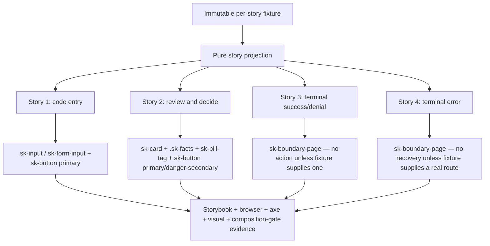

# Implementation Plan: CLI Auth Pattern Stories

**Mission**: `cli-auth-pattern-stories-01M25STS`
**Branch / merge target**: `train/elements-first`
**Spec**: `kitty-specs/cli-auth-pattern-stories-01M25STS/spec.md`
**Issue**: `spec-kitty/spec-kitty-design#329`, part of epic `#319`

## Summary

Add one Storybook-only CLI-auth pattern family proving four canonical Family 5 states — code entry, authorization decision, terminal success/denial, and terminal error — compose from current and landing public `@spec-kitty/tokens`/`@spec-kitty/styles`/`@spec-kitty/elements` surfaces plus native semantic HTML. Non-dependent scaffolding (immutable fixtures, Story 1, Story 2's non-Deny anatomy, both terminal stories' fixtures/test shells, the composition-gate coverage, and the documentation draft) proceeds now. Dependent finalization (Story 2's Deny action via `#320`, both terminal stories' `sk-boundary-page` frame via `#303`, and Story 1's contrast/target-size verification via `#321`) is a clearly separated last phase that rebases onto whichever of those three land on `train/elements-first`, and reports — never fakes — any that miss the 2026-09-15 deadline. No new component, token, dependency, or Team Kitty application behavior is introduced.

## Technical Context

**Language/Version**: TypeScript 5, Lit 3, Storybook 10 web components, Node 22 in CI.
**Primary Dependencies**: existing public `@spec-kitty/elements` exports (`sk-button`, `sk-form-input`, `sk-card`, `sk-pill-tag`) and `@spec-kitty/styles` (`.sk-input`, `.sk-facts`), plus two in-flight public surfaces this mission consumes once landed: `#320` (`sk-button` danger-secondary) and `#303` (`sk-boundary-page`). No new package dependency.
**Storage / services**: none; fixtures are static authored evidence.
**Testing**: Playwright Storybook tests in Chromium and Firefox, axe, Vitest/Node behavior gates where applicable, visual regression, the existing `check-pattern-composition.mjs` composition/inventory gate, and a new component-scoped no-literal grep test.
**Target Platform**: repository-supported modern browsers and the static Storybook build.
**Performance Goals**: stay within the repository Storybook build budget; render performs no I/O, polling, parsing, or timers.
**Constraints**: zero new public component surface; zero private-root reach; zero page-level horizontal overflow at 390 px and zoom proofs; public token values only; zero forked CSS standing in for `#320`/`#303` ahead of their landing.
**Scale/Scope**: one pattern module (fixture + stories), one focused browser test, existing visual/story registries and generated baselines, and one consumer-documentation section. Four stories, not twelve screen replicas.

## Charter Check

- **Tokens first — PASS**: all pattern-owned layout uses approved `--sk-*` tokens. No raw visual value or new token is introduced.
- **Semantic pairing — PASS**: `--sk-status-danger`/`--sk-on-status-danger` (already public, already used by `sk-pill-tag`) is the only status-toned pair this mission touches directly, for the optional terminal-state pill affordance; it is not used to fake `#320`'s button tone.
- **Public composition — PASS**: only public custom elements, documented native CSS families, and native semantic HTML are consumed. No shadow/private reach; the existing `check-pattern-composition.mjs` gate enforces this over the fixture's directory without modification.
- **Naming — PASS**: pattern-owned classes use the `sk-cli-auth-pattern` BEM block.
- **Accessibility — PASS by design, verified by gates**: labels/descriptions, keyboard order, error/status announcement, heading order, target-size floor, forced-colors visibility, 200% zoom, and reduced-motion are explicit tests per story.
- **Theme — PASS**: default dark plus the required `LightMode` story, wrapped in `class="sk-light"`, for every story.
- **No new component — PASS**: no `auth-card`, auth-shell, `scope-chip`, `form-action-row`, or second boundary/stage frame is created. `#303` owns the terminal frame; this mission consumes it once public.
- **Copy ownership — PASS**: every user-visible string is fixture-supplied; a component-scoped grep-style test (FR-018) asserts none of it is a hardcoded default inside any composed element's own source, consistent with `#286`'s and `#320`'s DoD pattern.
- **Dependency honesty — CONDITIONAL PASS, tracked explicitly**: Story 2's Deny action and both terminal stories cannot be finalized before `#320`/`#303` land. This plan's IC-06 is the single, clearly separated finalization step; it is not started, and its acceptance criteria are not asserted met, until the corresponding dependency lands and the lane rebases onto the train commit carrying it. If `#303` misses 2026-09-15, the mission's status and PR body report that fact instead of shipping a substitute frame.
- **Review — REQUIRED**: an independent review seat inspects the exact final head per the repository's adversarial-squad standing order (Tier C, pre-merge for this mission per the issue's "Squad tier: C").
- **Generated artifacts — PASS by process**: repository generators and Playwright own derived registries, reports, and images; never hand-authored from assumptions.
- **Delivery — PASS**: one coherent work package, one PR containing `Closes #329` and `Refs #319` (never closing #319), targeting only `train/elements-first`.

## Project Structure

### Mission artifacts

```text
kitty-specs/cli-auth-pattern-stories-01M25STS/
├── meta.json
├── spec.md
├── research.md
├── data-model.md
├── research/
│   ├── evidence-log.csv
│   └── source-register.csv
├── plan.md
├── tasks.md
└── tasks/
    └── WP01-cli-auth-pattern-proof.md
```

### Repository surfaces

```text
packages/elements/src/patterns/
├── cli-auth.fixture.ts       # new — immutable per-story fixtures
└── cli-auth.stories.ts       # new — story-only composition, sk-cli-auth-pattern__* layout

fixtures/elements-behaviour/src/
└── (no new subject — this mission composes no new behavior-owning element;
    the no-literal grep assertion lands as a focused Node test beside the
    pattern module rather than in the behaviour-mutation fixture, matching
    #320's own "grep-style assertion" DoD shape rather than ADR-11's
    required-behaviours list, which governs element-owned behavior only)

apps/storybook/src/tests/
├── sk-cli-auth-pattern.spec.ts     # new — focused Playwright browser spec
├── visual.spec.ts                  # edit — register required visual cases
└── visual.spec.ts-snapshots/       # generated only by Playwright/CI, never hand-authored

expected-stories.json               # edit — register every exported story ID
docs/design-system/using-components.md   # edit — CLI-auth pattern section + ownership boundary
```

**Structure decision**: Follow the established pattern-mission shape (`repository-dossier.fixture.ts` + `repository-dossier.stories.ts`, `mission-reading.stories.ts`, `work-package-views.stories.ts`) — fixture, pure projections, and story-only markup together under `packages/elements/src/patterns/`, so nothing is exported as a reusable runtime component and `check-pattern-composition.mjs` covers it automatically by directory convention. Put the focused browser spec beside the other pattern specs in `apps/storybook/src/tests/`. Add one short documentation section to the existing consumer guide rather than a new documentation hierarchy.

## Architecture and Data Flow



No story owns mutable application state. Story 1's invalid/default branch, Story 2's fixed action pair, and Stories 3/4's action-or-none branch are all pure selections over one frozen fixture per story — never a fetch, a timer, a route decision, or an inferred permission/session/validation outcome. `#320` and `#303` are consumed as opaque public contracts: this plan does not assume their final class or slot names beyond what their own issues already commit to (a danger-secondary tone reusing `--sk-status-danger`; a title/body/action-group/footnote anatomy).

## Implementation Concern Map

> Concerns IC-01 through IC-05 have no dependency on `#320`, `#321`, or `#303` landing and may complete now. IC-06 is the single dependent finalization concern; it starts only once the corresponding dependency lands on `train/elements-first`, and its own acceptance criteria are not claimed met before then.

### IC-01 — Immutable fixtures for all four states

- **Purpose**: establish one frozen source per story for every repeated label, fact, scope, status, and action value; no field is invented downstream.
- **Relevant requirements**: FR-001–FR-004, C-006, C-010.
- **Affected surfaces**: `cli-auth.fixture.ts` (deep-frozen code-entry, authorization, terminal-outcome, and terminal-error fixtures per `data-model.md`).
- **Sequencing/depends-on**: none.
- **Risks**: a fixture shape assumed too early could need reshaping once `#320`/`#303` land with a concrete API. Mitigate by keeping fixture fields generic (label/text/href pairs) rather than pre-binding them to an assumed class or slot name.

### IC-02 — Story 1: code entry (fully composable now)

- **Purpose**: prove the labelled input + description + primary submit anatomy from the current, unchanged `.sk-input`/`sk-form-input` public contract.
- **Relevant requirements**: FR-001, FR-005–FR-010, FR-013, FR-014.
- **Affected surfaces**: `cli-auth.stories.ts` (Story 1 default + invalid variants), `sk-cli-auth-pattern.spec.ts` (label/description association, `aria-invalid` branch, keyboard order).
- **Sequencing/depends-on**: IC-01.
- **Risks**: the target-size/contrast acceptance clauses (FR-011/FR-012 for this story) cannot pass until `#321` lands, since the current `.sk-input` border and target size are the exact gap `#321` fixes. Mitigate by authoring the target-size/contrast assertions now as red-first (expected to fail against current CSS) and re-running them, not re-authoring them, once `#321`'s lane rebase happens — recorded as part of IC-06.

### IC-03 — Story 2: authorization facts, scopes, and Approve (non-Deny anatomy)

- **Purpose**: prove the client/account/redirect fact list and consumer-supplied scope labels compose from `.sk-facts` and `sk-pill-tag`, and that Approve composes the existing `sk-button` primary tone, with DOM order already fixed as Approve-then-Deny.
- **Relevant requirements**: FR-002 (partial — Approve, facts, scopes), FR-005–FR-010, FR-013, FR-014.
- **Affected surfaces**: `cli-auth.stories.ts` (Story 2 markup, minus the Deny button's final tone), `sk-cli-auth-pattern.spec.ts` (fact-list/scope assertions, DOM-order assertion written against both buttons even though Deny's tone is pending).
- **Sequencing/depends-on**: IC-01.
- **Risks**: none technical; the risk is scope creep into inventing a placeholder danger style. Mitigate by leaving Deny as a plain `sk-button` secondary in the scaffolding commit, explicitly marked (in a code comment and in `tasks.md`) as pending `#320`'s tone, never as a finished state.

### IC-04 — Stories 3 and 4: terminal fixtures, shells, and no-invented-recovery assertions

- **Purpose**: prove the terminal-outcome and terminal-error fixture/action rules (no action unless supplied; exactly one action when supplied) independently of the frame that will render them, and stand up red-first story/test shells against `sk-boundary-page` so the finalization step in IC-06 has a known-failing baseline to turn green.
- **Relevant requirements**: FR-003, FR-004, FR-018 (partial — asserted once `sk-boundary-page` source exists).
- **Affected surfaces**: `cli-auth.fixture.ts` (terminal-outcome, terminal-denial, terminal-error-with/without-action fixtures), `cli-auth.stories.ts` (Story 3/4 shells, deliberately failing to resolve `sk-boundary-page` until it lands), `sk-cli-auth-pattern.spec.ts` (action-count assertions).
- **Sequencing/depends-on**: IC-01.
- **Risks**: this is the concern most likely to still be open past 2026-09-15 if `#303` misses the date. Mitigate by keeping the fixture/action-rule assertions independently valuable and independently reviewable even while the story shell itself stays red, and by naming `#303` explicitly as the blocker in `tasks.md`'s Definition of Done rather than silently deferring it.

### IC-05 — Composition/inventory proof and no-literal assertion

- **Purpose**: confirm the existing `scripts/check-pattern-composition.mjs` gate covers the new fixture directory unmodified, and add the component-scoped grep-style test proving none of this mission's fixture copy is hardcoded inside `sk-button`, `.sk-input`/`sk-form-input`, `sk-card`, `sk-pill-tag`, or (once landed) `sk-boundary-page`.
- **Relevant requirements**: FR-017, FR-018.
- **Affected surfaces**: no change to `scripts/check-pattern-composition.mjs` itself (confirmed by reading its `SCAN` constant — `packages/elements/src/patterns/**` already includes this mission's files); a new focused Node test asserting the no-literal invariant, placed beside `sk-cli-auth-pattern.spec.ts` or as a `tests/node/` case following the repository's existing convention for source-scoped grep assertions.
- **Sequencing/depends-on**: IC-01–IC-04 (needs the fixture copy strings to exist before it can assert their absence elsewhere).
- **Risks**: the assertion's coverage of `sk-boundary-page` is incomplete until `#303`'s source exists. Mitigate by scoping the test to the elements that exist at authoring time and adding the `sk-boundary-page` case in IC-06 once that source lands — never reporting the assertion as covering a component that is not yet in the tree.

### IC-06 — Dependent finalization (LAST; gated on `#320`, `#321`, and `#303` landing)

- **Purpose**: consume whichever public contract `#320`, `#321`, and `#303` actually ship, finalize Story 2's Deny action and Stories 3/4's `sk-boundary-page` composition, regenerate every derived artifact, and produce CI-harvested visual baselines from the exact final rebased head.
- **Relevant requirements**: FR-002 (Deny), FR-003, FR-004, FR-011, FR-012 (target-size/contrast re-verification), FR-016, NFR-008, NFR-009, FR-020.
- **Affected surfaces**: `cli-auth.stories.ts` (Deny tone, terminal frame composition), `sk-cli-auth-pattern.spec.ts` (turn the IC-02/IC-04 red assertions green), `visual.spec.ts` + generated snapshots, `expected-stories.json`, `docs/design-system/using-components.md`.
- **Sequencing/depends-on**: IC-01–IC-05, and externally on `#320`, `#321`, `#303` landing on `train/elements-first`.
- **Risks**: partial landing (e.g., `#320`/`#321` land but `#303` does not by 2026-09-15). Mitigate by treating this as three independently checkable sub-steps (Deny/`#320`; input verification/`#321`; terminal frame/`#303`) rather than one atomic gate — the mission can finalize whichever of the three has landed and report the remainder as open, per the issue's explicit instruction, rather than blocking the entire mission on the slowest dependency. This is the one concern this plan does not promise a completion date for, because two of its three inputs are outside this mission's control.

## Verification Strategy

1. Exercise the focused `sk-cli-auth-pattern.spec.ts` suite in Chromium and Firefox: story existence, non-empty roots, label/description association, `aria-invalid` branch, DOM-order-equals-focus-order, live-region announcement for the invalid and terminal states, target-size measurement, and the fixture-consistency/no-fabricated-action invariants for Stories 3 and 4.
2. Run the component-scoped no-literal grep test (IC-05) and the existing `check-pattern-composition.mjs --selftest` plus its full repository pass over `packages/elements/src/patterns/**`.
3. Run axe over every registered story; inspect all four stories individually and as one family in default dark and required LightMode.
4. Check the complete family at 390 px, 200%/400% zoom equivalents, forced colors, and reduced motion; assert zero page-level horizontal overflow and zero clipped form actions.
5. Run `npm run quality:all` (ESLint + Stylelint + HTMLHint), `npx nx run tokens:catalogue`, `npx nx run styles:build`, `npx nx run elements:build`, `npx nx run elements:analyze`, `node scripts/build-react-wrappers.mjs --check`, `npx nx run storybook:storybook:build`, `node scripts/run-axe-storybook.js`, and `npx playwright test` (including `apps/storybook/src/tests/visual.spec.ts`).
6. Run `npm run quality:commitlint` against the final commit set (scope `storybook`, per the closed conventional-commit enum).
7. Fetch and rebase onto latest `origin/train/elements-first` immediately before IC-06, and again immediately before final review; regenerate every derived artifact (manifest, React wrapper, Vue types, CSS modules, story index, size report) from source and repeat applicable checks on the exact reviewed SHA. Visual baselines are harvested from CI's `visual-regression-diffs` artifact on that SHA — never captured locally.
8. Deploy the repository's independent adversarial review squad at the tier this issue declares ("Squad tier: C — pre-merge"), record findings and dispositions, and capture the verdict before Spec Kitty accept/merge.

## Delivery Strategy

- Finalize one work package covering IC-01 through IC-06 and open exactly one PR with `Closes #329` and `Refs #319`. The PR must not close `#319`.
- Recheck `#320`, `#321`, and `#303` (and their PRs/branches, if any) immediately before starting IC-06 and again immediately before final review.
- Never target or merge `main`.
- If `#303` has not landed by 2026-09-15, the PR body states that Stories 3 and 4 remain open pending `#303`, names the exact blocking issue, and does not claim the mission's terminal-state acceptance criteria as met.
- After Spec Kitty acceptance, merge to `train/elements-first`, run the post-merge mission review, comment exact evidence on `#329`, and check its box in epic `#319` (the epic itself closes only after `#320`, `#321`, and this mission are all verified complete).

## Complexity Tracking

No charter exception is requested. The mission adds authored fixture data, pure functions, story-only markup/layout, focused tests, generated visual evidence, and documentation; it creates no public runtime abstraction. IC-06's cross-mission dependency is a delivery-sequencing fact, not a charter violation, and is handled by delivery-strategy sequencing rather than by a complexity-tracking exception.
