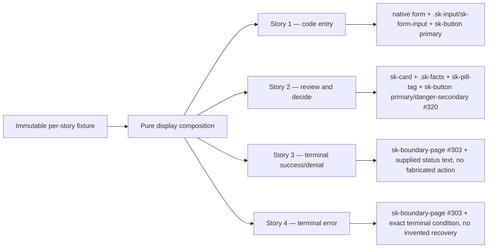

# Mission Specification: CLI Auth Pattern Stories

**Mission**: `cli-auth-pattern-stories-01M25STS`
**Target Branch**: `train/elements-first`
**Created**: 2026-09-10
**Status**: Draft
**Input**: GitHub issue `spec-kitty/spec-kitty-design#329` (`[TKA3]`), child of epic `#319`, tracking `#125`. Authority: approved Team Kitty Family 5 "CLI auth" A1–A12 pack (`ux_redesign/families/05-cli-auth`, planning workspace), Opus rereview 02 verdict `approve`, 2026-09-10.

## Purpose and evidence

Publish one Storybook-only CLI-auth pattern family that proves four canonical, honest security-boundary compositions — code entry, authorization decision, terminal success/denial, and terminal error — assemble entirely from public `@spec-kitty/tokens`, `@spec-kitty/styles`, and `@spec-kitty/elements` surfaces plus native semantic HTML. The family is composition and accessibility evidence for design-system consumers; it is not a new component, not a Team Kitty route, and not a replica of all twelve Family 5 screens (A1–A12).

Family 5's twelve server-rendered CLI/device-authorization screens reduce to one small reusable anatomy. This mission proves that anatomy composes from what the library already publishes (`sk-button`, `.sk-input`/`sk-form-input`, `sk-card`, `.sk-facts`, `sk-pill-tag`) plus two in-flight public surfaces this mission consumes but does not fork or restate: `#320`'s `sk-button` danger-secondary tone and `#321`'s input contrast/target-size contract. A fourth surface, `#303`'s `sk-boundary-page`, is the required frame for both terminal stories and is open with no branch — its absence is a reportable technical dependency, never a reason to build a local frame.

## Dependency posture (read before any acceptance clause below)

| Consumed surface | Status at mission filing | Story that needs it | Fallback if it misses 2026-09-15 |
|---|---|---|---|
| `#320` — `sk-button` danger-secondary tone | In flight, sibling mission, not on `train/elements-first` | Story 2 (Deny action) | Report the dependency honestly in the mission status; do not style a local danger button and do not reuse `--sk-status-danger` directly on `.sk-button--secondary` to fake the tone. |
| `#321` — `.sk-input`/`sk-form-input` contrast + target-size contract | In flight, sibling mission, not on `train/elements-first` | Story 1 (code entry) | The story still composes the CURRENT `.sk-input`/`sk-form-input` class unchanged; nothing forks. The target-size and contrast acceptance clauses for Story 1 are unverifiable until #321 lands and are re-verified, not re-authored, after rebase. |
| `#303` — `sk-boundary-page` public frame | Open, owned by epic #300, no branch, no PR at filing time | Story 3 and Story 4 (both terminal states) | Report the dependency honestly. Do not fork `sk-boundary-page`'s anatomy locally, and do not compose a second boundary/stage frame under any other name. If #303 misses the deadline, Stories 3 and 4 ship as a documented open finalization step, not as a substitute frame. |

This mission may fully specify, plan, select fixtures, and scaffold red-first story/test files against surfaces that do not exist yet on the train. It must not implement final Story 2 or Story 3/4 composition, and must not assert their acceptance criteria as met, before the corresponding dependency lands and the lane rebases onto the train commit that carries it.

## User Scenarios & Testing

### User Story 1 — Enter a code (Priority: P1)

As a design-system consumer building the CLI/device code-entry screen, I can compose one labelled native input using the shared static/element input contract, with a description, validation-capable semantics, and a primary submit action — entirely from public surfaces.

**Why this priority**: Code entry (Family 5 A3) is the first screen in every CLI-auth flow and the simplest anatomy; it establishes the fixture/composition pattern the other three stories reuse.

**Independent Test**: Render the default and invalid-state stories in Storybook and a real browser; assert the label/description association, the `aria-invalid` branch, keyboard order, and the primary submit action, all sourced from one fixture.

**Acceptance Scenarios**:

1. **Given** the default code-entry fixture, **When** the story renders at desktop width in default dark, **Then** one native `<form>` contains a labelled `.sk-input`/`<sk-form-input>`, a description, and one `sk-button` primary submit, with every string supplied by the fixture.
2. **Given** the invalid-code fixture, **When** the story renders, **Then** the control carries `aria-invalid="true"`, an associated error description, and the error text is announced without a page reload or invented retry mechanism.
3. **Given** the same fixture, **When** the story renders at 390 px, **Then** the label, input, description, and submit action keep equal gutters, remain unclipped, and introduce no page-level horizontal overflow.
4. **Given** the story rendered with the DOM inspected, **When** keyboard focus is tabbed through it, **Then** the visit order is label-adjacent input, then submit, matching DOM order exactly.

---

### User Story 2 — Review and decide (Priority: P1)

As a design-system consumer building the authorization/consent screen, I can compose factual client/account/redirect details, consumer-supplied scope labels, an Approve primary action, and a Deny action using the danger-secondary treatment — using native forms with DOM order as focus order.

**Why this priority**: This is the security-critical decision moment in every Family 5 screen that has one (A1, A2, A4, A5) and the story with the sharpest non-goal boundary (no auth-card, no scope-chip, no confirmation step).

**Independent Test**: Render the story with a multi-scope fixture; assert the fact list matches the fixture exactly, scope labels render through `sk-pill-tag`, Approve and Deny are both real form-associated buttons in DOM order, and Deny renders through the danger-secondary tone once `#320` lands.

**Acceptance Scenarios**:

1. **Given** the authorization fixture (client name, account, redirect target, one or more scopes), **When** the story renders, **Then** the facts render through `.sk-facts` as a native `<dl>` with exactly the supplied terms/values, and each scope renders as one `sk-pill-tag` with fixture-supplied text.
2. **Given** the same fixture, **When** the actions render, **Then** Approve is `sk-button` primary and Deny is `sk-button` with the `#320` danger-secondary tone, both inside one native `<form>`, in DOM order Approve-then-Deny matching the approved visual order, and neither button owns a hardcoded "Approve"/"Deny" default.
3. **Given** the story rendered at 390 px, **When** the action group is inspected, **Then** both actions remain visible, unclipped, and keep their documented target-size floor.
4. **Given** the story rendered before `#320` lands, **When** the composition gate or visual baseline is evaluated, **Then** the mission reports Deny as blocked on `#320` rather than shipping a locally-styled substitute.

---

### User Story 3 — Terminal success or denial (Priority: P1)

As a design-system consumer building the outcome screen, I can compose one success/denied composition with supplied status text and no fabricated action, using the public `sk-boundary-page` frame.

**Why this priority**: A terminal state is the moment Family 5 is most tempted to invent a recovery affordance that does not exist in the real flow; the story exists to prove the frame renders an honest, action-free (or fixture-action-only) terminal message.

**Independent Test**: Render the success and denied variants from two fixtures; assert the frame composes `sk-boundary-page` publicly, the status text is exactly the fixture's, and no action renders unless the fixture supplies one.

**Acceptance Scenarios**:

1. **Given** the success fixture (status text only, no action), **When** the story renders, **Then** `sk-boundary-page`'s card/title/body anatomy shows exactly the supplied status text and no action group, matching `sk-boundary-page`'s own documented "no action" state.
2. **Given** the denied fixture (status text only, no action), **When** the story renders, **Then** the same anatomy shows the denial text with no invented "try again" or "contact support" action.
3. **Given** either fixture, **When** the story renders in default dark and required LightMode, **Then** the composition uses only `sk-boundary-page`'s public seams (`::part()`/slots it documents) — no story-local frame, stage, or card is built.
4. **Given** `#303` has not landed at implementation time, **When** this story is evaluated, **Then** the mission's status names `#303` as the blocking dependency; the story is not shipped against a locally forked frame.

---

### User Story 4 — Terminal error, no invented recovery (Priority: P1)

As a design-system consumer building the failure screen, I can compose one exact terminal error condition with no retry, back, or recovery control unless the fixture explicitly supplies a real route.

**Why this priority**: This is the non-goal boundary made testable — the library must prove it can render a dead end honestly rather than defaulting to a generic "try again" pattern.

**Independent Test**: Render the no-action error fixture and, separately, a fixture that supplies one real route; assert the frame renders zero fabricated actions in the first case and exactly the supplied action in the second.

**Acceptance Scenarios**:

1. **Given** an error fixture with no supplied route, **When** the story renders, **Then** `sk-boundary-page` shows only the exact terminal error text, with no button, link, or other recovery control anywhere in the composition.
2. **Given** an error fixture that explicitly supplies one real route (a label and an href/action), **When** the story renders, **Then** exactly that one action renders, sourced only from the fixture, never invented by the pattern.
3. **Given** either error fixture, **When** evaluated under forced-colors and 200% zoom, **Then** the terminal message and any supplied action remain visible, legible, and unclipped.
4. **Given** `#303` has not landed, **When** this story is evaluated, **Then** the same honest-dependency-report posture as Story 3 applies — no local frame fork.

### Edge Cases

- A code-entry fixture supplies a description but no error state; the invalid branch must not render when unused.
- An authorization fixture supplies exactly one scope and, separately, four scopes; the fact list and pill-tag row must not overflow or clip at 390 px in either case.
- A denial fixture's status text and an error fixture's terminal text are both plausible negative outcomes; the two stories must remain visually and semantically distinct (denial is a decision outcome, error is a failure condition) without inventing a shared "problem" component.
- An error fixture's supplied route label is unusually long; it must wrap or truncate accessibly without producing page-level horizontal overflow.
- `#320` or `#321` lands mid-mission; the plan's finalization step must consume the landed surface without re-authoring the fixture or story shape.
- `#303` misses the 2026-09-15 deadline entirely; Stories 3 and 4 remain open, reported, and undelivered rather than shipped against an invented frame.
- Reduced-motion and forced-colors preferences are both active simultaneously across all four stories.
- 200% zoom is combined with the 390 px narrow viewport for the code-entry and review-and-decide stories, where clipped form actions are explicitly disallowed by the issue.

## Requirements

### Functional Requirements

| ID | Title | User Story | Priority | Status |
|----|-------|------------|----------|--------|
| FR-001 | Code-entry composition | As a consumer, I want one labelled `.sk-input`/`sk-form-input` code-entry story with description, validation-capable semantics, and a primary submit action. | High | Open |
| FR-002 | Authorization decision composition | As a consumer, I want a story composing factual client/account/redirect details, consumer-supplied scope labels via `sk-pill-tag`, an Approve primary action, and a Deny danger-secondary action, in DOM order. | High | Open |
| FR-003 | Terminal success/denial composition | As a consumer, I want one success/denied story composing `sk-boundary-page` with supplied status text and no fabricated action. | High | Open |
| FR-004 | Terminal error composition | As a consumer, I want one terminal-error story composing `sk-boundary-page` with no retry/back/recovery control unless the fixture supplies a real route. | High | Open |
| FR-005 | Default dark and required LightMode | As a system maintainer, I want every story to ship a default-dark render and a required `LightMode` variant wrapped in `class="sk-light"`. | High | Open |
| FR-006 | Desktop and 390 px narrow evidence | As a narrow-viewport user, I want every story evidenced at desktop and 390 px with equal gutters, zero page-level horizontal overflow, and unclipped form actions. | High | Open |
| FR-007 | Keyboard order matches DOM order | As a keyboard user, I want tab order to match DOM order in every interactive story, with no positive `tabindex`. | High | Open |
| FR-008 | Labels and descriptions | As an assistive-technology user, I want every interactive control programmatically associated with its label and, where present, its description. | High | Open |
| FR-009 | Error/status announcement | As an assistive-technology user, I want the invalid-code state and the terminal states to announce through a stable, correctly-roled live region. | High | Open |
| FR-010 | Heading order | As an assistive-technology user, I want each story's heading structure to be a single, correctly-nested sequence with no skipped level. | Medium | Open |
| FR-011 | Target-size floor | As a pointer or touch user, I want every interactive control (submit, Approve, Deny, any supplied terminal action) to meet the repository's documented target-size floor at both evidenced widths. | High | Open |
| FR-012 | Forced-colors visibility | As a forced-colors user, I want the input boundary, both button tones, scope pill-tags, and the boundary-page frame to remain visible and distinguishable with no color-only meaning. | High | Open |
| FR-013 | 200% zoom | As a low-vision user, I want every story to remain operable and unclipped at 200% zoom equivalents. | High | Open |
| FR-014 | Reduced-motion behavior | As a user with a reduced-motion preference, I want the pattern to introduce no motion of its own, asserted rather than assumed. | Medium | Open |
| FR-015 | Axe zero | As a system maintainer, I want zero serious/critical axe violations across all four stories in both themes. | High | Open |
| FR-016 | Visual-regression baselines | As a system maintainer, I want CI-harvested visual baselines for every required state, never locally shot. | High | Open |
| FR-017 | Composition/inventory proof | As a system maintainer, I want the existing `check-pattern-composition.mjs` gate extended to this fixture directory, proving every `sk-*` primitive used comes from a public surface with no shadow reach-through and no duplicated component CSS. | High | Open |
| FR-018 | No-user-visible-literal assertion | As a system maintainer, I want a component-scoped, grep-style assertion (consistent with #286's DoD pattern) that none of this mission's fixture copy is hardcoded as a default inside any composed element's own source. | High | Open |
| FR-019 | Consumer ownership documentation | As a consumer, I want documentation naming which behavior stays theirs: route, permission, session, validation, submission, confirmation, copy, localization, and terminal-state selection. | Medium | Open |
| FR-020 | Dependency-honest finalization | As a mission maintainer, I want non-dependent scaffolding (fixtures, Story 1, the composition gate coverage, the a11y matrix design) completed independently of `#320`/`#321`/`#303`, and the dependent finalization (Story 2's Deny tone, Story 3/4's frame) as a clearly separated, rebase-gated last step. | High | Open |

### Non-Functional Requirements

| ID | Title | Requirement | Category | Priority | Status |
|----|-------|-------------|----------|----------|--------|
| NFR-001 | Browser behavior | Required behavior/accessibility checks pass in the repository-supported Chromium and Firefox projects on the exact reviewed SHA. | Compatibility | High | Open |
| NFR-002 | Automated accessibility | Storybook/axe checks report zero serious or critical WCAG 2.1 AA violations for every required state, where a story that fails to load is a failure. | Accessibility | High | Open |
| NFR-003 | Responsive width | At 390 px, every required narrow state has zero page-level horizontal overflow and preserves equal gutters and unclipped form actions. | Accessibility | High | Open |
| NFR-004 | Zoom reflow | At 200% zoom equivalents, all four stories remain operable with no essential content or control lost or clipped. | Accessibility | High | Open |
| NFR-005 | Alternate user preferences | Forced-colors and reduced-motion checks preserve all state meaning, focus indication, and control visibility without color or motion alone. | Accessibility | High | Open |
| NFR-006 | Visual fidelity | All required dark and LightMode states are reviewed individually and as one family against CI-harvested baselines before acceptance. | Quality | High | Open |
| NFR-007 | Generated-artifact integrity | Manifest, wrapper, CSS module, story-index, ratchet, and size gates remain byte-clean or contain only generator-produced updates required by authored sources. | Maintainability | High | Open |
| NFR-008 | Theme coverage | The default dark family and required LightMode pass the repository visual and accessibility gates on the exact reviewed final SHA, after the dependency rebase. | Compatibility | High | Open |
| NFR-009 | Dependency traceability | The mission's status/PR body names the exact commit on `train/elements-first` that carries each of `#320`, `#321`, and `#303` at finalization, or names the one still missing. | Governance | High | Open |

### Constraints

| ID | Title | Constraint | Category | Priority | Status |
|----|-------|------------|----------|----------|--------|
| C-001 | Story-only, no new component | Publish no new custom element, no story-local component, and no runtime page API. | Architecture | High | Open |
| C-002 | Forbidden abstractions | Do not create `auth-card`, an auth-shell, a `scope-chip` component, or a `form-action-row` component. | Architecture | High | Open |
| C-003 | No second boundary frame | Do not fork or restate `sk-boundary-page`'s anatomy; consume its public surface only, once landed. | Architecture | High | Open |
| C-004 | Public surfaces only | Compose only `@spec-kitty/tokens`, `@spec-kitty/styles`, `@spec-kitty/elements` public exports, and native semantic HTML; no shadow-root reach-through. | Architecture | High | Open |
| C-005 | No invented behavior | Do not add authentication, session, device-code, permission/scope evaluation, redirect, confirmation, or persistence logic. | Scope | High | Open |
| C-006 | Copy stays fixture data | Every user-visible string in all four stories is fixture-supplied, never an element default (#286). | Data | High | Open |
| C-007 | Representative, not replica | Ship exactly the four representative stories named in the issue; do not replicate all twelve Family 5 screens or add exhaustive client/scope permutations. | Scope | High | Open |
| C-008 | No Lynn dependency or claim | Do not start, block on, or claim Lynn's product verdict for any part of this mission. | Governance | Medium | Open |
| C-009 | Current train authority | Current `train/elements-first` tokens and public component contracts govern implementation; the planning-workspace pack is provenance, not a frozen implementation base. | Governance | Medium | Open |
| C-010 | Dependency non-substitution | Never copy `#320`'s or `#321`'s pending CSS into this mission's fixtures or stories to manufacture a passing state ahead of their landing. | Governance | High | Open |
| C-011 | One work package, one PR | Deliver as exactly one bounded Work Package and one PR with `Closes #329` and `Refs #319`; the PR must not close #319. | Delivery | High | Open |
| C-012 | Train-only delivery | Review, accept, and merge only into `train/elements-first`, never `main`. | Delivery | High | Open |

### Key Entities

- **Code-entry fixture**: Immutable input for Story 1 — label, description, placeholder/value, and an optional invalid-state message. No routing, session, or submission behavior.
- **Authorization-decision fixture**: Immutable input for Story 2 — client name, account, redirect target, an ordered list of scope labels, and the Approve/Deny action labels. No permission or scope-evaluation logic.
- **Terminal-outcome fixture**: Immutable input for Story 3 — one of `success`/`denied`, a status heading, a status body, and an optional single action (label + href). No status-inference logic.
- **Terminal-error fixture**: Immutable input for Story 4 — an exact error heading/body and an optional single supplied real-route action. No retry/back logic of any kind is ever synthesized.
- **Composition/inventory gate**: `scripts/check-pattern-composition.mjs`, already scoped to `packages/elements/src/patterns/**`; this mission's fixtures land inside that directory and are checked by the existing gate without modification to it.

## Success Criteria

### Measurable Outcomes

- **SC-001**: Storybook exports four distinct, independently discoverable stories (code entry, review-and-decide, terminal success/denial, terminal error) plus each required `LightMode`, 390 px, forced-colors, reduced-motion, and 200% zoom proof.
- **SC-002**: A component-scoped grep-style test asserts zero occurrences of any fixture copy string inside the source of `sk-button`, `.sk-input`/`sk-form-input`, `sk-card`, `sk-pill-tag`, and (once landed) `sk-boundary-page`.
- **SC-003**: The existing `check-pattern-composition.mjs` gate passes over `packages/elements/src/patterns/**` including the new CLI-auth fixture files, with zero code changes required to the gate itself.
- **SC-004**: Axe reports zero serious/critical violations across all required stories in both themes on the exact reviewed SHA.
- **SC-005**: Chromium and Firefox behavior/browser checks pass for keyboard order, label/description association, and error/status announcement on the exact reviewed SHA.
- **SC-006**: 390 px and 200%/400% zoom evidence shows zero page-level horizontal overflow and zero clipped form actions across all four stories.
- **SC-007**: Forced-colors and reduced-motion proofs retain visible focus, control boundaries, and status meaning without relying on color or motion alone.
- **SC-008**: Story 2 ships Deny through `#320`'s landed danger-secondary tone, and Story 1's input evidence reflects `#321`'s landed contrast/target-size contract, both verified after the mission's lane rebases onto the train commits that carry them.
- **SC-009**: Stories 3 and 4 ship composed from `#303`'s landed public `sk-boundary-page` surface, or — if `#303` has not landed by 2026-09-15 — the mission's status and PR body report that dependency exactly, with no substitute frame shipped in its place.
- **SC-010**: Generated manifests, React wrappers, CSS modules, story indexes, ratchets, and size reports are regenerated or verified clean from authored sources, with no hand-edit.
- **SC-011**: Repository build, lint, type, Storybook, accessibility, visual, and required local gate commands all pass on the exact reviewed final SHA.
- **SC-012**: The final diff introduces no new custom element, no `auth-card`/`scope-chip`/`form-action-row` component, and no Team Kitty application behavior.
- **SC-013**: Documentation names, for a consumer, exactly which behaviors remain theirs: route, permission, session, validation, submission, confirmation, copy, localization, and terminal-state selection.
