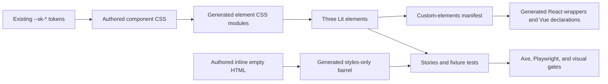

# Implementation Plan: Compact Work-Item Extensions

**Branch**: `mission/compact-work-item-extensions` | **Date**: 2026-09-07 | **Spec**: [spec.md](./spec.md)
**Input**: GitHub issue #212, part of #208, on the current `train/elements-first` base

## Summary

Add four presentation-only extensions to existing public surfaces: card layout and a supporting
slot for `sk-action-row`, independent compact-size/circle axes and predictable image cropping for
`sk-entity-marker`, marker-only pulsing for `sk-status-indicator`, and an inline modifier/exemplar
for the styles-only empty-state primitive. Preserve the existing native interaction, accessible
name, tone, and light-DOM contracts. All visual choices use the current authoritative `--sk-*`
catalogue; T10/T11 supply qualitative composition intent, not recoverable pixel values.

The approved qualitative reference is #208's T10 Mission kanban screen in Stitch project
[`13081441628826430456`](https://stitch.withgoogle.com/projects/13081441628826430456), screen ID
`ac34a994f4eb4c058d0744bf757713ab`. The binding #212 issue contract remains implementation
authority; the Stitch screen informs observable composition intent only.

The mission also makes one bounded correction to the Storybook axe render-evidence gate. It will
accept only a loaded, paintable, directly slotted `img[alt=""]` inside a registered, genuinely
upgraded and meaningfully labelled `sk-entity-marker`; the current empty-image fixture, blank hosts,
unupgraded or counterfeit open-shadow hosts, and attribute-only promises remain rejected by the
same exported verdict function.

No new component, token, dependency, package, status tone, application state, or architectural
ruling is required.

## Technical Context

**Language/Version**: TypeScript and ECMAScript modules on the repository-pinned Node/npm toolchain
**Primary Dependencies**: Lit, generated custom-elements manifest, generated React wrappers,
Storybook, Playwright, Vitest, axe-playwright, Nx
**Storage**: N/A; all inputs are consumer-projected content and reflected presentation properties
**Testing**: fixture behavior tests, ADR-11 registry/mutation checks, React compile-time tests,
Storybook axe, three-browser Playwright, Chromium visual regression, repository drift/quality gates
**Target Platform**: evergreen browsers covered by Chromium, Firefox, and WebKit projects
**Project Type**: token-first monorepo (`styles → elements → generated wrappers`)
**Performance Goals**: CSS-only presentation changes; no timer, subscription, fetch, image
processing, or shared pulse lifecycle
**Constraints**: existing `--sk-*` values only; additive public API; authored/generated ownership;
native light-DOM empty-state semantics; no cross-shadow selectors; do not worsen #154
**Scale/Scope**: three existing custom elements, one existing styles-only family, their stories,
registries, generated distribution artifacts, documentation, and focused acceptance evidence

## Doctrine and Charter Check

| Check | Plan response | Result |
|---|---|---|
| Tokens first and semantic token pairing | Reuse the current catalogue for every design value. Stop rather than invent a raw value or token. | Pass |
| Dependency direction | Author CSS in `packages/styles`; elements adopt generated CSS; React/Vue surfaces derive from the manifest. | Pass |
| ADR-9 styling API | Add only the declared `supporting` part; use BEM modifiers and existing per-component CSS/property boundaries. | Pass |
| ADR-10 authored/generated ownership | Author the inline exemplar once and regenerate all barrels, CSS modules, manifest, wrappers, Vue types, and size report. | Pass |
| ADR-11 evidence | Keep the existing subject sets; add exactly four SC-010 property-before-upgrade arms and one SC-013 supporting-part-removal arm; cover reflection, fail-open, projection and presentation through direct tests. | Pass |
| Native semantics | Keep `.sk-empty-state--inline` on consumer-authored light DOM with no element wrapper, role, or live region. | Pass |
| Compatibility | Omitted/invalid new values retain current behavior; existing parts, slots, events, tones, and default baselines remain unchanged. | Pass |
| Accessibility and preferences | Preserve DOM/visual order, single marker naming, static reduced-motion emphasis, and forced-colors distinction. | Pass |
| Supply-chain/release gates | No dependency or lockfile change is planned; still run lockfile, audit, action-pin, build, drift, and package graph gates. | Pass |
| Ownership boundaries | No Work Package component, status-toned card imitation, notice semantics, routing, fetching, timers, liveness inference, or identity derivation. | Pass |

The implementation does not cross an uncovered architecture boundary. If existing tokens cannot
express the required treatment, or if the axe correction cannot be kept to the conjunctive marker
case below, implementation must stop and raise a decision instead of widening this plan.

### Intermediate approval versus completion

Each WP remains independently reviewable and may receive an intermediate `approved` review verdict.
WP01 and WP02 MUST remain not `done`: their focused checks intentionally do not duplicate WP03's
shared ratchets, all-story axe run, or CI-authoritative visual ownership. No WP may transition to
`done` until WP03 has integrated all three packages and run the coherent mission's full Storybook,
axe, visual, generation, and final gate surface. WP01 builds Storybook as a focused story smoke before
intermediate approval; WP02 also builds Storybook and runs its owned focused browser evidence. Full
all-story axe and visual baselines remain T016-only after shared story ratchets are current.

## Architecture and Data Flow



Consumer attributes and slots are the only runtime inputs. Lit reflects and validates presentation
properties, but performs no domain translation. CSS consumes reflected attributes. The action-row
event continues to originate only from its existing internal trigger, while trailing controls stay
its sibling. The axe script observes rendered Storybook DOM only; it does not alter component
runtime behavior.

## Project Structure

### Authored implementation surfaces

```text
packages/styles/src/
├── action-row/sk-action-row.css
├── entity-marker/sk-entity-marker.css
├── status-indicator/sk-status-indicator.css
└── empty-state/
    ├── sk-empty-state.css
    ├── sk-empty-state-inline.html              # new authored exemplar
    └── sk-empty-state-html.stories.ts

packages/elements/src/
├── action-row/{sk-action-row.ts,sk-action-row.stories.ts}
├── entity-marker/{sk-entity-marker.ts,sk-entity-marker.stories.ts}
└── status-indicator/{sk-status-indicator.ts,sk-status-indicator.stories.ts}

fixtures/elements-behaviour/src/
├── sk-action-row.test.ts
├── sk-entity-marker.test.ts
└── sk-status-indicator.test.ts

packages/react/type-tests/wrappers.type-test.tsx
apps/storybook/src/tests/sk-empty-state-inline.spec.ts          # new WP02 focused suite
apps/storybook/src/tests/sk-compact-work-item-extensions.spec.ts  # new focused acceptance suite
apps/storybook/src/tests/visual.spec.ts
scripts/run-axe-storybook.js
packages/elements/src/__fixtures__/shapes.mjs
behaviours.json
mutations.json
expected-docs.json
expected-parts.json
expected-stories.json
docs/design-system/{using-components.md,using-react.md,changelog.md}
```

### Regenerated outputs

```text
packages/elements/src/{action-row,entity-marker,status-indicator}/sk-*.css.{js,d.ts}
packages/styles/src/empty-state/index.ts
packages/elements/custom-elements.json
packages/elements/vue.d.ts
packages/react/src/**
packages/elements/SIZES.md
```

Generated files are never edited to create the desired output. `mutations.selftest.json` is not a
planned edit: extend it only if a new mutation-runner capability is actually required, which this
plan does not anticipate.

## Public Contract Design

### 1. `sk-action-row`

- Add reflected `layout: 'card' | undefined`. Only `card` is accepted. Omitted/empty values select
  the unchanged row presentation; unsupported non-empty strings warn through the component's
  established validation style and fail open to that same presentation.
- Add a named `supporting` slot in an always-present wrapper declared as `part="supporting"`.
  Follow the repository's existing slot-presence pattern so the wrapper is hidden when it has no
  assigned content and restored after later assignment. The stable wrapper keeps `::part()`
  addressable without creating false visible content.
- Keep the current trigger element and activation handlers. `rowId`, `selectable`, controlled
  `selected`, exact `{ id }` detail, event flags, keyboard de-duplication, and no-tab-stop rules do
  not branch by layout.
- Keep native/custom trailing controls outside the primary trigger. Supporting content is passive
  summary content, never an interactive channel; consumers place actions in `controls`.

The fixed source order is also the visual and assistive-technology order:

```text
sk-action-row
├── primary trigger (existing button/div selection)
│   ├── marker
│   ├── title
│   ├── reference
│   ├── tags
│   ├── metadata
│   └── supporting
└── controls (independent sibling)
```

Card CSS reflows that same tree. It must not use CSS `order`, move controls into the trigger, add a
semantic card wrapper, nest a toned `sk-card`, or add a status/tone axis. Long title/reference and
sparse combinations must wrap or contain their own overflow at 220px, an intermediate width, and
360px without clipping focus indication.

### 2. `sk-entity-marker`

- Add reflected `size: 'sm' | undefined` and `shape: 'circle' | undefined`. Each validated axis
  toggles its own BEM modifier, so compact-square, default-circle, and compact-circle are true
  compositions rather than coupled variants. Unknown runtime values apply no modifier and retain
  the corresponding default axis.
- Keep the internal `part="marker"` as the bounded box. Existing token-backed dimensions supply
  default and compact sizes; an existing radius token supplies the circle. Do not hardcode inferred
  Stitch pixels.
- Style only a directly slotted default-slot image. It fills the marker's content box in both sizes
  and shapes with `width`/`height` constrained to the box, `object-fit: cover`, and host clipping,
  preventing intrinsic portrait/landscape ratios from stretching layout.
- Preserve the current accessible-name algorithm: a trimmed nonblank host `label` makes the
  internal marker `role="img"` with that one `aria-label`; absent/blank labels retain decorative
  behavior. The supported meaningful image composition is host `label` plus consumer-owned
  `img alt=""`. The library neither rewrites alternate text nor fetches/derives image or identity
  data. Documentation calls nonempty image alt in this composition a duplicate-name consumer error.

### 3. `sk-status-indicator`

- Add reflected boolean `pulsing = false`; property-before-upgrade and attribute/property
  synchronization follow the component's existing Lit conventions.
- Scope the presentation exclusively to the marker wrapper. Adopt the current slot-presence
  technique so an empty marker slot stays hidden and `pulsing` cannot create a placeholder dot.
- Use per-host CSS animation only. Do not add JavaScript timers, subscriptions, shared phase/state,
  liveness inference, text replacement, or tone mapping. The six existing tones remain exhaustive.
- Under `prefers-reduced-motion: reduce`, remove animation but retain a static token-backed marker
  emphasis. Under `forced-colors: active`, retain a system-perceivable border/outline distinction;
  do not use `forced-color-adjust: none`. Supplied visible text remains unchanged and is always the
  meaning carrier.

### 4. `.sk-empty-state--inline`

- Add a BEM modifier to the existing styles-only family. It represents one compact structural
  message, not one forced physical line: allow natural wrapping and prohibit `nowrap`, ellipsis,
  and clipping.
- Add authored `sk-empty-state-inline.html` using native passive content, for example a paragraph
  with `sk-empty-state sk-empty-state--inline` and consumer-supplied copy. It has no role, live
  region, heading, action, or fallback string.
- Generate its `SkEmptyStateInlineHTML` barrel export through
  `scripts/build-styles-only-markup.mjs`. Existing heading/body/action exemplars and presentation
  remain unchanged.

## Bounded Axe Render-Evidence Correction

Do not add `img[alt=""]` to the global content/media selector: that would make an invisible,
broken, or decorative image sufficient everywhere. Extend the existing self-contained
module-exported `computeRenderVerdict`/`hasOwnContent` seam with one conjunctive special case. It
returns positive only when all of the following are observed in the rendered page:

1. the host's exact local name is `sk-entity-marker`;
2. `customElements.get('sk-entity-marker')` returns the registered constructor, the host matches
   `:defined`, `host instanceof customElements.get('sk-entity-marker')` is true, and the upgraded
   host exposes its open shadow root;
3. the reflected host `label`, after trimming, is nonblank;
4. the shadow `[part~="marker"]` has `role="img"`, carries the exact same nonblank `aria-label`, and
   is not `aria-hidden`;
5. the default slot directly assigns the candidate `img`, with `assignedSlot`, parent and host
   relationships excluding an indirect or descendant-component image;
6. that image's `alt` is exactly empty;
7. it is `complete` with positive `naturalWidth` and `naturalHeight`;
8. it has a positive rendered rectangle; and
9. its computed `display` and `visibility` are paint-capable.

Both the readiness wait and final per-root/per-host assertion must call that same module-exported
verdict; do not introduce a second predicate or closure-only exception. In
`packages/elements/src/__fixtures__/shapes.mjs`, add a deterministic embedded data image as the
positive shape. Add an unregistered counterfeit marker with an open shadow root and otherwise
matching marker internals/direct loaded image. Add independent negative shapes that falsify each
conjunct or subcondition: wrong local name, missing registered constructor, non-`:defined` or non-
instance host, missing authored shadow internals, blank label, wrong marker role, marker/host
`aria-label` mismatch, `aria-hidden`, descendant image, indirectly slotted image, nonempty alt,
broken image, zero-intrinsic image, hidden image, zero rectangle, and otherwise nonpaintable image.
Keep the current `shadow-img-empty-alt` and `light-img-empty-alt` shapes rejected. Every positive and
negative must traverse the exported verdict used by both readiness and final assertion. Update
`scripts/gate-selftest.mjs` only if deterministic image-load orchestration genuinely needs a focused
harness change, never to duplicate or relax the verdict.

## Evidence Design

### ADR-11 registry and mutation mapping

Use only the existing ADR-11 scenario IDs and subject sets. In particular, SC-011 is the fallback-
behavior row: none of the three elements gains fallback behavior in this mission, so no action-row,
entity-marker, or status-indicator SC-011 subject is added.

| Surface | Existing scenario rows to extend | Contract evidence and new non-inert mutation arms |
|---|---|---|
| Action row | SC-006, SC-007, SC-008, SC-010, SC-013, SC-014 | Add one SC-010 arm that breaks `layout` property-before-upgrade preservation and one SC-013 arm that removes only `part="supporting"`. Keep existing rowId, event, nested-control, reference, and adopted-sheet arms live. Reflection, unsupported-layout fail-open, supporting slot naming/projection/empty behavior, and source order are ordinary direct assertions, not registry subjects or slot-misroute mutations. |
| Entity marker | SC-010, SC-013, SC-014 | Add one SC-010 property-before-upgrade arm for `size` and one for `shape`. Keep existing label, content-part, and adopted-sheet arms live. Reflection, default-slot image projection, crop, and accessible naming remain ordinary direct assertions, with no SC-011 subject or slot-misroute mutation. |
| Status indicator | SC-010, SC-013, SC-014 | Add one SC-010 arm that breaks `pulsing` property-before-upgrade preservation. Keep existing tone, part, and adopted-sheet arms live. Reflection, marker-slot projection, marker-only pulse, reduced motion, and forced colors remain ordinary direct assertions, with no SC-011 subject or slot-misroute mutation. |
| Generated React action row | Existing SC-006 | Reconfirm activation detail/flags through the wrapper; no new event contract is introduced. |

The `behaviours.json` documentation comment may be updated to record this boundary, but its subject
sets do not expand. Supporting projection, marker image projection/naming, pulse/preferences, card
geometry, and inline empty semantics receive ordinary DOM, computed-style, geometry,
accessibility-tree, interaction, and visual assertions. They do not receive invented ADR-11 IDs or
mutations. There are exactly five new arms: four SC-010 property-before-upgrade arms (`layout`,
`pulsing`, `size`, `shape`) and one SC-013 arm removing only `part="supporting"`. WP01 demonstrates
its three handoff arms once, WP02 demonstrates its two once, and WP03 persists those exact entries
without manually replaying them; `node scripts/suite-selftest.mjs` is the sole final re-derivation.

### Focused behavior and type evidence

- Extend the three element fixture tests for omitted, accepted, unknown, toggle-after-upgrade, and
  property-before-upgrade values. Prove supporting/marker slot assignment and removal, source order,
  part exposure, accessible-name rules, pulse marker-only scope, and all unchanged interaction/event
  contracts.
- Extend React compile-time coverage with positive uses of `layout`, `size`, `shape`, and `pulsing`,
  plus `@ts-expect-error` cases for unsupported strings/non-boolean pulse. Assert the generated
  types are exact unions/boolean and never `any`; add no host `tabindex` forwarding.
- Update `expected-docs.json` by the rebased per-element deltas: action-row attributes 3→4,
  entity-marker 1→3, status-indicator 1→2. Update `expected-parts.json` only by the one new
  action-row `supporting` part. Register all authored new-axis stories in
  `expected-stories.json`. Recalculate repository totals after the final rebase rather than
  copying stale global counts.
- Reconcile each changed element's documented `Token dependencies:` JSDoc against the exact unique
  `--sk-*` references in its authored CSS. WP01 owns action-row and status-indicator comment updates;
  WP02 owns entity-marker's comment and documents the inline empty-state modifier's exact token
  contract in the existing component guide. WP03 repeats set-equality inspection after the final
  rebase. Use existing comments/docs only; add no token file and no new token.

### Storybook coverage

Keep existing default stories unchanged and add focused stories along these lines:

- Action row: `CardStates`, `CardLongContent`, `T10CompactItem`, and
  `T10CompactItemLightMode`; cover static/selectable/selected, sparse channels, supplied live/stale
  supporting text, and nested controls.
- Entity marker: `AxisMatrix`, `ImageNaming`, `LongLabel`, and
  `CompactCircleLightMode`; cover initials/icon/image, both sizes/shapes, meaningful/decorative
  labels, and portrait/landscape crop.
- Status indicator: `PulsingStates`, `MultiplePulsingAllTones`, `PulsingPreferences`, and
  `PulsingLightMode`; cover pulse off/on, absent marker, all six tones, and several instances.
- Empty state: `Inline`, `InlineLongNarrow`, `InlinePreferences`, and `InlineLightMode`; keep copy
  supplied and passive.

Every new story has a genuine `.sk-light` `LightMode` variant. Preference stories are illustrative;
authoritative preference evidence comes from Playwright `emulateMedia`, so the story must not use a
decoy class that only looks reduced/forced.

### Playwright, axe, and visual evidence

Add WP02-owned `sk-empty-state-inline.spec.ts` and run it under Chromium, Firefox, and WebKit for
short/long supplied copy, 220px/intermediate/360px widths, dark/light/forced-colors, passive native
semantics and page overflow. Add WP03-owned `sk-compact-work-item-extensions.spec.ts` and run it
under Chromium, Firefox, and WebKit. It must cover:

- action-row DOM/accessibility order, one pointer/Enter/Space activation, no nested-control row
  activation, selected-state control, no tab stop when non-actionable, and focus/overflow checks at
  220px, an intermediate width, and 360px in both layouts;
- marker size/shape independence, bounded box geometry, portrait/landscape cover behavior,
  meaningful single name, decorative behavior, and long/whitespace labels;
- pulse toggle/reflection, marker-only animation, no-marker behavior, multiple-instance
  independence, all tones, a differential pulse-on versus pulse-off static emphasis under reduced
  motion, and an author-owned non-color pulse-on versus pulse-off observable under forced colors;
  UA remapping or unchanged current styling alone is not evidence; and
- inline empty native passive semantics, complete wrapping copy, themes/preferences, and no
  horizontal page overflow.

Run the Storybook build and axe over every affected story. The gate self-test must show the valid
loaded image case passes while each independent negative named in the bounded axe correction,
including the counterfeit unregistered open-shadow marker, fails through the same exported verdict
used by readiness and final assertion.

At T016, attempt live access to #208's approved T10 Stitch project URL and screen ID above. Record
the attempt date and whether the screen was accessible/authenticated. Compare candidate dark,
light, and narrow screenshots against every observable approved T10 intent and every binding #212
clause. If the remote remains unauthenticated or unavailable, preserve that evidence and perform the
bounded qualitative comparison against #212 plus current authoritative train fixtures and tokens;
remote access is not a blocker when the issue contract is sufficient. Never invent dimensions or
claim pixel fidelity. Prepare the candidate screenshots and visual diff for the orchestrator to
attach to the PR with the access outcome and qualitative disposition.

Add only new-state assertions to `visual.spec.ts`; all existing default baselines remain unchanged.
Include the integrated T10 compact item in dark/light, narrow/long content, marker axis/image crop,
pulse on/off and preference fallback, and inline empty states. Make pulse screenshots deterministic
by using reduced motion or by disabling only the animation after behavior was separately asserted.
CI is authoritative for Ubuntu pixels: retrieve and inspect the `visual-regression-diffs` artifact,
commit the intentional new PNGs, and rerun the exact head. Never accept changed legacy screenshots
without explaining and fixing their compatibility regression.

## Implementation Concern Map

### IC-01 — Additive element contracts

- **Purpose**: Add the reflected action-row layout, marker axes, and pulsing flag without branching
  existing behavior.
- **Relevant requirements**: FR-001–FR-023, NFR-002–NFR-008.
- **Affected surfaces**: three element sources, their authored CSS, stories, fixtures, manifest,
  wrappers, Vue types, docs, and ratchets.
- **Depends on**: none.
- **Risks**: CSS reordering, wrapper focus regression, coupled marker axes, animation leaking to
  text, and empty slots occupying space.

### IC-02 — Native inline empty state

- **Purpose**: Provide the compact passive empty-lane treatment without creating element or notice
  semantics.
- **Relevant requirements**: FR-024–FR-027, NFR-002, NFR-004, NFR-007–NFR-008.
- **Affected surfaces**: empty-state CSS, authored inline HTML, generated barrel, stories, docs,
  ratchets, focused browser/visual tests.
- **Depends on**: none.
- **Risks**: physical one-line truncation, invented accessibility semantics, or hand-edited barrel.

### IC-03 — Fail-closed image render evidence

- **Purpose**: Admit the one valid upgraded meaningful marker/image composition without weakening
  axe anti-vacuity.
- **Relevant requirements**: FR-030–FR-031, NFR-001, C-016, NI-013, mission success criterion
  SC-011 (not ADR-11's fallback-behavior scenario).
- **Affected surfaces**: axe runner, shapes fixture, and existing gate self-test if needed.
- **Depends on**: IC-01's final marker DOM/name contract.
- **Risks**: accepting a bare label, invisible/broken image, descendant image, or unupgraded host;
  wait/assert predicate drift.

### IC-04 — Composition and distribution proof

- **Purpose**: Prove the four surfaces compose into T10 intent and distribute consistently.
- **Relevant requirements**: FR-028–FR-029, NFR-001–NFR-009, SC-001–SC-010.
- **Affected surfaces**: stories, Playwright/visual tests, registries/mutations, docs, generated
  artifacts, size report, and full gates.
- **Depends on**: IC-01–IC-03.
- **Risks**: stale generation after rebase, incomplete state matrix, environment-specific visual
  baselines, and registry mutations that do not test the claimed contract.

## Delivery Slicing

Tasks should produce three serial work packages on the single mission branch. They are independently
reviewable units eligible for intermediate `approved` verdicts, not independently mergeable train
releases or completed slices; #214 must see the coherent final contract.

1. **Action-row and status presentation contracts**: red-first fixture evidence, authored element/
   CSS changes, focused stories, the SC-010 property-before-upgrade mutations for `layout` and
   `pulsing`, the SC-013 mutation removing only `part="supporting"`, and direct reflection,
   fail-open, supporting projection and pulse-preference assertions.
2. **Entity marker, inline empty state, and axe seam**: SC-010 size/shape mutations; direct image
   projection/naming and passive-inline assertions; the conjunctive gate correction, its
   positive/negative self-test shapes, and focused documentation.
3. **Integrated acceptance and distribution**: T10 composition, three-browser/narrow/preference
   coverage, generated artifacts, ratchets, documentation, size report, CI-authoritative visual
   baselines, and final full gates.

Each package starts from a clean tree, records red-first evidence before implementation, and leaves
its owned focused surface green. WP01 and WP02 may receive intermediate `approved` verdicts but remain
not `done`; no WP becomes `done` until WP03 has run full coherent Storybook/axe/visual gates. Task
authoring must distinguish the limited SC-010/SC-013 registry arms above from ordinary direct-test
coverage and must not create SC-011 or slot-misroute tasks. Tier B point-cuts occur after task
authoring and again before merge; all four required Codex adversarial lenses review the final exact
head separately.

## Risk Mitigation

| Risk | Mitigation / proof |
|---|---|
| Card layout changes semantics | One DOM tree for both layouts; source-order and accessibility-tree assertions; controls remain sibling. |
| Sparse slots leave gaps | Slot-presence listeners/tests for initial empty, assignment, removal, and reassignment. |
| Marker axes become a combined enum | Separate properties/modifiers and full 2×2 geometry matrix. |
| Image produces duplicate/false name | Host-label algorithm unchanged; documented `alt=""`; accessibility-tree and axe assertions. |
| Axe exception masks blanks | Exact-host plus registered-constructor/`:defined`/`instanceof` proof, authored internals, name consistency, direct slot, empty alt, intrinsic load, visibility and positive-rect conjunction; one independent negative per subcondition, including a counterfeit open-shadow host. |
| Pulse becomes behavioral or motion-only | CSS-only flag, no lifecycle code, marker-scoped computed styles, reduced-motion static and forced-colors tests. |
| Inline means truncated | Explicit long-copy narrow tests and no nowrap/ellipsis; passive native exemplar. |
| Generated drift or stale train state | Regenerate after the final rebase, run check modes, require clean committed output, and invalidate all evidence after any push. |

## Generation and Verification Sequence

After authored changes and focused tests are green, regenerate in dependency order:

```bash
node scripts/build-elements-css.mjs
node scripts/build-element-markup.mjs
node scripts/build-styles-only-markup.mjs
npx nx run elements:analyze --skip-nx-cache
node scripts/build-react-wrappers.mjs
node scripts/build-vue-types.mjs
npx nx run-many --target=build --projects=tokens,styles,elements --skip-nx-cache
node scripts/measure-elements-sizes.mjs
```

Then run the repository's complete current gate surface, including:

- focused fixture/React/Playwright tests first, followed by `npm run test` and
  `node scripts/suite-selftest.mjs`;
- all generator `--check` modes, manifest diff, styles-only barrel check, and size-report check;
- manifest-content, source-CSS, element-entry, adopted-CSS, CSS-hygiene, part, docs/story,
  theme-wrapper, wrapper self-test, mutation, and gate-wiring ratchets required by current CI;
- `node scripts/typecheck-all.mjs` and `npm run quality:all`;
- `npm run security:lockfile-check`, `bash scripts/npm-audit-gate.sh`, action-pin checks, release
  graph/build/contents checks applicable on the current train;
- Storybook build, demo assembly/path verification, axe and gate self-tests;
- focused Playwright across Chromium/Firefox/WebKit and relevant Chromium visual regression.

Use the exact commands in the rebased `CLAUDE.md`, component recipe, and CI workflow when they
supersede this inventory. No gate may be skipped, muted, weakened, or reclassified.

## Final Rebase and Gate Sequence

1. Fetch the latest `train/elements-first`, rebase the mission branch, and resolve against the
   train's current tokens/contracts rather than preserving stale assumptions.
2. Rerun all generators, explicitly rerun manifest analysis and its `git diff --exit-code` drift
   check, update rebased ratchet totals, build before measuring sizes, reconcile the documented
   token-dependency sets against every changed authored CSS file, commit every legitimate generated
   output, and confirm no drift.
3. Immediately build Storybook, before any focused Playwright, visual, or axe command; then run
   focused evidence followed by the full local gate surface above.
4. Push and let CI generate the authoritative Ubuntu visual diff artifact. Inspect it, add only the
   intentional new baselines, and rerun local affected gates.
5. Fetch/rebase again if the train moved. Any rebase or push invalidates CI and review evidence.
6. On the exact final PR head SHA, obtain green CI and dispatch the required profile-loaded Codex
   adversarial gate: Architect Alphonso, Reviewer Renata, Debugger Debbie, and Randy Reducer. Record
   severity, file/line, explanation, recommendation, and folded/deferred disposition.
7. Fold all findings or defer them only to numbered issues, then rerun both CI and all four lenses
   after any resulting push. Merge only when every exit criterion is evidenced on that unchanged
   head.
8. Only after WP03's full Storybook, axe, visual, and final gate evidence is green may the three
   independently reviewed WPs transition from intermediate `approved` verdicts to `done`.

## Complexity Tracking

No charter violation or exceptional architecture is planned. The only gate change is the bounded
case already required by FR-030/FR-031 and C-016; its strict conjunction and negative fixtures keep
the existing fail-closed contract.
