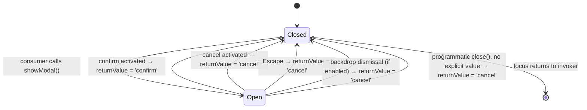

# Phase 1 Data Model: sk-confirm-dialog

This component is presentational/behavioral with no persisted or domain data. There is no
database, API resource, or long-lived record. The "entities" below are the value shapes the
public contract passes across the element's boundary — documented here because they are what
`custom-elements.json`, the React wrapper, and the behavior tests all need to agree on.

## Confirmation Outcome (value, not a stored entity)

| Field | Type | Description |
|---|---|---|
| `returnValue` | `'confirm' \| 'cancel'` | Read from the native `<dialog>` after its `close` event fires. `'confirm'` only when the confirm control was activated; every other close path (cancel control, Escape, backdrop dismissal, programmatic close with no explicit value) resolves `'cancel'`. |

**Invariants**:
- Exactly one of the two literal values is ever observed; there is no third state, no `undefined`,
  and no empty string once the dialog has closed at least once.
- The element itself never reads or acts on this value beyond setting it — FR-005 (outcome
  reported, never performed).

## Public reactive properties (element's own public surface — not "data" in the storage sense)

| Property (attribute) | Type | Required? | Default | Notes |
|---|---|---|---|---|
| `dialogTitle` (`dialog-title` or `title` if it does not collide with the global HTML `title` attribute — **naming finalized in tasks**) | `string` | Yes, no default | none (FR-001) | Becomes the dialog's accessible name (FR-002). |
| `message` / `body` (**naming finalized in tasks**, matching the `sk-notice` precedent of a plain `message` property) | `string` | Yes, no default | none (FR-001) | Becomes the dialog's accessible description (FR-002). Long values scroll (FR-010). |
| `confirmLabel` (`confirm-label`) | `string` | Yes, no default | none (FR-001) | Visible text of the confirm control. |
| `cancelLabel` (`cancel-label`) | `string` | Yes, no default | none (FR-001) | Visible text of the cancel control. |
| `initialFocus` (`initial-focus`) | `'confirm' \| 'cancel'` | No | `'cancel'` (FR-008 — the one property this component is allowed a real default for, because it is a **behavioral** safe-default, not user-visible copy) | Documented, consumer-overridable. |
| a backdrop-dismissal toggle (naming/default finalized in tasks; see research.md open question 4) | `boolean` | No | finalized in tasks | Governs whether clicking outside the dialog's content resolves as cancel (FR-007). |

**Why `initialFocus` may default and the four strings may not**: FR-001/FR-017 forbid a default
for *user-visible copy* specifically, because that is #286's exact concern (a literal reaching an
untranslated shadow root). `initialFocus` is a behavioral enum with no user-visible text of its
own — defaulting it to `'cancel'` is the safe-default FR-008 explicitly asks for, not a violation
of the no-copy-defaults rule.

## State transitions

No state is retained across a Closed→Open→Closed cycle beyond what the consumer re-supplies
(strings are reactive properties the consumer owns; they are not reset by the element itself).
