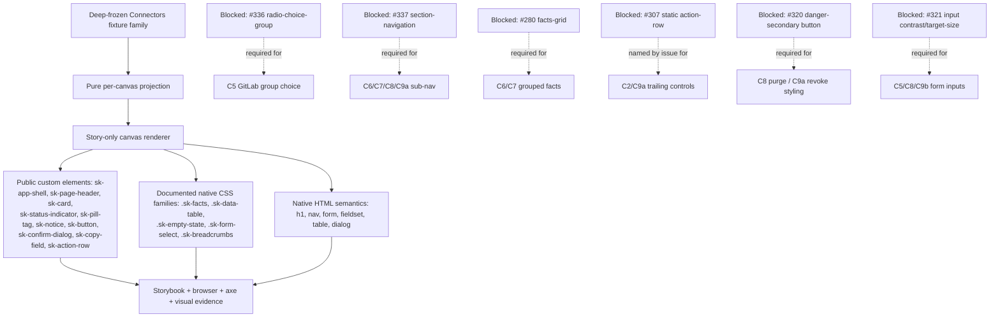

# Implementation Plan: Connectors Pattern Stories

**Mission**: `connectors-pattern-stories-01M26947`
**Branch / merge target**: `train/elements-first`
**Spec**: `kitty-specs/connectors-pattern-stories-01M26947/spec.md`
**Research**: `kitty-specs/connectors-pattern-stories-01M26947/research.md`
**Issue**: `spec-kitty/spec-kitty-design#338`, part of epic #335

## Summary

Prove the Opus-approved Connectors C1-C9b corpus as one Storybook-only pattern-story family under
`packages/elements/src/patterns/`, composed from public `@spec-kitty/elements`/`@spec-kitty/styles`
surfaces already on the train plus six named dependencies (#336, #337, #280, #307, #320, #321) —
each consumed only where `research.md`'s canvas map shows it genuinely required. **This mission is
dependency-blocked for final implementation and baselines by explicit design.** This plan therefore
splits every concern into work doable now against the current train (fixture typing, pure
projections that don't yet need a blocked surface, red-first composition-gate scaffolding, truth-
boundary test *shapes*) and work that must wait for a named dependency, and does not sequence past
that split — no fixture, story, or CSS is authored in this pass (see spec.md SC-012).

## Technical Context

**Language/Version**: TypeScript 5, Lit 3, Storybook 10 web components, Node 22 in CI.
**Primary Dependencies**: existing public `@spec-kitty/elements` exports (`sk-app-shell`,
`sk-personal-rail`, `sk-context-sidebar`, `sk-page-header`, `sk-card`, `sk-status-indicator`,
`sk-pill-tag`, `sk-notice`, `sk-button`, `sk-confirm-dialog`, `sk-copy-field`, `sk-action-row`) and
`@spec-kitty/styles` families (`.sk-facts`, `.sk-data-table`, `.sk-empty-state`, `.sk-form-select`,
`.sk-breadcrumbs`); no new package dependency. Six blocked public contracts named above.
**Storage / services**: none; fixtures are static authored evidence, deep-frozen.
**Testing**: Playwright Storybook tests (Chromium/Firefox), axe, Vitest/node fixture-consistency and
mutation gates, visual regression, `scripts/check-pattern-composition.mjs` (#259) and its self-test.
**Target Platform**: repository-supported modern browsers and the static Storybook build.
**Performance Goals**: stay within the repository Storybook build budget; render performs no I/O,
polling, parsing, or timers.
**Constraints**: zero new public component surface; zero private-root reach; zero page-level
horizontal overflow at 390px/200%/400% zoom; public token values only; every truth boundary in
spec.md FR-011-FR-019 provably absent, not merely untriggered.
**Scale/Scope**: ten canvases (C1-C9b), one fixture family, one pattern module (or a small set under
one directory), targeted browser tests, existing visual/story registries, one doc section.

## Charter Check

- **Tokens first — PASS by design**: pattern-owned layout will use only approved `--sk-*` tokens;
  no raw value or new token is anticipated. Re-verify once layout is authored.
- **Semantic pairing — PASS by design**: composed elements/styles already carry paired
  surface/foreground and status tokens (`danger` tone verified present on `sk-status-indicator`,
  `sk-pill-tag`, `sk-notice`, `sk-card`).
- **Public composition — PASS, verified**: every surface named in `research.md`'s map was read
  directly from `packages/elements/src/**` and `packages/styles/src/**` at this checkout's HEAD, not
  assumed from the issue body or the product corpus.
- **Naming — PASS by design**: pattern-owned classes will use an `sk-connectors-pattern` (or
  per-canvas-group) BEM block, following the `sk-repository-dossier-pattern` precedent.
- **Accessibility — REQUIRED, not yet verified**: native semantics (FR-024), keyboard coverage
  (FR-025), axe (NFR-006), and accessibility-tree assertions (NFR-007) are explicit story-phase
  work; nothing is built yet to check.
- **Theme — PASS by design**: default dark plus required `LightMode` (NFR-002); no light-mode
  product redesign is implied — matches the Repository Dossier precedent's system-proof framing.
- **Review — REQUIRED**: an independent reviewer seat inspects the exact final head once
  implementation exists; not applicable to this design-only pass.
- **Generated artifacts — N/A this pass**: no generator has run; `expected-parts.json`,
  `expected-docs.json`, `behaviours.json`, `mutations.json`, `expected-stories.json` updates are
  implementation-phase work (FR-028).
- **Delivery — PASS**: one coherent work package once implementation starts, one PR with
  `Closes #338` and `Refs #335`, targeting only `train/elements-first`.
- **Composition-boundary gate (#259) — N/A this pass**: nothing exists yet under
  `packages/elements/src/patterns/` for this family; `check-pattern-composition.mjs
  --selftest` was NOT run against this mission's (nonexistent) code — see Verification Strategy.

## Project Structure

### Mission artifacts

```text
kitty-specs/connectors-pattern-stories-01M26947/
├── meta.json
├── spec.md
├── research.md
├── data-model.md          # scaffolded, empty — no data model beyond the fixture shape itself
├── plan.md                # this file
├── tasks/                 # NOT populated this pass (tasks phase deferred)
└── status.events.jsonl    # CLI-owned
```

### Repository surfaces (once implementation starts — NOT created this pass)

```text
packages/elements/src/patterns/
└── connectors.stories.ts          # or split per canvas group if one file grows unwieldy —
                                    # decide at implementation time against the #259 gate's
                                    # MIN_COMPOSED_TAGS/MIN_OWNED_CLASSES floors

apps/storybook/src/tests/
├── sk-connectors-pattern.spec.ts
├── visual.spec.ts                 # extended, not replaced
└── visual.spec.ts-snapshots/      # generated only by Playwright tooling, harvested from CI

docs/design-system/using-components.md   # new "Connectors pattern" section
expected-stories.json                    # extended
```

**Structure decision**: Follow the `repository-dossier-pattern-stories` precedent exactly — fixture
types, recursive-freeze helper, pure projections, and story-only render helpers all live inside the
`.stories.ts` module(s) under `packages/elements/src/patterns/`, the only directory the #259 gate
scans. No package-level export. Whether C1-C9b become one file or several is an implementation-time
call, not a design-time one; either shape satisfies the gate as long as every fixture lives under
that directory and the family composes at least `MIN_COMPOSED_TAGS` (3) distinct `sk-*` tags.

## Architecture and Data Flow



The only mutable demonstration state anticipated is consumer-owned (e.g. a controlled
confirm-dialog's open/closed state, mirroring how `repository-dossier`'s drawer works) — every other
render is a pure projection from a frozen fixture. No projection infers backend truth: health,
counts, IDs, timestamps, errors, and permissions are always supplied facts (FR-017), never computed.

## Implementation Concern Map

Split explicitly into concerns doable **now** against the current train, and concerns that **wait**
on a named dependency. Nothing in either group is executed this pass — tasks/WPs are deferred.

### Doable now (zero blocked-dependency requirement)

#### IC-01 — Fixture shape and pure projection scaffolding

- **Purpose**: Establish the one fixture family's TypeScript shape (provider, installation, health,
  account, group, channel records) and the recursive-freeze/consistency-assertion helpers, mirroring
  `repository-dossier`'s fixture pattern, before any canvas is rendered.
- **Relevant requirements**: FR-017, FR-020, FR-021, FR-022; C-010, C-011.
- **Affected surfaces**: `packages/elements/src/patterns/connectors.stories.ts` (fixture types +
  freeze helper only, no render functions yet for blocked canvases).
- **Sequencing/depends-on**: none.
- **Risks**: designing the fixture shape before every canvas's exact composition is known risks
  over- or under-modeling fields. Mitigate by deriving the shape directly from
  `BACKEND-CAPABILITY-MAP.md`'s route/state inventory (already read) and the issue's explicit fact
  list (health, counts, IDs, timestamps, branches, errors, permissions) rather than guessing ahead.

#### IC-02 — Unblocked canvas composition: C1, C3, C4

- **Purpose**: Compose the three canvases with no `blocked-on` marker in spec.md — C1 (setup index),
  C3 (provider handoff), C4 (GitHub App setup failure) — entirely from surfaces verified present
  today (`sk-app-shell`, `sk-page-header`, `sk-card`, `sk-notice`, `sk-status-indicator`, `sk-button`
  busy-cue, `.sk-breadcrumbs`, `.sk-empty-state`).
- **Relevant requirements**: FR-001, FR-003, FR-004; FR-011, FR-014 (both touch these canvases via
  the automatic-admission and redirect-fact assertions).
- **Affected surfaces**: same pattern module, C1/C3/C4 render functions and projections.
- **Sequencing/depends-on**: IC-01.
- **Risks**: C1/C4's provider card grid and back-route layout are pattern-owned IA (C-004); risk is
  accidentally generalizing them into a reusable component. Mitigate by keeping every layout helper
  private to the `.stories.ts` module, as the #259 gate and every precedent require.

#### IC-03 — Truth-boundary test *shapes* not requiring rendered blocked canvases

- **Purpose**: Author the fixture-consistency assertions for the truth boundaries that apply to
  already-unblocked canvases now (FR-011 no-picker on C1/C3/C4's provider surfaces, FR-014
  `/discovery/`-as-fact, FR-017 fixture-consistency, FR-020 permission-projection-removes-controls
  where testable against C1's admin/member split if the issue's states include one).
- **Relevant requirements**: FR-011, FR-014, FR-017, FR-020.
- **Affected surfaces**: `apps/storybook/src/tests/sk-connectors-pattern.spec.ts` (scaffolding only
  for the unblocked assertions; the remaining six truth boundaries that only manifest on blocked
  canvases — FR-012 Slack, FR-013 GitLab-only, FR-015 purge, FR-016 danger/no-recovery on C6/C9a,
  FR-018 forms, FR-019 review scaffolding — cannot be meaningfully authored against nothing).
- **Sequencing/depends-on**: IC-01, IC-02.
- **Risks**: a test written against a canvas that later changes shape once a dependency lands is
  wasted or misleading work. Mitigate by keeping these assertions narrowly scoped to the exact
  unblocked canvases and re-deriving the remaining ones fresh once each dependency lands, rather
  than pre-writing speculative assertions against an unbuilt contract.

#### IC-04 — Composition-boundary gate scaffolding

- **Purpose**: Confirm `scripts/check-pattern-composition.mjs --selftest` still passes on the
  current train (its self-test is dependency-independent — it plants and detects violations in a
  temp copy) before any Connectors code exists, establishing the pre-mission baseline.
- **Relevant requirements**: FR-026, NFR-011.
- **Affected surfaces**: none (verification only).
- **Sequencing/depends-on**: none.
- **Risks**: none — this is a read-only baseline check, executed below in Verification Strategy.

### Waits on a named dependency

#### IC-05 — C5 GitLab group selection

- **Purpose**: Compose exactly-one group selection, validation, no-groups, and connected-after-
  refresh-failure states.
- **Relevant requirements**: FR-005, FR-013; FR-018 (announce-only submit).
- **Blocked on**: `#336` (radio-choice-group — the exactly-one selection primitive itself does not
  exist); `#321` (any validation-state input inherits the unfixed contrast/target-size defect).
- **Sequencing/depends-on**: IC-01.
- **Risks**: composing C5 against a hand-rolled substitute radio group would violate C-010 outright;
  this concern does not start until #336 merges to the train.

#### IC-06 — C6/C7/C8/C9a Installation Detail family (shell + three sub-navigation tabs)

- **Purpose**: Compose the installation detail shell and its three sub-navigated tabs (Workspace
  Scope, Project Routing, Team Accounts), which share one sub-navigation surface.
- **Relevant requirements**: FR-006, FR-007, FR-008, FR-009; FR-015, FR-016, FR-022, FR-023.
- **Blocked on**: `#337` (section-navigation — the sub-navigation strip connecting all four canvases
  does not exist; verified `.sk-context-nav` is a different, nested-tree contract, not a substitute);
  `#280` (grouped/reflowing facts-grid for C6's health facts and C7's scope facts — `.sk-facts`
  today only supports stacked/two-col, not a grouped grid); `#320` (danger-secondary button for the
  C8 hard-purge confirm action and any C9a revoke-styled control); `#307` (issue names it for C2/C9a
  trailing controls — see the IC-07 note on the measured finding); `#321` (C8 validation/Jira-rescue
  inputs).
- **Sequencing/depends-on**: IC-01; internally, the shell (C6) before its three tabs since they share
  the sub-navigation surface.
- **Risks**: this is the largest blocked concern — four of the ten canvases sit behind two-to-four
  dependencies each. Do not decompose it into a partial PR once dependencies land one at a time;
  spec.md C-012 keeps delivery to one PR, so implementation should wait until all of #337/#280/#320
  land (whichever of #307/#321 apply to the specific canvas) rather than landing C6 alone.

#### IC-07 — C2 operating index and C9a trailing controls

- **Purpose**: Compose provider rows/linked-account rows with a trailing per-row control (e.g. a
  reconnect or self-owned unlink action).
- **Relevant requirements**: FR-002, FR-009 (trailing-control portion); FR-012, FR-016.
- **Blocked on**: `#307` as named explicitly by the issue's dependency list. **Recorded finding,
  not acted on**: `research.md` shows the interactive `sk-action-row` Lit element already exposes a
  public `controls` slot/part on the train today, independent of #307/PR #331 (which adds only the
  static server-rendered form). If the operator confirms the Storybook composition may proceed on
  the interactive element alone, IC-07's `sk-action-row`-based rows could move to "doable now"; this
  plan does NOT make that call unilaterally and keeps IC-07 blocked per the issue's explicit text
  until the operator disposes of the finding.
- **Sequencing/depends-on**: IC-01, IC-02 (C2 is otherwise unblocked apart from this one facet).
- **Risks**: splitting "the parts of C2 that don't need a trailing control" from "the parts that do"
  into separate work risks a half-rendered canvas landing before its story is complete. Keep C2 as
  one unit gated on the operator's disposition of the #307 finding.

#### IC-08 — C9b Slack channel selection (partial block)

- **Purpose**: Compose populated/empty/refusal/rate-limit/incomplete-enumeration channel selection.
- **Relevant requirements**: FR-010; FR-012.
- **Blocked on**: `#321` only if the picker includes a filter/search `sk-form-input` — to be
  confirmed against the corpus's exact C9b markup at implementation time; the `.sk-form-select`-only
  path (no free-text filter) would be entirely unblocked.
- **Sequencing/depends-on**: IC-01.
- **Risks**: this is the one canvas where the block is conditional rather than certain — implementation
  must re-check the corpus's exact C9b form before assuming #321 applies, rather than blocking
  optimistically or unblocking incorrectly.

#### IC-09 — Delivery boundary, ratchets, and documentation

- **Purpose**: Register the family in every required ratchet (`expected-parts.json`,
  `expected-docs.json`, `behaviours.json`, `mutations.json`, `expected-stories.json`), harvest CI
  visual baselines, and document the composition/ownership boundary.
- **Relevant requirements**: FR-026, FR-027, FR-028, FR-029; NFR-008, NFR-009, NFR-010.
- **Blocked on**: transitively blocked — cannot finalize until IC-05 through IC-08 are complete,
  since ratchets and baselines cover the whole family, not a partial one (C-012's one-PR rule).
- **Sequencing/depends-on**: IC-01 through IC-08.
- **Risks**: partial ratchet registration would misrepresent the family as complete. Mitigate by
  finalizing this concern only once every blocked canvas has landed.

## Verification Strategy

### Run this pass (design/research only — no fixtures, stories, or CSS exist yet)

1. `SPEC_KITTY_NO_UPGRADE_CHECK=1 spec-kitty plan --mission connectors-pattern-stories-01M26947` —
   this command, its real output recorded in the mission report.
2. `node scripts/check-pattern-composition.mjs --selftest` — dependency-independent baseline check
   confirming the gate itself still passes on the current train before any Connectors code exists.
   Measured result: `✅ All 47 probes behaved as recorded (34 reject, 13 accept), all 8 input
   probes refused their own branch, both floor arms refused, and 16 planted violation(s) went red
   in a copy of the real patterns directory.`
3. `node scripts/check-pattern-composition.mjs` (non-selftest) — also run, since the directory
   already holds seven other pattern families and does not floor-refuse over an empty Connectors
   set (the R4 floors only trip on a genuinely empty patterns directory, not on this mission's own
   absence within a populated one). Measured result: `✅ Pattern composition: 9 fixture(s), 252
   inline CSS rule(s), 21 composed element tag(s), every ::part() inside the 141-part public
   ratchet, no reach-through, no duplicated component CSS.` This is the pre-mission baseline the
   family must still pass once Connectors fixtures are added.

### Deferred to implementation (not run this pass)

1. Focused Storybook/behaviour tests per canvas: native structure, fixture-consistency invariants
   (FR-017, FR-020-FR-023), the nine truth-boundary absence assertions (FR-011-FR-019), and
   interaction semantics (dialog trap/cancel/focus-return, controlled state) in Chromium and Firefox.
2. Axe over every registered story; accessibility-tree assertions for landmarks, headings, tables,
   dialogs, and danger-tone meaning.
3. Full family review at 1440px/390px, threshold edges, 200%/400% zoom, long-identifier stress,
   forced colors, reduced motion, RTL, default dark, and required LightMode.
4. `node scripts/check-pattern-composition.mjs --selftest && node
   scripts/check-pattern-composition.mjs` (non-selftest form, once the family exists) — plus
   `check-no-css-in-source.mjs`, `quality:stylelint`, `expected-stories.json` checks, Storybook
   build, and the full repository browser suite.
5. Mutation gates for every introduced behavior-bearing helper (NFR-009), manifest/wrapper/CSS-module
   regeneration checks, ratchets, sizes, security, and all required local gates.
6. Rebase onto latest `origin/train/elements-first` before final review; regenerate derived artifacts
   from source; re-run applicable checks on the exact reviewed SHA. Re-verify every `blocked-on`
   dependency has actually landed on the train (not merely closed as an issue) before treating its
   canvases as unblocked.
7. Visual baselines harvested from CI's `visual-regression-diffs` artifact per the programme brief's
   trap — never `--update-snapshots` locally.
8. Independent reviewer seat inspects the exact final head; findings fixed; verdict captured before
   `spec-kitty accept`.

## Delivery Strategy

- This design/research pass produces spec.md, research.md, and this plan.md only. Tasks/WP
  authoring is explicitly deferred (spec.md SC-012) until the operator decides sequencing relative
  to #336/#337 landing.
- When implementation starts: one bounded Work Package covering the family, one PR with
  `Closes #338` and `Refs #335`, targeting only `train/elements-first`.
- Re-check all six dependencies' merge state immediately before implementation begins and again
  immediately before final review — issue-closed is not sufficient evidence; the PR must actually be
  merged to `train/elements-first`.
- Never target or merge `main`. Never merge `train/elements-first` into `main`.
- Family 3 is Opus-approved; Lynn's verdict is pending and is never claimed as obtained.

## Complexity Tracking

No charter exception is requested. This mission adds authored fixture data, pure functions,
story-only markup/layout, tests, generated visual evidence, and documentation; it creates no public
runtime abstraction. The size of the family (ten canvases, six partial dependencies) is addressed by
decomposing the Implementation Concern Map, not by requesting a structural exception.
