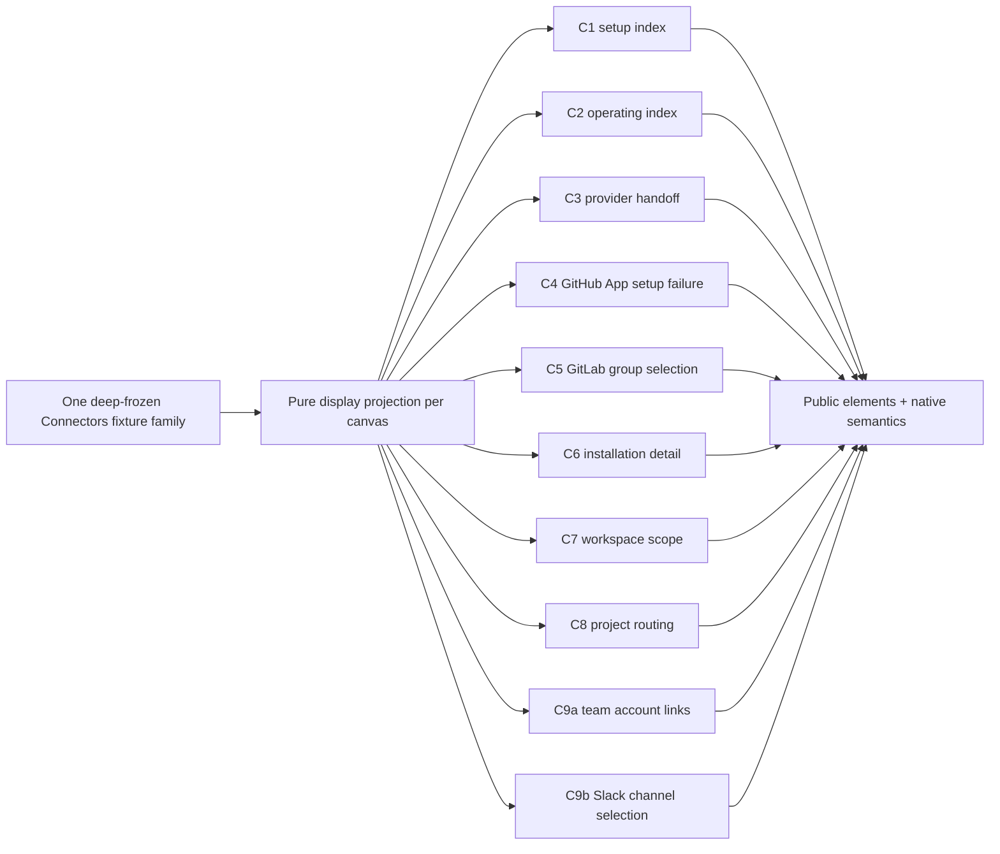

# Mission Specification: Connectors Pattern Stories

**Mission Branch**: `mission/connectors-pattern-stories`
**Target Branch**: `train/elements-first`
**Created**: 2026-09-10
**Status**: Draft
**Input**: GitHub issue `spec-kitty/spec-kitty-design#338`, part of epic #335, tracking #125.

## Purpose and evidence

Prove the Opus-approved Team Kitty Family 3 "Connectors" C1-C9b corpus (approve verdict,
`evidence/OPUS-REVIEW-05.md`, 2026-09-10) as one Storybook-only pattern-story family, composed
exclusively from public `@spec-kitty/elements`/`@spec-kitty/styles` surfaces already on
`train/elements-first`, plus six named public contracts (#336, #337, #280, #307, #320, #321) where
and only where each is genuinely needed. Every reused fact, health value, count, ID, timestamp,
error, and permission comes from one internally consistent, deep-frozen fixture per canvas family.
This mission adds fixtures, pure selectors, Storybook render functions, pattern-local layout, tests,
and baselines. It does **not** register or publish `sk-connectors`, a provider component, or any
product-level page element.

**This mission is dependency-blocked for final implementation and baselines**, deliberately. Live
state verified 2026-09-10 (`gh issue view`/`gh pr view`): #336, #337, #280, #307, #320, and #321 are
all **OPEN**. #280 has no PR. #307 is PR #331 (UNSTABLE). #320 and #321 have no PR. #336 and #337
are wave-1 lanes of this same programme, in flight now. Every FR below that depends on one of these
carries a `blocked-on: #NNN` marker.

**Orchestrator ruling, 2026-09-10 (not an operator decision — recorded in `research.md`'s
"Dependency reconciliation" section with full measurement):** the live #338 issue body names #280
and #307 among its six hard dependencies; measurement against the current train contradicts both
for this mission specifically. `#280` is dropped as a hard dependency of #338 — it is filed for a
different epic (#279, Work Package Detail) and today's plain `.sk-facts` already renders C6/C7's
installation-facts group truthfully, just without #280's grouped-reflow presentation, which is
recorded as a follow-up candidate in `plan.md` rather than a gate. `#307` is dropped from C2 and
C9a — `sk-action-row`'s interactive `controls` slot/part is already public and styled on the train
today, independent of #307/PR #331 (which adds only the static no-JS markup form). `#336`, `#320`,
and `#321` remain live blocks where marked below. See `research.md` for the full canvas→surface→
dependency map and the dated reconciliation record.

## User Scenarios & Testing

### User Story 1 - Read honest connector state across every canvas (Priority: P1)

As a library maintainer proving the Connectors corpus, I can render each of the ten required
canvases (C1-C9b) and verify every fact, health value, count, and available action agrees with one
immutable fixture, with no invented data and no dead action.

**Why this priority**: This is the mission's entire deliverable — the composition proof epic #335
exists to close.

**Independent Test**: Render each canvas's required states independently and assert their headings,
facts, status meanings, action availability, and omissions against the fixture that supplies them.

**Acceptance Scenarios**:

1. **Given** the C1 setup-index fixture, **when** the admin-empty story renders, **then** server-
   configuration gaps are shown honestly and no action is present that the fixture does not support.
2. **Given** the C2 operating-index fixture, **when** admin and member projections render with mixed
   provider health, **then** GitHub shows automatic admission with no selective picker, Slack shows
   outbound-only affordances, and every action present is permission-owned.
3. **Given** the C3 handoff fixture, **when** installation, reconnect, and own-user-linking each
   render, **then** their waiting, completing, and source-exact-failure states are visually and
   semantically distinct.
4. **Given** the C4 fixture, **when** the resolved-Team and no-Team variants render, **then** the
   back route is present only in the resolved-Team variant.
5. **Given** the C5 fixture, **when** populated, no-groups, validation, and connected-after-refresh-
   failure states render, **then** exactly one group can be selected at a time and no submission
   ever shows success theater.
6. **Given** the C6 fixture, **when** admin and member shells render across health variants,
   **then** only authoritative (fixture-supplied) health values are shown.
7. **Given** the C7 fixture, **when** populated, empty, unavailable, and stale-persisted-after-
   refresh-failure states render, **then** the member admin-only boundary removes the scoped
   controls without altering the shared facts a member can already see.
8. **Given** the C8 fixture, **when** active/disabled mappings, admitted/withdrawn repositories, and
   empty/validation/Jira-rescue states render, **then** a hard-purge confirmation is reachable
   through `sk-confirm-dialog` and completing it never mutates the fixture or calls an application
   route.
9. **Given** the C9a fixture, **when** active, unhealthy, unlinked, and empty states render,
   **then** mutation controls act only on the signed-in user's own linked account, and a
   `needs_reauth` account shows the danger tone with no reauthorization action anywhere in the DOM.
10. **Given** the C9b fixture, **when** populated, empty, refusal, rate-limit, and incomplete-
    enumeration states render, **then** the channel picker never claims delivery-tested or
    inbound-previewed status.

---

### User Story 2 - Prove the trust boundaries cannot be silently violated (Priority: P1)

As a design-system reviewer, I can run a fixture-consistency test suite that fails if a story ever
invents a control, route, or claim the source product does not actually offer.

**Why this priority**: The issue's "Truth and ownership assertions" section names absences —
a picker that must not exist, an action that must not appear — which a story that merely renders
cannot fail to violate. Each becomes an explicit, separately assertable requirement (FR-011 through
FR-019 below), mirroring the reasoning that produced the #259 composition-boundary gate itself
(a green line over an unfalsifiable claim is a defect, not a pass).

**Independent Test**: For each truth boundary, assert both that the honest state renders correctly
AND that the forbidden control/route/claim is provably absent from the rendered DOM — not merely
untriggered.

**Acceptance Scenarios**:

1. **Given** any C2/C8 GitHub-repository story, **when** the DOM is inspected, **then** no
   selective-repository checkbox and no "Admit selected" control exists anywhere in the tree.
2. **Given** any Slack-related story (C2, C9b), **when** the DOM is inspected, **then** no inbound
   preview, readback, or delivery-test affordance exists.
3. **Given** any provider-selection story outside C5, **when** the DOM is inspected, **then** no
   another-group-connection or group-selection control exists — that capability is GitLab-only.
4. **Given** any story referencing `/discovery/`, **when** rendered, **then** it is represented only
   as a compatibility-redirect fact, never as an interactive browse destination.
5. **Given** the C8 hard-purge story after confirmation, **when** the fixture is inspected,
   **then** the repository remains purged and no tombstone-lift control is rendered anywhere.
6. **Given** any `needs_reauth`, revoked, or failed health/link state, **when** the DOM is
   inspected, **then** the state renders in the danger tone and no recovery/reauthorization action
   exists in that story.
7. **Given** any story with a native `<form>`, **when** its method/action/fields/confirmation copy
   are inspected, **then** they match the fixture's source values exactly, and submitting it never
   calls an application route or shows a successful-mutation result.
8. **Given** any review-only projection selector, fixture switcher, provenance label, or
   offline-interception notice in the mission's own evidence scaffolding, **when** the rendered
   product-story DOM is inspected, **then** none of that scaffolding appears as a control the
   product story itself exposes.

---

### User Story 3 - Validate accessibility, responsiveness, and visual fidelity across the family (Priority: P1)

As an accessibility or responsive-design reviewer, I can exercise every required canvas at the
documented widths, zoom levels, and preference combinations and find no document-level overflow,
no clipped focus, and no meaning conveyed by tone/color alone.

**Why this priority**: Accessibility, responsive containment, and visual fidelity are pass/fail
gates on this repository, not optional polish (programme brief, hard rule 1; charter accessibility
gate).

**Independent Test**: Run the required browser/axe/visual assertions for every registered story at
1440px, 390px, the documented threshold edges, 200% zoom, long-identifier stress, and short
viewports, under default dark, required LightMode, forced colors, reduced motion, and RTL.

**Acceptance Scenarios**:

1. **Given** any required story at 1440px or 390px, **when** rendered, **then** there is zero
   document-level horizontal overflow and gutters remain equal at both widths.
2. **Given** any required story at 200% zoom or with long identifiers/error strings, **when**
   rendered, **then** content wraps or scrolls locally rather than clipping or overflowing the page.
3. **Given** forced colors or reduced motion, **when** any required story renders, **then** all
   state meaning (health, permission boundary, focus) remains visible without relying on color or
   motion alone.
4. **Given** any story with a native dialog, table, or choice group, **when** operated by keyboard
   only, **then** focus trapping (dialog), cancellation, focus return, and table/action reachability
   all work through native semantics with no custom keyboard model invented.
5. **Given** the default dark corpus and the required `LightMode` proof, **when** compared, **then**
   both pass the repository's accessibility and visual gates on the same reviewed SHA.

---

### User Story 4 - Sequence dependency-blocked work honestly (Priority: P2)

As the mission's orchestrator, I can see exactly which fixture/red-first-check work is doable now
against the current train and which final implementation/baseline work is blocked on named public
contracts, so the mission does not fork a local substitute for a missing dependency.

**Why this priority**: The issue states hard dependencies explicitly and this mission's own
instructions forbid inventing a local substitute; a spec that hides the blocks behind vague language
would make the block illegible to whoever sequences work next.

**Independent Test**: Every FR below that names a blocked dependency carries an explicit
`blocked-on: #NNN` marker; every FR without one is verified doable against the current train state
recorded in `research.md`.

**Acceptance Scenarios**:

1. **Given** the dependency state recorded in `research.md`, **when** a reader scans the FR table,
   **then** every FR whose canvas composition needs #336, #337, #280, #307, #320, or #321 is
   explicitly marked, and no FR silently assumes an unmerged contract.
2. **Given** the six named dependencies are all still open, **when** this mission's design phase
   completes, **then** no fixture, story, or CSS has been authored (out of scope for this pass —
   see Non-Goals), and no missing public CSS/markup has been copied from any unmerged branch.

### Edge Cases

- A provider row's health, count, or permission value is supplied but the fixture omits an adjacent
  fact (e.g., no last-sync timestamp) — the omission must render as absent, not as a fabricated
  zero or dash standing in for unknown data.
- A member views a canvas whose admin-only controls are removed — the shared facts underneath must
  be pixel-for-pixel identical to what an admin sees, only the controls differ.
- A refresh failure leaves stale data displayed (C7, C5) — the stale values must be visually and
  semantically distinguishable from a successful refresh, never silently presented as current.
- `needs_reauth`, revoked, and failed states appear across three different canvases (C2, C6, C9a) —
  each must independently omit a recovery action; a control added to fix any one of the three fails
  all three's assertions if it is missing from even one.
- A hard-purge confirmation is cancelled versus confirmed — cancellation must change nothing;
  confirmation must change only the fixture's local review-evidence state, never call a route.
- Long provider names, repository paths, group names, or error codes are evaluated at 390px and
  200%/400% zoom without causing page-level horizontal overflow.
- RTL/logical-property layout is evaluated alongside forced colors and reduced motion.
- The `/discovery/` compatibility-redirect fact is evaluated with one active installation (redirects
  to Installation Detail) and with zero/multiple active installations (redirects to Connectors
  index) — both are supplied facts, never client-computed routing.

## Requirements

### Functional Requirements — Required canvases

| ID | Title | Canvas | Required states | Priority | Status |
|---|---|---|---|---|---|
| FR-001 | Setup index | C1 | admin empty; server-configuration gaps; no dead actions | High | Open |
| FR-002 | Operating index | C2 | admin/member projections; mixed provider health; GitHub admission/relay; outbound-only Slack; permission-owned actions | High | Open — doable now (`#307` dropped; see research.md Dependency reconciliation, 2026-09-10) |
| FR-003 | Provider authorization handoff | C3 | installation, reconnect, own-user-linking; distinct waiting/completing/source-exact-failure states | High | Open |
| FR-004 | GitHub App setup failure | C4 | resolved-Team back route present; no-Team boundary variant omits it | High | Open |
| FR-005 | GitLab group selection | C5 | populated, no-groups, validation, connected-after-refresh-failure; exactly-one selection; no submission-success theater | High | `blocked-on: #336, #321` |
| FR-006 | Installation detail shell | C6 | admin/member shell; authoritative health variants; installation-facts group (Provider, Connected account, Health, Project routing count, Linked accounts count, Installed) renders via plain `.sk-facts` (stacked). The four/two/one-column reflowing presentation from the approved screen is deferred to #280 and tracked as a plan.md follow-up candidate; no fact is omitted or altered by the narrowing | High | `blocked-on: #337` only (`#280` dropped as a hard dependency; see research.md Dependency reconciliation, 2026-09-10) |
| FR-007 | Workspace scope tab | C7 | populated, empty, unavailable, stale-persisted-after-refresh-failure; member admin-only boundary; shares C6's stacked-`.sk-facts` installation-facts header under the same narrowing; C7's own tab-unique content (`scope-stats` pair count, scope table) needs no facts-grid at all | High | `blocked-on: #337` only (`#280` dropped; see research.md Dependency reconciliation, 2026-09-10) |
| FR-008 | Project routing / admitted repos | C8 | active/disabled mappings; admitted/withdrawn repositories; empty/validation/Jira-rescue; hard-purge confirmation via `sk-confirm-dialog` | High | `blocked-on: #337, #320, #321` |
| FR-009 | Team account links | C9a | active/unhealthy linked accounts; unlinked/empty states; self-owned mutation only; `needs_reauth` danger with no recovery action | High | `blocked-on: #337, #320` (`#307` dropped; the interactive `sk-action-row`'s `controls` slot is already public and styled — see research.md Dependency reconciliation, 2026-09-10) |
| FR-010 | Slack channel selection | C9b | public-channel selection; empty; refusal; rate-limit; incomplete enumeration | High | `blocked-on: #321` if a filter input is part of the picker |

### Functional Requirements — Truth and ownership assertions

| ID | Title | Assertion | Priority | Status |
|---|---|---|---|---|
| FR-011 | No GitHub repository picker | GitHub coverage is automatic; no selective-repository checkbox and no `Admit selected` action exists anywhere in the family | High | Open |
| FR-012 | Slack is outbound-only | No inbound preview, readback, or delivery-test capability exists anywhere Slack is represented | High | Open |
| FR-013 | GitLab-only group choice | Only GitLab (C5) exposes another-group connection and exactly-one group selection; no other canvas exposes it | High | `blocked-on: #336` |
| FR-014 | `/discovery/` is a redirect fact, never a destination | Every reference to `/discovery/` is represented as a compatibility-redirect fact, never as an interactive browse control | High | Open |
| FR-015 | Hard purge has no invented recovery | A repository purge blocks automatic readmission; no tombstone-lift action is invented anywhere in the family | High | Open |
| FR-016 | Danger tone implies no recovery route | `needs_reauth`, revoked, and failed map to the danger tone and expose no reauthorization/recovery action, independently verified on every canvas where they appear (C2, C6, C9a) | High | Open |
| FR-017 | One internally consistent immutable fixture | Health, counts, IDs, timestamps, errors, and permissions for the whole family come from one deep-frozen fixture; no story computes, infers, or duplicates a fact | High | Open |
| FR-018 | Forms are mutation-free evidence | Every native form preserves its source method/action/fields/confirmation copy as evidence but never calls an application route or simulates a successful mutation | High | Open |
| FR-019 | Review scaffolding never becomes product UI | Review-only projection selectors, fixture switchers, provenance labels, and offline-interception notices are evidence scaffolding only; none of them appears as a control inside a rendered product story, and none is published as reusable API | High | Open |

### Functional Requirements — Fixture and projection behavior

| ID | Title | Assertion | Priority | Status |
|---|---|---|---|---|
| FR-020 | Permission projections remove controls, not facts | Comparing an admin projection to its paired member projection on the same fixture shows identical shared facts and only the permission-owned controls differ | High | Open |
| FR-021 | Stale data after refresh failure stays stale, and says so | A story representing a refresh failure (C5, C7) preserves the last-known values distinctly from a successful refresh and does not silently present them as current | High | Open |
| FR-022 | Account activity stays separate from auth health | C9a's account activity/linked-time facts and its `active/needs_reauth/revoked/failed` health value are two independently supplied facts, never conflated or inferred from one another | High | Open |
| FR-023 | Every destructive path is mutation-free in Storybook | Hard purge (C8), disconnect/unlink (C9a), and any other destructive-looking action never mutate the fixture's canonical state or call an application route; only mission-local review evidence may change | High | Open |
| FR-024 | Native information semantics | One `<h1>` per canvas in logical order; native `nav`/`a`/`form`/`fieldset`/`input[type=radio]`/`select`/`table`/`dialog`; labelled navigation and local scroll regions; no visible text replaced by tone/color alone | High | Open |
| FR-025 | Keyboard coverage | Route navigation, choice groups, form controls, table/action access, dialog trapping/cancellation/focus-return, and native links are all keyboard-operable with no custom keyboard model and no application router implemented | High | Open |

### Functional Requirements — Delivery and boundary

| ID | Title | Assertion | Priority | Status |
|---|---|---|---|---|
| FR-026 | Composition-boundary gate passes | `node scripts/check-pattern-composition.mjs --selftest` and `node scripts/check-pattern-composition.mjs` both pass over `packages/elements/src/patterns/` with no private-root reach-through, no duplicated/undeclared component CSS, no undeclared `::part()`, and no new reusable component hidden inside the pattern | High | Open (deferred to implementation — see plan.md) |
| FR-027 | Canonical baselines committed | Ten canonical desktop and narrow baselines (one pair per canvas) plus targeted role, error, local-overflow, health, and hard-purge-dialog state baselines are committed, harvested from CI per the programme brief's visual-baseline trap (never local `--update-snapshots`) | High | Open (deferred to implementation) |
| FR-028 | Ratchets and inventories updated | `expected-parts.json`, `expected-docs.json`, `behaviours.json`, `mutations.json`, `expected-stories.json`, and the story/visual inventories are updated for the new family; derived artifacts are regenerated through repository tooling, never hand-edited | High | Open (deferred to implementation) |
| FR-029 | Composition and boundary documented | `docs/design-system/using-components.md` gains a Connectors pattern section stating the application/library ownership boundary, matching the style of the existing Repository Dossier/Mission Reading/Work Explorer pattern sections | Medium | Open (deferred to implementation) |
| FR-030 | No product-level publication | No `sk-connectors` element, no provider component, and no product-level page element is registered in any manifest or published from this mission | High | Open |

### Non-Functional Requirements

| ID | Title | Requirement | Category | Priority | Status |
|---|---|---|---|---|---|
| NFR-001 | Responsive containment | At 1440px, 390px, the documented Installation Detail sub-navigation threshold edges, 200% zoom, and short viewports, every required story has zero document-level horizontal overflow, no clipped focus, and locally contained tables/navigation | Accessibility | High | Open |
| NFR-002 | Theme coverage | The default dark corpus and the required `LightMode` compatibility story both pass the repository's accessibility and visual gates on the exact reviewed SHA | Compatibility | High | Open |
| NFR-003 | Forced colors | Status, focus, selected-navigation, warning, and control meaning survive forced-colors mode without relying on color | Accessibility | High | Open |
| NFR-004 | Reduced motion | No essential state or progress meaning depends on animation | Accessibility | High | Open |
| NFR-005 | RTL / logical layout | Required stories render correctly under `dir="rtl"` using logical properties | Accessibility | Medium | Open |
| NFR-006 | Automated accessibility | Axe reports zero serious/critical violations across every required story | Accessibility | High | Open |
| NFR-007 | Accessibility-tree assertions | Reviewed accessibility-tree evidence covers names, roles, native landmark/list/table/dialog relationships, and status/danger-tone meaning for every required state | Accessibility | High | Open |
| NFR-008 | Visual fidelity | Every required canvas is compared individually and as one family against its corpus screen before baseline approval | Quality | High | Open |
| NFR-009 | Mutation adequacy | All behavior-bearing helpers introduced meet the repository mutation threshold, per subject in `mutations.json`, with surviving mutants fixed or explicitly justified | Testability | High | Open |
| NFR-010 | Derived-artifact integrity | Manifest, wrapper/type, CSS module, story-index, ratchet, size, and build gates remain byte-clean or contain only generator-produced updates | Maintainability | High | Open |
| NFR-011 | Composition-boundary gate | `check-pattern-composition.mjs` and its self-test pass with no private-root reach-through, duplicated component CSS, runtime CSS injection, or undeclared `::part()` access | Architecture | High | Open |

### Constraints

| ID | Title | Constraint | Category | Priority | Status |
|---|---|---|---|---|---|
| C-001 | Story-only public API | Publish no new custom element, component, manifest entry, wrapper, or application API | Architecture | High | Open |
| C-002 | No `sk-connectors` or provider component | Do not create `sk-connectors`, a provider card element, or any published full-page Connectors composition | Architecture | High | Open |
| C-003 | Public surfaces only | Compose only documented public design-system contracts (slots, parts, attributes, tokens, native HTML); never reach into shadow DOM or private implementation | Architecture | High | Open |
| C-004 | Pattern-owned information architecture | Provider card grids, provider/detail page layout, and review-fixture switching remain pattern-owned — they encode this product family's IA, not a reusable API | Architecture | High | Open |
| C-005 | No Team Kitty behavior | No OAuth, GitHub App, Nango, webhook, relay, polling, routing, permission, admission, refresh, mapping, purge, or account-link logic; no provider SDK/API work | Scope | High | Open |
| C-006 | No copy/i18n ownership | All user-visible strings are consumer-supplied (#286); the mission owns no default copy | Scope | High | Open |
| C-007 | No state persistence, timers, or custom controls | No state persistence, no timers, no custom form control, no router | Scope | High | Open |
| C-008 | No redesign of the approved corpus | C1-C9b are not redesigned; the approved dark screens define composition intent, current train tokens/contracts define implementation | Scope | High | Open |
| C-009 | Legacy surfaces stay out of scope | No revival of the legacy discovery wizard, legacy mapping pages, the unmatched-repository queue, or the #1560 orphaned partials | Scope | High | Open |
| C-010 | Dependency block, not substitute | Where #336, #337, #280, #307, #320, or #321 is genuinely required (per FR `blocked-on` markers), this mission records the block and does not fork a local substitute or copy CSS/markup from any unmerged branch | Dependency | High | Open |
| C-011 | Immutable fixture work may start early | Fixture authoring and red-first composition checks may begin while the six dependencies are in flight; final implementation and baselines wait for the exact ones each FR needs | Dependency | Medium | Open |
| C-012 | One work package, one PR | Delivery stays one bounded Work Package and one PR, `Closes #338` and `Refs #335`; #335 must never appear in a closing keyword | Delivery | High | Open |
| C-013 | Train-only delivery | Review, accept, and merge only into `train/elements-first`, never `main` | Delivery | High | Open |
| C-014 | Lynn verdict not claimed | Family 3 is Opus-approved but Lynn's verdict is pending; this mission's evidence never claims Lynn approval | Governance | High | Open |

### Key Entities

- **Connectors fixture family**: One recursively frozen fixture (or small family of frozen fixtures,
  one per canvas group) supplying every repeated provider, health, count, ID, timestamp, error, and
  permission value used across C1-C9b.
- **Canvas projection**: A pure, deterministic function mapping the fixture to what one canvas
  variant shows or omits — no discovery, polling, inference, arithmetic, routing, or timers.
- **Truth boundary**: One of the nine assertions in FR-011 through FR-019 — a claim about what must
  provably be *absent*, not merely unclicked.
- **Review scaffolding**: Fixture selectors, provenance labels, and offline-interception notices used
  by this mission's own evidence process; never product UI, never published API (FR-019).
- **Dependency block**: A named, open public contract (#336/#337/#280/#307/#320/#321) that a
  specific FR cannot satisfy until it lands, recorded explicitly rather than hidden.

## Success Criteria

### Measurable Outcomes

- **SC-001**: Storybook exports distinct, named stories covering every required state in FR-001
  through FR-010's tables, once each blocking dependency lands.
- **SC-002**: Automated fixture-consistency tests cover all nine truth boundaries (FR-011-FR-019)
  with each asserting the forbidden control/route/claim is provably absent, not merely untriggered.
- **SC-003**: `node scripts/check-pattern-composition.mjs --selftest && node
  scripts/check-pattern-composition.mjs` both pass with zero findings over
  `packages/elements/src/patterns/` once the family exists.
- **SC-004**: Axe reports zero serious/critical violations across every required story.
- **SC-005**: Required dark and `LightMode` stories render successfully through the repository's
  Storybook build/test gates.
- **SC-006**: Zero document-level horizontal overflow at 390px/1440px/200% zoom across every
  required story, including long-identifier stress states.
- **SC-007**: Forced-colors and reduced-motion proofs retain all state meaning without color/motion
  dependence.
- **SC-008**: Mutation coverage passes the repository threshold for every introduced behavior-
  bearing branch.
- **SC-009**: Generated manifests, wrappers, CSS modules, story indexes, ratchets, and size reports
  are regenerated cleanly from authored sources with no hand-edit.
- **SC-010**: The final diff contains no new component definition, no `sk-connectors`, and no Team
  Kitty application behavior listed in C-005.
- **SC-011**: Every FR marked `blocked-on` in this spec is either satisfied only after its named
  dependency has landed and been re-verified against the rebased train, or is still explicitly
  blocked and reported as such — never silently worked around.
- **SC-012**: This design/research pass (research.md, spec.md, plan.md) completes and is reported
  before any fixture, story, or CSS is authored, per this mission's explicit sequencing instruction.
