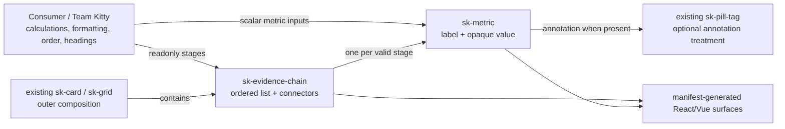
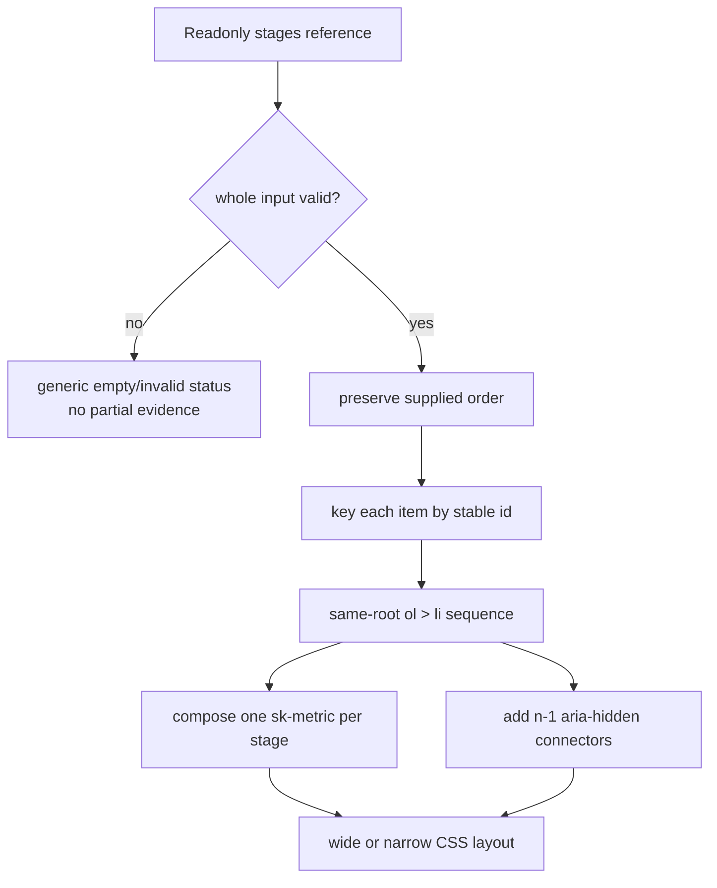

# Implementation Plan: Delivery-return metric elements

**Mission**: `delivery-return-metric-elements-01M1STPA` · Issue #147 · Epic #144  
**Branch**: `mission/delivery-return-metric-elements` from `train/elements-first` at `0fde2abffd26c53caeb40ced44bef8c79846b47b`  
**Date**: 2026-09-06  
**Spec**: [`spec.md`](./spec.md)

## Summary

Add two generic, presentational elements: `sk-metric` renders one supplied label/value with an optional annotation and bounded tone/density; `sk-evidence-chain` accepts a readonly ordered array and composes one `sk-metric` per stage inside a native ordered sequence with decorative connectors. All domain computation and formatting happens before values enter the library.

Both components remain element-only. The chain's structured data cannot be represented honestly as attributes, and its static form would have to duplicate the metric implementation. The metric's optional annotation deliberately composes the existing `sk-pill-tag`; a no-JavaScript copy would either leave that child unupgraded or restate its markup. ADR-10 permits no markup module where no genuine static form exists.

The implementation reuses the existing Lit, manifest, React/Vue generation, part/story ratchets, `sk-card`, `sk-grid`, and `sk-pill-tag` machinery. No dependency, token, interactive behavior, event, application import, or Team-specific aggregate is added. The governed implementation remediation records only the two required SC-013 styling-surface subjects and matching part-removal mutations described below. Three sequential work packages isolate component authorship from the serial shared-artifact integration point. WP01/WP02 may proceed after landed prerequisite #79; WP03 is held until #145/#146 land and the approved authored WPs have been consolidated onto a freshly refreshed train base.

## Technical Context

**Language/Version**: TypeScript 5.x and CSS, targeting standards-based custom elements

**Primary Dependencies**: Lit 3.3.x plus the existing manifest, React/Vue generation, Vitest, Playwright, Storybook, and axe toolchain

**Storage**: N/A

**Testing**: Vitest browser/node projects, Playwright component/visual/forced-colors checks, Storybook build, axe, exact manifest-part and parsed token-literal gates, and repository drift/quality gates

**Target Platform**: Modern browsers through ESM and classic-IIFE builds; generated React 19 and Vue type consumers

**Project Type**: Nx elements-first design-system monorepo

**Performance Goals**: O(stage count) rendering for 0/2/4/6-stage fixtures; enforced Storybook build below 180 seconds

**Constraints**: Token-only CSS; no application state/imports; no new dependency; generated artifacts deterministic; final target only `train/elements-first`

**Scale/Scope**: Two public custom elements, nine public parts, six public documentation items, and fifteen required story IDs

| Concern | Decision |
|---|---|
| Language/runtime | TypeScript 5.x, Lit 3.3.x, standards-based custom elements, CSS |
| Distribution | Browser ESM and classic IIFE; generated React wrapper and Vue declarations |
| Storage/network | None; no fetch, store, router, timer, clock, persistence, or domain service |
| Dependencies | Existing repository dependencies only; no package or lockfile change |
| Canonical CSS | `packages/styles/src/metric/sk-metric.css` and `packages/styles/src/evidence-chain/sk-evidence-chain.css` |
| Canonical markup | Lit `render()` only; neither component has a genuine data-independent static form |
| Structured input | `stages` is a property-only `ReadonlyArray` with a frozen empty default and no JSON attribute |
| Complexity | Validation and rendering are linear in stage count; target scenarios contain 0, 2, 4, or 6 stages |

## Charter Check

| Obligation | Plan response |
|---|---|
| Specification fidelity | APIs use generic metric/evidence language and preserve supplied strings/order; no Team Kitty state, action, calculation, or public aggregate enters library code. |
| Token and architecture integrity | One authored CSS source per element, existing semantic tokens first, open shadow roots, declared parts, and no cross-root selectors. No new package or dependency. |
| Accessibility | Native definition relationship per metric, a same-root ordered list for the chain, decorative connectors, an active forced-colors Playwright context plus source reversal, both themes, axe zero, and accessibility-tree checks are explicit gates. |
| Test quality | Focused tests prove opaque values, fail-closed validation, readonly preservation, absent optional fields, stable identity, literal composition, exact parts, and stylesheet adoption through enumerated deliberate red reversals. No render-only or shadow snapshot evidence. |
| Generated consumers | Manifest, React wrapper, Vue declaration, CSS modules, and size report are regenerated and checked; the structured property type is self-contained at the manifest boundary. |
| Visual fidelity | Approved four-stage density, long/large content, two/four/six stages, narrow vertical reflow, dark, and `LightMode` are individually addressable stories/visual targets; computed-style comparisons prove token-driven theme variance for both tags. |
| Performance | A deterministic Storybook build wrapper fails on timeout or elapsed duration above 180 seconds and has a cheap timeout-arm selftest; component algorithms remain O(stage count). |
| Review and merge | Tier C requires three pre-merge lenses and one maintainer approval at the exact PR head. The only eventual target is `train/elements-first`; train-to-`main`, publish, and deploy remain forbidden. |
| Shared artifact coordination | After WP01/WP02 approval and #145/#146 landing, refresh from latest train and consolidate WP01→WP02 before WP03 is claimed. WP03 alone computes shared ratchets/generated evidence on that pinned integration head. Later train movement invalidates WP03 evidence and returns it through implementation/review on the new base. |

No charter exception or unresolved clarification is required. A newly proven token/dependency need is a stop-and-escalate condition, not implied authority.

## Component and ownership view



The arrows are one-way render inputs. There is no event or state path back to the consumer.

## Public Contract

### `sk-metric`

The tag exports `SkMetric`. Public fields use literal manifest-facing types so generated declarations never reference an unimported alias.

| Property | Lit declaration/default | Meaning |
|---|---|---|
| `label` | `{ type: String }`; `''` | Required consumer label, rendered verbatim |
| `displayValue` | `{ type: String, attribute: 'display-value' }`; `''` | Required opaque preformatted value |
| `annotation` | `{ type: String }`; `''` | Optional supporting string; absent removes annotation chrome |
| `tone` | `{ type: String, reflect: true }`; `'neutral'` | `'neutral' \| 'info' \| 'success' \| 'attention'`; presentation only |
| `compact` | `{ type: Boolean, reflect: true }`; `false` | Density only; content/semantics unchanged |

There are no public methods, events, or slots. `label` and `displayValue` must be nonblank strings; an invalid required field or tone renders `Metric unavailable.` in a non-misleading status surface rather than a partially labelled value. The element does not trim or rewrite valid consumer strings.

The internal native semantic shape is one `<dl>` whose label is a `<dt>` and whose value is a `<dd>`. The optional annotation follows the value and contains an actual `sk-pill-tag`, mapped only for visual vocabulary:

| Metric tone | Pill-tag variant |
|---|---|
| `neutral` | default/no variant |
| `info` | `purple` |
| `success` | `green` |
| `attention` | `yellow` |

Tone affects presentation but never accessible text or domain meaning. The metric is not a heading; the consumer owns surrounding heading level and description.

Exact public parts: `metric`, `label`, `value`, `annotation`, `empty-state`. Internal BEM classes are not API. The root host declares `display: block`.

### `sk-evidence-chain`

The tag exports `SkEvidenceChain` and the convenience type:

```ts
export type EvidenceStage = Readonly<{
  id: string;
  label: string;
  displayValue: string;
  annotation?: string;
  tone?: 'neutral' | 'info' | 'success' | 'attention';
}>;
```

To keep generated wrappers self-contained, the public field repeats the structural literal instead of exposing only the alias in analyzer output:

```ts
stages: ReadonlyArray<Readonly<{
  id: string;
  label: string;
  displayValue: string;
  annotation?: string;
  tone?: 'neutral' | 'info' | 'success' | 'attention';
}>> = Object.freeze([]);
```

`static properties` declares `stages: { attribute: false }`. It is the only public field. There are no public attributes, methods, events, or slots, and no JSON attribute representation.

Validation accepts only a nonempty array of records with unique nonblank IDs, nonblank string labels/display values, optional string annotations, and supported tones. The validator reads but never freezes, sorts, normalizes, or annotates caller-owned data. Empty or invalid input renders `No evidence available.` in `part="empty-state"`, with no partial list.

Valid input renders one same-root `<ol part="list">`, direct `<li part="stage">` children, and one actual `sk-metric` per stage. Lit's `repeat` directive keys each item by `id`, preserving node identity across immutable reference updates without creating selection state. Each nonfinal item contains one explicit `aria-hidden="true"` connector node so connector count is exactly `n - 1`; CSS changes direction at the repository's established narrow breakpoint without changing DOM order.

Exact public parts: `list`, `stage`, `connector`, `empty-state`. Internal BEM classes are not API. The root host declares `display: block`.

## Controlled data flow



No arrow performs formatting, arithmetic, selection, navigation, time lookup, or mutation.

## Static-form decision

No `.markup.ts`, generated `.html`, or styles-layer `index.ts` is created for either component:

- A chain's ordered records are property-only and cannot be a finite attribute variant table.
- A chain static helper would have to reproduce metric markup, violating FR-008 and ADR-10.
- A metric static helper with annotation would have to duplicate pill-tag internals or emit an unupgraded custom element to a no-JavaScript consumer.
- Omitting a dishonest static form is explicitly permitted by the authoring recipe and matches the existing structured `sk-transition-matrix` precedent.

The authored `.css` files still ship through new `@spec-kitty/styles` wildcard subpath exports so the element build and advanced consumers can resolve them.

## Stories and visual coverage

Record exactly these new IDs in `expected-stories.json`:

### Metric — `Elements/SkMetric`

- `Default`
- `WithAnnotation`
- `Tones`
- `Compact`
- `LongContent`
- `LightMode`

### Evidence chain — `Elements/SkEvidenceChain`

- `Default` — generic four-stage sequence
- `ApprovedExample` — required Delivery return fixture inside real existing `sk-card` and `sk-grid` composition
- `TwoStages`
- `SixStages`
- `Narrow`
- `LongContent`
- `Empty`
- `InvalidInput`
- `LightMode`

The resulting IDs follow the repository convention (`elements-skmetric--...` and `elements-skevidencechain--...`). `LightMode` uses a real `.sk-light` wrapper around content equivalent to the default-dark fixture. `ApprovedExample` imports/registers and renders actual existing `sk-card` and `sk-grid` elements around `sk-evidence-chain`; annotated stages cause the nested `sk-metric` elements to render actual existing `sk-pill-tag` descendants. The story may contain Investment/Completed/Deployed/Verified and honest annotations because it is a representative fixture; those strings do not enter component source, defaults, types, or docs.

Visual coverage targets approved dark, equivalent light, compact metric, long content, two/six-stage generality, and narrow vertical reflow. Functional Playwright compares equivalent dark/`LightMode` content and requires at least one approved token-driven computed property to differ for `sk-metric` and for `sk-evidence-chain`. CI-produced baselines are authoritative; local actual PNGs are diagnostic and never committed as approved bytes.

## Behavior, type, and accessibility evidence

### Behavior registry decision

The reviewed plan originally prohibited any `behaviours.json` or `mutations.json` entry because these components own none of ADR-11's event, form, upgrade-order, slot, focus/keyboard, or selection behaviors. During implementation, the repository's config-contract gate proved that every public element must register its externally targetable styling surface under SC-013 and that every declared `(id, subject)` pair must have one matching mutation. The operator authorized the narrow remediation on 2026-09-06: record `sk-metric` and `sk-evidence-chain` only as SC-013 subjects, with one exact non-root part-removal mutation each. This does not create a new behavior id, SC-014 claim, mutable/interactive behavior, or broader registry ownership; it reconciles the enforced repository contract with the approved focused part tests.

### Focused element evidence

`fixtures/elements-behaviour/src/sk-metric.test.ts` proves:

- exact opaque string preservation, including currency/percentage-looking values;
- definition label/value semantics and absence of a heading role;
- annotation omission and literal `sk-pill-tag` composition/mapping;
- compact changes presentation only;
- invalid required data fails closed;
- all five parts are externally targetable;
- the exact named `skMetricSheet` is adopted and no `<style>` is injected.

WP01's red-evidence matrix is fixed before implementation: opaque text, native definition semantics, annotation/pill composition, fail-closed validation, and part/constructed-sheet adoption are separate coherent groups. For each row the WP prompt names the temporary production-source break and the single expected failing assertion; the implementer records red output, restores the source, and records the same assertion green.

`fixtures/elements-behaviour/src/sk-evidence-chain.test.ts` proves:

- frozen two/four/six-stage inputs render one direct list item and one `sk-metric` per stage;
- order, caller bytes, and object/array identity remain unchanged;
- rerender with stable IDs preserves stage node identity while new references update text;
- connector count is `n - 1` and connectors are absent from the accessibility tree;
- malformed/duplicate/blank-ID input fails closed as a whole;
- a stage with absent `tone` and `annotation` remains valid, renders neutral/no annotation chrome, and does not acquire caller-visible defaults;
- all four parts are externally targetable;
- the exact named `skEvidenceChainSheet` is adopted and no `<style>` is injected.

WP02 likewise fixes separate red rows for immutable order/stable identity, literal metric composition/connectors, whole-input validation including absent optional fields, ordered-list/accessibility semantics, forced-colors authored CSS, and part/constructed-sheet adoption. Tests do not snapshot shadow markup or certify only that an element renders.

### Manifest and generated-consumer evidence

Expected documentation delta:

- `sk-metric`: 5 attributes, 0 property-only fields, 0 methods.
- `sk-evidence-chain`: 0 attributes, 1 property-only field, 0 methods.
- `expected-docs.json` total increases by 6 from the recorded latest-train + WP01/WP02 integrated baseline.

Expected part delta: nine total parts (five metric, four chain), with the total increased from that recorded integrated baseline. The shrink-only aggregate ratchet is necessary but insufficient: `scripts/check-component-public-contract.mjs` parses `custom-elements.json`, accepts explicit `--tag` expectations, and fails on any missing, extra, duplicate, or empty per-tag part set; its `--selftest` proves both missing and extra cases. Rendered fixture tests target every one of the nine parts. Expected story delta: fifteen IDs.

`scripts/check-component-token-literals.mjs` parses the two authored component stylesheets with the repository's existing CSS parser and rejects raw design-bearing values in color, spacing/gap, typography/line, radius, border/outline, shadow, motion, and z-index declarations. Its narrowly documented CSS-wide/structural exceptions do not permit raw design values, and `--selftest` proves every property class has a red case. No dependency is added.

`scripts/build-storybook-with-budget.mjs` owns the real Storybook build invocation, terminates/fails closed at 180 seconds, fails a completed build whose elapsed time exceeds the same ceiling, and reports duration. Its internal `--selftest` exercises success, nonzero exit, and timeout using short fixture children rather than a real 180-second wait.

`packages/react/type-tests/wrappers.type-test.tsx` proves scalar metric props, supported literal tones, readonly `EvidenceStage[]`, rejected malformed stages/tones, and no explicit or inferred `any`. `fixtures/react-consumer/src/sk-evidence-chain.test.tsx` proves the wrapper assigns the exact frozen `stages` identity through the property path, replaces it on rerender, and resets omission to a fresh frozen empty array without a `stages` attribute. This is verification of the already-shipped property-only mechanism, not a new generator feature or behavior-registry subject.

Generated wrappers must not reference `EvidenceStage` or another local alias without a valid import. The manifest-facing field's structural literal is the preventive contract. Vue generation references the element's own field type through the existing declaration strategy.

## File and write scope

### WP01 — metric-authored surface

```text
packages/styles/src/metric/sk-metric.css
packages/elements/src/metric/sk-metric.ts
packages/elements/src/metric/sk-metric.stories.ts
packages/elements/src/metric/sk-metric.css.js          # generated local sheet
packages/elements/src/metric/sk-metric.css.d.ts        # generated local declaration
fixtures/elements-behaviour/src/sk-metric.test.ts
```

### WP02 — evidence-chain authored surface

```text
packages/styles/src/evidence-chain/sk-evidence-chain.css
packages/elements/src/evidence-chain/sk-evidence-chain.ts
packages/elements/src/evidence-chain/sk-evidence-chain.stories.ts
packages/elements/src/evidence-chain/sk-evidence-chain.css.js   # generated local sheet
packages/elements/src/evidence-chain/sk-evidence-chain.css.d.ts # generated local declaration
fixtures/elements-behaviour/src/sk-evidence-chain.test.ts
```

WP02 depends on WP01 because it imports and composes `sk-metric`.

### WP03 — serial public integration and generated artifacts

```text
packages/elements/src/index.ts
packages/elements/src/elements.ts
packages/styles/package.json
expected-docs.json
expected-parts.json
expected-stories.json
packages/elements/custom-elements.json                 # generated
packages/react/src/SkMetric.js                         # generated
packages/react/src/SkMetric.d.ts                       # generated
packages/react/src/SkEvidenceChain.js                  # generated
packages/react/src/SkEvidenceChain.d.ts                # generated
packages/react/src/index.js                            # generated
packages/react/src/index.d.ts                          # generated
packages/react/src/react-utils.js                      # generated only if bytes derive differently
packages/react/.wrapper-floor                          # generated floor
packages/elements/vue.d.ts                             # generated
packages/elements/SIZES.md                             # generated after build
scripts/check-component-public-contract.mjs
scripts/check-component-token-literals.mjs
scripts/build-storybook-with-budget.mjs
packages/react/type-tests/wrappers.type-test.tsx
fixtures/react-consumer/src/sk-evidence-chain.test.tsx
apps/storybook/src/tests/sk-metric.spec.ts
apps/storybook/src/tests/sk-evidence-chain.spec.ts
apps/storybook/src/tests/visual.spec.ts
apps/storybook/src/tests/visual.spec.ts-snapshots/*metric*.png
apps/storybook/src/tests/visual.spec.ts-snapshots/*evidence-chain*.png
docs/design-system/using-components.md
docs/design-system/using-react.md
docs/design-system/changelog.md
CHANGELOG.md
```

WP03 depends on approved WP01/WP02, landed #145/#146, a fresh `origin/train/elements-first` refresh, and supported WP01→WP02 consolidation onto the clean mission target. It updates `CHANGELOG.md` with exactly the two new public tags because `check-release-graph.mjs` compares every manifest tag with that file. Other generated bytes may move only as deterministic consequences of that recorded integration base. No sibling authored component, token, dependency, lockfile, ADR, application, or other mission record is in scope.

## Project Structure

```text
kitty-specs/delivery-return-metric-elements-01M1STPA/
├── spec.md
├── research.md
├── data-model.md
├── plan.md
├── quickstart.md
├── contracts/public-elements.md
└── tasks/

packages/styles/src/
├── metric/sk-metric.css
└── evidence-chain/sk-evidence-chain.css

packages/elements/src/
├── metric/
└── evidence-chain/

fixtures/
├── elements-behaviour/src/sk-{metric,evidence-chain}.test.ts
└── react-consumer/src/sk-evidence-chain.test.tsx

scripts/
├── check-component-public-contract.mjs
├── check-component-token-literals.mjs
└── build-storybook-with-budget.mjs
```

**Structure decision**: extend the existing four-package elements-first monorepo. No new package, app, service, storage, or application integration is needed.

## Implementation Concern Map

### IC-01 — Scalar metric contract

- **Purpose**: Establish one accessible, generic, opaque label/value renderer with bounded annotation, tone, and density.
- **Relevant requirements**: FR-001–FR-005, FR-013, FR-016; NFR-001–NFR-003.
- **Affected surfaces**: metric authored CSS/element/story and focused fixture.
- **Sequencing/depends-on**: existing #79 `sk-pill-tag`; already present on the base.
- **Risks**: accidentally treating the value as numeric/heading content, or duplicating pill-tag presentation.

### IC-02 — Ordered evidence composition

- **Purpose**: Validate and render readonly stages through actual metrics with stable order/identity and responsive accessible sequence semantics.
- **Relevant requirements**: FR-006–FR-012, FR-015–FR-016; NFR-001–NFR-003.
- **Affected surfaces**: evidence-chain authored CSS/element/story and focused fixture.
- **Sequencing/depends-on**: IC-01.
- **Risks**: mutating/sorting input, partial invalid rendering, cross-root list semantics, or hardcoding four stages.

### IC-03 — Manifest and consumer contract

- **Purpose**: Register both tags and preserve all public types through generated manifest, React, and Vue surfaces.
- **Relevant requirements**: FR-014, FR-016; NFR-004–NFR-005.
- **Affected surfaces**: element entries, ratchets, package export, generated artifacts, React fixtures/type tests.
- **Sequencing/depends-on**: IC-01 and IC-02 complete.
- **Risks**: unimported alias leakage in generated declarations, stale property reset, or hand-edited generated outputs.

### IC-04 — Visual, documentation, and release closure

- **Purpose**: Prove approved density/themes/generality and leave every public surface documented and release-reachable.
- **Relevant requirements**: FR-015–FR-016; NFR-001–NFR-006; C-008.
- **Affected surfaces**: Storybook Playwright/visual coverage, docs, changelogs, styles export map, all final gates.
- **Sequencing/depends-on**: IC-03, landed #145/#146, a latest-train refresh, and supported WP01→WP02 consolidation before WP03 begins.
- **Risks**: shared-artifact drift from #145/#146, local baseline substitution, stale exact-head review, or release-graph omissions.

## Gate sequence

### Focused WP gates

Each component WP runs its focused Vitest browser file, TypeScript/lint for touched sources, CSS generation/check for its local sheet, and a focused Storybook build/load check without invoking the full mutation fleet. WP03 owns all full-repository gates.

### WP03 entry and final integration gates

WP03 is the serial shared-artifact stage. It must not be claimed merely because WP01/WP02 are approved:

1. Wait until #145 and #146 are verified on `origin/train/elements-first`.
2. Require clean mission target and lane worktrees with no active writer. Fetch the current train and refresh the canonical mission target through the supported stale-state/git workflow.
3. Consolidate approved WP01 then WP02 onto that refreshed target through the supported dependency-aware workflow. Record the train SHA, WP01 SHA, WP02 SHA, and resulting integrated target SHA.
4. Claim WP03 only if its returned workspace contains exactly that integrated target. If the runtime cannot construct this base safely, stop as blocked; do not manually assemble a substitute worktree.
5. Compute ratchets from this base and regenerate in repository order:

   ```sh
   node scripts/build-elements-css.mjs
   node scripts/build-element-markup.mjs
   npx nx run elements:analyze
   node scripts/build-react-wrappers.mjs
   node scripts/build-vue-types.mjs
   npx nx run-many --target=build --projects=tokens,styles,elements
   node scripts/measure-elements-sizes.mjs
   ```

6. Run all drift/content/hygiene/type/release gates, including the exact contract and parsed CSS checks:

   ```sh
   node scripts/build-elements-css.mjs --check
   node scripts/build-element-markup.mjs --check
   node scripts/build-react-wrappers.mjs --check
   node scripts/build-vue-types.mjs --check
   git diff --exit-code -- packages/elements/custom-elements.json
   node scripts/measure-elements-sizes.mjs --check
   node scripts/check-manifest-content.mjs
   node scripts/check-no-css-in-source.mjs
   node scripts/check-elements-entries.mjs
   node scripts/check-adopted-css-boundaries.mjs
   node scripts/check-element-css-hygiene.mjs
   node scripts/check-part-ratchet.mjs
   node scripts/check-component-public-contract.mjs --manifest packages/elements/custom-elements.json --tag sk-metric=metric,label,value,annotation,empty-state --tag sk-evidence-chain=list,stage,connector,empty-state
   node scripts/check-component-public-contract.mjs --selftest
   node scripts/check-component-token-literals.mjs packages/styles/src/metric/sk-metric.css packages/styles/src/evidence-chain/sk-evidence-chain.css
   node scripts/check-component-token-literals.mjs --selftest
   node scripts/check-story-theme-wrapper.mjs
   node scripts/check-story-theme-wrapper.mjs --selftest
   node scripts/typecheck-all.mjs
   node scripts/build-react-wrappers.mjs --selftest
   node scripts/check-manifest-content.mjs --selftest
   node scripts/check-gate-wiring.mjs
   node scripts/check-release-graph.mjs
   node scripts/check-release-graph.mjs --selftest
   npm run quality:all
   ```

7. Run `npm run test`, then the full `node scripts/suite-selftest.mjs` serially with no competing browser fleet. No new mutation arm is expected, but the complete existing fleet must remain green.
8. Run `node scripts/build-storybook-with-budget.mjs --selftest`, then `node scripts/build-storybook-with-budget.mjs`; the latter invokes the real build and fails closed at 180 seconds. Run axe, functional Chromium/Firefox coverage, the active forced-colors Chromium case, and diagnostic local visual tests. WebKit remains required in final unqualified CI; local system-library installation is not authorized.
9. Commit every generated output and require a clean tree. Re-run deterministic checks against the exact commit and verify `origin/train/elements-first` still equals the recorded train SHA.
10. If train moved, do not rebase an approved WP03 or edit ratchets/generated files after review. Return WP03 through supported stale-state recovery onto the new refreshed/consolidated base, then repeat implementation evidence and independent review.
11. If train is unchanged, use the supported workflow to consolidate the approved WP03 result, open one eventual PR to `train/elements-first` with `Refs #147`, and use CI-produced visual bytes as the only baseline authority.
12. At the final exact PR head require all CI, three Tier C lens verdicts with dispositions, and one maintainer approval. Any push invalidates SHA-pinned evidence and requires it to rerun.

## Complexity Tracking

No charter violation is requested. The two-element/three-WP split is the minimum that preserves literal composition and isolates shared generated artifacts; a single WP would combine two independently rejectable component contracts, while additional packages or helpers would add structure without evidence.

## Planning risks and stop conditions

- If the approved connector/value treatment cannot be achieved from existing semantic tokens, stop for a token decision and maintainer scope rather than adding a component token silently.
- If the generated React declaration refers to a missing local type alias, correct the source declaration shape and regenerate; do not hand-edit wrapper output.
- If another mission lands after the recorded WP03 integration base, invalidate WP03 evidence and return it through supported refresh/consolidation/implementation/review; do not post-rebase an approved lane or resolve generated conflicts by editing sibling authored sources.
- If same-root ordered-list semantics or connector forced-colors visibility fails measured accessibility checks, return to the element/CSS design inside this mission.
- Any need for events, selection, application imports, domain calculations, new dependencies, public aggregate tags, or sibling component edits exceeds issue #147 and blocks implementation pending explicit scope.
