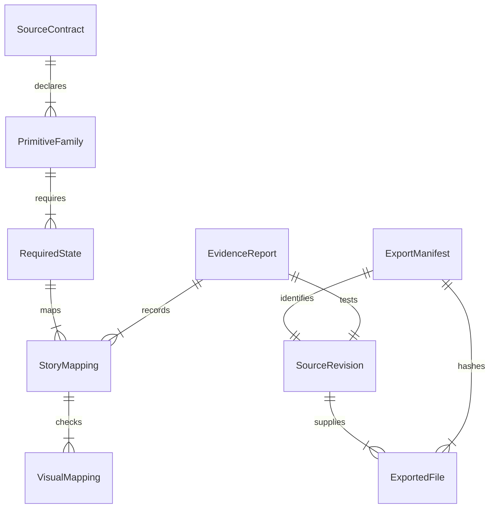

# Discovery data model

Audience: implementers of the source contract and offline exporter/verifier.

- **SourceContract**: versioned, source-intrinsic inventory committed at S. It contains the exact 22 families, required states, public entries, source paths, license references, and story/visual mappings. It contains no S value, own content digest, gate result, or timestamp; those would make S self-referential.
- **PrimitiveFamily / RequiredState**: a family and its independently defined state/theme/viewport obligations. Required states are not inferred from the current Storybook index; deleting a story cannot silently shrink the obligation set.
- **StoryMapping / VisualMapping**: required state → Storybook story ID → visual test identifier → committed snapshot path. The checker confirms every link resolves and fails if any required link disappears. Actual test outcomes live in an evidence report.
- **SourceRevision**: a full committed Git SHA. Stage A tests against a committed revision; Stage B selects stable post-merge `develop` SHA S.
- **ExportedFile**: normalized relative path, role, committed blob identity/bytes or a verified source-mapped scoped derivative, byte length, SHA-256, and license basis. The exporter rejects dirty included paths or proves that only committed blobs supplied bytes, and cannot let a mid-export mutation alter payload unnoticed.
- **ExportManifest**: generated after the source revision, outside its tree. It binds the full source SHA, contract digest, canonical payload digest, file list, and rights references. It does not hash itself. A copied artifact may pass internal integrity from this record alone; approved-source verification additionally requires an independently pinned expected source SHA and artifact digest.
- **EvidenceReport**: generated after the tested revision, outside its source tree. It holds exact commands, positive visual test count, per-story axe results, story-to-visual-test-to-snapshot results, tested SHA, and pass/fail. Stage B repeats the gates at S and records its S-labelled report in the handoff, not in S.
- **LicenseEvidence**: reference to the actual redistribution terms for each exported asset. Inter has `packages/tokens/src/fonts/Inter-OFL.txt`; Falling Sky OTF carries embedded SIL OFL evidence. Swansea has unresolved terms while full `tokens.css` contains Swansea URLs, so unchanged full-token export fails until rights are proven. A scoped derivative excluding those URLs requires a checked source map and derivative hash.
