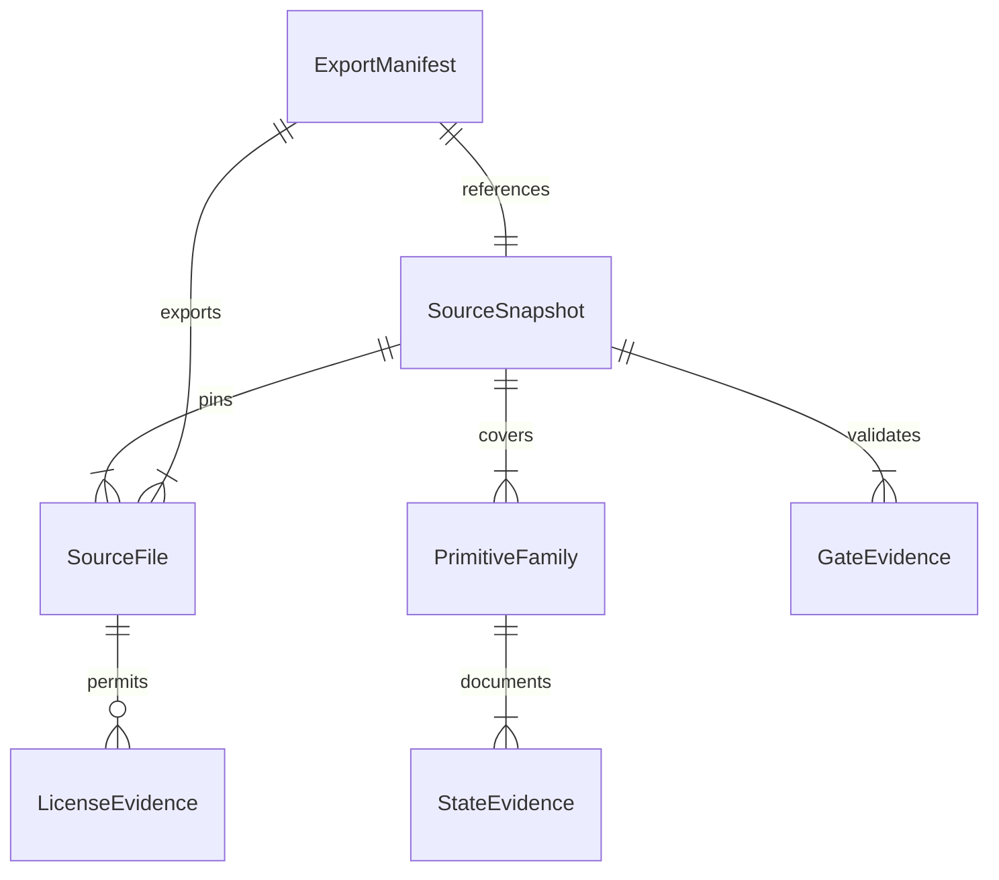

# Discovery data model

Audience: implementers of the source contract and offline verifier.

- **SourceSnapshot**: full committed Git SHA; repository and target branch. This mission tests export at a committed revision. The follow-up mission selects stable post-merge `develop` SHA S.
- **PrimitiveFamily**: one of issue #470's 22 names, source form (`styles`, `elements`, or both), public consumer entry points, states/variants, and required assets.
- **SourceFile**: normalized repository-relative source or transitive asset path, byte length, SHA-256 digest, role, and license evidence reference. No absolute checkout path or mutable ref is a file identity.
- **LicenseEvidence**: SPDX identifier or explicit terms reference and source path; checked for every exported source/asset. Unknown rights are a failure, not an inferred MIT grant.
- **StateEvidence**: per-family state and theme/viewport coverage mapped to a Storybook story ID plus axe result and visual evidence ID/path at the tested source revision. Missing coverage is explicit and cannot count as a pass.
- **GateEvidence**: command, result, source SHA, and evidence artifact for lint, test, build, Storybook, axe, visual, and export verification. Final gate evidence at S belongs to the follow-up mission.
- **ExportManifest**: deterministic schema/version, full source SHA, artifact digest and file list, contract digest, and evidence IDs. The final immutable artifact is created by the follow-up handoff mission after the contract/tooling PR lands on `develop`.
