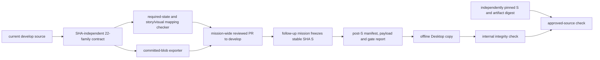

# Implementation Plan: Desktop V2 primitive contract and offline handoff tooling

**Branch**: `develop` in the standalone mission checkout | **Date**: 2026-09-28 | **Spec**: [spec.md](./spec.md)  
**Input**: [issue #470](https://github.com/spec-kitty/spec-kitty-design/issues/470), operator correction to `develop`, and [research.md](./research.md).

## Summary

Document and check the 22 current primitive families, then build a deterministic exporter and offline verifier. WP01 and WP02 are independently reviewable lanes that consolidate into one mission PR to `develop`. After that PR lands, a separate focused Spec Kitty mission selects stable source SHA S on `develop`, repeats the required gates at S, and creates the immutable handoff artifact. The approved prototype informs composition only.

## Technical context

| Area | Existing surface and chosen use |
|---|---|
| Languages | TypeScript and JavaScript tooling; CSS tokens/styles; Lit custom elements and generated React wrappers. |
| Packages | `@spec-kitty/tokens` → `@spec-kitty/styles` → `@spec-kitty/elements` → generated `@spec-kitty/react`. Do not hand-edit generated wrappers or markup. |
| Source | `packages/styles/src/<family>/` exists for each named family; `packages/elements/src/<family>/` exists only for some. Inventory actual forms and public entries. |
| Evidence | Independent required-state inventory, Storybook stories, `apps/storybook/src/tests/visual.spec.ts` plus committed snapshots, per-story results from `scripts/run-axe-storybook.js`, repository tests and Nx builds. |
| Storage | Versioned contract and export files in the repository; local filesystem copy for the consumer. No service, registry, npm runtime dependency, or network verification. |
| Scale | 22 families plus their actual token/font/source closure; no new generic primitive or Desktop application code. |

## Charter check

- `develop` is the charter's PR target. Its active ruleset requires a linear history and permits rebase merging only. `main` is a separate operator release; this mission never promotes to it.
- Preserve authored/generated boundaries, one-way package dependencies, token-only component CSS, required Storybook states, WCAG 2.1 AA scans, and committed visual baselines. Any source changes made for coverage follow the existing component recipe and required behaviour tests.
- The mission PR requires green CI, matching-head adversarial squad evidence on the PR, and the charter's maintainer approval where component files or tokens change. Earlier review point-cuts apply if the mission's risk tier calls for them.
- Redistribution rights are assessed per exported asset. `LICENSE` is MIT for repository code, `packages/tokens/src/fonts/Inter-OFL.txt` supports Inter, and Falling Sky OTF carries embedded SIL OFL evidence. Full `packages/tokens/src/tokens.css` still contains Swansea URLs while its terms are unresolved. An unchanged full-token export is blocked until rights are proven; a checked scoped derivative may exclude those URLs and record a source map.
- The charter's historical token size ceiling is already documented as repository-contradicted. This mission does not change or silently waive it; no new token-size claim is made.

## Data flow and boundary

The contract records each family's actual source form, public entry, independently required states, and required-state→story→visual-test→snapshot mapping. It has no SHA, self-hash, timestamp, or test-result fields: it is part of the source at S and cannot describe S itself. The exporter reads committed Git blob bytes at the selected SHA, so dirty included paths and mid-export working-tree mutations cannot alter the exported payload. It emits a schema-versioned manifest after that source commit with full source SHA, file role/path/size/SHA-256, license reference, and canonical payload/contract digest. The manifest does not hash itself. A separate after-source evidence report holds gate commands, tested SHA, per-story axe results, visual test/snapshot results, and positive test count.

The copied verifier has two honest modes. Internal mode checks manifest and payload consistency but cannot distinguish coordinated replacement of manifest, contract, and files. Approved-source mode requires the caller to supply an independently pinned expected source SHA and artifact digest; a coordinated rehash that passes internal mode fails there. Neither mode needs network or PKI.

## Proposed repository surfaces

| Surface | Responsibility |
|---|---|
| `contracts/desktop-v2/` | Versioned SHA-independent 22-family contract, independent required-state inventory, story/visual mappings, and license references. Exact filenames can follow current repository conventions during WP01. |
| `packages/styles/src/`, `packages/elements/src/`, `packages/tokens/src/` | Existing sources; change only verified coverage or composition gaps. Generated files follow their generators. |
| `apps/storybook/src/tests/visual.spec.ts` and snapshots | Visual states and baselines when WP01 needs missing evidence. |
| `scripts/` and `tests/node/` | Exporter, offline verifier, contract drift checks, and focused failure-case tests using the existing Node/Vitest tooling. |
| `handoffs/desktop-v2/<S>/` | Post-S manifest, payload, and S-labelled gate/axe/visual evidence created by the later focused handoff mission after this mission's PR lands. |
| `kitty-specs/desktop-v2-immutable-handoff-develop-01M3JSCM/` | Mission spec, plan, tasks, work-package review records. |

## Delivery sequence and dependencies

1. **WP01 — source contract and evidence mapping.** Inventory all 22 names against current `develop`; define required states independently of existing stories; record styles/element forms, source/public paths, token/font closure, rights, and state→story→visual-test→snapshot mapping. Fill coverage gaps through existing story/test paths. Add deletion probes for a required state and its story. Persist per-story axe and visual results for the tested PR head in an evidence sidecar, not in the contract. Review WP01 in its Spec Kitty lane.
2. **WP02 — deterministic offline exporter and verifier.** Consume WP01's checked contract; export committed Git blobs or source-mapped scoped derivatives; emit normalized payload and post-source manifest; validate copied payload and contract offline in internal and independently pinned modes. Test dirty and mid-export mutation, coordinated rehash, path/rights closure, and repeatability. Wire contract changes into the existing `components` CI filter and run contract/export checks in relevant existing jobs, so changes cannot silently skip them; run the exact-head seven-gate suite when preparing the mission PR. Review WP02 in its Spec Kitty lane.
3. **Mission PR and follow-up handoff.** Once both WPs are approved, assemble a disposable aggregate draft-PR candidate from the current planning head plus approved lane content, without changing managed worktrees. Run and review all seven gate categories at that exact draft PR head. Only then record the FR verdicts and run Spec Kitty's native accept workflow. Its no-push merge produces a new head: update the draft PR branch to that head, then repeat exact-head gates and review before the remote rebase merge to `develop`. After the PR lands, a separate focused handoff mission chooses stable S, reruns required gates, and commits the artifact. This plan does not create that second mission.

WP02 depends on WP01's approved source contract, not a separate WP01 merge to `develop`. Each WP has an independent review verdict; the aggregate diff receives the repository's required PR review once.

## Verification design

| Gate | Command or evidence source | Acceptance |
|---|---|---|
| Lint | `npm run quality:all` | Exit 0 on the mission PR head. |
| Tests | `npm test` plus focused contract/export tests | Exit 0; required-state/story deletion probes fail, dirty or mid-export edits leave committed-blob bytes unchanged, and independently pinned coordinated-rehash probes fail. |
| Package build | `npx nx run-many --target=build --projects=tokens,styles,elements,react` | Exit 0; generated output remains consistent with authored source. |
| Storybook | `npx nx run storybook:storybook:build` | Exit 0 and all contract story IDs resolve in `index.json`. |
| Axe | `node scripts/run-axe-storybook.js` | Zero WCAG 2.1 AA violations and zero unloaded stories; persist per-story outcomes in post-source evidence. |
| Visual | `PW_INCLUDE_VISUAL=1 npx playwright test apps/storybook/src/tests/visual.spec.ts --project=chromium` | Exit 0, positive executed-test count, checked story→test→committed-snapshot mapping. |
| Export | Mission exporter twice from the same committed SHA; offline verifier on copied output with caller-pinned SHA/digest | Identical bytes; dirty/mid-export probes cannot alter output; coordinated rehash fails in approved-source mode. |

WP01 may document uncovered evidence as a finding while building; it cannot claim complete acceptance until required states, stories, rights, and visual mappings resolve. The mission PR records actual command, head SHA, result, positive test count where applicable, and evidence path for all seven gate categories outside the source contract. CI must treat `contracts/desktop-v2/**` as relevant to the existing components gate; if a gate still skips, the exact-head manual run and evidence are required before review. The later handoff mission repeats and records all required gates at S after S exists; its final acceptance consumes the artifact itself.

### Acceptance matrix and evidence

The acceptance matrix contains nine FR criteria and six registered negative invariants; all criterion verdicts remain pending. Lane evidence supports WP review but cannot pass aggregate FR criteria. Before native acceptance, run and review all seven gate categories against the disposable aggregate draft-PR candidate's exact head; only then record FR verdicts and run Spec Kitty accept. After its no-push merge creates a new head, update the draft PR branch and repeat exact-head gates and review before remote rebase merge. Capture each command, result, tested SHA, and evidence path. Keep verdicts pending until the required aggregate evidence is reviewed. Run `npx vitest run --project node --reporter=default tests/node/desktop-v2-contract.test.ts` and `npx vitest run --project node --reporter=default tests/node/desktop-v2-handoff.test.ts` for the full focused suites.

| Criterion | Planned concrete evidence at the reviewed head |
|---|---|
| FR-001 | `node scripts/check-desktop-v2-contract.mjs`; exactly 22 issue-listed families and real public entries. |
| FR-002 | `npx vitest run --project node --reporter=default tests/node/desktop-v2-contract.test.ts -t 'required state mapping'`; independently declared required states close over live story→visual-test→snapshot mappings, with deletion probes for missing families, states, stories and stale mappings. |
| FR-003 | `npx vitest run --project node --reporter=default tests/node/desktop-v2-contract.test.ts -t 'rights closure'`; source, token and font assets have redistribution evidence; unchanged full `tokens.css` stays blocked for unresolved Swansea rights, a checked scoped derivative is allowed, and Falling Sky OFL is accepted. |
| FR-004 | `npx vitest run --project node --reporter=default tests/node/desktop-v2-handoff.test.ts -t 'committed blob provenance'`; export reads committed Git blob bytes for a full SHA and records byte hashes in its post-source manifest, unaffected by dirty worktree bytes. |
| FR-005 | `npx vitest run --project node --reporter=default tests/node/desktop-v2-handoff.test.ts -t 'offline copied verification'`; same-SHA exports are byte-repeatable and a detached copy verifies offline in internal and independently pinned approved-source modes. |
| FR-006 | `npx vitest run --project node --reporter=default tests/node/desktop-v2-handoff.test.ts -t 'tamper matrix'`; changed/missing/extra/path-substituted files fail by name, dirty and mid-export changes cannot silently affect payload, and coordinated rehash fails against independent pins. |
| FR-007 | Seven exact commands in the gate table above at the PR head; persisted per-story axe report, visual mapping/snapshot report, and positive visual test count. |
| FR-008 | `npx vitest run --project node --reporter=default tests/node/desktop-v2-handoff.test.ts -t 'post-source binding'`; Stage A proves the source contract has no own SHA/results, the post-source manifest binds a full committed SHA, and separate post-source evidence reports are supported. S-labelled reports are created in Stage B after stable S is selected. |
| FR-009 | `npx vitest run --project node --reporter=default tests/node/desktop-v2-contract.test.ts -t 'consumer boundary'`; selected navigation composes existing neutral primitives and tokens, while generic primitives expose no Desktop domain tree. |

| Registered negative invariant | Exact planned failing probe |
|---|---|
| Missing family/state/story cannot be green | `npx vitest run --project node --reporter=default tests/node/desktop-v2-contract.test.ts -t 'deletion probes'`; fixture deletions must make the checker exit nonzero. |
| Unlicensed full Swansea CSS cannot export | `npx vitest run --project node --reporter=default tests/node/desktop-v2-contract.test.ts -t 'Swansea full CSS rejection'`; unchanged full-token closure must fail, while source-mapped omission passes. |
| Dirty or mid-export source cannot silently change payload | `npx vitest run --project node --reporter=default tests/node/desktop-v2-handoff.test.ts -t 'committed blob provenance'`; `npx vitest run --project node --reporter=default tests/node/desktop-v2-handoff.test.ts -t 'source race rejection'`; dirty and mid-export working-tree edits must leave the selected committed-blob bytes unchanged. |
| Coordinated rehash cannot impersonate approved source | `npx vitest run --project node --reporter=default tests/node/desktop-v2-handoff.test.ts -t 'coordinated rehash'`; internal mode's limited result is documented and independently pinned mode fails. |
| Zero visual tests cannot satisfy the visual gate | `PW_INCLUDE_VISUAL=1 npx playwright test apps/storybook/src/tests/visual.spec.ts --project=chromium`; parsed executed count must exceed zero. |
| Contract-only change cannot skip relevant CI | `npx vitest run --project node --reporter=default tests/node/desktop-v2-handoff.test.ts -t 'components CI filter'`; the existing filter includes `contracts/desktop-v2/**`, or exact-head manual seven-gate evidence is supplied. |

## Failure modes and containment

- **Font rights/closure:** unchanged full `tokens.css` contains Swansea URLs and must fail export until rights are proven. A scoped derivative excluding those URLs needs a checked source map and its own digest. Falling Sky OTF is OFL by embedded terms and must not be mislabeled uncleared.
- **Stale evidence:** required states are independent of observed stories; deleting a story or visual test fails. Actual axe/visual results carry the tested SHA in a post-source sidecar and are renewed when source changes.
- **Self-reference:** source contract has no SHA/own hash/gate result. Digest the canonical payload/contract list in a later manifest; generate S-labelled evidence only after S.
- **Verifier trust:** internal consistency cannot establish approved-source authenticity. The caller must pin expected source SHA and artifact digest independently; test a coordinated manifest/contract/payload rewrite that internal mode accepts and pinned mode rejects.
- **Source races:** read committed blobs at the selected SHA; dirty included files and mid-export working-tree edits cannot change exported bytes. Test both cases against the committed-byte payload.
- **Nonportable files:** reject symlinks, traversals, absolute paths, duplicates, case collisions and host-dependent timestamps/order; test on an artifact copied outside the Git tree.
- **Protected target:** `develop` permits rebase merge only. Use the actual branch ruleset, not the old run prompt's stale squash example or a two-parent merge assumption.
- **Old train history:** old D1 branch and lane output may inform selective source edits but must not be merged or cherry-picked wholesale. The final source comes from current `develop`.

## Implementation concern map

### IC-01 — Contract and evidence

- **Purpose**: Identify the exact reusable source and prove state, rights, accessibility and visual coverage.
- **Requirements**: FR-001–FR-003, FR-007, FR-009; NFR-003–NFR-005.
- **Surfaces**: `contracts/desktop-v2/`, current packages, Storybook and snapshots.
- **Dependency**: none. **Risk**: source forms and font rights vary across the 22 families; a story-derived state list would silently shrink on deletion.

### IC-02 — Reproducible offline handoff tooling

- **Purpose**: Produce portable bytes and fail deterministically on consumer-contract drift.
- **Requirements**: FR-004–FR-008; NFR-001–NFR-002.
- **Surfaces**: `scripts/`, `tests/node/`, `contracts/desktop-v2/`, CI script wiring.
- **Dependency**: IC-01 contract schema and closure. **Risk**: source races, path normalization, and a verifier claiming authenticity without an independent pin.

### Downstream mission boundary

The next focused mission owns the `handoffs/desktop-v2/<S>/` artifact, final gate evidence at S, and its own PR. Its prerequisite is this mission's reviewed PR merged to `develop`; no WP in this mission claims that post-merge freeze.
