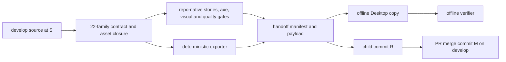

# Implementation Plan: Desktop V2 primitive contract and immutable develop handoff

**Branch**: `develop` in the standalone mission checkout | **Date**: 2026-09-28 | **Spec**: [spec.md](./spec.md)  
**Input**: [issue #470](https://github.com/spec-kitty/spec-kitty-design/issues/470), operator correction to `develop`, and [research.md](./research.md).

## Summary

Document and check the 22 current primitive families, then produce a deterministic in-repository export that Kitty Desktop can verify offline. Finish only after WP01 and WP02 are reviewed and merged to `develop`: freeze source commit S, execute and bind all required gates to S, create a single child handoff commit R, and merge its PR with a merge commit M that retains R in `develop` history. The approved prototype informs composition only.

## Technical context

| Area | Existing surface and chosen use |
|---|---|
| Languages | TypeScript and JavaScript tooling; CSS tokens/styles; Lit custom elements and generated React wrappers. |
| Packages | `@spec-kitty/tokens` → `@spec-kitty/styles` → `@spec-kitty/elements` → generated `@spec-kitty/react`. Do not hand-edit generated wrappers or markup. |
| Source | `packages/styles/src/<family>/` exists for each named family; `packages/elements/src/<family>/` exists only for some. Inventory actual forms and public entries. |
| Evidence | Storybook stories, `apps/storybook/src/tests/visual.spec.ts` plus committed snapshots, `scripts/run-axe-storybook.js`, repository tests and Nx builds. |
| Storage | Versioned contract and export files in the repository; local filesystem copy for the consumer. No service, registry, npm runtime dependency, or network verification. |
| Scale | 22 families plus their actual token/font/source closure; no new generic primitive or Desktop application code. |

## Charter check

- `develop` is the charter's PR target. `main` is a separate operator release; this mission never promotes to it.
- Preserve authored/generated boundaries, one-way package dependencies, token-only component CSS, required Storybook states, WCAG 2.1 AA scans, and committed visual baselines. Any source changes made for coverage follow the existing component recipe and required behaviour tests.
- Every WP PR requires green CI, matching-head adversarial squad evidence on the PR, and the charter's maintainer approval where component files or tokens change. Earlier review point-cuts apply if the mission's risk tier calls for them.
- Redistribution rights are assessed per exported asset. `LICENSE` is MIT for repository code, `packages/tokens/src/fonts/Inter-OFL.txt` supports Inter, and `docs/design-system/brand-guidelines.md` flags unresolved Swansea rights. Do not export an unresolved font on assumed MIT terms.
- The charter's historical token size ceiling is already documented as repository-contradicted. This mission does not change or silently waive it; no new token-size claim is made.

## Data flow and boundary

The contract records each family's actual source form and public entry; it is not a second implementation of the component. The exporter copies only an explicitly enumerated, licensed transitive closure, sorted by normalized repository-relative path. It emits a schema-versioned manifest with S, file role, path, byte size, SHA-256, license reference, state/evidence IDs, and a canonical digest over the payload/contract file list. The manifest does not hash itself or embed R/M hashes. R is identified as the commit containing the handoff; M is identified by the merged PR and Git ancestry.

## Proposed repository surfaces

| Surface | Responsibility |
|---|---|
| `contracts/desktop-v2/` | Versioned human-readable and machine-readable 22-family consumer contract, evidence map, and license references. Exact filenames can follow current repository conventions during WP01. |
| `packages/styles/src/`, `packages/elements/src/`, `packages/tokens/src/` | Existing sources; change only verified coverage or composition gaps. Generated files follow their generators. |
| `apps/storybook/src/tests/visual.spec.ts` and snapshots | Visual states and baselines when WP01 needs missing evidence. |
| `scripts/` and `tests/node/` | Exporter, offline verifier, contract drift checks, and focused failure-case tests using the existing Node/Vitest tooling. |
| `handoffs/desktop-v2/<S>/` | R's immutable, repository-held manifest and payload for offline copy; no external bundle or anchor. |
| `kitty-specs/desktop-v2-immutable-handoff-develop-01M3JSCM/` | Mission spec, plan, tasks, work-package review records. |

## Delivery sequence and dependencies

1. **WP01 — source contract and evidence.** Inventory all 22 names against current `develop`; record styles/element forms, source/public paths, token and font closure, redistribution evidence, state IDs, axe and visual references. Fill actual coverage gaps through existing story/test paths. Add a machine check that rejects missing or stale family/evidence entries. Review and merge its PR into `develop`.
2. **WP02 — deterministic offline exporter and verifier.** Consume WP01's checked contract; emit the normalized payload and manifest; validate copied payload and contract entirely offline. Test repeatability, path/rights closure, and tamper cases. Wire the check into existing repository scripts/CI without a new harness. Review and merge its PR into `develop`.
3. **WP03 — freeze and handoff.** On the then-current `develop`, choose S only after all source changes from WP01/02 are merged. Run lint, test, package builds, Storybook build, axe, visual, and export twice at S; record command/result/evidence for each. If any source or baseline changes, choose a new S and rerun. Create a branch at S and one child commit R containing only `handoffs/desktop-v2/<S>/` output/record. Verify `parent(R) = S`, artifact bytes, and copied offline verification. Open/review its PR to `develop`; use merge-commit mode, then record M in the PR merge receipt and verify `R` is an ancestor of M. Do not infer M before merge or embed it in R.

Each WP has its own PR and independent review verdict. WP02 depends on WP01; WP03 depends on WP02's merge. At most the source/gate discovery within WP01 can run alongside exporter design exploration; the actual frozen artifact cannot precede WP02.

## Verification design

| Gate | Command or evidence source | Acceptance |
|---|---|---|
| Lint | `npm run quality:all` | Exit 0 at S. |
| Tests | `npm test` plus focused contract/export tests | Exit 0; mutations of required fields/files fail. |
| Package build | `npx nx run-many --target=build --projects=tokens,styles,elements,react` | Exit 0; generated output remains consistent with authored source. |
| Storybook | `npx nx run storybook:storybook:build` | Exit 0 and all contract story IDs resolve in `index.json`. |
| Axe | `node scripts/run-axe-storybook.js` | Zero WCAG 2.1 AA violations and zero unloaded stories. |
| Visual | `npx playwright test apps/storybook/src/tests/visual.spec.ts --project=chromium` | Exit 0 against committed baselines; all contract visual IDs resolve. |
| Export | Mission exporter twice, compare byte digests; offline verifier on copied output | Identical bytes and successful network-disabled verification; corruption matrix exits nonzero. |

WP01 may document uncovered evidence as a finding while building; it cannot claim complete acceptance until the required states and references are resolved. WP03 records the actual command line, SHA S, exit code and evidence file; the final acceptance check consumes those records and the artifact itself, rather than trusting a prose claim.

## Failure modes and containment

- **Font rights/closure:** source CSS may reference Swansea although current component styles do not use its family. WP01 must compute the export's actual transitive CSS asset closure. If Swansea is in that closure, obtain explicit rights or narrow the export using a source-preserving, verified CSS selection; no unlicensed asset enters R.
- **Stale evidence:** story IDs, snapshots, or axe reports can drift with a late component change. Evidence carries S and is re-created when S changes.
- **Manifest self-reference:** digest only the canonical payload/contract list; derive R/M from Git/PR history.
- **Nonportable files:** reject symlinks, traversals, absolute paths, duplicates, case collisions and host-dependent timestamps/order; test on an artifact copied outside the Git tree.
- **Merge mode:** squash/rebase merge would break the requested `S → R → M` lineage. Require merge-commit mode and verify ancestry after the reviewed PR lands.
- **Old train history:** old D1 branch and lane output may inform selective source edits but must not be merged or cherry-picked wholesale. The final source comes from current `develop`.

## Implementation concern map

### IC-01 — Contract and evidence

- **Purpose**: Identify the exact reusable source and prove state, rights, accessibility and visual coverage.
- **Requirements**: FR-001–FR-003, FR-007, FR-009; NFR-003–NFR-005.
- **Surfaces**: `contracts/desktop-v2/`, current packages, Storybook and snapshots.
- **Dependency**: none. **Risk**: source forms and font rights vary across the 22 families.

### IC-02 — Reproducible offline handoff tooling

- **Purpose**: Produce portable bytes and fail deterministically on consumer-contract drift.
- **Requirements**: FR-004–FR-006; NFR-001–NFR-002.
- **Surfaces**: `scripts/`, `tests/node/`, `contracts/desktop-v2/`, CI script wiring.
- **Dependency**: IC-01 contract schema and closure. **Risk**: path normalization and self-referential hashes.

### IC-03 — Frozen delivery and lineage

- **Purpose**: Bind gates to S, commit the export as R, and preserve PR merge ancestry to `develop`.
- **Requirements**: FR-007–FR-008; all success criteria.
- **Surfaces**: `handoffs/desktop-v2/<S>/`, WP review records, PR merge receipt.
- **Dependency**: IC-01 and IC-02 merged. **Risk**: moving `develop` or wrong merge mode invalidates the intended proof.
