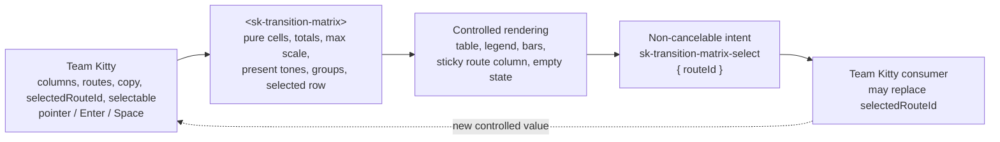

# Implementation Plan: Flow-health transition matrix

**Mission**: `flow-health-transition-matrix-01M1PGNJ` · Issue #149 · Epic #144
**Branch**: `mission/flow-health-transition-matrix` from `train/elements-first` at `5b7566f11b31281bc4c129efcf42427232e16965`
**Date**: 2026-09-04
**Governing spec**: [`spec.md`](./spec.md) at reconciled revision
`a08b263ecbbf15d9979f6bac98c671fe3697d425` (the original planning baseline was
`e92240d6fdf1ab1da43f05f49c699823a7c12115`)

## Summary

Add one reusable, controlled `<sk-transition-matrix>` to the elements-first design-system
surface. It receives immutable route/time-bucket values and consumer copy, derives its scale and
totals without mutating input, renders a real accessible table, and emits one non-cancelable
selection-intent event only when `selectable` is present. Team Kitty retains ownership of data,
time-window/description/hint wording, inventory, routing, and selection.

The approved clean-v4 export fixes the visual facts for `ApprovedExample`; it is not authority
for the adjacent Current/open-WPs summary, which is outside this component. The implementation
follows ADRs 9–11 and the authoring recipe: real token-only CSS, an open shadow root, generated
constructed-sheet, manifest, React, and size artifacts, plus red-first behavior evidence.

One prerequisite is architectural. `columns` and `routes` are structured JavaScript properties
with `attribute: false`. The current SSR-safe React generator drops every public field without an
observed attribute because it cannot distinguish an intentional property-only input from internal
`state: true`. First make that distinction explicit in the normalized manifest, then let the
generator's `useProperties` path deliver those values before upgrade, on reassignment, and on prop
removal. Removing either array prop assigns a fresh immutable empty-array reset value rather than
preserving stale data. #149 explicitly authorizes this smallest generic
normalizer/content-gate/wrapper-runtime change; no unrelated generator refactor is in scope.
Serializing arrays into attributes or hand-editing the wrapper would violate FR-002, FR-019, and
C-006.

## Technical Context

| Concern | Decision |
|---|---|
| Language/runtime | TypeScript 5.x, Lit 3.3.x, standards-based custom elements, CSS |
| UI environments | Browser ESM/IIFE, Storybook, generated React 19 wrapper |
| Storage/network | None; no fetch, store, router, timer, clock, persistence, or domain service |
| Dependencies | Existing Lit/React/Vitest/Playwright/axe/CEM toolchain only; no dependency or lockfile change |
| Canonical style source | `packages/styles/src/transition-matrix/sk-transition-matrix.css` |
| Canonical markup source | Lit `render()`; no static form or `.markup.ts` because the matrix requires structured data |
| Data/performance shape | One route row and one cell per route × column intersection; all derivations are linear in rendered cells |

## Charter Check

| Obligation | Plan response |
|---|---|
| Quality and red-first evidence | Every new registry subject gets a unique non-inert source mutation; acceptance tests also record a deliberate red break before restoration. Render-only/snapshot assertions are not behavior evidence. |
| Architecture and compatibility | No application dependency or new package. Public types/events are stable; #149 explicitly authorizes only the generic property-only classification/delivery/removal-reset seam required by the readonly structured props. |
| Accessibility and visual identity | Native table semantics, explicit header relationships, non-color meaning, keyboard parity, both themes, narrow overflow, reduced motion, axe, and visual diff are gates. Blocked red is only the resolved issue-specific exception. |
| Interactive-state completeness | The existing `SelectableStates` story proves rest, real hover, focus-visible, pointer-active and keyboard-pressed treatment; the non-selectable state is the component's disabled-interaction analogue. Every state is input-driven and axe-scanned; no story-only simulation class or tenth story is added. |
| Performance | The final PR evidence records the successful Storybook CI build step at the exact head SHA. Its duration must be `< 180` seconds; missing/skipped timing or `>= 180` seconds blocks merge. |
| Merge authorization | The single PR may merge into `train/elements-first` only with one maintainer approval on its current head SHA. A later push invalidates the recorded approval. Only the operator may merge the train into `main`. |
| Local/CI environment split | Fedora-local functional Playwright explicitly runs Chromium and Firefox. WebKit remains mandatory in the final unqualified CI Playwright job; do not install missing system libraries locally. The reproducible local guard-4 hang in `suite-selftest --selftest` is recorded as a harness/environment blocker only, while the exact command remains mandatory in final exact-head CI. |
| Canonical sources | CSS is authored once and adopted by identity; wrapper files are generator-owned; all generated artifacts are regenerated and checked. |
| Supply chain | No package or lockfile change. If implementation proves one necessary, stop for an explicit decision. |
| Decision boundary | No new ADR. Any uncovered public API, token namespace, or layering decision stops under C-010. |

No charter exception is requested.

## Public Contract

### Element, types, properties, and event

`packages/elements/src/transition-matrix/sk-transition-matrix.ts` exports `SkTransitionMatrix`
and the following types; `packages/elements/src/index.ts` re-exports all five.

```ts
export type TransitionColumn = Readonly<{ id: string; label: string }>;

export type TransitionTone =
  | 'forward'
  | 'completed'
  | 'blocked'
  | 'recovery'
  | 'backward';

export type TransitionRoute = Readonly<{
  id: string;
  label: string;
  tone: TransitionTone;
  group?: string;
  values: Readonly<Record<string, number>>;
}>;

export type TransitionMatrixSelectDetail = Readonly<{ routeId: string }>;

export type TransitionMatrixProperties = Readonly<{
  columns: ReadonlyArray<TransitionColumn>;
  routes: ReadonlyArray<TransitionRoute>;
  selectedRouteId?: string;
  selectable: boolean;
  windowLabel?: string;
  description?: string;
  selectionHint?: string;
}>;
```

The registered tag is exactly `sk-transition-matrix`. It has no public methods and no slots.
Internal BEM classes are not API. Its seven and only seven public properties are:

| Property | Lit declaration/default | Ownership |
|---|---|---|
| `columns` | `{ attribute: false }`; readonly array; immutable empty-array default | Property-only input; consumer assigns a new reference to update |
| `routes` | `{ attribute: false }`; readonly array; immutable empty-array default | Property-only input; consumer assigns a new reference to update |
| `selectedRouteId` | `{ type: String, attribute: 'selected-route-id' }`; `undefined` | Controlled projection; never changed on activation |
| `selectable` | `{ type: Boolean, reflect: true }`; `false` | Affirmative interaction opt-in independent of selection |
| `windowLabel` | `{ type: String, attribute: 'window-label' }`; `''` | Opaque consumer copy appended after the derived move total when non-empty |
| `description` | `{ type: String }`; `''` | Opaque consumer explanation rendered verbatim when non-empty |
| `selectionHint` | `{ type: String, attribute: 'selection-hint' }`; `''` | Opaque consumer prompt rendered verbatim only when selectable and non-empty |

`columns` and `routes` never gain JSON/string attributes. Deep mutation after assignment is
unsupported: readonly inputs and Lit reference updates require a new array/object graph. The
element never freezes, sorts, annotates, or mutates consumer objects.

All JSX props remain optional under the generated wrapper convention. The generic property-only
delivery path therefore accepts a reset value derived only for a manifest member whose source and
normalized type prove an empty-array default. A supplied array is assigned by identity; on a later
React render where that prop is omitted/`undefined`, the hook assigns a fresh `Object.freeze([])`
through the property path. Tests require the reset to be frozen, empty, non-identical to the prior
consumer array, and free of `columns`/`routes` attributes. No default is guessed for non-array
property-only fields.

The only custom event is:

```ts
new CustomEvent<TransitionMatrixSelectDetail>('sk-transition-matrix-select', {
  detail: { routeId },
  bubbles: true,
  composed: true,
  cancelable: false,
});
```

Typed `@fires` JSDoc documents the detail and flags. Dispatch has no default action: it does not
set `selectedRouteId`, navigate, or mutate data. `preventDefault()` cannot cancel anything. The
generated callback is
`onSkTransitionMatrixSelect?: (event: CustomEvent<TransitionMatrixSelectDetail>) => void`.

### Public styling surface

The exact `::part()` set is `header`, `legend`, `scroller`, `table`, `group`, `row`, `route`,
`bar`, `total`, and `empty-state`. These are stable structural seams. There is no generic `cell`,
tone-specific dynamic part, icon part, slot, public CSS class, or component custom property.
Class JSDoc lists all existing `--sk-*` token dependencies. The part ratchet records these ten
names and browser tests target every literal `::part(name)` selector.

## Controlled Data Flow



Every render computes only from current property references:

1. Build stable column-id and route-id maps without changing input order.
2. Validate non-empty unique ids; value keys must equal supplied column ids; values must be
   finite non-negative integers. Invalid input renders a meaningful, non-interactive unavailable
   state and never fabricates a zero, total, legend entry, or focus target. Development warnings
   may explain the defect without becoming API.
3. Materialize route × column cells by id, preserving values across reorder. Explicit zero stays
   numeric zero and uses the approved visual dash.
4. Derive route totals and then the overall move total from cells only.
5. Derive the global maximum cell. Bar inline size is `value / max`; if `max === 0`, every bar is
   exactly zero. An internal inline CSS property may carry this data ratio.
6. Derive present tones and render them in fixed order: forward, completed, blocked, recovery,
   backward. Derive contiguous group runs from opaque `group` strings.
7. Derive selected state only by comparing route ids to `selectedRouteId`. An unknown id selects
   nothing and is not repaired.

Component-owned generic copy is exactly `Flow health`, `<total> moves`, `Route`, `Total`, the five
tone names, and `bar length ∝ moves`. Route, group, column, `windowLabel`, `description`, and
`selectionHint` strings are consumer values rendered verbatim. A non-empty window label is appended
with the separator only after the derived move total; a non-empty hint appears only with
`selectable`. The approved story supplies `last 72 hours`, `Moves grouped by route and day.`, and
`Select any row to inspect its WPs.`. No reusable element source contains those screenshot/domain
phrases, clock, or date formatter.

## Accessibility and Responsive Rendering

- Render a labelled section with title, overall total, description, scale caption, and native
  legend list. Visible tone text supplements dots/bars; blocked, recovery, and backward routes
  use distinct decorative prohibition/directional icons plus visually hidden tone text. Inline
  Lucide-compatible SVG is dependency-free and `aria-hidden` because text supplies meaning.
- Render a real `<table>` in `part="scroller"`. `<thead>` contains Route, every consumer column,
  and Total; headers use `scope="col"`. Each route label is `th[scope="row"]`.
- Magnitude cells carry explicit `headers` references to generated route/column header ids.
  Totals reference route and Total headers; magnitude cells use `aria-describedby` to connect
  their route total. DOM ids use component-owned row/column indexes, never raw consumer ids.
- A named contiguous group starts with a visible full-width heading row; its `<tbody>` is labelled
  by that heading. It never replaces route headers or adds a role that erases table semantics.
- `aria-selected="true|false"` reflects only `selectedRouteId`, including non-selectable mode.
  Without `selectable`, rows have no tab index, activation listeners, hover cursor, focus ring,
  active/pressed treatment, prompt, or event; this is the component's disabled-interaction
  analogue and does not add a public `disabled` property. With `selectable`, every row is one
  selection target (`tabindex="0"`); pointer, Enter, and Space use one dispatch path. Actual
  pointer-down and keyboard-down input exposes a transient pressed treatment which clears on
  release/cancel/blur; Space prevents scrolling and key repeat emits no duplicate. Stories never
  fake that state with a class.
- The labelled overflow viewport is keyboard-scrollable. At narrow widths, intrinsic table
  widths scroll horizontally while Route header/cells are sticky at `inset-inline-start: 0`,
  use an opaque token surface, and the smallest structural stacking order needed. Long labels
  wrap in bounded header widths; labels/counts never overlap or become connectors.
- Prefer no bar animation; reduced motion removes any incidental transition.
- Empty routes or columns render the labelled root and `empty-state`, with no row targets.
  All-zero rectangular data remains a table with zero totals, zero bars, and present route tones.

## Manifest and React Property-only Seam

Extend the normalizer's TypeScript AST walk so a public settable field explicitly declared with
`attribute: false` is marked in normalized CEM as `"x-spec-kitty-property-only": true`.
`state: true` remains unattributed and unmarked; unsupported computed/spread declarations fail
closed.

For an explicitly property-only field, the same AST path may add
`"x-spec-kitty-property-reset": "empty-array"` only when both its declared type and source
initializer prove the documented immutable empty-array default. The wrapper generator rejects a
reset marker on any other shape. This narrow metadata is the generic mechanism for prop removal;
there is no `columns`/`routes` name check and no unrelated generator cleanup.

`scripts/check-manifest-content.mjs` and `expected-docs.json` add an exact `properties` count beside
`attributes` and `methods`. Property-only fields are public documentation items with required
non-empty descriptions. Existing elements record zero; `sk-transition-matrix` records
`attributes: 5`, `properties: 2`, `methods: 0`.

`scripts/build-react-wrappers.mjs` admits attributed fields plus only explicitly marked members
into the narrowed manifest. Internal state remains in `EXPECTED_NON_PROP_FIELDS`. The existing
generated `useProperties` mechanism assigns arrays through the ref. The narrow generator/runtime
change passes the proven empty-array reset to that hook. The gate asserts both props are typed,
neither reaches `React.createElement` as an attribute, both are assigned before upgrade and on
reference change, and removal assigns a frozen empty array instead of retaining the previous
identity. Generator selftests cover a lost marker, state falsely marked, invalid reset marker,
dropped property-only declaration, skipped-undefined stale state, and property assignment replaced
by an attribute. Generated `packages/react/src/**` is never hand-edited.

## File and Write Scope

### Authored component and evidence

```text
packages/styles/src/transition-matrix/sk-transition-matrix.css
packages/elements/src/transition-matrix/sk-transition-matrix.ts
packages/elements/src/transition-matrix/sk-transition-matrix.stories.ts
fixtures/elements-behaviour/src/sk-transition-matrix.test.ts
tests/node/react-wrappers.test.ts
apps/storybook/src/tests/sk-transition-matrix.spec.ts
apps/storybook/src/tests/visual.spec.ts
apps/storybook/src/tests/visual.spec.ts-snapshots/<runner-owned-baselines>.png
docs/design-system/using-components.md
docs/design-system/using-react.md
docs/design-system/changelog.md
```

No transition-matrix `packages/styles/**/index.ts`, `.html`, or `.markup.ts` is created: there is
no honest data-independent static form.

### Authored shared architecture/ratchets

```text
packages/elements/src/index.ts
packages/elements/src/elements.ts
scripts/normalise-manifest.mjs
scripts/build-react-wrappers.mjs
scripts/check-manifest-content.mjs
behaviours.json
mutations.json
expected-docs.json
expected-parts.json
expected-stories.json
```

Only generic property-only support justifies the script edits. No sibling authored component
source may change.

### Generated and committed artifacts

```text
packages/elements/src/transition-matrix/sk-transition-matrix.css.js  # exports skTransitionMatrixSheet
packages/elements/src/transition-matrix/sk-transition-matrix.css.d.ts
packages/elements/custom-elements.json
packages/react/src/SkTransitionMatrix.js
packages/react/src/SkTransitionMatrix.d.ts
packages/react/src/index.js
packages/react/src/index.d.ts
packages/react/src/react-utils.js             # only if deterministic generator output changes
packages/react/.wrapper-floor
packages/elements/SIZES.md
```

Other generated bytes may change only as a deterministic consequence of rebasing the train; no
authored sibling fixes are allowed. Packages, lockfiles, tokens, ADRs, existing mission records,
validation/learnings, Team Kitty code, and the Current/open-WPs summary are outside write scope.

### Serial verification-closure scope

```text
fixtures/react-consumer/src/sk-transition-matrix.test.tsx   # new distinct React subject
packages/react/type-tests/wrappers.type-test.tsx            # existing type-test surface
behaviours.json                                             # React SC-006/SC-010 pairs only
mutations.json                                              # matching non-inert mutations only
suite-budget.json                                           # conditional: CI evidence only
```

These files belong to WP03 after WP02 has generated the wrapper. The registry/mutation overlap is
intentional and serial. WP03's independently reviewable Definition of Done records the passing main
`suite-selftest.mjs` result and elapsed time. It also attempts the guard selftest and records the
approved, reproducible local guard-4 hang without claiming a pass; local timing can prove that the
added mutations execute, but can never authorize a budget change or waive final CI. After WP03 is
reviewed and integrated, mission wrap-up rebases the whole shared lane onto the latest train,
regenerates shared outputs, and reruns all runnable local gates before opening the one draft mission
PR. That PR's mutation-adding CI run is the authoritative timing source for the final-gate budget
disposition, and its exact-head CI must pass `node scripts/suite-selftest.mjs --selftest`.
`suite-budget.json` changes only when that run proves the current `selftestCeilingSeconds` lacks
defensible margin; record CI URL, SHA, mutation/test counts, elapsed time, variance-aware
justification, and the smallest defensible ceiling. If a change is required, keep the same draft PR,
route the edit back through WP03 with a fresh implementer, repeat the affected WP03 review, push the
reviewed correction to that PR, and rerun the final SHA gate. Never open a second PR.

## Fixtures and Stories

- Reuse one readonly clean-v4 fixture: four columns, six routes, 24 values, five tones, the group,
  62 moves, and derived 21/17/11/6/4/3 totals. Never encode supplied totals.
- Ship exactly nine independently addressable story ids: `Default`, `ApprovedExample`,
  `FiftyActiveWPs`, `SparseData`, `EqualTotalsDifferentDistribution`, `Empty`,
  `ControlledSelection`, `SelectableStates`, and `LightMode`; record all in
  `expected-stories.json`.
- `Default` is domain-neutral and non-selectable. `ApprovedExample` is selectable, supplies the
  three clean-v4 copy strings, and is the primary dark visual. `FiftyActiveWPs` supplies only
  aggregate routes. `ControlledSelection` action-logs the typed event and keeps selection until
  story-owned state reassigns the property; it includes an inspectable non-selectable state.
  `SelectableStates` is the independently addressable rest/hover/focus-visible/pointer-active/
  keyboard-pressed target and also exposes the non-selectable disabled-interaction analogue without
  adding another story.
  `LightMode` uses `.sk-light` with equivalent content and relationships.
- Visual coverage captures approved dark, light, narrow-scrolled ownership, selectable rest/hover/
  focus-visible/active-or-pressed states, and the non-selectable disabled-interaction analogue.
  Local captures are diagnostic and are never committed or blessed. After WP03 approval and the
  final rebase/regeneration, the one draft PR produces nine CI-authoritative actual PNGs. Those exact
  bytes are compared with clean-v4, committed to that same PR as baselines, and must pass the final
  exact-head Chromium visual-regression rerun.

## Behavior, Type, and Gate Evidence

Register `sk-transition-matrix` only for ADR-11 behaviors it owns:

- ADR SC-006: one event per activation in
  `fixtures/elements-behaviour/src/sk-transition-matrix.test.ts`; WP03 adds the distinct
  React-listener delivery pair in `fixtures/react-consumer/src/sk-transition-matrix.test.tsx`.
- ADR SC-007: exact `{ routeId }` detail in the element subject; React compile/runtime detail proof
  stays in WP03's dedicated file without reusing another component's pair.
- ADR SC-008: bubbling and composed as documented, with the same assertion also pinning the
  declared `cancelable === false`; the element subject owns the event flags.
- ADR SC-010: element arrays assigned before definition survive upgrade; WP03's distinct React
  subject proves initial identity, reference replacement, and removal reset delivery.
- ADR SC-013: all ten parts are present and targetable in the element subject.
- ADR SC-014: the element adopts exactly the named package export `skTransitionMatrixSheet` by
  identity and injects zero shadow `<style>` nodes; separate empty-array and identity-swap mutation
  arms target the same subject pair.

Do not register ADR SC-009: cancellation is inapplicable. Do not register ADR SC-011 (no slots),
ADR SC-012 (its registry meaning is specifically Escape-close/focus-return/`aria-expanded`, none
of which this matrix owns), or ADR SC-015 per element (guarded definition belongs to `define()` and
is covered globally). Mission success criteria with the same `SC-nnn` spelling are never used as
registry ids or bracketed behavior-test labels.

Every new `(behavior id, subject file)` pair has a surgical production-source mutation in
`mutations.json`. ADR SC-014 keeps separate empty-array and identity-swap mutations. Event
count/detail/flags, property upgrade, unique part, and stylesheet mutations each fail their named
registry test while collateral registry tests stay green, and the main `node
scripts/suite-selftest.mjs` re-derives them. Totals, exact proportional ratios/global-max
reassignment, controlled selection, table headers, legend filtering, validation, aggregation,
positive/negative selectable affordances and narrow ownership are mission acceptance tests, not
invented ADR ids; each records a real source mutation, exact named failing test and red output
before restoration in WP evidence. Tests use `[SC-nnn]` only for actual registry pairs.

Type/runtime evidence must prove:

- Elements compile readonly inputs, five tones, optional selected id, boolean property, and typed
  event; invalid tone/count/detail examples fail with `@ts-expect-error`.
- React accepts `columns`, `routes`, `selectedRouteId`, `selectable?: boolean`, `windowLabel`,
  `description`, and `selectionHint`; callback detail is `string` with no explicit/inferred `any`.
- Runtime passes the same array identities before definition, observes them after upgrade,
  replaces them on rerender, resets removed props to frozen empty arrays, and receives one sentinel
  event; no `columns`/`routes` attributes.
- Manifest contains the seven-property/five-attribute/two-property-only split, typed event and documented flags, zero
  methods/slots, and all ten parts.
- The generated stylesheet module exports `skTransitionMatrixSheet`; the elements package root
  re-exports it, and the browser subject compares `shadowRoot.adoptedStyleSheets[0]` with that named
  package export rather than with `Ctor.styles[0]`.
- Class JSDoc and Storybook component docs enumerate the exact distinct `--sk-*` tokens referenced
  by `sk-transition-matrix.css`. A focused test/gate extracts both sets and fails on any missing or
  extra published token, so the charter token-dependency requirement is not satisfied by prose
  inspection alone.
- WP03 owns local mutation proof before its approval. Its main mutation harness must pass; its
  locally reproducible guard-4 `--selftest` hang is recorded as an approved environment/harness
  blocker without being called green. The single draft mission PR owns the authoritative
  mutation-adding CI measurement and final budget disposition, and the exact guard-selftest command
  must pass there. Any required budget edit returns to WP03 and repeats affected implementation/
  review before the final SHA gate.

### Local gate commands

Run the deterministic, build, content, accessibility and main mutation commands locally. Functional
Playwright is deliberately qualified to Chromium and Firefox on Fedora. The WebKit project is not
run locally because its required system libraries are unavailable and installing them is not
authorized. The Chromium visual invocation is diagnostic only: missing-baseline failures produce
the actuals later harvested from CI, and neither local actuals nor local snapshots are committed.
Attempt `node scripts/suite-selftest.mjs --selftest`; if the already reproduced guard-4 hang recurs,
record the command, last completed guard and bounded timeout rather than claiming a pass. This local
exception never relaxes the final exact-head CI requirement.

```sh
node scripts/build-elements-css.mjs
node scripts/build-element-markup.mjs
npx nx run elements:analyze
node scripts/build-react-wrappers.mjs
npx nx run-many --target=build --projects=tokens,styles,elements
node scripts/measure-elements-sizes.mjs

node scripts/build-elements-css.mjs --check
node scripts/build-element-markup.mjs --check
npx nx run elements:analyze
git diff --exit-code -- packages/elements/custom-elements.json
node scripts/build-react-wrappers.mjs --check
node scripts/build-react-wrappers.mjs --selftest
node scripts/check-manifest-content.mjs
node scripts/check-manifest-content.mjs --selftest
node scripts/check-elements-entries.mjs
node scripts/check-elements-entries.mjs --selftest
node scripts/check-part-ratchet.mjs
node scripts/check-adopted-css-boundaries.mjs
node scripts/check-adopted-css-boundaries.mjs --selftest
node scripts/check-element-css-hygiene.mjs
node scripts/check-story-theme-wrapper.mjs
node scripts/check-story-theme-wrapper.mjs --selftest
node scripts/check-gate-wiring.mjs
node scripts/typecheck-all.mjs
node scripts/measure-elements-sizes.mjs --check
npm run quality:all
npm run test
node scripts/suite-selftest.mjs
node scripts/suite-selftest.mjs --selftest
npx nx run storybook:storybook:build
node scripts/run-axe-storybook.js
npx playwright test apps/storybook/src/tests/sk-transition-matrix.spec.ts --project=chromium
npx playwright test apps/storybook/src/tests/sk-transition-matrix.spec.ts --project=firefox
PW_INCLUDE_VISUAL=1 npx playwright test apps/storybook/src/tests/visual.spec.ts --project=chromium
```

The full repository quality command remains the umbrella lint/style/build gate. Final evidence
cites actual results. Story load failure is an axe failure. Size evidence is regenerated
raw/minified/min+gzip `SIZES.md` rather than an estimate.

### Post-WP03 mission wrap-up and final CI

This sequence is mission closeout, not a WP02 or WP03 completion claim:

1. After WP03 is independently approved and integrated into the shared lane, fetch current
   `train/elements-first`, rebase the whole mission branch, preserve authored sources, regenerate in
   the documented order, and rerun every runnable local gate above. Do not rebase between WP02 and
   WP03 because Spec Kitty has one shared lane and no partial-WP merge/reparent seam.
2. Open exactly one draft PR with `Refs #149`. Its first CI run must execute the unqualified
   `npx playwright test` suite, including WebKit, and the exact
   `node scripts/suite-selftest.mjs --selftest` command. The mutation job supplies the authoritative
   budget evidence.
3. Download all nine transition-matrix actual PNG bytes from that PR's
   `visual-regression-diffs` artifact. Compare those exact CI-rendered images with clean-v4. Once
   approved, commit those bytes—not locally regenerated substitutes—to the snapshot paths on the
   same PR. Never use local `--update-snapshots` as baseline authority.
4. Rerun final CI at the resulting exact head. The exact commands below, Storybook, axe, mutation
   budget and every other hard gate must pass:

   ```sh
   node scripts/suite-selftest.mjs --selftest
   npx playwright test
   PW_INCLUDE_VISUAL=1 npx playwright test apps/storybook/src/tests/visual.spec.ts --project=chromium
   ```
5. Record the named `[ENFORCED] Storybook build (NFR-003 < 3 min)` step's URL, exact SHA,
   start/end timestamps and duration strictly below 180 seconds. Then run the full SHA-pinned
   pre-merge adversarial squad and require one maintainer approval whose review `commit_id` equals
   that same current head. Any push—including baseline or budget commits—invalidates earlier CI,
   squad, timing and approval evidence and requires the affected gates to rerun.

These are merge gates, not substitutes for local evidence. The mission PR may merge only into
`train/elements-first`; train-to-`main` remains operator-only.

## Implementation Concern Map

### IC-01 — Property-only manifest and React delivery

- **Purpose**: Distinguish intentional structured inputs from internal Lit state, publish their
  docs/types, and deliver them through the SSR-safe generated wrapper.
- **Requirements**: FR-002, FR-018, FR-019, FR-021, FR-024; NFR-004, NFR-009, NFR-010; C-006.
- **Surfaces**: Normalizer, docs ratchet, wrapper generator/selftests, React fixtures/artifacts.
- **Depends on**: Nothing; precedes the element so its API cannot disappear silently.
- **Risks**: False publication of state; initial values lost after upgrade; removed React props
  retaining stale arrays. AST/reset markers and runtime identity/update/removal tests close all
  three.

### IC-02 — Pure model and controlled interaction

- **Purpose**: Exact types, consumer-owned copy, validation, totals/scale/legend/group derivations,
  selected projection, and one intent path.
- **Requirements**: FR-001–FR-014, FR-017, FR-022; NFR-002–NFR-004, NFR-008; SC-001–SC-008, SC-010.
- **Surfaces**: Element, entries, behavior fixture, registries/mutations, manifest.
- **Depends on**: IC-01.
- **Risks**: Invented missing values, local selection, positional reorder bugs. Fail-closed
  validation and id-keyed pure derivation are explicit tests.

### IC-03 — Semantic table and styling surface

- **Purpose**: Header/group/tone semantics, sticky ownership, token-only themes, sheet adoption,
  and ten parts.
- **Requirements**: FR-004, FR-007–FR-010, FR-015–FR-018, FR-023; NFR-001, NFR-005–NFR-008;
  SC-003–SC-005, SC-009, SC-011, SC-013.
- **Surfaces**: Template/JSDoc, CSS/sheet, browser/Storybook tests, parts ratchet.
- **Depends on**: IC-02.
- **Risks**: Sticky painting/long labels; blocked red leaking. Narrow scroll evidence and token
  gates constrain both. Stop if layering needs a new token/ADR.

### IC-04 — Fixtures, distribution, and release evidence

- **Purpose**: Independently inspectable stories and complete manifest/wrapper/entry/size/axe/
  visual gates after integration.
- **Requirements**: FR-020, FR-021, FR-024; NFR-001, NFR-003–NFR-006, NFR-009–NFR-010;
  SC-010–SC-015.
- **Surfaces**: Stories/ratchet, React proof, docs, generated artifacts, Storybook/visual evidence.
- **Depends on**: IC-01–IC-03; WP02 closes its component evidence before the post-WP03 final
  rebase/regeneration.
- **Risks**: Visual green over wrong fixture/local baseline. Assert clean-v4 facts first and use
  the one draft PR's nine CI actuals as the only baseline source. State evidence covers real hover,
  focus-visible, pointer-active and keyboard-pressed input plus the non-selectable
  disabled-interaction analogue in the existing nine-story set.

### IC-05 — Dedicated React and final verification closure

- **Purpose**: Prove generated React structured-property/event behavior and types in their distinct
  consumer surfaces, mutation-back those pairs, record local suite timing and runnable gate
  evidence before WP03 approval. Apply the final rebase/regeneration and CI-only environment,
  visual and budget gates later during mission wrap-up on the single draft PR.
- **Requirements**: FR-012, FR-019, FR-021, FR-024; NFR-002, NFR-004, NFR-009, NFR-010; C-006, C-010.
- **Surfaces**: Dedicated React fixture, React type tests, React behavior pairs/mutations, local gate
  evidence, and—only if the draft-PR CI evidence requires it—a reviewed conditional suite-budget
  correction.
- **Depends on**: IC-01–IC-04 and the WP02-generated wrapper.
- **Risks**: A type-only green can hide dropped/stale runtime properties; require real identity,
  update, reset, attribute-absence, and event-delivery assertions.

## Work-package Strategy Recommendation

This spec-kitty-design child mission uses the one branch named above and one final PR into
`train/elements-first`, using `Refs #149`. Keep three serial internal work packages on that mission
branch; they may remain separate focused commits, but all are integrated and reviewed together
before the single PR is presented:

1. **Generic property-only pipeline** — IC-01 only: normalized marker, documentation ratchet,
   wrapper delivery, selftests, and React runtime/type proof. No transition-matrix source.
2. **Complete component** — IC-02–IC-04 atomically: source, CSS, element behavior/type/story/axe/
   diagnostic visual evidence, published token-dependency proof, entries, docs, ratchets, and
   generated artifacts. T011 records a truthful closeout handoff; it does not claim the later
   upstream rebase, WebKit, guard-selftest or CI baseline gates.
3. **React/final verification closure** — IC-05: dedicated React behavior/type evidence, only its
   applicable registry pairs and mutations, local timing and all runnable local gates. The known
   local guard-4 selftest hang is recorded, not waived. After this WP is reviewed and integrated,
   mission wrap-up performs the final train rebase/regeneration and opens the single draft PR for
   CI-authoritative timing, conditional budget disposition, nine-baseline harvesting, Storybook CI
   duration evidence, visual rerun, current-head squad and maintainer approval. Any required budget
   correction returns through WP03 and affected review on the same PR.

Open PRs #140 and #143 overlap manifest, wrappers, entries, size, ratchets, stories, tokens, and
gates, but not authored transition-matrix sources. After WP03 approval and integration, wait for any
preceding train PR, rebase the whole mission branch onto the latest train, preserve both source
changes rather than choosing an old generated side, regenerate CSS/markup/manifest/wrappers/build/
size in order, and rerun all runnable local gates. Then open that one draft PR and let its first CI
run supply authoritative mutation timing and nine visual actuals. After those exact bytes are
approved and committed as baselines to the same PR, rerun final CI and exact-head review gates.
Coordinate explicit merge order; if an overlapping PR lands afterward, rebase the whole mission
branch and repeat regeneration, baseline provenance, CI, squad, timing, approval and the exact-final-
SHA gate before merge.

## Pre-mortem and Risks

| Failure | Earliest signal | Mitigation |
|---|---|---|
| React types exist but initial arrays disappear | Wrapper sees defaults after `whenDefined` | Marker + `useProperties` + pre-upgrade/update identity test/selftest |
| A removed React array prop leaves prior rows visible | Rerender omits prop but element retains previous identity | Proven empty-array reset metadata + rerender-removal runtime/selftest |
| Internal state becomes a React prop | Expected non-prop set changes | Explicit `attribute:false` only; fail-closed AST/false-marker probe |
| Screenshot copy leaks into the reusable element | Element source contains `last 72 hours`, `day`, or `WPs` | Consumer string properties + approved-story values + source absence invariant |
| Selection becomes uncontrolled | Activation changes `aria-selected` | Dispatch-only path and controlled-selection mutation |
| Keyboard duplicates intent | More than one Space/Enter event | Shared activation, key/repeat filtering |
| Visual table lacks recoverable headers | Semantic assertion/axe fails | Native table plus explicit ids/headers/descriptions |
| Sticky labels paint under cells | Narrow scrolled test fails | Opaque token surface/minimal stacking; stop if new architecture is needed |
| Invalid cells alter totals | Boundary test sees fabricated data | Exact shape validation and meaningful unavailable state |
| Red-first mutation is inert/collateral | Selftest misses named failure | Unique anchors and pairwise subjects; separate SC-014 arms |
| Mission SC number corrupts ADR registry | Matrix is registered under ADR SC-012 | Registry derives only actual behaviours; non-registry reds stay recorded evidence |
| Added mutations breach the current CI tail budget | Draft-PR CI `suite-selftest` exceeds 360 seconds | Keep the same PR; return a justified minimal `suite-budget.json` edit to a fresh WP03 implementer, repeat affected review, and rerun the final SHA gate |
| Local guard selftest hangs at guard 4 | Fedora run reproduces the pre-existing syntax-error Vitest hang | Record the bounded local blocker without a pass claim; require the exact `node scripts/suite-selftest.mjs --selftest` command to pass in final exact-head CI |
| WebKit cannot launch locally | Fedora reports missing Ubuntu-targeted runtime libraries | Do not install system packages; run qualified Chromium and Firefox locally and require WebKit in final unqualified CI Playwright |
| Approval includes open-WP inventory | Story/API contains inventory content | Exact fixture and negative Current/open-WP checks |
| Rebase overwrites sibling work | Authored sibling diff appears | Serial rebase/regenerate and authored-scope diff check |
| A local screenshot becomes baseline authority | Snapshot bytes originate outside the draft PR's CI artifact | Commit only the nine CI-generated actual PNG bytes after clean-v4 comparison, then rerun visual CI on the same PR |
| Hover/focus pass but active is unimplemented | Pointer-down/keyboard-down computed style equals rest | Exercise real input in `SelectableStates`, axe-scan it, capture it, and mutation-break its authored style anchor |
| Storybook CI build exceeds its charter budget | Exact final-head build step is missing, skipped, or `>= 180s` | Fail the merge gate and remediate without editing the threshold in this mission |
| Approval is stale after a corrective push | Approval review `commit_id` differs from PR head | Require one maintainer approval on the new exact head SHA before merging to the train |
| New dependency/token appears | Package/lock/token diff | Stop for decision; none is authorized |

There is no planning blocker. The known risks are the generic property-only wrapper seam and
serial regeneration against #140/#143; both are isolated above.
