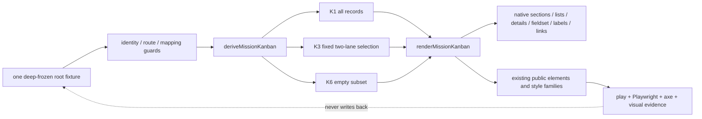

# Implementation Plan: Mission Kanban K1–K6 pattern stories

**Mission**: `mission-kanban-pattern-stories-01M22F6C` · **Issue**: #278 · **Epic**: #276  
**Planning branch**: local Spec Kitty coordination ref `train/elements-first`  
**Date**: 2026-09-09 · **Spec**: [spec.md](./spec.md)  
**Planning base**: `origin/train/elements-first@fb424e83c827a586038d7a2a977b946b193192fb`

## Summary

Add one Storybook-only Mission Kanban composition module at
`packages/elements/src/patterns/mission-kanban.stories.ts`. Keep the one deeply frozen root fixture,
its guards, pure projections, render helper, all K1–K6 stories, and theme/stress evidence together
inside this excluded `*.stories.ts` module so Team Kitty-shaped data and helpers cannot enter the
published elements build. Compose the current public app-shell, mission-navigation, heading,
breadcrumb, status/pill, disclosure, checkbox-choice, workflow-board/lane, action-row route,
notice, empty-state, and button surfaces over native HTML semantics.

Add a focused built-Storybook Playwright suite, ratchet the ten planned story exports into the axe
gate, extend the Chromium visual suite with directly inspected K1–K6 and theme/stress captures,
and add the #277 checkbox stylesheet to the existing Storybook-only cross-layer CSS seam. No
custom element, token, package export, manifest entry, wrapper, behavior registry subject, or
generated product artifact changes.

Exactly one Work Package owns the cohesive story, fixture, tests, ratchet, and visual evidence.
Splitting the fixture from its stories would either publish consumer-shaped helpers or create a
partial package that cannot prove the K1–K6 truth relationships independently.

## Technical Context

**Language/Version**: TypeScript 5.x, Lit 3.3 templates, modern browser JavaScript, native HTML/CSS  
**Primary Dependencies**: Storybook 10.6 web-components/Vite, existing `@spec-kitty/styles` and
`@spec-kitty/elements` public surfaces, Playwright 1.62, axe-playwright, Vitest 4.1, Nx 22  
**Storage**: N/A; one deterministic deeply frozen in-memory Storybook fixture  
**Testing**: story play assertions, focused Chromium/Firefox/WebKit Playwright semantics and
geometry, accessibility-tree snapshots, axe over every ratcheted story, Chromium visual regression,
and existing repository generation/release/security gates  
**Target Platform**: built static Storybook and evergreen Chromium, Firefox, and WebKit consumers  
**Project Type**: token-first Nx design-system monorepo; Storybook-only pattern composition  
**Performance Goals**: retain the repository's fail-closed Storybook build budget; no timer,
subscription, fetch, polling, store, or runtime data processing  
**Constraints**: existing `--sk-*` tokens and public train components only; no private selector,
copied component CSS, raw design value, Team Kitty import, router, filtering engine, or generated
artifact edit  
**Scale/Scope**: one story module, six approved product states, four explicit evidence variants,
fifteen Work Packages, five rendered stages, ten detailed filter lanes, one focused browser suite,
and one Chromium visual family

## Planning decisions

### PD-001 — One excluded story module is the complete implementation boundary

Create `packages/elements/src/patterns/mission-kanban.stories.ts` with Storybook title
`Patterns/Mission Kanban`. `packages/elements/tsconfig.lib.json` excludes `src/**/*.stories.ts`,
while the published package is reached only through explicit entry barrels. Types, fixture data,
guards, projections, and render functions therefore remain in this file. Do not create an ordinary
helper module under `packages/elements/src`, add an index export, register a custom element, or add
React/Vue/public declarations.

Export the fixture and pure helpers only where story play assertions need stable seams. Enumerate
every non-story export in CSF `excludeStories`; verify the built `index.json` discovers only the
ten user-facing story exports. Source and package-build checks must prove that no
`sk-mission-kanban` definition or public module exists.

### PD-002 — One deep-frozen fixture carries all supplied facts

Define one `MISSION_KANBAN_FIXTURE`, recursively freeze every nested object/array, and type all
inputs and projections as deeply readonly. It contains:

- five stages in exact order: Planned, Doing, For review, Approved, Done;
- ten detailed lanes in exact order: Genesis, Planned, Claimed, In progress, For review, In
  review, Approved, Done, Blocked, Canceled;
- the fifteen exact Work Package records, supplied native routes, exact committed detailed lanes,
  agent profiles, and optional tracker routes;
- the K3 controlled selected set `in_review` and `blocked`;
- one unchanged commit context, one snapshot-behind-log notice, WP03's supplied observation, and
  separately supplied reported-live records;
- navigation/context labels, approved empty copy, and separately supplied long-content stress
  strings needed by evidence variants.

The exact supplied reduction is Planned/Blocked → Planned, Claimed/In progress → Doing, For
review/In review → For review, Approved → Approved, and Done/Canceled → Done. Genesis stays a
valid zero-count filter choice without a presentation stage; a guard rejects a non-empty Genesis
or any other non-empty lane lacking an explicit mapping instead of inventing placement.

Fixture guards reject duplicate stage, detailed-lane, Work Package, route-control, or DOM ids;
unknown selected lanes; blank primary routes; more than one stage membership; count/list mismatch;
and non-empty unmapped lanes. Render/play evidence records and rechecks deep immutability before and
after every projection.

### PD-003 — Pure projections preserve source truth

`deriveMissionKanban(fixture, options)` returns a newly deeply frozen projection. Its story-only
options select one of the supplied Work Package subsets and whether supplied snapshot, observed,
or reported-live records are visible. It:

1. selects only fixture-owned records;
2. groups each selected record by its exact committed lane's supplied stage mapping;
3. preserves stage order and fixture Work Package order;
4. derives stage and detailed-lane counts from records rather than copied display totals;
5. retains exact committed lane on every card; and
6. never writes to the fixture or a prior projection.

The K3 helper receives the fixture's fixed selected set to produce WP10 and WP05 for that story.
This pure deterministic projection is acceptance evidence, not a published filter engine. Native
checkbox interaction does not mutate story args, recalculate the board, persist state, or write a
query parameter. A consumer-supplied rerender is the only conceptual route to a different view.

`renderMissionKanban(projection, presentation)` consumes only a frozen projection and explicit
presentation options for compact/light/long/known-overflow evidence. Presentation options never
change committed data, counts, routes, snapshot classification, or truth tiers.

### PD-004 — Ten separately addressable stories cover six product states

Use a mandatory `Default` export with display name `K1 Populated desktop` plus nine explicit
exports. The planned built-story family is:

| Export | Product/evidence state | Required proof |
|---|---|---|
| `Default` | K1 populated desktop dark | 15 cards; five stages; `3/4/3/1/4`; exact committed lanes and routes |
| `K2NarrowContained` | K2 compact 390px dark | compact shell; board-only overflow; named focusable region; no page overflow |
| `K3DetailedLaneFilters` | K3 open filters dark | ten native choices; two checked; exact counts; 2/15; separate Apply/Clear |
| `K4SnapshotBehindLog` | K4 populated dark | one notice at K1's unchanged commit; no second revision or comparison logic |
| `K5ObservedNotYetPushed` | K5 populated dark | WP03 remains Doing/`in_progress`; observed and reported-live content separate |
| `K6StableEmptyBoard` | K6 empty dark | five zero-count sections/lists; sibling empty copy; no CTA |
| `LightMode` | K1 in `.sk-light` | semantic/data parity with K1 and measurably distinct resolved theme values |
| `LongContent` | supplied long-content stress | wrapping/local overflow without lost meaning, page overflow, or clipped focus |
| `ForcedColors` | representative K4/K5 truth tiers | real media emulation preserves boundaries, labels, notice, routes, and focus |
| `ReducedMotion` | representative K5 truth tiers | real media emulation preserves all content without pattern-owned motion |

The current train ratchet is 381 stories, so ten additions would produce 391 if the train remains
unchanged. The built Storybook `index.json`, not predicted normalization or this arithmetic, is
final authority. Recompute and record the exact ten normalized IDs after the last train refresh.

### PD-005 — Public composition and native structure

The render tree keeps only the relevant semantic relationships:

```text
sk-app-shell [presentation=compact only for K2]
├── sk-personal-rail / sk-context-sidebar   existing navigation slots
├── sk-page-header                         heading + supplied status/pill context
└── main
    ├── nav > ol > li > a                  native breadcrumbs
    ├── details.sk-disclosure              K3 only
    │   └── fieldset.sk-checkbox-choice-group
    │       ├── legend
    │       ├── label > input[type=checkbox] × 10
    │       └── separate Apply / Clear controls
    ├── sk-notice                          K4 only
    ├── section.sk-workflow-board
    │   └── board scroller
    │       └── section.sk-workflow-lane × 5
    │           ├── heading + derived count
    │           ├── ol > li > sk-action-row[href][layout=card]
    │           └── sibling inline empty state when empty
    └── separately named reported-live section
```

Import the existing custom-element modules directly by authored module path. Use public slots,
attributes, parts only where already documented, and native light-DOM classes. Do not query child
shadow roots to style the composition. Pattern-local layout CSS may target only a
`sk-mission-kanban-pattern*` namespace and scoped native descendants, and every design value must
use an existing `var(--sk-*)` token. `scripts/check-pattern-composition.mjs` and its self-test are
mandatory.

The Storybook preview already owns the styles-only disclosure, empty-state, breadcrumbs,
workflow-board, and workflow-lane imports. Add only
`packages/styles/src/checkbox-choice-group/sk-checkbox-choice-group.css` to that sanctioned
cross-layer seam. The stylesheet is class-scoped; the full visual suite detects unintended changes
to unrelated stories. Do not import CSS from the elements story module.

### PD-006 — Real #272 routes, no synthetic activation

Each Work Package `li` contains the public `sk-action-row` with `layout="card"` and the exact
non-blank fixture `href`. Do not set `selectable`, attach `sk-action-row-activate`, add
`role="link"`, intercept navigation, or build routes. The WP id supplies the primary link name;
the exact committed lane and agent profile remain visible supporting facts. Supplied tracker
references render as independent native controls outside the primary anchor; absence renders no
placeholder.

Playwright verifies the actual rendered anchor destination, accessible name, Enter behavior,
modified click semantics without destructive navigation, context-menu eligibility, visible focus,
and the absence of custom activation events. This reuses #272's landed contract and does not
retest or recreate its internal implementation.

### PD-007 — Overflow semantics are conditional and measurable

K1 and other fitting desktop projections omit the board region/name/tab-stop triad. K2 uses
`sk-app-shell[presentation="compact"]` at 390 CSS pixels and supplies the triad because the measured
board genuinely overflows. The board scroller alone owns horizontal overflow and initially shows
one full lane plus a glimpse of the next. Keyboard focus entering or traversing the board must be
scrolled fully into the local viewport; the document must never scroll horizontally.

Use the repository's calibrated 200%-zoom/half-viewport harness in addition to the 390px case and
assert both document geometry and every focused route/control rectangle. Long-content evidence
uses the same local-containment rule. Do not add a JavaScript viewport observer, breakpoint-owned
data change, or alternative narrow stage vocabulary.

### PD-008 — K3 remains a controlled composition

Render the disclosure open with a native `<details>`/`<summary>`, one real `fieldset`/`legend`,
and ten `label`/`input type="checkbox"` choices using #277's public classes. Set only In review and
Blocked checked from the fixture. Display the derived counts
`0/2/1/3/2/1/1/4/1/0`, “2 of 15 work packages,” and separate public Apply and Clear buttons.

Buttons may be Storybook-observable/inert controls, but no callback changes the fixture,
checkboxes, board, URL, or stored state. Browser tests exercise disclosure and checkbox keyboard
behavior and explicitly show that a native checkbox can toggle while the fixed board remains WP10
and WP05 until a consumer rerender.

### PD-009 — K4/K5 keep four evidence classes separate

K4 adds one attention `sk-notice` beside the exact K1 commit context. It introduces no second SHA,
clock, stale threshold, parser, comparison algorithm, or board mutation. Tests compare K4's commit,
fifteen cards, exact lanes, membership, and counts with K1.

K5 projects the WP03 observation only as labelled supporting content. WP03 remains committed
`in_progress` under Doing while `lynn → for_review, not yet pushed` remains explicitly Observed.
The separately named reported-live section remains a sibling evidence class. Accessibility-tree,
text, DOM placement, and visual checks prove committed, snapshot, observed, and reported-live
claims cannot be mistaken for one another.

### PD-010 — K6 preserves empty information architecture

K6 derives an empty Work Package subset from the same root fixture. It renders all five named stage
sections, each with count zero and an empty direct `ol`; “No work packages in this stage.” is a
sibling inline empty-state node, never a fake list item. The separately named live region says
“No live activity reported.” No CTA, reason, owner, title, state transition, or recovery action is
invented.

### PD-011 — Story ratchet, axe, and generated-surface proof

Add the ten exact emitted story IDs beneath a new `mission-kanban-pattern` key in
`expected-stories.json` and increase the derived total by exactly ten after the final rebase. All
ten stories have `a11y.disable: false`; `run-axe-storybook.js` must report zero WCAG 2.1 AA
violations over each. Helper exports and generated docs pages are excluded.

This pattern owns no new component behavior, so `behaviours.json`, `mutations.json`,
`expected-parts.json`, and `expected-docs.json` do not change. Run all generators and package
builds, then prove byte-zero changes to custom-elements manifest, React wrappers, Vue declarations,
element CSS modules, static markup/barrels, token catalogue, and `SIZES.md`. Any public/generated
delta is a scope breach to diagnose, not an artifact to accept.

### PD-012 — Visual authority and inspection

Extend `apps/storybook/src/tests/visual.spec.ts` with one full or focused capture for each of the ten
stories. K1–K6 are dark-mode product-approval captures. `LightMode` uses a real `.sk-light`
wrapper; forced colors and reduced motion use `page.emulateMedia`, not lookalike classes. Capture
K2 at 390×844 and include the board boundary/next-lane glimpse; choose stable desktop dimensions
for the other full states and focused crops only when the truth-tier relationship remains visible.

Render and inspect every story locally against all six durable HTML/PNG references before final
review. CI-produced Ubuntu baselines are authoritative for committed pixels because system-font
metrics vary by host. Download the CI diff artifact, inspect every candidate, commit only the ten
intended new PNGs, and rerun the exact-head visual job. Existing baseline bytes must remain
unchanged.

## Architecture and data flow



Committed lane, snapshot mismatch, observed activity, and reported-live activity enter the render
as sibling supplied facts. No arrow exists between them; no renderer promotes one evidence class
into another.

## Project Structure

### Mission documentation

```text
kitty-specs/mission-kanban-pattern-stories-01M22F6C/
├── meta.json
├── spec.md
├── research.md
├── research/
│   ├── source-register.csv
│   └── evidence-log.csv
├── data-model.md
├── plan.md
├── tasks.md                              # created by the tasks phase
├── acceptance-matrix.json                # generated/finalized by Spec Kitty
├── issue-matrix.json                     # generated/finalized by Spec Kitty
└── tasks/
    └── WP01-mission-kanban-pattern-and-proof.md
```

No public contract document is created because this mission adds no public API.

### Authored source and evidence

```text
packages/elements/src/patterns/
└── mission-kanban.stories.ts                          # new; fixture, helpers, K1–K6 + evidence

apps/storybook/.storybook/
└── preview.ts                                         # add #277 styles-only CSS import

apps/storybook/src/tests/
├── sk-mission-kanban-pattern.spec.ts                  # new focused three-browser suite
├── visual.spec.ts                                     # add ten visual cases
└── visual.spec.ts-snapshots/
    ├── mission-kanban-k1-desktop-dark-chromium-linux.png
    ├── mission-kanban-k2-narrow-contained-chromium-linux.png
    ├── mission-kanban-k3-detailed-filters-chromium-linux.png
    ├── mission-kanban-k4-snapshot-behind-log-chromium-linux.png
    ├── mission-kanban-k5-observed-overlay-chromium-linux.png
    ├── mission-kanban-k6-empty-board-chromium-linux.png
    ├── mission-kanban-light-mode-chromium-linux.png
    ├── mission-kanban-long-content-chromium-linux.png
    ├── mission-kanban-forced-colors-chromium-linux.png
    └── mission-kanban-reduced-motion-chromium-linux.png

expected-stories.json                                 # add exact ten emitted ids and +10 total
```

### Explicitly unchanged public/generated surfaces

```text
packages/elements/src/index.ts
packages/elements/custom-elements.json
packages/elements/vue.d.ts
packages/elements/src/**/*.css.{js,d.ts}
packages/elements/SIZES.md
packages/react/src/**
packages/styles/src/**/index.ts
packages/tokens/src/tokens.css
docs/design-system/token-catalogue.md
expected-parts.json
expected-docs.json
behaviours.json
mutations.json
```

**Structure Decision**: one excluded story file is the only code-owning composition surface;
Storybook preview supplies the one missing styles-only import, and built-story tests/ratchets
provide independent acceptance evidence without duplicating markup.

## Implementation Concern Map

### IC-01 — Immutable fixture and exact reduction

- **Purpose**: make every stage, lane, card, count, route, and truth-tier claim traceable to one
  immutable supplied source.
- **Relevant requirements**: FR-002–FR-006, FR-012, FR-014–FR-017; NFR-008.
- **Affected surfaces**: `packages/elements/src/patterns/mission-kanban.stories.ts`.
- **Sequencing/depends-on**: none.
- **Risks**: copied counts, shallow freezing, duplicate membership, Genesis placement invention,
  observation changing committed state.

### IC-02 — Public semantic composition

- **Purpose**: reproduce K1–K6 from current public components and native semantics without a page
  element or private styling.
- **Relevant requirements**: FR-001, FR-007–FR-018; C-001–C-008.
- **Affected surfaces**: story module and `apps/storybook/.storybook/preview.ts`.
- **Sequencing/depends-on**: IC-01.
- **Risks**: domain helper leaking into package output, CSS reach-through, duplicate component CSS,
  action-row button mode, simulated checkbox/list semantics, global preview regression.

### IC-03 — Responsive, keyboard, and accessibility evidence

- **Purpose**: prove actual built K1–K6 routes at narrow/zoom/theme/preference boundaries.
- **Relevant requirements**: FR-009–FR-013, FR-019–FR-020; NFR-001–NFR-006.
- **Affected surfaces**: story module, focused Playwright suite, `expected-stories.json`.
- **Sequencing/depends-on**: IC-01, IC-02.
- **Risks**: dead scroller tab stop, document overflow, clipped focus, vacuous axe coverage,
  checkbox toggles mistaken for library filtering.

### IC-04 — Visual and generated-surface acceptance

- **Purpose**: compare every story against durable approved intent and prove no public artifact
  drift.
- **Relevant requirements**: FR-019–FR-020; NFR-007, NFR-009–NFR-010; C-007–C-010.
- **Affected surfaces**: `visual.spec.ts`, new snapshot PNGs, generator and release checks.
- **Sequencing/depends-on**: IC-02, IC-03.
- **Risks**: host-font baseline variance, uninspected CI candidates, stale story totals, train
  movement, adjacent #279–#284 content entering the fixture.

## Focused acceptance strategy

### Story/play and source invariants

- assert the root fixture and every nested value are frozen before and after each derivation;
- assert exact stage order, detailed-lane order/count vector, K1 membership/counts, K3 selected set
  and WP05/WP10 membership, K4 commit identity, K5 WP03 committed/observed separation, and K6 empty
  list structure;
- assert dark/light semantic and data signatures are identical while resolved token-backed theme
  values differ;
- assert no `customElements.define`, `sk-mission-kanban` tag, Team Kitty import, fetch, timer,
  polling, route builder, filtering handler, state store, private shadow selector, or unsupported
  domain field appears in the source;
- assert the story IDs discovered from the built index equal the ten planned user-facing exports
  and no helper export is indexed.

### Focused built-Storybook Playwright suite

Create `apps/storybook/src/tests/sk-mission-kanban-pattern.spec.ts` and run it under Chromium,
Firefox, and WebKit. It covers:

- exact native landmark/heading/section/list relationships and lane/list count equality;
- real action-row route roles, opaque destinations, Enter/modified-click/context-menu behavior,
  independent tracker controls, and visible focus without custom activation;
- K2 compact shell, conditional scroller triad, lane glimpse, keyboard traversal, 390px and
  calibrated 200%-zoom document/focus geometry;
- K3 disclosure, fieldset/legend, ten label/input associations, native Space toggling, exact
  checked set/counts, separate Apply/Clear controls, and unchanged fixed board projection;
- K4 one-notice/same-commit parity with K1 and no computed revision/freshness content;
- K5 accessibility-tree and DOM separation of committed, observed, and reported-live facts;
- K6 five named empty lists, sibling empty copy, separate no-live copy, and no CTA;
- long-content containment, `.sk-light` semantic parity/resolved-style difference, forced-colors
  focus and truth distinctions, and reduced-motion completeness.

Use `locator.ariaSnapshot()` for reviewed accessibility-tree evidence and geometry assertions for
containment. Tests query public rendered output; they do not style through or depend on private
shadow implementation details.

### Visual and axe evidence

All ten emitted IDs enter `expected-stories.json`, so the existing axe script must render each and
report zero violations. The visual suite captures all ten variants. Store direct inspection notes
and approved-reference comparison in the mission's implementation evidence, including K1–K6,
LightMode, narrow/long, forced colors, reduced motion, and calibrated 200%-zoom observations.

## Validation commands

Run targeted feedback first:

```bash
npm run quality:lint
npm run quality:stylelint
node scripts/check-pattern-composition.mjs --selftest
node scripts/check-pattern-composition.mjs
node scripts/typecheck-all.mjs
npm run test
npx nx run storybook:storybook:build
npx playwright test apps/storybook/src/tests/sk-mission-kanban-pattern.spec.ts
node scripts/gate-selftest.mjs
node scripts/run-axe-storybook.js
PW_INCLUDE_VISUAL=1 npx playwright test apps/storybook/src/tests/visual.spec.ts --project=chromium
```

Then run the authored/generated fidelity sequence. Generators may execute, but every listed
committed output is expected to remain byte-identical:

```bash
node scripts/build-elements-css.mjs
node scripts/build-element-markup.mjs
node scripts/build-styles-only-markup.mjs
npx nx run elements:analyze
node scripts/build-react-wrappers.mjs
node scripts/build-vue-types.mjs
npx nx run-many --target=build --projects=tokens,styles,elements
node scripts/measure-elements-sizes.mjs

node scripts/build-elements-css.mjs --check
node scripts/build-element-markup.mjs --check
node scripts/build-styles-only-markup.mjs --check
node scripts/build-react-wrappers.mjs --check
node scripts/build-vue-types.mjs --check
node scripts/measure-elements-sizes.mjs --check
git diff --exit-code -- packages/elements/custom-elements.json packages/elements/vue.d.ts packages/react/src packages/elements/SIZES.md

node scripts/check-manifest-content.mjs
node scripts/check-no-css-in-source.mjs
node scripts/check-elements-entries.mjs
node scripts/check-adopted-css-boundaries.mjs
node scripts/check-element-css-hygiene.mjs
node scripts/check-part-ratchet.mjs
node scripts/check-story-theme-wrapper.mjs
node scripts/check-story-theme-wrapper.mjs --selftest
node scripts/build-react-wrappers.mjs --selftest
node scripts/check-manifest-content.mjs --selftest
node scripts/check-gate-wiring.mjs
npm run quality:all
node scripts/suite-selftest.mjs
node scripts/suite-selftest.mjs --selftest
npx playwright test
```

Run `npm run tokens:catalogue` only if implementation discovers an authorized token change. This
plan authorizes none; a token need is a stop-and-return planning decision, not permission to add
one. Run the current release/offline and security commands from CI before final review:

```bash
npm run security:lockfile-check
node scripts/check-release-graph.mjs --selftest
node scripts/check-release-graph.mjs
node scripts/check-vue-packed-types.mjs
node scripts/check-offline-load.mjs --selftest
node scripts/check-offline-load.mjs
npm run quality:commitlint
```

## One-Work-Package implementation strategy

Create exactly `WP01 — Mission Kanban pattern and proof`. It owns the entire acceptable slice:

1. refresh from the latest `origin/train/elements-first` containing #277 and #272, then verify the
   excluded story build boundary and public component contracts;
2. author the frozen fixture, guards, projections, K1–K6 render composition, and four evidence
   variants in the one story module, plus the single preview CSS import;
3. add source/play assertions, the focused three-browser suite, exact story ratchet, and visual
   cases;
4. build Storybook, render and inspect all ten stories against the durable UX evidence, obtain and
   inspect CI-authoritative candidate baselines, and commit only intended new snapshots;
5. run targeted and full validation, prove generated/public product drift is zero, and record
   requirement-by-requirement implementation evidence;
6. fetch/rebase onto the then-current train, recompute shared ratchet totals, regenerate/check all
   surfaces, rerun exact-head tests and visuals, and submit one independently reviewed PR.

The Work Package is not complete after the story compiles: fixture integrity, browser/a11y/visual
evidence, generated no-delta proof, and direct inspection are all part of the same acceptance unit.

## Delivery, rollback, and migration

- Implement on the runtime-created mission/WP branch and open one PR into
  `train/elements-first`; never push directly to the train or `main`.
- Refresh/rebase immediately before independent review. A changed head invalidates browser,
  visual, and adversarial-review evidence until rerun.
- No data, API, package, or consumer migration exists. Team Kitty adopts the public child surfaces
  independently and remains the owner of all runtime behavior.
- Rollback is the reversal of the one PR: remove the story module, focused test, ten ratchet IDs,
  ten visual cases/baselines, and the preview checkbox CSS import if no other pattern uses it.
  There is no persistent state, generated public API, or deployment migration to unwind.
- After merge, verify #278 is closed, run the Spec Kitty mission review and retrospective, and
  leave #279–#284 untouched.

## Risk register

| Risk | Detection | Mitigation |
|---|---|---|
| Fixture or projection mutates | deep-freeze pre/post play assertions and repeated-render signatures | recursively freeze one root and return frozen projections only |
| Count or stage drift | exact vectors, list counts, and unique-membership assertions | derive every count and grouping from one fixture |
| Genesis acquires invented placement | non-empty unmapped-lane negative guard | keep Genesis empty/unmapped and fail closed |
| K3 becomes a filtering/state engine | source scan plus toggle-with-unchanged-board browser test | fixed supplied projection; no handlers that write state or URL |
| Route mode regresses to synthetic activation | anchor role/href/event and modified-click tests | use only non-blank #272 `href`; omit `selectable` and activation listeners |
| Observed activity looks committed | K1/K5 membership comparison, accessibility tree, visual crop | keep committed/observed/reported-live nodes separately labelled |
| Snapshot notice implies another revision | K1/K4 commit identity and source-field checks | one shared commit record; no clock/comparison helper |
| Narrow/zoom causes page overflow or clipped focus | document/scroller/focused-rect geometry at 390px and calibrated 200% | local board scroller with conditional triad only when measured overflow exists |
| Preview CSS import changes unrelated stories | class-scoped source inspection and full visual suite | add only #277's existing class-scoped sheet at sanctioned preview seam |
| Helpers leak into package or Storybook index | package diff, built index, CEM/wrapper/no-entry checks | keep all helpers in excluded story file and list them in `excludeStories` |
| Light/forced/reduced stories are decoys | computed theme difference and real `emulateMedia` assertions | no lookalike theme/preference classes |
| Visual baselines vary by host | CI artifact comparison and exact-head rerun | treat local captures as diagnostic; commit reviewed Ubuntu outputs only |
| Train moves and shared totals conflict | fetch/rebase and built-index recount before review | preserve append-only union, recompute total, rerun every invalidated gate |
| Adjacent programme data enters scope | file/content review against #278 and NI-009 | no #279–#284 artifact, fixture field, import, or public contract |

## Charter Check

| Charter / doctrine gate | Plan response | Result |
|---|---|---|
| Token authority | Reuse current `--sk-*` tokens; stop if the composition needs a new value. | Pass |
| Elements-first boundary | One excluded pattern story; no page element, export, wrapper, or app logic. | Pass |
| ADR-9 public styling | Pattern-local token CSS and public seams only; composition gate plus self-test. | Pass |
| ADR-10 ownership | Author one story module; generated product surfaces must remain byte-identical. | Pass |
| ADR-11 behavior | Reuse native and existing element behavior; no new registry subject or mutation. | Pass |
| Native semantics | Real sections/headings/lists, details, fieldset/legend, labels/checkboxes, and routes. | Pass |
| Accessibility | Every story axe-ratcheted; tree, keyboard, focus, zoom, and preference tests. | Pass |
| Visual review | Dark K1–K6 plus LightMode/stress states rendered, inspected, and baselined. | Pass |
| Delivery | Exactly one WP and one PR to the train; no push to train/main, release, or deployment. | Pass |
| Programme scope | #279–#284 excluded from fixture, implementation, and public contract. | Pass |

No charter exception, new ADR, migration, or product decision is required.

## Complexity Tracking

No charter violation or additional architectural layer is planned.
