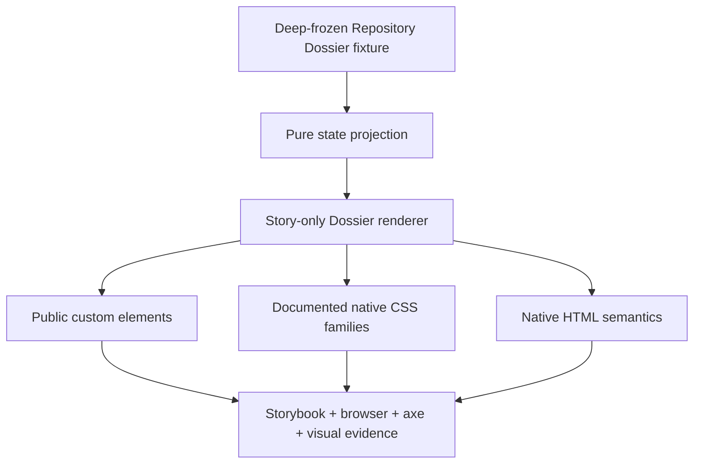

# Implementation Plan: Repository Dossier Pattern Stories

**Mission**: `repository-dossier-pattern-stories-01M22WFQ`  
**Branch / merge target**: `train/elements-first`  
**Spec**: `kitty-specs/repository-dossier-pattern-stories-01M22WFQ/spec.md`  
**Issue**: `spec-kitty/spec-kitty-design#255`

## Summary

Add one Storybook pattern family that proves D1, D2, and D4-D8 from immutable Repository Dossier fixtures, pure display projections, current public elements, documented CSS families, and native HTML. Focused browser assertions, axe, visual baselines, composition-boundary checks, story registration, and consumer documentation make the proof durable. No new component, token, dependency, data contract, or Team Kitty application behavior is introduced.

## Technical Context

**Language/Version**: TypeScript 5, Lit 3, Storybook 10 web components, Node 22 in CI.  
**Primary Dependencies**: existing public `@spec-kitty/elements` exports and `@spec-kitty/styles`; no new package dependency.  
**Storage / services**: none; the fixtures are static authored evidence.  
**Testing**: Playwright Storybook tests in Chromium and Firefox, axe, Vitest/node behavior and mutation gates, visual regression, composition and generated-artifact gates.  
**Target Platform**: repository-supported modern browsers and the static Storybook build.  
**Performance Goals**: stay within the repository Storybook build budget; render performs no I/O, polling, parsing, or timers.  
**Constraints**: zero new public component surface, zero private-root reach, zero page-level horizontal overflow at 390 px and zoom proofs, public token values only.  
**Scale/Scope**: one pattern module, one focused browser test, existing visual/story registries and generated baselines, and one consumer-documentation section.

## Charter Check

- **Tokens first — PASS**: pattern-owned placement uses approved `--sk-*` tokens. No raw visual value or new token is introduced.
- **Semantic pairing — PASS**: foreground/surface and status token pairs remain intact in dark, LightMode, and forced-colors conditions.
- **Public composition — PASS**: only public custom elements, documented native CSS families, `::part` seams already declared public where necessary, and native semantic HTML are consumed. No shadow/private reach is allowed.
- **Naming — PASS**: pattern-owned classes use the `sk-repository-dossier-pattern` BEM block.
- **Accessibility — PASS by design, verified by gates**: headings, landmarks, navigation/lists, progress, time, code, links, buttons, drawer focus/Escape/inert handling, copy feedback, zoom, forced colors, and reduced motion are explicit tests.
- **Theme — PASS**: the default approved dark family includes a required LightMode system proof without presenting D3 as approved product composition.
- **Review — REQUIRED**: an independent Codex review seat inspects the exact final head, findings are fixed, and the verdict is captured before acceptance.
- **Generated artifacts — PASS by process**: repository generators and Playwright own derived registries, reports, and images; they are never hand-authored from assumptions.
- **Delivery — PASS**: one coherent work package, one PR containing `Refs #255`, targeting only `train/elements-first`.

## Project Structure

### Mission artifacts

```text
kitty-specs/repository-dossier-pattern-stories-01M22WFQ/
├── meta.json
├── spec.md
├── plan.md
├── tasks.md
├── wps.yaml
└── tasks/
    └── WP01-repository-dossier-pattern-proof.md
```

### Repository surfaces

```text
packages/elements/src/patterns/
└── repository-dossier.stories.ts

apps/storybook/src/tests/
├── sk-repository-dossier-pattern.spec.ts
├── visual.spec.ts
└── visual.spec.ts-snapshots/       # generated only by Playwright tooling

docs/design-system/using-components.md
expected-stories.json
```

**Structure decision**: Keep the fixture, types, pure projections, pattern renderer, and token-only story layout together in the established pattern directory so nothing is exported as a reusable page component. Put browser behavior and composition assertions beside existing Storybook tests and extend only the established story/visual registries. Add a short ownership note to the existing consumer guide rather than creating a second documentation hierarchy.

## Architecture and Data Flow



The only mutable demonstration state is the D2 consumer-owned drawer boolean. The trigger sets `open`; the story consumes the shell dismissal event, clears `open`, and lets `sk-app-shell` restore focus. Clipboard behavior remains owned by `sk-copy-field`. Every other story render is a pure projection from a recursively frozen fixture.

No projection infers backend truth. In particular, D4's merged value, D6's affected mission, D7's indexing state, and D8's emptiness are supplied facts. Progress labels and values are supplied together; no story computes percentages or status thresholds from repository data.

## Implementation Concern Map

### IC-01 — Immutable fixtures and honest projections

- **Purpose**: establish one source for every repeated repository, branch, SHA, path, mission, state, action, and omission value.
- **Relevant requirements**: FR-003-FR-007, FR-011, FR-012, FR-014; C-006-C-010.
- **Affected surfaces**: `repository-dossier.stories.ts` fixture types, recursive freeze helper, projection functions, and focused consistency tests.
- **Sequencing/depends-on**: none.
- **Risks**: duplicated display literals can conceal drift; inferred values can turn a composition proof into application behavior. Mitigate by accepting fixture-derived projections only and testing identity/omission invariants directly.

### IC-02 — Approved public composition

- **Purpose**: compose D1, D2 closed/open, D4, D5, D6, D7, and D8 with the merged public contracts and native semantics.
- **Relevant requirements**: FR-001-FR-010, FR-015; C-001-C-005.
- **Affected surfaces**: `repository-dossier.stories.ts` markup and token-only `sk-repository-dossier-pattern` layout styles; `using-components.md`.
- **Sequencing/depends-on**: IC-01.
- **Risks**: a convenient page wrapper can become a private component, and CSS can duplicate a component-owned surface. Mitigate by keeping the renderer inside `.stories.ts`, exporting no package API, using documented native families, and running the composition gate/self-test.

### IC-03 — Interaction, resilience, and visual evidence

- **Purpose**: prove controlled drawer and exact-copy behavior plus LightMode, long data, threshold edges, 390 px, zoom, forced-colors, reduced-motion, axe, and visual fidelity.
- **Relevant requirements**: FR-002, FR-008, FR-009, FR-013, FR-014; NFR-001-NFR-009.
- **Affected surfaces**: focused Storybook Playwright spec, `visual.spec.ts`, generated visual baselines, `expected-stories.json`.
- **Sequencing/depends-on**: IC-02.
- **Risks**: visual baselines captured before the final rebase cease to describe merged code. Mitigate by rebasing first, regenerating every derived artifact, then rerunning and reviewing baselines from the exact final PR head.

### IC-04 — Delivery boundary and traceability

- **Purpose**: keep the story proof traceable to #255, verify no public distribution changed, and deliver one reviewable unit.
- **Relevant requirements**: FR-015; NFR-006-NFR-009; C-011-C-012.
- **Affected surfaces**: mission artifacts, generated/package checks, PR review evidence, issue closeout.
- **Sequencing/depends-on**: IC-01-IC-03.
- **Risks**: shared story indexes, snapshots, or ratchets may move with the train. Mitigate through latest-train rebase, regeneration from sources, and exact-head verification before merge.

These concerns form one work package because the stories, immutable fixtures, focused assertions, visual registrations/baselines, and ownership documentation are one coupled proof. Splitting them would create an unverified story PR or a test-only PR that cannot pass independently.

## Verification Strategy

1. Exercise focused Repository Dossier story tests for fixture immutability/consistency, native structure, conditional omissions, controlled drawer focus/Escape/ARIA/inert behavior, and exact copy success/failure in supported Chromium and Firefox projects.
2. Run axe over every registered story and inspect D1, D2, and D4-D8 individually. Check the complete family in default dark, required LightMode, forced colors, reduced motion, 390 px, 200%/400% zoom equivalents, long-data, and threshold-edge conditions.
3. Run the pattern composition gate and self-test, source/style guards, expected-story checks, Storybook build, visual regression, and repository browser suite.
4. Run authored-source tests, mutation/self-test gates, lint/type/build, package graph, manifest/wrapper/Vue/CSS-module generation checks, ratchets, sizes, security, and all required local gates from current repository instructions.
5. Fetch and rebase onto latest `origin/train/elements-first`; regenerate derived artifacts from source and repeat applicable checks on the exact reviewed SHA.
6. Use an independent Codex seat for review. Record every finding and disposition before Spec Kitty accept/merge.

## Delivery Strategy

- Finalize one work package covering IC-01 through IC-04 and open exactly one PR with `Refs #255`.
- Recheck #212/#252, #213, #254, #256, and #257 immediately before final review and merge.
- Never target or merge `main`.
- After Spec Kitty acceptance, merge to `train/elements-first`, run the post-merge mission review, comment exact evidence on #255, close it, check it in #253, and close the epic only after all four children are verified closed.

## Complexity Tracking

No charter exception is requested. The mission adds authored fixture data, pure functions, story-only markup/layout, tests, generated visual evidence, and documentation; it creates no public runtime abstraction.
