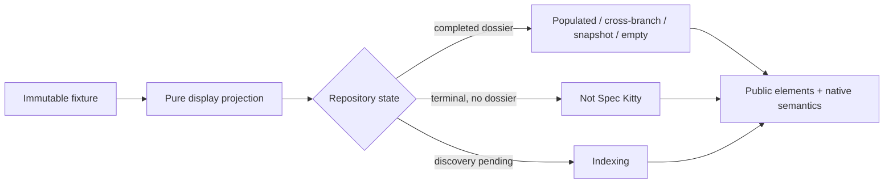

# Mission Specification: Repository Dossier Pattern Stories

**Mission Branch**: `repository-dossier-pattern-stories-01M22WFQ`  
**Target Branch**: `train/elements-first`  
**Created**: 2026-09-09  
**Status**: Draft  
**Input**: GitHub issue `spec-kitty/spec-kitty-design#255`, informed by the approved Repository Dossier D1, D2, and D4-D8 UX artifacts.

## Purpose and evidence

Publish a Storybook-only Repository Dossier pattern family that proves the approved composition with existing public design-system contracts. The stories use immutable fixtures and pure display projections. They do not publish a Repository Dossier component or supply Team Kitty routing, discovery, polling, truth inference, timestamp calculation, progress arithmetic, or command execution.

The live issue and comments are binding. The approved dark screens define composition and UX intent; current `train/elements-first` tokens and public component contracts define implementation. `BACKEND-CAPABILITY-MAP.md` limits the fixture vocabulary to facts an application can honestly supply.

## User Scenarios & Testing

### User Story 1 - Read an honest completed dossier (Priority: P1)

As a repository maintainer, I can inspect a completed Repository Dossier whose repository facts, mission history, branch context, and available actions agree with one immutable source of truth.

**Why this priority**: The populated dossier and its truthful variations are the core pattern the programme exists to prove.

**Independent Test**: Render the populated, cross-branch, affected-mission, and completed-empty stories and assert their headings, facts, status meanings, action availability, and repeated values against their fixture.

**Acceptance Scenarios**:

1. **Given** the D1 completed fixture, **when** the story renders at desktop width in the default dark theme, **then** it presents the approved repository header, facts, mission content, progress, notices, and actions through public components and native semantics.
2. **Given** the D4 cross-branch fixture, **when** the default branch differs from the inspected branch, **then** both branch values remain distinct and the merged fact agrees with the fixture without client-side truth inference.
3. **Given** the D6 affected-mission fixture, **when** a snapshot SHA affects one mission, **then** the warning, SHA, mission status, and supporting context agree without inventing a new status surface.
4. **Given** the D8 completed-empty fixture, **when** no missions exist, **then** the real commit and setup guidance render, while fabricated zero-count rows and progress are absent.

---

### User Story 2 - Navigate and copy at narrow width (Priority: P1)

As a keyboard, screen-reader, or narrow-screen user, I can move through the Dossier and copy exact repository values without losing context or receiving false success feedback.

**Why this priority**: The D2 responsive composition and accessible interaction contracts are required for the pattern to be usable, not optional polish.

**Independent Test**: Render the 390 px closed- and open-drawer stories; operate the compact shell and copy fields with keyboard and pointer input; verify focus, Escape, labels, exact copied values, and result announcements.

**Acceptance Scenarios**:

1. **Given** the narrow D2 story, **when** the controlled drawer is closed or opened, **then** the compact header, context navigation, main landmark, focus handling, inert background, accessible state, and 390 px gutters match the public shell contract without page-level horizontal overflow.
2. **Given** a copyable branch, path, command, or SHA, **when** copying succeeds or fails, **then** the exact displayed value is requested and the stable accessible result region reports only the real outcome.

---

### User Story 3 - Distinguish terminal and pending repository states (Priority: P2)

As a maintainer, I can distinguish a repository that is not a Spec Kitty repository from one whose indexing is still in progress, without being shown unavailable facts or actions.

**Why this priority**: D5 and D7 prevent the pattern from asserting certainty before the application has it.

**Independent Test**: Render the two stories independently and assert that their messages, live/busy semantics, omissions, and actions differ exactly as their fixture state requires.

**Acceptance Scenarios**:

1. **Given** the D5 terminal fixture, **when** the story renders, **then** it shows the supplied terminal explanation but no setup guidance, repository commit fact, or action that requires a completed dossier.
2. **Given** the D7 indexing fixture, **when** the story renders, **then** it preserves a stable notice/live region and busy meaning while omitting facts that are not yet known.
3. **Given** reduced motion is requested for D7, **when** the story renders, **then** no essential state or progress meaning depends on animation.

---

### User Story 4 - Validate the family across system conditions (Priority: P2)

As a design-system maintainer, I can evaluate the Repository Dossier family in light mode, forced colors, long-data stress, the compact-navigation layout threshold, and zoom without treating those proofs as application behavior or a new approved product screen.

**Why this priority**: The family must prove durable public composition beyond a single ideal dark screenshot.

**Independent Test**: Exercise the dedicated proof stories and browser checks at required modes and widths, then compare every approved state individually and as one family.

**Acceptance Scenarios**:

1. **Given** the LightMode proof, **when** the family renders, **then** all content and interactive states use public tokens and remain legible; this does not claim approval of the deferred D3 product composition.
2. **Given** unusually long repository, branch, path, command, or SHA values, **when** rendered at 390 px and 200% or 400% zoom, **then** content wraps or scrolls locally without page-level horizontal overflow or hidden controls.
3. **Given** forced colors, **when** the family renders, **then** status, focus, selected navigation, warnings, and controls retain non-color meaning and visible boundaries.
4. **Given** the same populated fixture immediately around the public compact-navigation boundary, **when** rendered at 860 px and 861 px, **then** the intended shell regions and local gutters change at the documented seam without changing repository truth.

### Edge Cases

- The inspected branch and default branch have the same value; duplicate branch copy must not imply a cross-branch state.
- A completed repository has zero missions; setup guidance is present and fabricated counts, rows, or progress are absent.
- A terminal not-Spec-Kitty state has neither a commit fact nor completed-dossier actions.
- An indexing state has no repository facts yet; the live/busy surface remains stable as the immutable story state is selected.
- Clipboard access rejects; feedback reports failure and never announces success.
- Copyable text contains punctuation, slashes, whitespace, or a full SHA; the requested clipboard value is exact.
- Long unbroken data is evaluated at 390 px and high zoom without causing page-level horizontal overflow.
- The app-shell width sits at 860 px and 861 px around the public compact-navigation boundary.
- Reduced-motion and forced-colors preferences are active simultaneously.

## Requirements

### Functional Requirements

| ID     | Title                         | User Story                                                                                                                                                                    | Priority | Status |
| ------ | ----------------------------- | ----------------------------------------------------------------------------------------------------------------------------------------------------------------------------- | -------- | ------ |
| FR-001 | Populated desktop composition | As a maintainer, I want the approved D1 populated Dossier represented in a default-dark desktop story using public components and native semantics.                           | High     | Open   |
| FR-002 | Narrow drawer composition     | As a narrow-screen user, I want D2 closed- and open-drawer stories at 390 px using the controlled compact app-shell seam.                                                     | High     | Open   |
| FR-003 | Cross-branch truth            | As a maintainer, I want D4 to show inspected branch, default branch, and merged fact exactly as supplied by one immutable fixture.                                            | High     | Open   |
| FR-004 | Not-Spec-Kitty terminal state | As a maintainer, I want D5 to show only the supplied terminal explanation while omitting setup guidance, unavailable commit facts, and completed-dossier actions.             | High     | Open   |
| FR-005 | Affected-mission snapshot     | As a maintainer, I want D6 to associate one supplied snapshot SHA with one supplied affected mission and warning.                                                             | High     | Open   |
| FR-006 | Indexing state                | As a maintainer, I want D7 to expose stable live/busy meaning, omit unknown facts, and work with reduced motion.                                                              | High     | Open   |
| FR-007 | Completed empty state         | As a maintainer, I want D8 to show the real commit and setup guidance without invented zero-count rows or progress.                                                           | High     | Open   |
| FR-008 | Light system proof            | As a system maintainer, I want a required LightMode proof without claiming the deferred D3 product screen is approved.                                                        | Medium   | Open   |
| FR-009 | Exact copy behavior           | As a user, I want public copy fields for exact values with honest success and failure feedback.                                                                               | High     | Open   |
| FR-010 | Native information semantics  | As an assistive-technology user, I want native navigation, lists, links, buttons, code, time, progress, headings, and landmarks where the issue calls for them.               | High     | Open   |
| FR-011 | Immutable fixture consistency | As a reviewer, I want every repeated repository fact, status, action, and omission to derive from one immutable fixture per story.                                            | High     | Open   |
| FR-012 | Pure display projections      | As a library consumer, I want story projections to be deterministic and free of discovery, polling, inference, arithmetic, timestamps, routing, stores, or command execution. | High     | Open   |
| FR-013 | Long-data proof               | As a maintainer, I want stress coverage for long names, branches, paths, commands, and SHAs.                                                                                  | Medium   | Open   |
| FR-014 | Boundary proof                | As a maintainer, I want explicit stories and browser assertions at 860 px and 861 px around the documented compact-navigation layout threshold.                               | Medium   | Open   |
| FR-015 | Pattern documentation         | As a consumer, I want Storybook documentation that identifies this as a composition pattern and states its ownership boundaries.                                              | Medium   | Open   |

### Non-Functional Requirements

| ID      | Title                      | Requirement                                                                                                                                                                       | Category        | Priority | Status |
| ------- | -------------------------- | --------------------------------------------------------------------------------------------------------------------------------------------------------------------------------- | --------------- | -------- | ------ |
| NFR-001 | Browser behavior           | Required behavior checks pass in current repository-supported Chromium and Firefox projects on the reviewed SHA.                                                                  | Compatibility   | High     | Open   |
| NFR-002 | Automated accessibility    | Storybook accessibility checks report zero serious or critical violations for every required state.                                                                               | Accessibility   | High     | Open   |
| NFR-003 | Responsive width           | At a 390 px viewport, each required narrow state has zero page-level horizontal overflow and preserves usable controls and approved gutters.                                      | Accessibility   | High     | Open   |
| NFR-004 | Zoom reflow                | At 200% and 400% zoom equivalents, content remains operable with zero page-level two-dimensional scrolling except local code/data overflow where appropriate.                     | Accessibility   | High     | Open   |
| NFR-005 | Alternate user preferences | Forced-colors and reduced-motion checks preserve all state meaning, focus indication, and operation without reliance on color or motion alone.                                    | Accessibility   | High     | Open   |
| NFR-006 | Visual fidelity            | All seven approved dark states are reviewed individually and as a family against D1, D2, and D4-D8 before baseline approval.                                                      | Quality         | High     | Open   |
| NFR-007 | Mutation adequacy          | All behavior-bearing story helpers introduced by this mission meet the repository mutation threshold, with surviving mutants fixed or justified by the repository gate.           | Testability     | High     | Open   |
| NFR-008 | Derived-artifact integrity | Manifest, wrapper/type, CSS module, story-index, ratchet, size, and build gates either remain byte-clean or contain only generator-produced updates required by authored sources. | Maintainability | High     | Open   |
| NFR-009 | Theme coverage             | The default dark family and required LightMode proof pass the repository visual and accessibility gates on the exact reviewed SHA.                                                | Compatibility   | High     | Open   |

### Constraints

| ID    | Title                      | Constraint                                                                                                                                        | Category      | Priority | Status |
| ----- | -------------------------- | ------------------------------------------------------------------------------------------------------------------------------------------------- | ------------- | -------- | ------ |
| C-001 | Story-only public API      | Publish no new custom element, component, manifest entry, wrapper, or application API.                                                            | Architecture  | High     | Open   |
| C-002 | Forbidden abstractions     | Do not create `sk-mission-row`, `sk-repository-dossier`, a truth/provenance band, or a collection wrapper around native lists.                    | Architecture  | High     | Open   |
| C-003 | No duplicate primitives    | Do not duplicate existing progress, breadcrumb, prose, notice, card, empty-state, branch-chip, tracker, status, or copy primitives.               | Architecture  | High     | Open   |
| C-004 | Public surfaces only       | Compose only documented public design-system contracts; do not reach into shadow DOM or private implementation details.                           | Architecture  | High     | Open   |
| C-005 | Native semantics           | Preserve native elements wherever the issue requires native navigation, lists, links, buttons, code, time, and progress.                          | Accessibility | High     | Open   |
| C-006 | No Team Kitty behavior     | Do not implement routing, stores, repository discovery, polling, truth inference, timestamps, progress arithmetic, or command execution.          | Scope         | High     | Open   |
| C-007 | Immutable evidence         | Use immutable fixtures and pure display selectors; do not present fixture content as a backend contract.                                          | Data          | High     | Open   |
| C-008 | Current train authority    | Current `train/elements-first` tokens and component contracts supersede incidental visual details in approved artifacts.                          | Governance    | High     | Open   |
| C-009 | Approved evidence boundary | D1, D2, and D4-D8 define approved dark compositions; LightMode is a system proof and not D3 product approval.                                     | Design        | High     | Open   |
| C-010 | Integration dependencies   | Use the merged public contracts from issues #150, #176-#178, #210, #212-#214, #254, #256, and #257; do not substitute private temporary versions. | Dependency    | High     | Open   |
| C-011 | One coherent work package  | Keep this story-only architectural boundary in one work package and one PR with `Refs #255`.                                                      | Delivery      | High     | Open   |
| C-012 | Train-only delivery        | Review, accept, and merge only into `train/elements-first`, never `main`.                                                                         | Delivery      | High     | Open   |

### Key Entities

- **Repository Dossier fixture**: Immutable story input containing only supplied repository identity, path, branch, commit, capability, mission, warning, and action-display facts.
- **Repository display projection**: Pure, deterministic presentation values and omission decisions derived from one fixture without application-side acquisition or inference.
- **Dossier state**: One of populated, narrow closed/open, cross-branch, not-Spec-Kitty, affected-mission snapshot, indexing, completed-empty, or a system stress proof.
- **Copy value**: An exact display value delegated to `sk-copy-field`, with feedback determined by the actual clipboard result.

## Success Criteria

### Measurable Outcomes

- **SC-001**: Storybook exports distinct, named stories covering D1, D2 closed, D2 open, D4, D5, D6, D7, and D8, plus LightMode, long-data, forced-colors/reduced-motion, tracker resilience, and 860/861 px layout-threshold proof coverage.
- **SC-002**: Automated fixture-consistency tests cover every repeated repository fact and every conditional omission/action in the seven approved states with no divergence.
- **SC-003**: Chromium and Firefox behavior checks pass for controlled drawer focus/Escape semantics and copy success/failure semantics on the exact reviewed SHA.
- **SC-004**: Axe reports zero serious or critical violations across every required story on the exact reviewed SHA.
- **SC-005**: Required dark and LightMode stories render successfully through the repository Storybook test/build gates.
- **SC-006**: D2 and long-data stories show zero page-level horizontal overflow at 390 px and retain operation at 200% and 400% zoom equivalents.
- **SC-007**: Forced-colors and reduced-motion proofs retain visible focus and non-color/non-motion state meaning.
- **SC-008**: Mutation coverage passes the repository threshold for every introduced behavior-bearing branch.
- **SC-009**: Generated manifests, React wrappers, Vue types, CSS modules, story indexes, ratchets, and size reports are regenerated or verified clean from authored sources.
- **SC-010**: Repository build, lint, type, unit, Storybook, accessibility, visual, and required local gate commands all pass on the exact reviewed SHA.
- **SC-011**: A visual review records individual correspondence for D1, D2, and D4-D8 and a cross-screen family verdict before baseline approval.
- **SC-012**: The final diff contains no new component definition and no Team Kitty application behavior listed in C-006.
