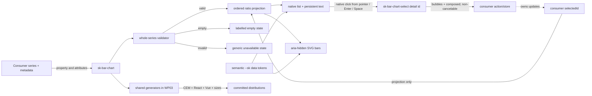

# Implementation Plan: Return-over-time bar chart

**Branch**: `mission/return-over-time-bar-chart` | **Date**: 2026-09-05
**Spec**: `/home/jeroennouws/dev/team-kitty-missions/design-148/kitty-specs/return-over-time-bar-chart-01M1QYBY/spec.md`
**Input**: GitHub issue #148 under epic #144, the approved Team overview capture, and the
completed mission research/data model
**Target**: One pull request into `train/elements-first` with `Refs #148`
**Review tier**: B — three independent profile-loaded Codex lenses post-tasks and pre-merge

## Summary

Add `<sk-bar-chart>` as a controlled, presentational Lit custom element for one ordered readonly
numeric series. The element validates the complete input, derives zero-origin ratios from numeric
values, renders persistent label/value text with supplementary SVG geometry, handles narrow widths
through a same-item horizontal scroller, and optionally emits a typed non-cancelable selection
intent from native buttons. Three reusable data-visualization token aliases support dark/light
themes. The component owns no Team Kitty calculations or application state.

The implementation uses #149's landed generic seam: PR #171 merged as `8e654e8`, and this branch is
rebased onto train `dcf7af2`. The three work packages remain serial, while final shared-output
generation is deferred to WP03 so WP01 can prove the authored property-only element without owning
CEM/React/Vue drift. WP03 proves `series` transport and the frozen-empty removal reset through the
common mechanism rather than a duplicate.

## Technical Context

**Language/Version**: TypeScript 5.x and JavaScript ES modules on Node.js 22; CSS custom properties
**Primary Dependencies**: Lit 3.3, Nx, Storybook, React 19 wrapper consumer, Vue 3/Volar consumer
**Storage**: N/A — immutable consumer input and pure render-time derivation only
**Testing**: Vitest 4 browser/node lanes, ADR-11 behaviour subjects plus mutation harness,
Playwright cross-browser/visual tests, Storybook axe, TypeScript and repository drift/hygiene gates
**Target Platform**: standards-based custom elements in current Chromium, Firefox, and WebKit;
generated ESM/IIFE elements distribution, React wrapper, and Vue declaration
**Project Type**: publishable multi-package web component design system
**Performance Goals**: Storybook build below 180 seconds in CI; no animation or application-scale
runtime target
**Constraints**: token-only authored CSS; one Lit render source; numeric SVG geometry rather than
dynamic inline style; no app state/fetching/routing/formatting; no hand-edited generated outputs
**Scale/Scope**: one chart, one ordered series, eight required stories, seven public parts, three
new semantic token aliases, and the exact API below

## Charter Check

*GATE: passed before design and re-checked after the Phase 1 contract below.*

| Governance obligation | Plan disposition | Result |
|---|---|---|
| Reusable, framework-neutral element | Generic series data and consumer-owned text; no Team Kitty import or domain calculation | PASS |
| Token-only CSS and documented dependencies | Add three semantic aliases in both theme blocks; component CSS contains only `--sk-*` values | PASS |
| One authored source per concern | Lit owns structured rendering; one styles-package CSS file owns presentation; no `.markup.ts` or static HTML for this data-shaped element | PASS |
| WCAG 2.1 AA and non-vacuous story loading | Persistent text/list semantics, native buttons only in selectable mode, all required stories axe-enabled and ratcheted | PASS |
| ADR-11 behaviour and red-first evidence | Register only applicable subjects; pair each with named mutations and add direct source-break probes for non-ADR behaviors | PASS |
| Exact public API documentation | Four documented attributes, one documented property-only field, typed event, zero methods, seven documented/targeted parts | PASS |
| Generated artifact determinism | Reuse landed #171 machinery; generate CEM/React/Vue and SIZES only in WP03, then verify source and packed-consumer checks on the final integrated source | PASS |
| Dark/light and responsive visual conformance | `.sk-light`, 390×844 geometry, cross-browser input, and CI-authoritative cropped baselines are explicit gates | PASS |
| Review cadence | Three Codex lenses post-tasks and at exact-head pre-merge; maximum two passes per point-cut | PASS |
| Human approval | Component and core token changes require current-head maintainer approval before merge | PASS |
| Storybook build budget | Measure in CI and require less than 180 seconds | PASS |
| Deployment boundary | PR targets only `train/elements-first`; no train-to-main, publish, release, or deployment action | PASS |

No charter exception or complexity waiver is required. The operator-confirmed non-cancelable event
is documented in the spec, research, issue, and event contract; it does not evade ADR-11 because
the controlled element has no default state transition for `preventDefault()` to stop.

The `MO-*` identifiers in the specification are mission measurable outcomes. `SC-*` is reserved
exclusively for ADR-11 registry behaviors, preventing apparently valid but semantically mismatched
test evidence. This is a surgical artifact correction, not a codebase terminology migration; the
bulk-edit classifier therefore leaves the mission's additive change mode unchanged.

## Architecture and Boundaries



The solid path inside the element ends at a notification. The dashed return is consumer-owned;
the element never mutates `selectedId`, navigates, fetches, formats money/dates, or retains an
application object.

### Public TypeScript contract

```ts
export type BarDatum = Readonly<{
  id: string;
  label: string;
  value: number;
  displayValue: string;
}>;

export type BarChartSelectDetail = Readonly<{ id: string }>;

export class SkBarChart extends LitElement {
  static properties = {
    series: { attribute: false },
    label: { type: String },
    description: { type: String },
    selectable: { type: Boolean, reflect: true },
    selectedId: { type: String, attribute: 'selected-id' },
  };

  series: ReadonlyArray<BarDatum>;
  label: string;
  description: string;
  selectable: boolean;
  selectedId: string;
}
```

- `series` initializes to a frozen empty array, is compared/replaced by identity, and has no
  attribute representation. The landed #171 generators project it into React and Vue declarations,
  and the React production hook supplies removal reset with a fresh frozen empty array.
- `label` defaults to `Bar chart`; `description` and `selectedId` default to the empty string;
  `selectable` defaults to `false`.
- The final CEM/docs ratchet records four attributes, one property-only public field, and zero
  methods; the generated Vue declaration preserves that property-only field.
- `sk-bar-chart-select` carries exact readonly `{ id: string }` detail with `bubbles: true`,
  `composed: true`, and `cancelable: false`.

### Validation and render model

`validateSeries(value)` returns exactly one immutable discriminant:

```text
[] or default          -> empty
not an array           -> invalid(shape)
record not an object   -> invalid(shape)
blank/duplicate id     -> invalid(id)
blank label            -> invalid(label)
non-number, NaN,
infinite or negative   -> invalid(value)
blank displayValue     -> invalid(display-value)
otherwise              -> valid(data, maximum)
```

Validation is all-or-nothing: invalid data never leaves partial or stale bars, selection, or
targets. It preserves consumer objects and order. For valid data, each ratio is
`maximum === 0 ? 0 : value / maximum`; formatted text never contributes to geometry.

The plot uses a fixed `viewBox="0 0 100 100"`. Each bar rect receives numeric SVG attributes
`y = 100 - ratio * 100` and `height = ratio * 100`; SVG geometry is `aria-hidden` because the
adjacent native list text owns the accessible meaning. A baseline and restrained grid are
decorative geometry, while every datum's `label` and `displayValue` remain visible at ratio zero.

### Selection and responsive behavior

- Presentational mode renders no buttons, tab stops, pressed states, hover affordance, or events.
- Selectable mode renders one native `button type="button"` per datum. Its click handler is the
  only dispatch path. A non-dispatching `keydown` guard prevents the default action for repeated
  Enter/Space keydowns, because Chromium can synthesize repeated clicks for held Enter; the first
  non-repeat native activation remains untouched.
- `aria-pressed` reflects only `selectable && datum.id === selectedId`. An unknown/removed ID
  selects nothing. Dispatch never writes `selectedId`.
- Visible focus uses `--sk-border-focus`; selected state combines border/shape with programmatic
  state and never relies on hue alone. Reduced-motion has no required animation.
- The plot owns horizontal overflow. Each fixed-minimum-width item contains its value, SVG bar,
  and wrapping full label; no viewport-level horizontal overflow or cross-item hit target is
  permitted at 390×844.

### Styling contract

Add these reusable aliases to both token theme blocks:

| Token | Default alias | Light alias | Role |
|---|---|---|---|
| `--sk-color-data-series-primary` | `var(--sk-on-tint-sky)` | `var(--sk-on-tint-sky)` | Primary single-series bar ink |
| `--sk-color-data-grid` | `var(--sk-border-default)` | `var(--sk-border-default)` | Restrained guidance lines |
| `--sk-color-data-baseline` | `var(--sk-fg-subtle)` | `var(--sk-fg-subtle)` | Stronger zero-origin reference |

Aliases are explicitly present in both theme blocks so the catalogue and theme assertions make
the intended semantic surface visible even though their targets already vary by theme. Gold is
reserved for focus via the existing focus token.

The public part surface is frozen at seven names:

| Part | Stable responsibility |
|---|---|
| `chart` | Named chart figure/root |
| `plot` | Bounded horizontal scroller and plot region |
| `item` | One datum ownership boundary |
| `bar` | Supplementary geometric bar |
| `value` | Persistent formatted value |
| `label` | Persistent category label |
| `empty-state` | Empty and unavailable state surface |

Decorative grid/baseline nodes and private BEM classes are intentionally not public parts. Token
dependencies and all seven parts are documented in the element JSDoc and Storybook docs.

## Project Structure

### Documentation (this mission)

```text
kitty-specs/return-over-time-bar-chart-01M1QYBY/
├── spec.md
├── plan.md
├── research.md
├── data-model.md
├── research/
│   ├── source-register.csv
│   └── evidence-log.csv
├── tasks.md
├── issue-matrix.json
└── acceptance-matrix.json
```

No separate `contracts/` or `quickstart.md` is needed: the complete public interface and state
table are already fixed in this plan and `data-model.md`; duplicating them would create drift.

### Authored source and evidence

```text
packages/tokens/src/tokens.css
packages/styles/src/
└── bar-chart/
    └── sk-bar-chart.css
packages/styles/package.json
packages/elements/src/
├── index.ts
├── elements.ts
└── bar-chart/
    ├── sk-bar-chart.ts
    └── sk-bar-chart.stories.ts
fixtures/elements-behaviour/src/sk-bar-chart.test.ts
fixtures/react-consumer/src/sk-bar-chart.test.tsx
fixtures/vue-consumer/src/
├── Good.vue
├── types.test-d.ts
└── vue-interop.test.ts
packages/react/type-tests/wrappers.type-test.tsx
apps/storybook/src/tests/
├── sk-bar-chart.spec.ts
├── visual.spec.ts
└── visual.spec.ts-snapshots/
behaviours.json
mutations.json
expected-parts.json
expected-docs.json
expected-stories.json
CHANGELOG.md
docs/
```

### Generated shared outputs

```text
packages/elements/src/bar-chart/sk-bar-chart.css.js
packages/elements/src/bar-chart/sk-bar-chart.css.d.ts
packages/elements/custom-elements.json
packages/react/src/**
packages/react/.wrapper-floor
packages/elements/vue.d.ts
packages/tokens/dist/token-catalogue.json
packages/elements/SIZES.md
```

The implementation never hand-edits generated outputs. `packages/styles/src/bar-chart/` has no
static `.html` or component barrel because this structured-data element has no truthful static
form; `packages/styles/package.json` still exposes `./bar-chart/*` so the CSS source participates
in the existing styles distribution.

**Structure Decision**: Extend the existing token/styles/elements/react packages, generated Vue
declaration, and root ratchets. Keep authored bar-chart files in new component directories; append
the element to both guarded distribution entries. Reuse current React/Vue consumer fixtures,
Storybook, and test lanes instead of creating a new package, renderer, chart dependency, or app
surface.

## Required Stories and Fixtures

| Story | Distinct proof |
|---|---|
| `Default` | 320/510/440/604, `Aug 11`–`Sep 1`, exact ratios and approved cool-blue appearance |
| `CloseValues` | 510 and 570 remain visibly and numerically distinct |
| `ZeroValues` | zero/equal/all-zero cases retain text and baseline |
| `Empty` | labelled empty state, zero geometry/targets |
| `LongLabels` | full date-stamped labels, bounded scroll at narrow width |
| `ControlledSelection` | external story state applies emitted ID back through `selectedId` |
| `SelectableStates` | presentational and rest/hover/focus/pressed/selected states are inspectable |
| `LightMode` | `.sk-light`, identical semantics, different computed data tokens |

All eight Storybook IDs are added to `expected-stories.json`, every story enables axe, and no
story owns hidden app/domain state beyond the minimal local controlled-selection demonstration.
`ControlledSelection` also calls a `storybook/test` action spy for every emitted intent so the
Actions panel requirement is observable without adding a dependency. The approved screenshot hash remains
`ca08a0cbe1120233a1619d6b58da1bc2b84e3b9edeea41aff24a151321dbef04` (1123×1600); visual
baselines crop the component rather than attempting to reproduce the out-of-scope card/legend.
The named Stitch screen remains the durable authority. At final disposition, reacquire “Team
overview — final review v4 approved,” verify the capture/hash when retrievable, and block rather
than claim visual approval if neither the named source nor an authenticated attachment is available.

## Verification Design

### ADR-11 registered subjects

`sk-bar-chart` is registered in `behaviours.json` with
`fixtures/elements-behaviour/src/sk-bar-chart.test.ts` for:

- SC-006: one event per activation;
- SC-007: exact `{ id }` detail;
- SC-008: bubbling/composed shadow-boundary delivery;
- SC-010: pre-upgrade property assignment reaches first render;
- SC-013: all seven declared parts exist and are externally targetable;
- SC-014: exactly one sheet is adopted, and that sheet is the generated bar-chart sheet by
  identity.

SC-009 is intentionally absent because the event is non-cancelable. SC-012 is not claimed: native
button activation is verified directly in real browsers, while that registry ID's contract is the
component-owned Escape/focus behavior that this chart does not implement. WP01 registers four
mutations across its three pairs: one SC-010 arm, one SC-013 arm, and two independent SC-014 arms
that break adopted-sheet length and generated-sheet identity respectively. WP02 adds one arm for
each of SC-006/007/008. Run the slow suite, and do not raise the 560-second selftest ceiling without
a new CI measurement that justifies it.

`react-bar-chart` is independently registered with
`fixtures/react-consumer/src/sk-bar-chart.test.tsx` for SC-006 (one callback delivery) and SC-010
(property delivery before definition and on replacement/removal). Each pair has a bar-specific
wrapper mutation; unrelated tests in the shared legacy wrapper fixture cannot certify it. The
projected final registry therefore contains nine bar-chart mutations: seven element arms across
six pairs plus two React arms.

### Direct component and browser proofs

- Unit/browser fixture: complete validation table, immutable/order preservation, exact ratios,
  equal/zero/close/extreme-range values, display-only changes, empty/unavailable replacement, controlled selected
  projection, no presentational interactivity, property replacement/removal, event flags/count.
- React runtime/type fixtures: readonly series assignment/replacement/removal through the production
  hook; `selectable`/`selectedId`; typed callback detail; `@ts-expect-error` malformed datum and
  nonexistent detail member.
- Vue source and packed fixtures: generated `packages/elements/vue.d.ts` exposes `series` without an
  attribute surrogate; `Good.vue` and `types.test-d.ts` exercise the readonly shape, and the existing
  Vue runtime fixture proves property transport. Extend `scripts/check-vue-packed-types.mjs` while
  preserving #149 coverage so its real-tarball consumer, with source path aliases disabled, indexes
  `GlobalComponents['sk-bar-chart']` instance `$props.series`, accepts the readonly datum shape, and
  uses load-bearing malformed negative cases that fail if the type disappears or widens.
- Playwright on Chromium/Firefox/WebKit: pointer/Enter/Space equivalence and held-key repeat
  suppression; accessible name/description/list/buttons and SVG announcement suppression; zero
  presentational tab stops; real rest/hover/focus/pointer-active/selected/nonselectable computed
  visual deltas; reduced motion; exact 390×844 ownership/overflow geometry before and after scroll;
  semantic series/grid/baseline token bindings; no console errors.
- Axe: every required story must load non-empty and report zero WCAG 2.1 AA violations.
- Visual: CI-authoritative Chromium crops for approved dark, LightMode, narrow, zero/empty, and
  selectable states, each explicitly disposed against the approved capture.
- Direct red-first probes outside the ADR registry: proportional calculation, whole-series
  fail-closed validation, controlled non-mutation, semantic token bindings/`.sk-light` resolution,
  reduced motion, and narrow item ownership. Each invariant remains a deterministic standing
  Vitest/Playwright assertion in CI; record the exact temporary source mutation, failing command,
  named failing assertion/output, restoration, and green rerun instead of mislabelling it with an
  ADR `SC-*` ID.
- Formal conformance-matrix row: recheck #112 at final integration. If its artifact then exists,
  add and test #148's row; otherwise record the verified open-state deferral while updating the
  current behavior/mutation/parts/docs/story ratchets truthfully.

### Final repository gate sequence

Before WP01 is first claimed, the orchestrator fetches `origin`, checks out and requires a clean
planning target `mission/return-over-time-bar-chart`, rebases that target onto the latest
`origin/train/elements-first`, normalizes the human-authored planning range to a small conventional
history accepted by the repository's commitlint policy, and reruns
`spec-kitty agent mission finalize-tasks --mission return-over-time-bar-chart-01M1QYBY --json` so
`lanes.json.planning_commit_sha` belongs to the final pre-execution lineage. It then uses the normal canonical
action, `spec-kitty agent action implement WP01 --mission return-over-time-bar-chart-01M1QYBY
--agent <dispatched-agent>`. Do not substitute compatibility `spec-kitty implement --base`: the
canonical action creates fresh `lane-a` from the updated target/default mission lineage.

WP01, WP02, and WP03 are one serial execution lane. They reuse
`.worktrees/return-over-time-bar-chart-01M1QYBY-lane-a` on
`kitty/mission-return-over-time-bar-chart-01M1QYBY-lane-a`; approved WP01/WP02 work is not
consolidated into internal mission branch `kitty/mission-return-over-time-bar-chart-01M1QYBY`
between packages. Lane→mission→planning-target consolidation happens only through the supported
merge workflow. Do not rebase that lane after execution begins: Spec Kitty 3.2.6rc4 records and
reuses the finalized `planning_commit_sha`, then freezes it once execution state exists. Rewriting
the lane mid-mission would make that recorded commit stale and cannot be repaired by re-finalizing.
If train advances while WP01–WP03 run, leave the serial lane on its verified pre-execution base and
complete the packages in order.

Before WP03 is claimed, the orchestrator runs the read-only command
`spec-kitty orchestrator-api resolve-workspace --mission return-over-time-bar-chart-01M1QYBY --wp
WP03` and verifies the returned workspace is the existing clean `lane-a`, still contains the
recorded planning commit and #171 merge `8e654e8`, and retains the approved WP01/WP02 content. The
worker does not rebase, cherry-pick, or update either integration branch.

WP03 regenerates and commits all final outputs before running drift checks. Every command below is
mandatory local/CI parity evidence; a green subset is not sufficient. Run the full sequence in the
reused lane. After supported lane→mission→planning-target consolidation creates the actual PR head,
the orchestrator fetches `origin`, rebases the clean target onto latest
`origin/train/elements-first`, regenerates and commits every shared output from its authoritative
source, then reruns the same complete sequence on that exact clean target head before final CI,
visual, squad, or maintainer evidence. Tree equivalence or earlier lane evidence cannot substitute
for the exact-target-head run. If train advances again before acceptance, repeat this final-target
rebase, regeneration, and full gate sequence:

```bash
set -euo pipefail

# Security and workflow integrity.
bash scripts/npm-audit-gate.sh
npm ci --dry-run --ignore-scripts
bash scripts/check-action-pins.sh

# Generate every relevant committed artifact.
node scripts/build-elements-css.mjs
node scripts/build-element-markup.mjs
node scripts/build-styles-only-markup.mjs
npx nx run elements:analyze
node scripts/build-react-wrappers.mjs
node scripts/build-vue-types.mjs
npx nx run tokens:catalogue

# Derive the real publishable build set; an empty set is a hard failure.
PUBLISHABLE_PROJECTS="$(node scripts/release-graph.mjs --projects)"
[ -n "$PUBLISHABLE_PROJECTS" ] || { echo "ERROR: empty publishable build set"; exit 1; }
npx nx run-many --target=build --projects="$PUBLISHABLE_PROJECTS"
node scripts/measure-elements-sizes.mjs

# After committing the generated outputs, prove drift and catalogue content.
node scripts/build-elements-css.mjs --check
node scripts/build-element-markup.mjs --check
node scripts/build-styles-only-markup.mjs --check
node scripts/build-react-wrappers.mjs --check
node scripts/build-vue-types.mjs --check
npx nx run elements:analyze
git diff --exit-code -- packages/elements/custom-elements.json
node scripts/measure-elements-sizes.mjs --check
node -e "const c=require('./packages/tokens/dist/token-catalogue.json'); const t=new Set(Object.values(c.categories).flatMap(x=>x.tokens)); for(const n of ['--sk-color-data-series-primary','--sk-color-data-grid','--sk-color-data-baseline']) if(!t.has(n)) throw new Error('token catalogue missing '+n)"
bash scripts/check-token-breaking-changes.sh

# Content, boundary, selftest, type, and wiring gates.
node scripts/check-manifest-content.mjs
node scripts/check-manifest-content.mjs --selftest
node scripts/check-no-css-in-source.mjs
node scripts/check-elements-entries.mjs --selftest
node scripts/check-elements-entries.mjs
node scripts/check-adopted-css-boundaries.mjs --selftest
node scripts/check-adopted-css-boundaries.mjs
node scripts/check-element-css-hygiene.mjs
node scripts/check-part-ratchet.mjs
node scripts/check-story-theme-wrapper.mjs --selftest
node scripts/check-story-theme-wrapper.mjs
node scripts/build-react-wrappers.mjs --selftest
node scripts/check-gate-wiring.mjs
node scripts/check-vue-template-types.mjs
node scripts/typecheck-all.mjs
npm run quality:all
npx commitlint --from="$(git merge-base HEAD origin/train/elements-first)" --to=HEAD

# Built-package/release/offline gates; packed Vue runs only after the derived build.
node scripts/check-release-graph.mjs --selftest
node scripts/check-release-graph.mjs
node scripts/check-vue-packed-types.mjs
node scripts/check-offline-load.mjs --selftest
node scripts/check-offline-load.mjs

# Timed behavior and red-first mutation gates.
node scripts/measure-suite-time.mjs
node scripts/suite-selftest.mjs
node scripts/suite-selftest.mjs --selftest

# Storybook, non-vacuous accessibility, and nonvisual cross-browser Playwright.
npx nx run storybook:storybook:build
bash scripts/assemble-demo-dist.sh apps/storybook/storybook-static
node scripts/gate-selftest.mjs
node scripts/run-axe-storybook.js
npx playwright test
```

The token catalogue generator embeds generation time, so it is run once after the token source
change and committed; the exact three-name catalogue assertion and breaking-change check above are
its final verification rather than a fictitious `--check` mode. The sequence deliberately excludes
local visual snapshot acceptance before authoritative Linux bytes exist. Before opening/finalizing
the PR, both the lane run and the post-consolidation, latest-train target-head rerun must be clean after generated
artifacts are committed. If the target-head rerun creates or changes bytes, commit through the
authorized target workflow and rerun the entire sequence at the new head. A missing-baseline CI run
supplies the authoritative actual bytes; after visual review, commit those exact bytes under
`visual.spec.ts-snapshots/`, push, and require fresh green CI on the new head. Query the final
Actions job's `Storybook build` step timestamps and reject acceptance at 180 seconds or more. The
pre-merge squad comment names the exact final SHA, all three profile IDs,
verdicts/findings/dispositions, and a current-head maintainer approval is mandatory.

## Implementation Concern Map

### IC-01 — Semantic data-visualization tokens

- **Purpose**: Establish reusable, theme-aware series/grid/baseline roles without raw colors or
  component-named tokens.
- **Relevant requirements**: FR-017, FR-018, FR-024; NFR-005, NFR-010; C-005.
- **Affected surfaces**: `packages/tokens/src/tokens.css`, token catalogue, token tests/docs.
- **Sequencing/depends-on**: none.
- **Risks**: accidental light-theme contrast failure, gold misuse, inert cross-shadow selectors,
  or semantically redundant names.

### IC-02 — Validation and proportional render model

- **Purpose**: Turn untrusted property input into an ordered all-or-nothing render result and exact
  zero-origin SVG geometry.
- **Relevant requirements**: FR-001–FR-010, FR-024; NFR-003; C-001, C-002, C-004, C-005.
- **Affected surfaces**: `packages/elements/src/bar-chart/sk-bar-chart.ts`, element fixture.
- **Sequencing/depends-on**: IC-01 for styling only; validation/geometry logic is independent.
- **Risks**: mutation of consumer data, partial invalid renders, stale bars after replacement,
  formatted-value parsing, or all-zero division.

### IC-03 — Accessible and responsive presentation

- **Purpose**: Preserve label/value ownership and assistive meaning across themes and narrow hosts.
- **Relevant requirements**: FR-006–FR-009, FR-015–FR-021; NFR-001, NFR-004, NFR-005, NFR-010.
- **Affected surfaces**: styles CSS, element template, stories, Storybook/Playwright tests,
  `expected-parts.json`, `expected-stories.json`.
- **Sequencing/depends-on**: IC-01 and IC-02.
- **Risks**: duplicated screen-reader announcements, detached labels, viewport overflow, color-only
  state, missing/untargetable parts, or a visually dark LightMode story.

### IC-04 — Controlled selection intent

- **Purpose**: Offer opt-in native activation while keeping selected state and actions with the
  consumer.
- **Relevant requirements**: FR-011–FR-015, FR-024; NFR-002, NFR-006; C-001.
- **Affected surfaces**: element, controlled/state stories, element and Playwright fixtures,
  `behaviours.json`, `mutations.json`.
- **Sequencing/depends-on**: IC-02; combines with IC-03's focus/selected styling.
- **Risks**: double dispatch from manual key handlers, accidental internal state, event from stale
  data, or falsely claiming cancelability/SC-009.

### IC-05 — Distribution, React, and Vue integration

- **Purpose**: Publish the exact element/property types across ESM/IIFE/CEM/React/Vue, retain the
  typed event in CEM/React, and prove the structured property lifecycle through both source and
  packed consumer seams.
- **Relevant requirements**: FR-002, FR-003, FR-014, FR-020, FR-022, FR-023; NFR-007; C-007, C-008.
- **Affected surfaces**: generated CEM/React/Vue/wrapper floor/SIZES, `expected-docs.json`, React
  consumer/type tests, Vue SFC/type/runtime fixtures, and the packed-consumer gate.
- **Sequencing/depends-on**: IC-02–IC-04 on the unchanged reused serial lane; latest-train refresh
  occurs only on the consolidated target after all WPs are approved.
- **Risks**: losing the property-only field from CEM or Vue, `any` detail, stale series on React
  prop removal, source-path aliases hiding a broken tarball, or shared generated conflicts.

### IC-06 — Exact-head production gate evidence

- **Purpose**: Make local/CI/visual/review evidence correspond to the same integrated PR head.
- **Relevant requirements**: FR-021, FR-022, FR-024; NFR-001, NFR-006–NFR-010; C-008–C-011.
- **Affected surfaces**: all mission files, PR body/comments/checks, CI artifacts.
- **Sequencing/depends-on**: all prior concerns, the recorded #171/current-train seam, and supported
  lane→mission→planning-target consolidation.
- **Risks**: treating lane evidence or tree equivalence as exact-target-head evidence, stale squad
  evidence after a fix/branch refresh, locally generated visual baselines treated as authority,
  dirty shared outputs, missing maintainer approval, or unauthorized train-to-main work.

## Delivery Slices

Task authoring should produce three serial, independently reviewable work packages from the
recorded planning base (`#171` merge `8e654e8`, train `dcf7af2`):

1. **Token and core element contract** — IC-01/IC-02 plus element-level red-first tests: semantic
   tokens, validation, exact scale, persistent semantics, empty/invalid states, entries, generated
   CSS sheet, `expected-parts`, and four WP01 mutation arms. It owns no CEM/React/Vue,
   `expected-docs`, or SIZES reconciliation.
2. **Interaction, responsive stories, and browser evidence** — IC-03/IC-04: controlled native
   selection, interaction styling, stories/event ratchets, cross-browser accessibility/theme/narrow
   tests, initial visual fixtures, and regenerated/checked CSS JS/declaration after the final
   authored interaction-CSS change.
3. **Generated integration and final target gates** — IC-05/IC-06: verify the unchanged reused
   lane; regenerate CEM/React/Vue and SIZES; update
   `expected-docs`; prove React runtime/types plus Vue source-SFC, property/runtime, and packed
   types; complete lane gates; then require the orchestrator's full exact-target-head gate rerun,
   CI baseline disposition, exact-head squad, and PR readiness.

WP01 has no remaining external prerequisite and is independently reviewable because WP03 alone
owns the intentionally deferred shared CEM/React/Vue/docs/SIZES reconciliation. WP02 depends only
on WP01, and WP03 depends only on WP02; the dependency chain remains acyclic and serial.

## Requirement Traceability

| Requirement group | Primary concerns | Required evidence |
|---|---|---|
| Generic input, validation, order, scale, empty/invalid (`FR-001`–`FR-010`) | IC-02 | Element fixture plus direct red-first probes |
| Controlled interaction and event (`FR-011`–`FR-015`, `NFR-002`) | IC-04 | ADR subjects/mutations and cross-browser real input |
| Responsive/theme/tokens/parts/stories (`FR-016`–`FR-021`) | IC-01, IC-03 | Ratchets, axe, computed styles, geometry, CI visual crops |
| Generated React/Vue delivery (`FR-022`, `FR-023`, `NFR-007`) | IC-05 | Generator checks, CEM assertions, React runtime/type tests, Vue source-SFC/type/runtime and packed-consumer checks |
| Source-break, gate, visual, review readiness (`FR-024`, `NFR-008`–`NFR-010`) | IC-06 | Slow mutation suite, complete gate transcript, exact-SHA squad/CI/approval |
| Architecture/delivery constraints (`C-001`–`C-011`) | all | Diff audit, clean tree, base/head checks, PR evidence |

## Risks and Mitigations

| Risk | Mitigation / decision point |
|---|---|
| Train advances after recorded planning base `dcf7af2` | Do not rewrite the execution lane: 3.2.6rc4 freezes `planning_commit_sha` after execution starts. Complete WP01–WP03 on the unchanged serial lane; after supported consolidation, rebase the clean target onto latest train, regenerate all shared outputs, and rerun every gate and exact-head review. Repeat if train moves again. |
| New semantic tokens fail light mode | Alias themed semantic targets in both blocks; assert computed dark/light difference and contrast before visual review. |
| Native buttons distort chart geometry | Keep one ownership item per datum and style the button as the full item only in selectable mode; geometry tests cover both modes. |
| Invalid replacement leaks stale UI | Recompute discriminant every render and assert valid→invalid→valid replacement with zero intermediate targets. |
| Mutation suite breaches 560 seconds | Keep nine truthful mutations: seven element arms across six pairs (SC-014 needs separate length and identity arms) plus two dedicated React arms; use direct probes for other invariants and require CI evidence before any budget edit. |
| Screenshot encourages extra deployment series | Crop only the four blue bars and exclude deployment dots/counts/legend per RD-005 and C-002. |
| Public part surface becomes accidental API | Freeze only the seven structural parts above; leave decorative/internal nodes private. |
| Generated source conflicts after serial work | Keep CEM/React/Vue/expected-docs/SIZES ownership in WP03, regenerate from final authored sources once, and rerun drift checks and exact-head reviews. |

## Complexity Tracking

No charter violations or additional architectural mechanisms are proposed. The mission adds no
charting dependency, state store, formatter callback, static duplicate, application component, or
new test lane. The operator's specific one-child-issue/one-design-mission-PR instruction governs
this explicitly scoped `spec-kitty-design` checkout over the Team Kitty SaaS workspace's general
WP-per-PR convention. The former external dependency is satisfied by #171 merge `8e654e8` on the
recorded train base `dcf7af2`.
