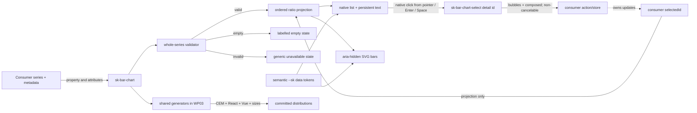

# Implementation Plan: Return-over-time bar chart

**Branch**: `mission/return-over-time-bar-chart` | **Date**: 2026-09-05
**Spec**: `/home/jeroennouws/dev/team-kitty-missions/design-148/kitty-specs/return-over-time-bar-chart-01M1QYBY/spec.md`
**Input**: GitHub issue #148 under epic #144, the approved Team overview capture, and the
completed mission research/data model
**Target**: One pull request into `train/elements-first` with `Refs #148`
**Review tier**: B — three independent profile-loaded Codex lenses post-tasks and pre-merge

## Summary

Add `<sk-bar-chart>` as a controlled, presentational Lit custom element for one ordered readonly
numeric series. The element validates the complete input, derives zero-origin ratios from numeric
values, renders persistent label/value text with supplementary SVG geometry, handles narrow widths
through a same-item horizontal scroller, and optionally emits a typed non-cancelable selection
intent from native buttons. Three reusable data-visualization token aliases support dark/light
themes. The component owns no Team Kitty calculations or application state.

The implementation uses #149's landed generic seam: PR #171 merged as `8e654e8`, and this branch is
rebased onto train `0fde2ab`. Two active work packages remain serial: WP01 owns the complete authored
component, controlled interaction, stories, and browser evidence without sharing files with its
dependent; WP03 alone owns behavior/mutation registry integration and final generated outputs.
WP03 proves `series` transport and the frozen-empty removal reset through the common mechanism
rather than a duplicate.

## Technical Context

**Language/Version**: TypeScript 5.x and JavaScript ES modules on Node.js 22; CSS custom properties
**Primary Dependencies**: Lit 3.3, Nx, Storybook, React 19 wrapper consumer, Vue 3/Volar consumer
**Storage**: N/A — immutable consumer input and pure render-time derivation only
**Testing**: Vitest 4 browser/node lanes, ADR-11 behaviour subjects plus mutation harness,
Playwright Chromium/Firefox lane checks and exact-head Chromium/Firefox/WebKit CI, Storybook axe,
TypeScript and repository drift/hygiene gates
**Target Platform**: standards-based custom elements in current Chromium, Firefox, and WebKit;
generated ESM/IIFE elements distribution, React wrapper, and Vue declaration
**Project Type**: publishable multi-package web component design system
**Performance Goals**: Storybook build below 180 seconds in CI; no animation or application-scale
runtime target
**Constraints**: token-only authored CSS; one Lit render source; numeric SVG geometry rather than
dynamic inline style; no app state/fetching/routing/formatting; no hand-edited generated outputs
**Scale/Scope**: one chart, one ordered series, eight required stories, seven public parts, three
new semantic token aliases, and the exact API below

## Charter Check

*GATE: passed before design and re-checked after the Phase 1 contract below.*

| Governance obligation | Plan disposition | Result |
|---|---|---|
| Reusable, framework-neutral element | Generic series data and consumer-owned text; no Team Kitty import or domain calculation | PASS |
| Token-only CSS and documented dependencies | Add three semantic aliases in both theme blocks; component CSS contains only `--sk-*` values | PASS |
| One authored source per concern | Lit owns structured rendering; one styles-package CSS file owns presentation; no `.markup.ts` or static HTML for this data-shaped element | PASS |
| WCAG 2.1 AA and non-vacuous story loading | Persistent text/list semantics, native buttons only in selectable mode, all required stories axe-enabled and ratcheted | PASS |
| ADR-11 behaviour and red-first evidence | Register only applicable subjects; pair each with named mutations and add direct source-break probes for non-ADR behaviors | PASS |
| Exact public API documentation | Four documented attributes, one documented property-only field, typed event, zero methods, seven documented/targeted parts | PASS |
| Generated artifact determinism | Reuse landed #171 machinery; generate CEM/React/Vue and SIZES only in WP03, then verify source and packed-consumer checks on the final integrated source | PASS |
| Dark/light and responsive visual conformance | Exact semantic-signature parity, forced-colors recoverability, `.sk-light`, 390×844 geometry, lifecycle-owned cross-browser input, and CI-authoritative cropped baselines are explicit gates | PASS |
| Review cadence | Three Codex lenses post-tasks and at exact-head pre-merge; maximum two passes per point-cut | PASS |
| Human approval | Component and core token changes require current-head maintainer approval before merge | PASS |
| Storybook build budget | Add one self-tested fail-closed wrapper that kills the build and exits nonzero at 180 seconds; require both local and CI Storybook builds to use it | PASS |
| Deployment boundary | PR targets only `train/elements-first`; no train-to-main, publish, release, or deployment action | PASS |

No charter exception or complexity waiver is required. The operator-confirmed non-cancelable event
is documented in the spec, research, issue, and event contract; it does not evade ADR-11 because
the controlled element has no default state transition for `preventDefault()` to stop.

The `MO-*` identifiers in the specification are mission measurable outcomes. `SC-*` is reserved
exclusively for ADR-11 registry behaviors, preventing apparently valid but semantically mismatched
test evidence. This is a surgical artifact correction, not a codebase terminology migration; the
bulk-edit classifier therefore leaves the mission's additive change mode unchanged.

## Architecture and Boundaries



The solid path inside the element ends at a notification. The dashed return is consumer-owned;
the element never mutates `selectedId`, navigates, fetches, formats money/dates, or retains an
application object.

### Public TypeScript contract

```ts
export type BarDatum = Readonly<{
  id: string;
  label: string;
  value: number;
  displayValue: string;
}>;

export type BarChartSelectDetail = Readonly<{ id: string }>;

export class SkBarChart extends LitElement {
  static properties = {
    series: { attribute: false },
    label: { type: String },
    description: { type: String },
    selectable: { type: Boolean, reflect: true },
    selectedId: { type: String, attribute: 'selected-id' },
  };

  series: ReadonlyArray<BarDatum>;
  label: string;
  description: string;
  selectable: boolean;
  selectedId: string;
}
```

- `series` initializes to a frozen empty array, is compared/replaced by identity, and has no
  attribute representation. The landed #171 generators project it into React and Vue declarations,
  and the React production hook supplies removal reset with a fresh frozen empty array.
- `label` defaults to `Bar chart`; `description` and `selectedId` default to the empty string;
  `selectable` defaults to `false`.
- The final CEM/docs ratchet records four attributes, one property-only public field, and zero
  methods; the generated Vue declaration preserves that property-only field.
- `sk-bar-chart-select` carries exact readonly `{ id: string }` detail with `bubbles: true`,
  `composed: true`, and `cancelable: false`.

### Validation and render model

`validateSeries(value)` returns exactly one immutable discriminant:

```text
[] or default          -> empty
not an array           -> invalid(shape)
record not an object   -> invalid(shape)
blank/duplicate id     -> invalid(id)
blank label            -> invalid(label)
non-number, NaN,
infinite or negative   -> invalid(value)
blank displayValue     -> invalid(display-value)
otherwise              -> valid(data, maximum)
```

Validation is all-or-nothing: invalid data never leaves partial or stale bars, selection, or
targets. It preserves consumer objects and order. For valid data, each ratio is
`maximum === 0 ? 0 : value / maximum`; formatted text never contributes to geometry.

The plot uses a fixed `viewBox="0 0 100 100"`. Each bar rect receives numeric SVG attributes
`y = 100 - ratio * 100` and `height = ratio * 100`; SVG geometry is `aria-hidden` because the
adjacent native list text owns the accessible meaning. A baseline and restrained grid are
decorative geometry, while every datum's `label` and `displayValue` remain visible at ratio zero.

### Selection and responsive behavior

- Presentational mode renders no buttons, tab stops, pressed states, hover affordance, or events.
- Selectable mode renders one native `button type="button"` per datum. Its click handler is the
  only dispatch path. A non-dispatching `keydown` guard prevents the default action for repeated
  Enter/Space keydowns, because Chromium can synthesize repeated clicks for held Enter; the first
  non-repeat native activation remains untouched.
- `aria-pressed` reflects only `selectable && datum.id === selectedId`. An unknown/removed ID
  selects nothing. Dispatch never writes `selectedId`.
- Visible focus uses an outline driven by the approved focus tokens; selected state combines
  border/shape with programmatic state and never relies on hue alone. Under `forced-colors: active`,
  the outline remains present and distinguishable from selection in both Default and LightMode.
  Reduced-motion has no required animation.
- The plot owns horizontal overflow. Each fixed-minimum-width item contains its value, SVG bar,
  and wrapping full label; no viewport-level horizontal overflow or cross-item hit target is
  permitted at 390×844.

### Styling contract

Add these reusable aliases to both token theme blocks:

| Token | Default alias | Light alias | Role |
|---|---|---|---|
| `--sk-color-data-series-primary` | `var(--sk-on-tint-sky)` | `var(--sk-on-tint-sky)` | Primary single-series bar ink |
| `--sk-color-data-grid` | `var(--sk-border-default)` | `var(--sk-border-default)` | Restrained guidance lines |
| `--sk-color-data-baseline` | `var(--sk-fg-subtle)` | `var(--sk-fg-subtle)` | Stronger zero-origin reference |

Aliases are explicitly present in both theme blocks so the catalogue and theme assertions make
the intended semantic surface visible even though their targets already vary by theme. Gold is
reserved for focus via the existing focus token.

The public part surface is frozen at seven names:

| Part | Stable responsibility |
|---|---|
| `chart` | Named chart figure/root |
| `plot` | Bounded horizontal scroller and plot region |
| `item` | One datum ownership boundary |
| `bar` | Supplementary geometric bar |
| `value` | Persistent formatted value |
| `label` | Persistent category label |
| `empty-state` | Empty and unavailable state surface |

Decorative grid/baseline nodes and private BEM classes are intentionally not public parts. Token
dependencies and all seven parts are documented in the element JSDoc and Storybook docs.

## Project Structure

### Documentation (this mission)

```text
kitty-specs/return-over-time-bar-chart-01M1QYBY/
├── spec.md
├── plan.md
├── research.md
├── data-model.md
├── research/
│   ├── source-register.csv
│   └── evidence-log.csv
├── tasks.md
├── issue-matrix.json
└── acceptance-matrix.json
```

No separate `contracts/` or `quickstart.md` is needed: the complete public interface and state
table are already fixed in this plan and `data-model.md`; duplicating them would create drift.

### Authored source and evidence

```text
packages/tokens/src/tokens.css
packages/styles/src/
└── bar-chart/
    └── sk-bar-chart.css
packages/styles/package.json
packages/elements/src/
├── index.ts
├── elements.ts
└── bar-chart/
    ├── sk-bar-chart.ts
    └── sk-bar-chart.stories.ts
fixtures/elements-behaviour/src/sk-bar-chart.test.ts
fixtures/react-consumer/src/sk-bar-chart.test.tsx
fixtures/vue-consumer/src/
├── Good.vue
├── types.test-d.ts
└── vue-interop.test.ts
packages/react/type-tests/wrappers.type-test.tsx
scripts/build-storybook-with-budget.mjs
scripts/check-gate-wiring.mjs
apps/storybook/src/tests/
├── sk-bar-chart.spec.ts
├── visual.spec.ts
└── visual.spec.ts-snapshots/
behaviours.json
mutations.json
expected-parts.json
expected-docs.json
expected-stories.json
CHANGELOG.md
docs/design-system/using-components.md
docs/design-system/changelog.md
.github/workflows/ci-quality.yml
```

### Generated shared outputs

```text
packages/elements/src/bar-chart/sk-bar-chart.css.js
packages/elements/src/bar-chart/sk-bar-chart.css.d.ts
packages/elements/custom-elements.json
packages/react/src/**
packages/react/.wrapper-floor
packages/elements/vue.d.ts
packages/tokens/dist/token-catalogue.json
packages/elements/SIZES.md
```

The implementation never hand-edits generated outputs. `packages/styles/src/bar-chart/` has no
static `.html` or component barrel because this structured-data element has no truthful static
form; `packages/styles/package.json` still exposes `./bar-chart/*` so the CSS source participates
in the existing styles distribution.

**Structure Decision**: Extend the existing token/styles/elements/react packages, generated Vue
declaration, and root ratchets. Keep authored bar-chart files in new component directories; append
the element to both guarded distribution entries. Reuse current React/Vue consumer fixtures,
Storybook, and test lanes instead of creating a new package, renderer, chart dependency, or app
surface.

## Required Stories and Fixtures

| Story | Distinct proof |
|---|---|
| `Default` | 320/510/440/604, `Aug 11`–`Sep 1`, exact ratios, approved cool-blue appearance, and the reference semantic signature |
| `CloseValues` | 510 and 570 remain visibly and numerically distinct |
| `ZeroValues` | zero/equal/all-zero cases retain text and baseline |
| `Empty` | labelled empty state, zero geometry/targets |
| `LongLabels` | full date-stamped labels, bounded scroll at narrow width |
| `ControlledSelection` | external story state applies emitted ID back through `selectedId` |
| `SelectableStates` | presentational and rest/hover/focus/pressed/selected states are inspectable |
| `LightMode` | `.sk-light`; identical ordered text/roles/parts/relationships/ARIA signature to `Default` before different computed data tokens |

All eight Storybook IDs are added to `expected-stories.json`, every story enables axe, and no
story owns hidden app/domain state beyond the minimal local controlled-selection demonstration.
A dedicated element fixture uses label ` &
"label"` and display value `<script>globalThis.__skBarChartProbe=2</script> £510`; standing
assertions require those exact literal strings, no input-created descendants, an unchanged probe
sentinel, and no DOM or resource-load side effect. The
Default and LightMode stories retain the identical approved four-datum fixture.
`ControlledSelection` also calls a `storybook/test` action spy for every emitted intent so the
Actions panel requirement is observable without adding a dependency. The approved screenshot hash remains
`ca08a0cbe1120233a1619d6b58da1bc2b84e3b9edeea41aff24a151321dbef04` (1123×1600); visual
baselines crop the component rather than attempting to reproduce the out-of-scope card/legend.
The named Stitch screen remains the durable authority. At final disposition, reacquire “Team
overview — final review v4 approved,” verify the capture/hash when retrievable, and block rather
than claim visual approval if neither the named source nor an authenticated attachment is available.

## Verification Design

### ADR-11 registered subjects

`sk-bar-chart` is registered in `behaviours.json` with
`fixtures/elements-behaviour/src/sk-bar-chart.test.ts` for:

- SC-006: one event per activation;
- SC-007: exact `{ id }` detail;
- SC-008: bubbling/composed shadow-boundary delivery;
- SC-010: pre-upgrade property assignment reaches first render;
- SC-013: all seven declared parts exist and are externally targetable;
- SC-014: exactly one sheet is adopted, and that sheet is the generated bar-chart sheet by
  identity.

SC-009 is intentionally absent because the event is non-cancelable. SC-012 is not claimed: native
button activation is verified directly in real browsers, while that registry ID's contract is the
component-owned Escape/focus behavior that this chart does not implement. WP01 authors every named
standing element assertion and records direct source-break proof without writing the shared
registries. WP03 is the sole `behaviours.json`/`mutations.json` writer: after the authored component
is frozen, it registers one SC-010 arm, one SC-013 arm, two independent SC-014 arms that break
adopted-sheet length and generated-sheet identity, and one arm for each of SC-006/007/008. Run the
slow suite. The checked-in 560-second ceiling is immutable from local evidence: only the final
exact-head CI mutation fleet may supply the measurement/disposition described below, and an
over-budget run stops readiness for filtered subject-scoped harness remediation rather than a
ceiling increase.

`react-bar-chart` is independently registered with
`fixtures/react-consumer/src/sk-bar-chart.test.tsx` for SC-006 (one callback delivery) and SC-010
(property delivery before definition and on replacement/removal). Each pair has a bar-specific
wrapper mutation; unrelated tests in the shared legacy wrapper fixture cannot certify it. The
projected final registry therefore contains nine bar-chart mutations: seven element arms across
six pairs plus two React arms.

### Direct component and browser proofs

- Unit/browser fixture: complete validation table, immutable/order preservation, exact ratios,
  equal/zero/close/extreme-range values, display-only changes, empty/unavailable replacement,
  controlled selected projection, no presentational interactivity, property replacement/removal,
  event flags/count, and markup-significant label/display values that remain exact literal text with
  no descendant markup or side effect.
- React runtime/type fixtures: readonly series assignment/replacement/removal through the production
  hook; `selectable`/`selectedId`; typed callback detail; `@ts-expect-error` malformed datum and
  nonexistent detail member.
- Vue source and packed fixtures: generated `packages/elements/vue.d.ts` exposes `series` without an
  attribute surrogate; `Good.vue` and `types.test-d.ts` exercise the readonly shape, and the existing
  Vue runtime fixture proves property transport. Extend `scripts/check-vue-packed-types.mjs` while
  preserving #149 coverage so its real-tarball consumer, with source path aliases disabled, indexes
  `GlobalComponents['sk-bar-chart']` instance `$props.series`, accepts the readonly datum shape, and
  uses load-bearing malformed negative cases that fail if the type disappears or widens.
- Playwright authors one three-project contract. Lane approval runs locally available Chromium and
  Firefox; exact-head PR CI owns Chromium, Firefox, and WebKit. No repository-named WebKit container
  seam exists at this planning head, so workers must not invent or install one; if a named seam
  genuinely lands before execution, record its repository command/provenance and treat a local
  WebKit run as additive evidence only. The contract proves pointer/Enter/Space equivalence and
  held-key suppression; accessible name/description/list/buttons and SVG announcement suppression;
  zero presentational tab stops; real rest/hover/focus/pointer-active/selected/nonselectable deltas;
  reduced motion; exact 390×844 ownership/overflow geometry before and after scroll; semantic
  series/grid/baseline token bindings; and no console errors. Before comparing themed colors,
  Default and LightMode must have an identical ordered semantic signature: exact text, roles,
  exported parts, datum order, label/value/bar ownership, and ARIA relationships. In both stories,
  `page.emulateMedia({ forcedColors: 'active' })` must then prove outline-based keyboard focus,
  distinct controlled selection, literal label/value text, bar ownership, and baseline/chart
  recoverability without authored color.
- Axe: every required story must load non-empty and report zero WCAG 2.1 AA violations.
- Visual: CI-authoritative Chromium crops for approved dark, LightMode, narrow, zero/empty, and
  selectable states, each explicitly disposed against the approved capture.
- Direct red-first probes outside the ADR registry: proportional calculation, whole-series
  fail-closed validation, controlled non-mutation, semantic token bindings/`.sk-light` resolution,
  forced-colors focus outline, reduced motion, and narrow item ownership. The forced-colors probe
  temporarily removes or neutralizes the focus outline, must turn the named dark/light
  forced-colors assertion red, restores the source, and reruns green. The token-theme proof includes a source-structural
  assertion over `packages/tokens/src/tokens.css`: each of the three semantic aliases occurs
  exactly once in the default block and exactly once in the `.sk-light` block with its prescribed
  target. Deleting a light-block declaration must fail that named source assertion even when CSS
  inheritance would leave a computed value green. Each invariant remains a deterministic standing
  Vitest/Playwright assertion in CI; record the exact temporary source mutation, failing command,
  named failing assertion/output, restoration, and green rerun instead of mislabelling it with an
  ADR `SC-*` ID.
- Formal conformance-matrix row: recheck #112 at final integration. If its artifact then exists,
  add and test #148's row; otherwise record the verified open-state deferral while updating the
  current behavior/mutation/parts/docs/story ratchets truthfully.

### Final repository gate sequence

**Pre-claim acceptance capability gate — resolved 2026-09-06:** installed Spec Kitty 3.2.6rc4 has
no supported command that can add NFR/constraint criteria or terminal-owner metadata.
`acceptance-verdict --criterion` updates an existing criterion only. The operator explicitly
authorized a governed out-of-band schema migration/write, and that path materialized all FR/NFR/C
rows, complete issue metadata, and per-criterion lane/terminal owners while leaving every verdict
pending. A successful task re-finalization closes this capability blocker; the matrices, rather
than this prose, remain the executable acceptance state.

Before WP01 is first claimed, the orchestrator fetches `origin`, checks out and requires a clean
planning target `mission/return-over-time-bar-chart`, rebases that target onto the latest
`origin/train/elements-first`, normalizes the human-authored planning range to a small conventional
history accepted by the repository's commitlint policy, and reruns
`spec-kitty agent mission finalize-tasks --mission return-over-time-bar-chart-01M1QYBY --json` so
`lanes.json.planning_commit_sha` belongs to the final pre-execution lineage. It then uses the normal canonical
action, `spec-kitty agent action implement WP01 --mission return-over-time-bar-chart-01M1QYBY
--agent <dispatched-agent>`. Do not substitute compatibility `spec-kitty implement --base`: the
canonical action creates fresh `lane-a` from the updated target/default mission lineage.

WP01 and WP03 form one serial dependency chain across two ownership-disjoint physical lanes. WP01
executes first on `.worktrees/return-over-time-bar-chart-01M1QYBY-lane-a`. Only after WP01 is
approved may the orchestrator invoke the canonical WP03 implementation action; Spec Kitty then
creates dependent `lane-b` from the frozen planning lineage and merges the approved `lane-a` tip
into it. Approved WP01 work is not manually consolidated into internal mission branch
`kitty/mission-return-over-time-bar-chart-01M1QYBY` between packages. Lanes→mission→planning-target
consolidation happens only through the supported merge workflow. Do not manually rebase,
cherry-pick, or merge either execution lane: Spec Kitty 3.2.6rc4 records and freezes the finalized
`planning_commit_sha`, and its allocator alone owns dependency-tip propagation. If train advances
while WP01 and WP03 run, leave both lanes on their recorded lineage and complete the packages in
order.

Immediately after WP03 is claimed, the orchestrator or worker runs the read-only command
`spec-kitty orchestrator-api resolve-workspace --mission return-over-time-bar-chart-01M1QYBY --wp
WP03` and verifies the returned workspace is clean dependent `lane-b`, contains the recorded
planning commit and #171 merge `8e654e8`, and includes the approved WP01 lane tip. The worker does
not rebase, cherry-pick, or update either integration branch.

WP03 first runs the following **one-time generated-output update** in dependent `lane-b` and commits
the result through the authorized workflow. WP01 already generated and committed `lane-a`'s
token catalogue exactly once after adding the semantic token sources. WP03 neither owns nor reruns
that timestamp-writing generator; it verifies the full catalogue non-destructively in the repeatable
sequence below.

```bash
set -euo pipefail

# One-time generated-output update from authoritative sources.
node scripts/build-elements-css.mjs
node scripts/build-element-markup.mjs
node scripts/build-styles-only-markup.mjs
npx nx run elements:analyze --skip-nx-cache
node scripts/build-react-wrappers.mjs
node scripts/build-vue-types.mjs

# Derive the real publishable build set; an empty set is a hard failure.
PUBLISHABLE_PROJECTS="$(node scripts/release-graph.mjs --projects)"
[ -n "$PUBLISHABLE_PROJECTS" ] || { echo "ERROR: empty publishable build set"; exit 1; }
npx nx run-many --target=build --projects="$PUBLISHABLE_PROJECTS" --skip-nx-cache
node scripts/measure-elements-sizes.mjs
```

After those generated bytes are committed, run the following **repeatable verification sequence**.
Every locally applicable command is mandatory evidence and CI repeats the sequence while adding
the required WebKit project; a green subset is insufficient. This sequence
deliberately omits the timestamp-writing token catalogue generator. Instead it derives the complete
catalogue object directly from the authoritative CSS in memory and compares it with the committed
catalogue, ignoring only `generated_at`.

The gate-wiring checker is itself load-bearing. Its `--selftest` creates isolated temporary
workflow fixtures through a fixture-only input seam; the normal command remains pinned to
`.github/workflows/ci-quality.yml` and exposes no production bypass. Every invalid fixture below
must exit nonzero with its named diagnostic, and a valid fixture must pass:

| Fixture probe | Required failure detected |
|---|---|
| delete `storybook-build` | missing enforced job |
| remove the relevant-change predicate | job made unconditional / lost predicate |
| replace the job predicate with an unrelated/partial condition | job-level conditional misuse |
| move/add selection logic at the build step | forbidden step-level `if` |
| add job-level `continue-on-error` | job failure made advisory |
| add build-step-level `continue-on-error` | build failure made advisory |
| append `|| true`, `set +e`, forced success, or an equivalent fallback | wrapper failure swallowed |
| delete the build command | missing wrapper |
| invoke another script | wrong wrapper |
| invoke `nx ... storybook:build` directly | raw Nx bypass |

CI's repeatable wiring block must invoke `node scripts/check-gate-wiring.mjs --selftest`
immediately before `node scripts/check-gate-wiring.mjs`. The Storybook job retains its deliberate
relevant-change predicate, but once selected the wrapper-backed build step is unconditional.

After WP03 is independently approved, the orchestrator performs mission wrap-up outside the WP:
fetch `origin`, rebase the clean planning target onto latest `origin/train/elements-first` **before**
supported consolidation captures `baseline_merge_commit`, and determine #112 state from that
latest-train target. If train advances before consolidation, repeat the refresh. Then consolidate
through the supported workflow. On that exact consolidated target, run the one-time generated-output
update once and additionally run `npx nx run tokens:catalogue --skip-nx-cache` exactly once; this is the mission's
only post-WP token-catalogue write. Commit any changed bytes, apply the recorded #112 decision, and
run this same repeatable sequence on the clean PR head. Never rebase after baseline capture; a later
train advance requires supported stale-state recovery rather than rewriting the recorded post-merge
anchor.

```bash
set -euo pipefail

# Security and workflow integrity.
bash scripts/npm-audit-gate.sh
npm ci --dry-run --ignore-scripts
bash scripts/check-action-pins.sh

# Derive and build the real publishable set; an empty set is a hard failure.
PUBLISHABLE_PROJECTS="$(node scripts/release-graph.mjs --projects)"
[ -n "$PUBLISHABLE_PROJECTS" ] || { echo "ERROR: empty publishable build set"; exit 1; }
npx nx run-many --target=build --projects="$PUBLISHABLE_PROJECTS" --skip-nx-cache

# Prove generated drift and token-catalogue content without rewriting timestamped bytes.
node scripts/build-elements-css.mjs --check
node scripts/build-element-markup.mjs --check
node scripts/build-styles-only-markup.mjs --check
node scripts/build-react-wrappers.mjs --check
node scripts/build-vue-types.mjs --check
npx nx run elements:analyze --skip-nx-cache
git diff --exit-code -- packages/elements/custom-elements.json
node scripts/measure-elements-sizes.mjs --check
node -e "const fs=require('node:fs'); const assert=require('node:assert/strict'); const css=fs.readFileSync('packages/tokens/src/tokens.css','utf8'); const categories={}; for(const match of css.matchAll(/\\s(--sk-([a-z][a-z0-9]*)(?:-[a-z0-9]+)+)\\s*:/g)){const name=match[1],category=match[2]; categories[category]??={prefix:'--sk-'+category+'-',tokens:[]}; if(!categories[category].tokens.includes(name)) categories[category].tokens.push(name)} const actual=JSON.parse(fs.readFileSync('packages/tokens/dist/token-catalogue.json','utf8')); const {generated_at,...comparable}=actual; assert.equal(typeof generated_at,'string'); assert.ok(generated_at.length>0); assert.deepStrictEqual(comparable,{schema_version:'1.0.0',generated_from:'packages/tokens/src/tokens.css',categories})"
bash scripts/check-token-breaking-changes.sh

# Content, boundary, selftest, type, and wiring gates.
node scripts/check-manifest-content.mjs
node scripts/check-manifest-content.mjs --selftest
node scripts/check-no-css-in-source.mjs
node scripts/check-elements-entries.mjs --selftest
node scripts/check-elements-entries.mjs
node scripts/check-adopted-css-boundaries.mjs --selftest
node scripts/check-adopted-css-boundaries.mjs
node scripts/check-element-css-hygiene.mjs
node scripts/check-part-ratchet.mjs
node scripts/check-story-theme-wrapper.mjs --selftest
node scripts/check-story-theme-wrapper.mjs
node scripts/build-react-wrappers.mjs --selftest
node scripts/check-gate-wiring.mjs --selftest
node scripts/check-gate-wiring.mjs
node scripts/check-vue-template-types.mjs
node scripts/typecheck-all.mjs
npm run quality:all
npx commitlint --from="$(git merge-base HEAD origin/train/elements-first)" --to=HEAD

# Built-package/release/offline gates; packed Vue runs only after the derived build.
node scripts/check-release-graph.mjs --selftest
node scripts/check-release-graph.mjs
node scripts/check-vue-packed-types.mjs
node scripts/check-offline-load.mjs --selftest
node scripts/check-offline-load.mjs

# Timed behavior and red-first mutation gates.
node scripts/measure-suite-time.mjs
node scripts/suite-selftest.mjs
node scripts/suite-selftest.mjs --selftest

# Storybook, non-vacuous accessibility, and locally available nonvisual Playwright.
# The selftest proves both a successful child and a deliberately short timeout arm.
node scripts/build-storybook-with-budget.mjs --selftest
node scripts/build-storybook-with-budget.mjs
bash scripts/assemble-demo-dist.sh apps/storybook/storybook-static
node scripts/gate-selftest.mjs
node scripts/run-axe-storybook.js
npx playwright test --project=chromium --project=firefox
```

The dependent lane's repeatable sequence must be green before WP03 review. Mission wrap-up begins only after
WP03 approval and must also leave the post-consolidation target sequence clean; lane evidence or
tree equivalence cannot substitute for that exact-head run. The repeatable sequence deliberately
excludes local visual snapshot acceptance before authoritative Linux bytes exist. Push the clean
consolidated head and open the draft `Refs #148` PR to `train/elements-first` before requesting the
first CI visual run, because this workflow is PR-triggered rather than mission-branch-push-triggered.
A missing-baseline CI run supplies the authoritative actual bytes; after visual review, commit those
exact bytes under `visual.spec.ts-snapshots/`, push, and require fresh green CI on the new head. The
Storybook job retains its deliberate relevant-change predicate; it is not forced to run for
unrelated changes. Once that job is selected, its build step is unconditional and must call
`node scripts/build-storybook-with-budget.mjs`; the wrapper kills the child process and exits
nonzero at 180 seconds, so a green step is the fail-closed NFR-009 proof rather than a manually
interpreted timestamp. The pre-merge squad and current-head maintainer approval are also
mission-wrap-up gates, not conditions for approving WP03; both must match the final PR head.

The exact-head PR CI `playwright`/behavior jobs—not either local lane—own the required WebKit
result and must run the authored contract in Chromium, Firefox, and WebKit. There is no named
repository WebKit container seam at this planning head; do not invent one. If such a seam is added
before execution, a cited local WebKit run is optional additive evidence and never replaces CI.

The final-head CI mutation job also owns the authoritative fleet measurement. Mission wrap-up must
record the PR-head SHA, run URL, mutation count, browser-test count, and elapsed seconds, then give
`suite-budget.json` an explicit disposition. A green measurement at or below the existing 560-second
ceiling may be appended as a measurement row by the terminal wrap-up owner; because that commit
changes the head, push it and require a fresh complete CI run. Neither WP03 nor mission wrap-up may
raise 560 seconds from local evidence. If exact-head CI exceeds 560 seconds, stop readiness and
perform separately authorized filtered, subject-scoped suite remediation; do not increase the
ceiling or mark the budget complete.

## Implementation Concern Map

### IC-01 — Semantic data-visualization tokens

- **Purpose**: Establish reusable, theme-aware series/grid/baseline roles without raw colors or
  component-named tokens.
- **Relevant requirements**: FR-017, FR-018, FR-024; NFR-005, NFR-010; C-005.
- **Affected surfaces**: `packages/tokens/src/tokens.css`, token catalogue, token tests/docs.
- **Sequencing/depends-on**: none.
- **Risks**: accidental light-theme contrast failure, gold misuse, inert cross-shadow selectors,
  or semantically redundant names.

### IC-02 — Validation and proportional render model

- **Purpose**: Turn untrusted property input into an ordered all-or-nothing render result and exact
  zero-origin SVG geometry.
- **Relevant requirements**: FR-001–FR-010, FR-024; NFR-003; C-001, C-002, C-004, C-005.
- **Affected surfaces**: `packages/elements/src/bar-chart/sk-bar-chart.ts`, element fixture.
- **Sequencing/depends-on**: IC-01 for styling only; validation/geometry logic is independent.
- **Risks**: mutation of consumer data, partial invalid renders, stale bars after replacement,
  formatted-value parsing, or all-zero division.

### IC-03 — Accessible and responsive presentation

- **Purpose**: Preserve label/value ownership and assistive meaning across themes and narrow hosts.
- **Relevant requirements**: FR-006–FR-009, FR-015–FR-021; NFR-001, NFR-004, NFR-005, NFR-010.
- **Affected surfaces**: styles CSS, element template, stories, Storybook/Playwright tests,
  `expected-parts.json`, `expected-stories.json`.
- **Sequencing/depends-on**: IC-01 and IC-02.
- **Risks**: duplicated screen-reader announcements, detached labels, viewport overflow, color-only
  state, missing/untargetable parts, or a visually dark LightMode story.

### IC-04 — Controlled selection intent

- **Purpose**: Offer opt-in native activation while keeping selected state and actions with the
  consumer.
- **Relevant requirements**: FR-011–FR-015, FR-024; NFR-002, NFR-006; C-001.
- **Affected surfaces**: element, controlled/state stories, element and Playwright fixtures,
  `behaviours.json`, `mutations.json`.
- **Sequencing/depends-on**: IC-02; combines with IC-03's focus/selected styling.
- **Risks**: double dispatch from manual key handlers, accidental internal state, event from stale
  data, or falsely claiming cancelability/SC-009.

### IC-05 — Distribution, React, and Vue integration

- **Purpose**: Publish the exact element/property types across ESM/IIFE/CEM/React/Vue, retain the
  typed event in CEM/React, and prove the structured property lifecycle through both source and
  packed consumer seams.
- **Relevant requirements**: FR-002, FR-003, FR-014, FR-020, FR-022, FR-023; NFR-007; C-007, C-008.
- **Affected surfaces**: generated CEM/React/Vue/wrapper floor/SIZES, `expected-docs.json`, React
  consumer/type tests, Vue SFC/type/runtime fixtures, and the packed-consumer gate.
- **Sequencing/depends-on**: IC-02–IC-04 through approved WP01 on `lane-a`; the supported allocator
  propagates that tip into dependent WP03 `lane-b`. After WP03 approval, the orchestrator refreshes
  the clean planning target onto latest train before supported consolidation captures
  `baseline_merge_commit`; the consolidated target is never rebased.
- **Risks**: losing the property-only field from CEM or Vue, `any` detail, stale series on React
  prop removal, source-path aliases hiding a broken tarball, or shared generated conflicts.

### IC-06 — Exact-head production gate evidence

- **Purpose**: Make local/CI/visual/review evidence correspond to the same integrated PR head.
- **Relevant requirements**: FR-021, FR-022, FR-024; NFR-001, NFR-006–NFR-010; C-008–C-011.
- **Affected surfaces**: all mission files, `scripts/build-storybook-with-budget.mjs`,
  `scripts/check-gate-wiring.mjs`, `.github/workflows/ci-quality.yml`, `suite-budget.json`, PR
  body/comments/checks, and CI artifacts.
- **Sequencing/depends-on**: all prior concerns, the recorded #171/current-train seam, and supported
  lanes→mission→planning-target consolidation.
- **Risks**: treating lane evidence or tree equivalence as exact-target-head evidence, stale squad
  evidence after a fix/branch refresh, locally generated visual baselines treated as authority,
  dirty shared outputs, missing maintainer approval, or unauthorized train-to-main work.

## Delivery Slices

Task authoring should produce two active serial, independently reviewable work packages from the
recorded planning base (`#171` merge `8e654e8`, train `0fde2ab`):

1. **Complete authored bar-chart and browser contract (WP01)** — IC-01–IC-04: semantic tokens,
   validation, exact scale, persistent semantics, controlled native selection, interaction styling,
   stories/event ratchets, a shared three-project accessibility/theme/narrow contract with local
   Chromium/Firefox evidence, visual scenario definitions, generated CSS sheet, and
   `expected-parts`/`expected-stories`. It authors all named
   element assertions and direct source-break transcripts but does not write the shared behavior or
   mutation registries and owns no CEM/React/Vue/`expected-docs`/SIZES reconciliation.
2. **Generated integration and closure gates (WP03)** — IC-05/IC-06: verify dependent `lane-b`
   contains the approved `lane-a` tip; exclusively register all element/React behavior pairs and
   nine mutations; regenerate
   CEM/React/Vue and SIZES; update `expected-docs`; prove React runtime/types plus Vue source-SFC,
   property/runtime, and packed types; complete the non-visual lane gates; and hand the clean
   approved lane to mission wrap-up. Only mission wrap-up refreshes and consolidates the target,
   writes the post-consolidation token catalogue, reruns exact-target-head gates, opens the draft PR
   before CI, disposes CI baseline bytes, obtains fresh CI, runs the exact-head squad, and obtains
   approval/PR readiness.

WP01 has no remaining product dependency, but its claim remains blocked by the acceptance-authoring
capability decision in the final gate section. Once that external tooling decision is resolved, it
is independently reviewable from its complete authored source and standing test evidence. WP03 depends only on WP01 and has exclusive ownership
of the intentionally deferred shared registries and CEM/React/Vue/docs/SIZES reconciliation; the
two-package dependency chain remains acyclic and serial. The earlier planned interaction-only WP02
is canceled without implementation because its complete scope is absorbed into WP01.

## Requirement Traceability

| Requirement group | Primary concerns | Required evidence |
|---|---|---|
| Generic input, validation, order, scale, empty/invalid (`FR-001`–`FR-010`) | IC-02 | Element fixture plus direct red-first probes |
| Controlled interaction and event (`FR-011`–`FR-015`, `NFR-002`) | IC-04 | ADR subjects/mutations and cross-browser real input |
| Responsive/theme/tokens/parts/stories (`FR-016`–`FR-021`) | IC-01, IC-03 | Ratchets, axe, computed styles, geometry, CI visual crops |
| Generated React/Vue delivery (`FR-022`, `FR-023`, `NFR-007`) | IC-05 | Generator checks, CEM assertions, React runtime/type tests, Vue source-SFC/type/runtime and packed-consumer checks |
| Source-break, gate, visual, review readiness (`FR-024`, `NFR-008`–`NFR-010`) | IC-06 | Slow mutation suite, fail-closed Storybook wrapper/selftest, complete gate transcript, exact-SHA squad/CI/approval |
| Architecture/delivery constraints (`C-001`–`C-011`) | all | Diff audit, clean tree, base/head checks, PR evidence |

## Risks and Mitigations

| Risk | Mitigation / decision point |
|---|---|
| Train advances after recorded planning base `0fde2ab` | Do not rewrite either execution lane: 3.2.6rc4 freezes `planning_commit_sha` after execution starts and the allocator owns propagation of the approved `lane-a` tip into dependent `lane-b`. Complete WP01 then WP03 on that recorded lineage. After WP03 approval, refresh the clean planning target onto latest train before supported consolidation and repeat if train moves before baseline capture. Never rebase after capture; use supported stale-state recovery for a later advance. |
| New semantic tokens fail light mode | Alias themed semantic targets in both blocks; assert computed dark/light difference and contrast before visual review. |
| Native buttons distort chart geometry | Keep one ownership item per datum and style the button as the full item only in selectable mode; geometry tests cover both modes. |
| Invalid replacement leaks stale UI | Recompute discriminant every render and assert valid→invalid→valid replacement with zero intermediate targets. |
| Mutation suite breaches 560 seconds | Keep nine truthful mutations: seven element arms across six pairs (SC-014 needs separate length and identity arms) plus two dedicated React arms; use direct probes for other invariants. Local evidence cannot raise 560. A final-head CI breach blocks readiness and requires separately authorized filtered, subject-scoped harness remediation. |
| Screenshot encourages extra deployment series | Crop only the four blue bars and exclude deployment dots/counts/legend per RD-005 and C-002. |
| Public part surface becomes accidental API | Freeze only the seven structural parts above; leave decorative/internal nodes private. |
| Generated source conflicts after serial work | Keep CEM/React/Vue/expected-docs/SIZES ownership in WP03, regenerate from final authored sources once, and rerun drift checks and exact-head reviews. |

## Complexity Tracking

No charter violations or additional architectural mechanisms are proposed. The mission adds no
charting dependency, state store, formatter callback, static duplicate, application component, or
new test lane. The operator's specific one-child-issue/one-design-mission-PR instruction governs
this explicitly scoped `spec-kitty-design` checkout over the Team Kitty SaaS workspace's general
WP-per-PR convention. The former external dependency is satisfied by #171 merge `8e654e8` on the
recorded train base `0fde2ab`.
