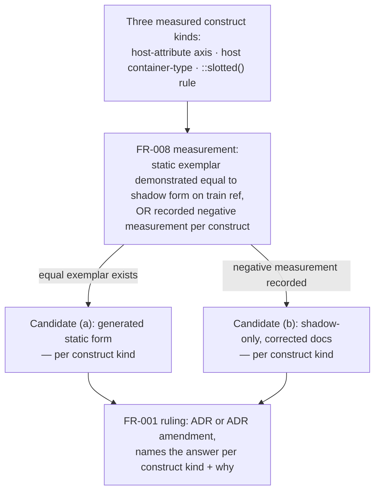

# Mission Specification: Static Form of Element-Backed CSS Families (Decision, Gap G0)

**Mission Branch**: `mission/static-form-of-element-backed-css`
**Created**: 2026-09-10
**Status**: Draft
**Input**: GitHub issue #301, "[TKT1] decide the static form of element-backed CSS families — the
server-rendered half of `:host`, `::slotted` and host container queries" (`spec-kitty/spec-kitty-design`),
read against #300 (epic), #161 and #239 (open, adjacent), #253/#274 (closed/open precedent), ADR-9,
ADR-10 and ADR-11, and the three measured CSS files as they stand on `train/elements-first@2b59c8c`
(the head this mission branched from).

## Discovery note

This mission was dispatched with a complete, operator-authorized brief (issue #301, cross-checked
live against #300/#161/#239/#253/#274 and against the actual repository files rather than assumed
from the issue text). Per the specify workflow's provision for an explicit instruction to minimize
discovery, the interactive interview was skipped and this document records the confirmed scope and
assumptions directly (Decision Moment `01M2497FF81WMVA14RGCK0X8S9`, resolved `yes-skip-discovery`).

## Mission kind — read this before the requirements below

**This is a decision mission (Family 4 component-gap audit, Gap G0), not a component-build
mission.** The deliverable is a recorded ruling — an ADR or an amendment to the ADR that currently
states the rule — plus a discriminating measurement, plus whatever documentation corrections the
ruling forces. There is no new component, no element, no visual-contract change to any shipped
component, and no compact-app-shell implementation in this mission.

**The answer is not decided by this spec.** Two candidate outcomes are fully specified below as
independent alternatives, each with its own consequences and conditional deliverables. Satisfying
this spec's functional requirements does not require, and must not be read as implying, that
either candidate is preferred. The measurement specified in FR-008 is what selects between them;
`plan.md` designs how to perform it, and the implementation Work Package performs it and records
the outcome in the ruling.

## The question this mission answers

Three shipped CSS constructs are legitimate, ADR-9-compliant shadow-DOM authoring patterns — none
of them is a defect under the boundary rule `scripts/check-adopted-css-boundaries.mjs` enforces
today — but none has a demonstrated equivalent for a consumer who cannot use a shadow root at all
(a Django, Jekyll, or Hugo server-rendered page, which is how Family 4 "Teams and membership"
consumes this library almost entirely):

1. **A host-attribute variant axis** that gates a layout change inside a `@container` block whose
   container is the host itself — e.g. `:host([presentation="compact"])` inside
   `@container (max-inline-size: 860px)`.
2. **A host-owned `container-type`** that establishes the container every descendant `@container`
   rule in the same sheet depends on — e.g. `:host { container-type: inline-size }`.
3. **A `::slotted()` child rule** that only matches slotted light-DOM children of a shadow host —
   e.g. `::slotted(img)`.

**The question:** does this design system adopt **(a)** a declared, generated static form for
these construct kinds — a light-DOM-consumable variant in which the host-attribute axis becomes a
root-class modifier, the host-owned container establishes on the root class instead of `:host`,
and `::slotted(x)` becomes a descendant rule under the root class, with a gate holding the two
forms equal — or **(b)** a stated rule that these axes are shadow-only, with the authoring recipe,
the relevant ADR(s), and every affected component's docs corrected to say so, and each affected
component documenting what a static consumer must author instead?

**Either answer is fine, and this spec does not pick one.** The ruling may also answer
per-construct-kind rather than with one global answer — nothing in these requirements forces a
single verdict across all three kinds if the measurement (FR-008) supports different answers for
different kinds.

### Candidate (a): declared, generated static form

**Shape.** A build step (extending `scripts/build-elements-css.mjs` / `build-element-markup.mjs`,
the existing generator pair ADR-10 §3 already establishes for canonical markup) emits a
light-DOM-consumable variant of the affected stylesheet: the host-attribute axis becomes a
`.sk-<name>--<modifier>` root-class rule; a host-owned `container-type` moves to the root class so
the same `@container` blocks apply; `::slotted(x)` becomes `.sk-<name> > x` (or the equivalent
descendant rule) under the root class. A gate (extending or paralleling
`check-adopted-css-boundaries.mjs`) holds the generated static form and the shadow form equal —
i.e. it fails if they diverge.

**Consequences.** New generator surface and a new drift/equivalence gate are required — this is
new build machinery, not a doc change. Static consumers (Family 4's Django templates and similar)
gain a supported, generated class they can rely on across upgrades. The generator and gate changes
themselves are **not** built in this mission (FR-006); they are named and filed as their own
issues with probe tables identified, because building them is more than one bounded Work Package.

### Candidate (b): stated shadow-only rule

**Shape.** The authoring recipe (`docs/contributing/adding-a-component.md`), the relevant ADR(s)
(most plausibly ADR-9 and/or ADR-10), and every other document that currently implies a static
equivalent exists for one of these construct kinds are corrected in this mission's own PR to state
plainly that the construct is shadow-only. Each affected component's docs (starting with the three
measured components, `sk-app-shell`, `sk-action-row`, `sk-entity-marker`) gain a stated instruction
for what a static consumer must author instead (e.g., "the compact-header seam is not available
outside a shadow root; a server-rendered page authors its own responsive header markup and CSS").

**Consequences.** No new generator or gate surface. Static consumers get an explicit, honest "you
must author this yourself" contract rather than a generated helper, and every doc that currently
overstates what the static path provides is corrected in the same PR (FR-007) — this is a doc-only
change, sized to fit one Work Package.

## Measured constructs — verified against the actual train head

The issue's evidence claims about the three constructs were re-measured against this checkout
rather than transcribed. All three hold; see "Evidence verification" below for the one claim that
could not be re-verified.

| # | Construct kind | Component / file | Verified detail |
|---|---|---|---|
| 1 | Host-attribute variant axis inside a host-owned `@container` | `packages/styles/src/app-shell/sk-app-shell.css` | `:host { container-type: inline-size }` (line 5); `:host([presentation="rail-preserving"])` rules inside `@container (max-inline-size: 1100px)` (line 67); `:host([presentation="compact"])` rules inside `@container (max-inline-size: 860px)` (line 104) |
| 2 | Host-owned `container-type` | `packages/styles/src/action-row/sk-action-row.css` | `:host { container-type: inline-size }` (line 4) is the sole container establishing `@container (max-width: 400px)` (line 186), the file's only reflow rule |
| 3 | `::slotted()` child rule | `packages/styles/src/entity-marker/sk-entity-marker.css` | `::slotted(img)` (lines 41–46) is the only image-targeting rule in the 46-line file |

## Evidence verification (issue claims checked against actual files)

- The three rows above **hold** exactly as #301 describes them.
- **One claim in #301 could not be independently re-verified from this checkout**: that Family 4's
  T3/T4 canvases "copied the `:host([presentation="compact"])` block verbatim into a document
  stylesheet, where it matches nothing." Those canvases live in the planning repo
  (`ux_redesign/families/04-teams-membership`), which is not part of this repository and is not
  reachable from this workspace (`gh repo view` fails to resolve it). The ruling required by
  FR-009 must name this as **reported evidence from #301**, not as an independently reproduced
  measurement, and say so plainly.
- All three constructs are confirmed **legitimate under the existing ADR-9 boundary rule** —
  `check-adopted-css-boundaries.mjs`'s own self-test table accepts `:host`, `:host([attr])
  <descendant>`, and `::slotted(...)` compounds as owned. The ruling must not describe them as
  defects; the gap is that no light-DOM equivalent exists, not that the shadow-DOM form is wrong.
- **#161 was re-measured with a real build on this checkout, not re-read from the issue text**,
  because a config-only reading (including one attempted mid-mission) gave a wrong answer once
  already. `rm -rf packages/styles/dist && npx nx run tokens:build --skip-nx-cache && npx nx run
  styles:build --skip-nx-cache`, then inspected the emitted tree and resolved the package through
  its actual npm-workspace symlink (`node_modules/@spec-kitty/styles → packages/styles`):
  - **The per-component subpath exports are intact and real.** `@spec-kitty/styles/action-row/*`,
    `/app-shell/*`, `/entity-marker/*`, and 45 others resolve, through Node's own export-map
    resolution, to files that exist on disk after the build — e.g.
    `dist/action-row/sk-action-row.css` and `dist/entity-marker/sk-entity-marker.css` are both
    present with real content. This is the path a static consumer (Django/Jekyll/Hugo linking a
    stylesheet, or a build copying the file) actually uses.
  - **#161's own literal technical claim is wrong, and the root export is broken for a different
    reason.** #161 says the compiler "emits `dist/index.js` ... never a `dist/src/` level." A real
    `styles:build` emits exactly `dist/src/index.js` and `dist/src/index.d.ts` — the file
    `package.json`'s `main`/`types`/`exports["."]` declare **does exist**. What actually breaks a
    real ESM consumer is different: that emitted root file re-exports its siblings as
    `export * from './blog-card/index'` — no file extension — which Chromium/Node's strict ESM
    resolver refuses (`ERR_MODULE_NOT_FOUND`), confirmed by importing
    `@spec-kitty/styles` through the real workspace symlink. A bundler with extensionless
    resolution (the default for webpack/Vite/esbuild) would likely tolerate this; a bare Node ESM
    `import` does not.
  - **Net effect for this mission**: the root package import (`import '@spec-kitty/styles'`) is
    confirmed broken for a strict-ESM consumer, but the per-component subpath exports — the actual
    static-consumer path for the three measured constructs' CSS — are confirmed working. FR-004
    below specifies the measurement against the subpath exports, and records the root-barrel defect
    as a precisely scoped, named limitation rather than a reason the whole question is unmeasurable.
  - Re-confirmed at the same measurement pass: `sk-action-row.css` genuinely opens with
    `:host { display: block; min-width: 0; container-type: inline-size; }` (unchanged from the
    earlier read), and no script anywhere under `scripts/` enforces user-visible copy or i18n —
    `check-component-token-literals.mjs` is a design-token/value-literal gate (colour, spacing,
    typography), not a copy gate. #286 compliance is **review-only** today; this spec does not
    imply otherwise anywhere below.
- #239 (can a shadow-DOM element consume a light-DOM primitive's stylesheet?) is confirmed **still
  open**, and is explicitly the inverse question — it does not own this mission's question and this
  mission does not decide it.

## Domain language

- **Static form** — a server-rendered, light-DOM-consumable CSS/markup variant of a construct that
  today exists only inside a shadow root. Not the same as "the generated `.html`" that already
  exists for canonical markup (ADR-10 §3) — that generation already happens; the open question is
  specifically about the three *shadow-boundary-dependent* construct kinds above.
- **Shadow-only** — a construct kind for which no static/light-DOM equivalent is provided by the
  library; a static consumer must author their own solution, with the library's docs stating what
  that solution needs to satisfy.
- **Static exemplar** — a concrete, generated or hand-verified artifact demonstrating the static
  form works, used as the "equal to the shadow form" side of the FR-008 measurement.
- **Negative measurement** — a concrete, recorded demonstration of *why* no static equivalent can
  be produced (not an assertion that none exists) — e.g. reproducing the exact CSS/DOM limitation
  that blocks it.

## User Scenarios & Testing *(mandatory)*

### User Story 1 - Record a ruling the epic's gated children can act on (Priority: P1)

As the design-system maintainer closing Gap G0, I need a recorded, evidence-backed ruling on
whether host-attribute axes, host-owned container queries, and `::slotted()` rules get a generated
static form or are declared shadow-only, so that the four gated child missions and any future
component author know what the static path provides without re-deriving it themselves.

**Why this priority**: #300's dependency map blocks four other missions on this ruling; #307
("starts after" this mission) cannot even begin planning until it resolves.

**Independent Test**: Can be fully tested by reading the resulting ADR/amendment and confirming it
states, for each of the three construct kinds, either a generated-static-form answer with named
follow-up issues, or a shadow-only answer with corrected docs — with no construct kind left silent.

**Acceptance Scenarios**:

1. **Given** the three measured constructs and their current shadow-only-only implementations,
   **When** the Work Package performs the FR-008 measurement, **Then** the ruling names, for each
   construct kind, either (a) the generated static equivalent or (b) an explicit "shadow-only, and
   here is what to author instead" statement, backed by that construct kind's own measurement
   result.
2. **Given** the ruling names candidate (a) for any construct kind, **When** the ruling ships,
   **Then** the required generator and boundary-gate changes for that construct kind are named
   (not built) and filed as separate issues, each with its probe table identified.
3. **Given** the ruling names candidate (b) for any construct kind, **When** the ruling ships,
   **Then** every document that currently implies a static equivalent exists for that construct
   kind is corrected in the same PR, and the affected component's docs state what a static
   consumer must author instead.

---

### User Story 2 - Unblock the four gated children with an explicit freeze statement (Priority: P2)

As the owner of #302 (TKT2/G1), #304 (TKT4/G3), #305 (TKT5/G4), or #307 (TKT7/G6), I need the
ruling to state explicitly whether my mission may freeze a static API and in what form, so I don't
guess or re-litigate this decision inside my own component mission.

**Why this priority**: #300 names these four as gated; guessing wrong wastes a WP cycle on a
static API shape the ruling doesn't actually support.

**Independent Test**: Can be tested by checking that the ruling contains one sentence per gated
child naming whether it may freeze a static API and in what form (generated-class contract, or
"shadow-only — do not freeze a static API for this axis").

**Acceptance Scenarios**:

1. **Given** the ruling is recorded, **When** a reader looks up #302, #304, #305, or #307 by name
   in the ruling, **Then** they find an explicit statement of whether and how that mission may
   freeze a static API.

---

### User Story 3 - State relationships to adjacent open questions without deciding them (Priority: P3)

As a reader of #161 or #239, I need this ruling to state how it relates to those open issues
without resolving them, so the three questions stay properly scoped to their own missions.

**Why this priority**: #300's shared constraints require both; conflating them would either
prejudge #239 or silently assume #161's root-export defect doesn't affect this ruling at all.

**Independent Test**: Can be tested by confirming the ruling contains a sentence relating to #239
that does not answer #239's own question, and a sentence about #161 naming precisely which import
path the measurement used (the per-component subpath export) and which import path remains broken
(the root package import) and why.

**Acceptance Scenarios**:

1. **Given** the per-component subpath exports (`@spec-kitty/styles/<name>/*`) are confirmed, by a
   real build, to resolve to real files on disk, **When** the FR-008 measurement runs, **Then** it
   is performed against that subpath path — the one a real static consumer actually uses — and the
   ruling records the result as a genuine measurement rather than treating #161 as blocking it.
2. **Given** the root package import (`@spec-kitty/styles` bare specifier) is confirmed broken for
   a strict-ESM consumer by the same build (extensionless relative re-exports in the compiled
   entry file), **When** the ruling is written, **Then** it names this as a scoped, precisely
   described limitation belonging to #161 — not as a reason the whole measurement is unmeasurable,
   since no measured construct in this mission needs the root import to work.
3. **Given** #239 asks the inverse question (can a shadow element consume a light-DOM primitive),
   **When** the ruling is written, **Then** it states its own relationship to #239 without
   answering #239's question.

### Edge Cases

- **What happens if the measurement produces different answers for different construct kinds?**
  The ruling is written per construct kind (FR-002); nothing in this spec requires one global
  answer, and a mixed ruling (e.g. generated static form for the host-attribute axis, shadow-only
  for `::slotted()`) is a valid outcome.
- **What happens with #161's effect on real package consumption?** A real build (measured on this
  train head, see "Evidence verification") shows the per-component subpath exports — the path a
  static consumer actually uses — resolve to real files, so the FR-008 measurement is run against
  those, not blocked by #161. Only the root package import is confirmed broken, for a specific,
  named reason (missing file extensions in the compiled entry's relative re-exports). The ruling
  records that scoped limitation precisely; it does not treat #161 as making the whole measurement
  unmeasurable, and it does not silently measure only against in-repo source examples either — the
  subpath measurement is a real installed-package resolution, performed through the npm-workspace
  symlink, not a source read.
- **What happens to the one issue-evidence claim (T3/T4 canvases) that cannot be independently
  re-verified from this repository?** The ruling names it as reported evidence from #301 (FR-009),
  not as a first-party measurement, and says so plainly rather than presenting it as verified.
- **What happens if the "generated static form" candidate is selected for a construct kind but
  the required generator/gate work is large?** FR-006 caps this mission's own output to naming and
  filing that work as separate issues with probe tables identified — building it is explicitly out
  of scope for this Work Package.

## Requirements *(mandatory)*

### Functional Requirements

| ID | Title | User Story | Priority | Status |
|----|-------|------------|----------|--------|
| FR-001 | Recorded ruling as ADR or ADR amendment | As the maintainer, I want a ruling landed as an ADR or an amendment to the ADR that currently states the rule so that the decision has one authoritative, versioned home. | High | Open |
| FR-002 | Ruling addresses all three construct kinds individually | As the maintainer, I want the ruling to say, for each of the host-attribute axis, the `::slotted()` child rule, and the host-owned `container-type`, what the static path gets, so that no construct kind is left ambiguous by omission. | High | Open |
| FR-003 | Ruling states which gated children may freeze a static API, and in what form | As the owner of #302/#304/#305/#307, I want the ruling to name each of us explicitly and say whether/how we may freeze a static API, so that we don't guess. | High | Open |
| FR-004 | Ruling holds for real package consumption via the per-component subpath exports, with #161's root-barrel defect named as a precise, scoped limitation | As a real installed-package consumer, I want the ruling's measurement performed against `@spec-kitty/styles/<name>/*` — the subpath export a static consumer actually resolves through, confirmed real by a build on this train head — not only against in-repo source examples; and I want #161's root-package-import defect (broken for a strict-ESM consumer because the compiled entry's relative re-exports omit file extensions — not, as #161's own text claims, because the file is missing) named precisely rather than treated as blocking this mission's measurement. | High | Open |
| FR-005 | Ruling states its relationship to #239 without deciding #239 | As a reader tracking both open questions, I want the ruling to say how it relates to #239's inverse question without answering #239 itself. | Medium | Open |
| FR-006 | Conditional (candidate a): name, not build, the generator and boundary-gate changes | As the maintainer, if the ruling adopts a generated static form for a construct kind, I want the required generator and boundary-gate changes named and filed as their own issues, each with its probe table identified, and I want only work small enough for this one Work Package to land in this mission's PR. | High | Open |
| FR-007 | Conditional (candidate b): correct every implying document in the same PR | As the maintainer, if the ruling adopts a shadow-only rule for a construct kind, I want every document that currently implies a static equivalent exists to be corrected in this mission's own PR, and each affected component's docs to state what a static consumer must author instead. | High | Open |
| FR-008 | Verification is a measurement, not an assertion | As a reviewer, I want the ruling backed by either a static exemplar demonstrated equal to the shadow form on the train ref, or a recorded negative measurement showing precisely what a static consumer cannot get, per construct kind — not a claim with no reproducible evidence. | High | Open |
| FR-009 | Ruling names the T3/T4 inert-block failure mode | As the maintainer, I want the ruling to name the inert copied `:host([presentation="compact"])` block in Family 4's T3/T4 canvases as the observed failure mode that motivated this mission, attributed as reported evidence from #301 since it cannot be independently re-verified from this repository. | Medium | Open |

### Non-Functional Requirements

| ID | Title | Requirement | Category | Priority | Status |
|----|-------|-------------|----------|----------|--------|
| NFR-001 | Measurement reproducibility | The FR-008 measurement (static exemplar comparison, or negative-measurement record) must be re-executable against the same train ref and produce the same result every time it is run — no flaky or manual-eyeball-only verification step. | Reliability | High | Open |
| NFR-002 | Doc-correction completeness (candidate b only) | If any construct kind is ruled shadow-only, 100% of documents this mission identifies as asserting or implying a static equivalent for that construct kind are corrected in the same PR — zero remaining contradictory statements in `docs/` or the authoring recipe. | Consistency | High | Open |

### Constraints

| ID | Title | Constraint | Category | Priority | Status |
|----|-------|------------|----------|----------|--------|
| C-001 | One bounded Work Package, one PR | This mission delivers exactly one Work Package and one PR, per #301's "Delivery" line and #300's per-child convention. If the work genuinely cannot fit one WP, the mission stops and reports rather than splitting on its own authority. | Process | High | Open |
| C-002 | No Team/membership model; copy stays consumer-owned | The library must not acquire a Team, invitation, membership, bearer-link, or session model as a side effect of this ruling. All component-visible copy stays consumer-supplied and translatable per #286. | Boundary | High | Open |
| C-003 | No citation of Lynn's product verdict | Lynn's Family 4 product verdict is not recorded anywhere and must not be cited as evidence in the ruling or any other artifact this mission produces. Cite the Opus rereview 04 `approve` verdict (2026-09-10) and the operator's delegated-trust authorization to file this program at ready-for-Lynn instead, accurately. | Governance | High | Open |
| C-004 | Non-goals carried forward verbatim | Out of scope: implementing a compact app-shell static form (belongs to #253/#254/#274's line if the ruling calls for it); deciding #239; any new element or component; any change to an existing component's visual contract; app-side templating, routes, permissions, or domain state; the Family 4 canvases' review-only state selectors, fixture facts, and canvas controls, which are not product UI and must not appear in this mission's acceptance criteria. | Scope | High | Open |
| C-005 | No hand-editing generated or `kitty-specs`/`.kittify` artifacts | Any generated artifact this mission's evidence touches (e.g. `custom-elements.json`, generated static HTML) is produced only via its own generator script, never hand-edited; mission governance artifacts under `kitty-specs/` and `.kittify/` are produced only via the Spec Kitty CLI or canonical phase skills. | Process | Medium | Open |

### Key Entities

- **Construct kind**: one of the three CSS authoring patterns this ruling covers (host-attribute
  variant axis, host-owned `container-type`, `::slotted()` child rule). The ruling may answer
  independently per construct kind.
- **The ruling**: the ADR or ADR-amendment artifact this mission produces; the single authoritative
  record of the answer(s) to the question above.
- **The measurement**: either a static exemplar (demonstrated equal to the shadow form on the
  train ref) or a negative-measurement record, produced per construct kind, that determines which
  candidate the ruling adopts for that construct kind.
- **Gated child mission**: one of #302, #304, #305, #307 — an open issue under epic #300 whose
  static-API finalization the ruling unblocks.
- **Measured component**: one of the three components used as this mission's exemplars —
  `sk-app-shell`, `sk-action-row`, `sk-entity-marker` — none of which this mission modifies
  visually; only their docs may be corrected under candidate (b).

## Success Criteria *(mandatory)*

### Measurable Outcomes

- **SC-001**: A reader with no other context can determine, from the ruling alone, what each of
  the three construct kinds' static-path availability is — with zero need to consult a second
  document to find any construct kind's answer.
- **SC-002**: Each of the four gated child missions (#302, #304, #305, #307) can determine from the
  ruling alone, in under one minute of reading, whether it may freeze a static API and in what
  form.
- **SC-003**: The measurement backing the ruling is independently reproducible by a reviewer from
  what is committed in the PR — not dependent on an unrecorded manual check.
- **SC-004**: If any construct kind is ruled shadow-only, a grep across `docs/` and the authoring
  recipe for language implying a static equivalent for that construct kind returns zero
  uncorrected hits after this mission's PR merges.

## Assumptions

- The mission proceeds under the operator's delegated-trust authorization referenced in the
  mission dispatch; Lynn's Family 4 product verdict remains unrecorded and is never cited as
  evidence (C-003).
- The planning repo (`ux_redesign/families/04-teams-membership`) is out of reach from this
  checkout; the one evidence claim that depends on it (T3/T4 canvases) is carried as reported
  testimony rather than independently re-verified (see "Evidence verification").
- `plan.md` will design the concrete mechanics of the FR-008 measurement (e.g., a probe page
  rendered both ways, or a targeted generator dry run); this spec fixes only what counts as
  admissible evidence, not how it is produced.
- The #161 finding above was produced by an actual `rm -rf dist` + `npx nx run styles:build
  --skip-nx-cache` + real Node ESM resolution through the workspace symlink, not by re-reading
  `packages/styles/package.json`/`tsconfig.lib.json` alone — a config-only reading of those two
  files gives a wrong answer about which path the compiler emits to, as this mission itself
  demonstrated mid-draft. Any later re-measurement (in `plan.md` or implementation) should repeat
  the same build-and-resolve steps rather than trust a config reading, per this mission's own
  "measurement, not an assertion" standard.
