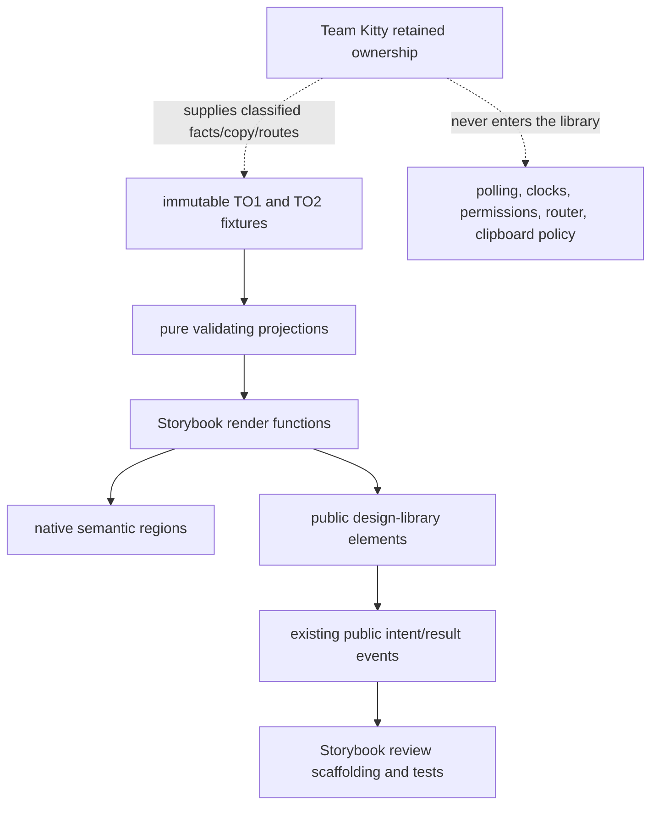

# Implementation Plan: Team Overview current-main pattern refresh

**Branch**: `team-overview-current-main-pattern-refresh` | **Date**: 2026-09-11 | **Spec**: [spec.md](./spec.md)
**Input**: #381/#383, the Family 1 programme handoff and TO1/TO2 reviewed evidence, current
`train/elements-first@d3263e9488f7df85a537a927d417729eacc75f12`, and landed pattern conventions.

## Summary

Replace the historical #150 Team Overview pattern rather than adding a second pattern family.
Extract current TO1 and six-state TO2 data into one story-only fixture/projection module; render the
projections through native HTML plus existing public shell, navigation, header, row, status, notice,
button, and copy-field elements. Replace the six discovered story IDs and the entire obsolete
visual inventory, add direct fixture tests plus built-Storybook interaction/accessibility coverage,
and publish a migration note that names #150 as historical/deprecated.

All browser behavior remains review scaffolding or an existing element contract. The pattern does
not fetch, route, poll, classify, format time, execute commands, determine permissions, or own
clipboard policy.

## Technical Context

**Language/Version**: TypeScript 5.x, Lit 3.3 templates, CSS custom properties
**Primary Dependencies**: Storybook 10.6, public `@spec-kitty/elements` source modules, native HTML
**Storage**: N/A — immutable in-memory Storybook fixtures only
**Testing**: Vitest fixture tests; Playwright against built Storybook; axe; visual regression
**Target Platform**: Current Chromium, Firefox, and WebKit browser projects
**Project Type**: Nx web-components monorepo, Storybook-only pattern composition
**Performance Goals**: Storybook build remains below the committed 180-second ceiling
**Constraints**: six stable story IDs; zero public element/token/wrapper/API delta; token-only
pattern CSS; zero document overflow at required presentations; zero axe violations
**Scale/Scope**: one current populated fixture, one alternate-retention fixture, exactly six
first-run response fixtures, one Work Package

## Charter Check

- **Tokens first**: PASS by design. Pattern-local layout uses existing `--sk-*` variables and
  logical properties. No token edit is planned.
- **Elements-first boundaries**: PASS. The pattern imports direct public element modules and uses
  their attributes/properties/slots/events/parts; it defines no element or wrapper.
- **Native semantics**: PASS. Landmarks, headings, lists, links, buttons, select, code, time, and
  status relationships stay in light DOM.
- **Accessibility**: planned built-browser checks cover axe, keyboard/focus, accessibility trees,
  narrow/zoom/RTL/forced-colors/reduced-motion, and controlled drawer dismissal.
- **Visual authority**: Family 1 TO1/TO2 HTML/PNG and round-13 reviewed captures are the current
  reference; #150 baselines are migration evidence only and are removed.
- **Living documentation**: story IDs, focused tests, visual cases, baseline PNGs, mission
  matrices, and the migration note change together.
- **Risk**: routine story-only scope, Squad tier C. Independent review remains required before PR;
  this implementer stops at `for_review`.

No charter exception is required.

## Data and ownership flow



## Project Structure

### Mission artifacts

```text
kitty-specs/team-overview-current-main-pattern-refresh-01M286R0/
├── spec.md
├── plan.md
├── research.md
├── data-model.md
├── quickstart.md
├── contracts/team-overview-pattern-migration.md
├── tasks.md
├── tasks/WP01-current-team-overview-pattern-and-proof.md
├── meta.json
├── issue-matrix.json
├── acceptance-matrix.json
├── status.json
├── status.events.jsonl
├── mission-events.jsonl
└── lanes.json
```

### Authored and evidence surfaces

```text
packages/elements/src/patterns/
├── team-overview.fixture.ts
└── team-overview.stories.ts

fixtures/elements-behaviour/src/
└── pattern-team-overview.test.ts

apps/storybook/src/tests/
├── sk-team-overview-pattern.spec.ts
├── visual.spec.ts
└── visual.spec.ts-snapshots/team-overview-current-*.png

docs/architecture/validation/issue-383-team-overview/
├── README.md
└── visual-inspection.md

expected-stories.json
```

**Structure Decision**: Keep immutable input and pure projections next to the Storybook pattern,
following Repository Dossier/Mission Reading precedent, while keeping direct fixture contract tests
in the existing elements-behaviour fixture and built-browser evidence in the Storybook test app.
No public barrel imports or exports the fixture module.

## Current-to-historical migration

| #150 current claim                     | #383 disposition                                           | Current replacement                                                  |
| -------------------------------------- | ---------------------------------------------------------- | -------------------------------------------------------------------- |
| Delivery return and attributed spend   | Historical/deprecated; removed from current IDs/tests/PNGs | Velocity over supplied TeamMoment retention                          |
| Flow health and transition matrix      | Historical/deprecated; removed from current IDs/tests/PNGs | At most two distinct in-flight Mission refs                          |
| Operational dashboard/evidence actions | Historical/deprecated; removed from current IDs/tests/PNGs | Admitted repository facts and passive recent activity                |
| Page-wide sync/freshness               | Removed                                                    | Observed freshness scoped only to TeamMoment regions                 |
| #150 interaction/scale/partial stories | Removed                                                    | TO2 fixture review, copy outcomes, long content, alternate retention |

Generic child components from #145–#149 remain valid public primitives. Only their use as evidence
of the current Team root is retired.

## Implementation Concern Map

### IC-01 — Immutable fixture and projection boundary

- **Purpose**: encode the exact TO1/TO2 supplied facts and reject caps, route, role, and state drift
  before markup is involved.
- **Relevant requirements**: FR-002–FR-008, FR-014; NFR-005; C-002, C-005.
- **Affected surfaces**: `team-overview.fixture.ts`,
  `pattern-team-overview.test.ts`.
- **Sequencing/depends-on**: none.
- **Risks**: accidentally deriving product policy (permissions/retention/time) rather than merely
  validating and projecting supplied fields; duplicating fixture strings in render code.

### IC-02 — Public-surface TO1/TO2 composition

- **Purpose**: render current Overview and review-only first-run states with correct native
  structure, controlled shell drawer, route/passive boundaries, and public copy-field usage.
- **Relevant requirements**: FR-001, FR-005–FR-011; NFR-001–NFR-003; C-001–C-005.
- **Affected surfaces**: `team-overview.stories.ts`.
- **Sequencing/depends-on**: IC-01.
- **Risks**: private `::part` misuse; local CSS duplicating a component sheet; hidden fixture
  panels remaining focusable; story-only scaffolding looking like product behavior.

### IC-03 — Direct and built-browser verification

- **Purpose**: prove fixture purity, native/a11y structure, role/route guards, copy outcomes,
  controlled focus, responsive containment, media modes, and story discovery.
- **Relevant requirements**: FR-012, FR-014–FR-015; NFR-001–NFR-007.
- **Affected surfaces**: fixture test, focused Playwright spec, expected story ratchet.
- **Sequencing/depends-on**: IC-01 and IC-02.
- **Risks**: tests coupled to private roots except where testing an existing element's public
  result; environment emulation that does not exercise actual media; story total drift after train
  movement.

### IC-04 — Visual replacement and durable migration evidence

- **Purpose**: remove obsolete #150 cases/PNGs, baseline the current TO1/TO2 states, inspect the
  reviewed output, and leave a clear consumer migration record.
- **Relevant requirements**: FR-013, FR-015; NFR-006; C-006, C-008.
- **Affected surfaces**: `visual.spec.ts`, only Team Overview snapshots, mission contract, and
  `docs/architecture/validation/issue-383-team-overview/**`.
- **Sequencing/depends-on**: IC-02 and IC-03.
- **Risks**: deleting non-Team-Overview images; accepting local output without inspection; leaving
  an old visual case or filename that still claims Delivery/Flow is current.

## Verification strategy

1. Write fixture/projection tests first and confirm the intended red against the #150 source.
2. Replace the story module and make fixture tests/type/lint/pattern-composition green.
3. Build Storybook; replace the six ratcheted IDs from emitted `index.json`.
4. Rewrite focused Playwright assertions and pass Chromium before all configured browsers.
5. Replace only Team Overview visual cases and PNGs through Playwright snapshot tooling; inspect
   every current image and record disposition.
6. Run axe and the required full repository/generator/size checks.
7. Run the fast focused subset again, safe-commit exact owned paths, transition WP01 through CLI to
   `for_review`, and push the literal branch.

## Complexity Tracking

No violation. One WP is justified because the story source, immutable fixture, exact story ratchet,
focused browser spec, migration note, and replacement visuals form one inseparable current-evidence
cutover. Splitting them would permit a branch where the discovered or visual story inventory still
certifies retired product behavior.
