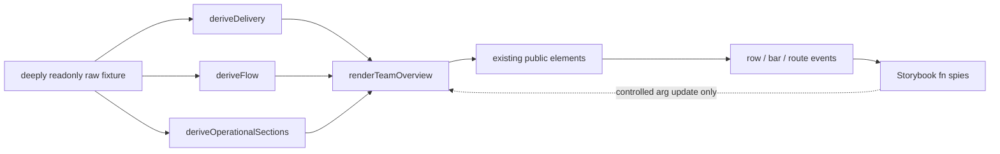

# Implementation Plan: Team overview pattern story

**Branch**: `mission/team-overview-pattern-story` | **Date**: 2026-09-07 | **Spec**:
`kitty-specs/team-overview-pattern-story-01M1WNHE/spec.md`  
**Input**: GitHub issue #150, epic #144, approved Stitch references, ADR-9/10/11, and the
#76 authoring recipe  
**Base at planning**: `origin/train/elements-first@2bbbd7b7c2287d1c664902b0d8c4f7e353205c7c`

## Summary

Add one Storybook-only Team overview composition under
`packages/elements/src/patterns/team-overview.stories.ts`. Keep the deeply readonly fixture,
pure selectors, render helper, story definitions, and Storybook spies together in that excluded
`*.stories.ts` module so domain-shaped demo data does not enter the published elements build.
Exercise the real story through Playwright rather than duplicating its markup in test fixtures.
Append six exact story IDs, targeted semantic/layout/event tests, and CI-authoritative visual
baselines. Do not change element implementations, public package entries, tokens, generated CEM,
React/Vue outputs, behavior/mutation registries, or SIZES.

One delivery work package owns this cohesive story/test slice. This respects the operator's
one-mission/one-PR instruction and avoids creating artificial WP boundaries across the same story
module, ratchet, Playwright spec, and visual file. Three independent Codex lenses review the exact
candidate in parallel at the Tier-C point-cut.

## Technical Context

**Language/Version**: TypeScript 5.x, modern browser JavaScript, HTML/CSS authored through Lit's
`html` templates and existing design-system tokens  
**Primary Dependencies**: Storybook 10.6 web-components/Vite, Lit 3.3, `storybook/test` spies,
Playwright 1.62, axe-playwright, Vitest 4.1  
**Storage**: N/A; immutable in-memory story fixture only  
**Testing**: direct selector tests where useful, Storybook play-function assertions, Playwright
Chromium/Firefox/WebKit semantic/layout/event checks, axe over every ratcheted story, Chromium visual
regression, existing full repository gates  
**Target Platform**: Storybook static build and evergreen Chromium/Firefox/WebKit consumers  
**Project Type**: Nx monorepo design system; Storybook-only pattern composition  
**Performance Goals**: existing fail-closed Storybook build below 180 seconds  
**Constraints**: no new custom element, package API, token, child implementation change, Team Kitty
import, runtime clock, fetching, routing, store, or private shadow-root reach-through  
**Scale/Scope**: six discoverable stories; one raw overview fixture; 62 transition moves; 50 open
WPs; full composition at 1280/1440 and narrow at 390×844

## Planning decisions

### PD-001 — Story discovery and package exclusion

Storybook discovers `packages/**/*.stories.ts[x]` and does not discover an ordinary story under
`apps/storybook/src`. The pattern therefore lives at:

`packages/elements/src/patterns/team-overview.stories.ts`

The elements build excludes `src/**/*.stories.ts`, so fixture data and render helpers remain
Storybook-only. No new ordinary `.ts` fixture module is added under `packages/elements/src`,
because that would be emitted even without a barrel export.

### PD-002 — Default versus ApprovedDark

The repo guide requires a `Default` export while #150 requires a visible `ApprovedDark` story.
Use one export, `Default`, with Storybook display name `ApprovedDark`. That yields one
non-duplicated story with ID `patterns-team-overview--default` and visible label
`ApprovedDark`. Five additional exports yield six stories total and move the story ratchet from
189 to 195:

1. `patterns-team-overview--default` (display name `ApprovedDark`)
2. `patterns-team-overview--light-mode`
3. `patterns-team-overview--narrow`
4. `patterns-team-overview--scale-50-w-ps`
5. `patterns-team-overview--controlled-interactions`
6. `patterns-team-overview--empty-partial-data`

The built Storybook `index.json`, not this predicted normalization, is the final authority; tests
and the ratchet use the emitted IDs.

### PD-003 — Reconciled delivery series

Do not reuse #148's illustrative component fixture `320 + 510 + 440 + 604 = 1,874`; it conflicts
with this composition's attributed amount. Use a composition-owned full-coverage series
`320 + 410 + 340 + 604 = 1,674`, preserving the approved ordering and tallest final bucket while
making the arithmetic exact. The partial-data variant uses an explicitly labelled subset and never
claims full coverage.

### PD-004 — No new design values

Use existing tokens and public child layout surfaces. Composition-level layout may use inline
Storybook fixture styles only when every design value is an existing `var(--sk-*)`; prefer a
story-local stylesheet string to repeated inline declarations. No token source/catalogue change is
planned. Any genuinely missing reusable contract becomes a follow-up rather than a child-component
or shadow-root patch.

### PD-005 — Visual authority and provenance

The supplied approved overview capture is available locally and governs the full page. The public
Stitch URL currently serves the application shell without project data to an unauthenticated
request, so it cannot independently export the named screens. The Flow-health child already has
approved CI baselines from #149. Before final visual disposition:

- hash and record the supplied full-page capture;
- identify the exact local path/provenance used by the operator session;
- compare Flow health against both the supplied page crop and #149's approved child baseline;
- never claim a separately acquired “clean v4” byte if no authenticated export is available.

This is an evidence-provenance task, not permission to block implementation or invent a replacement
design.

## Architecture and data flow



Pure selector invariants:

- `attributed = totalInvestment - unattributed`
- `attributionPercent = round(attributed / totalInvestment × 100)`
- full bucket coverage iff `sum(bucket.value) === attributed`
- `moveTotal = sum(route.cells)`
- `openTotal = sum(statusCounts)`
- `legendTones = unique route tones in first-use order`
- dates and commit hashes are raw immutable strings

The render helper receives projections and optional action callbacks. It creates one
`sk-app-shell` with slotted public shell elements, native semantic section/list structure, and
property assignments for evidence stages, bar series, matrix columns/routes, and controlled IDs.
It never imports Team Kitty or queries a child's shadow root.

## Story design

### ApprovedDark / Default

- fullscreen composition at natural product width;
- visual suite captures both 1280 and 1440 widths from the same story;
- exact evidence chain, reconciled four-bucket series, clean matrix, current summary, In flight,
  Admitted repos, and Recent activity;
- exactly one account anchor in `sk-personal-rail`'s `account` slot, above logout;
- no identical first Recent row copied from In flight.

### LightMode

- identical raw fixture and derived projections;
- `.sk-light` wrapper plus Storybook light background;
- semantic/data signature must equal ApprovedDark before computed-style comparison.

### Narrow

- same fixture at 390×844;
- shell regions follow existing reflow contracts;
- chart/matrix may use their own bounded scrollers; the page itself has no horizontal overflow;
- operational row grammar and all controls remain reachable in document order.

### Scale50WPs

- current inventory remains 12/21/13/4;
- transition cells remain an aggregate 62-move matrix, not 50 edges;
- existing matrix semantics own cell relationships; tests assert no detached labels/crossings.

### ControlledInteractions

- `args` carry selected row/bar/route IDs and three `fn()` callbacks;
- event listeners call the correct spy with the event detail;
- play function activates one row, bar, and route, proves one call and exact detail each, and proves
  the children do not retain the requested selection until controlled args are supplied.

### EmptyPartialData

- missing outcome evidence and operational sections use deliberate empty/pending copy;
- bar series covers a labelled partial interval and does not claim €1,674 coverage;
- warnings without navigation are plain text/status content, not links.

## Test strategy

### Story/source invariants

- direct/imported assertions cover deep readonly fixture construction, exact selector arithmetic,
  source ordering, deterministic date/hash strings, unique identity anchor, feed repeat rationale,
  tone cap, and no `customElements.define('sk-team-overview'`/Team Kitty import.
- inspect the story module rather than creating a second composition string.

### Storybook Playwright spec

Add `apps/storybook/src/tests/sk-team-overview-pattern.spec.ts` and load emitted story URLs.
Assert:

- non-empty upgrades and exact public child tags;
- 1,840 − 166 = 1,674; bucket sum 1,674; displayed 91%;
- evidence stage 1,840 → 42 → 6 → 2 and subordinate 34/4 copy;
- matrix cell reduction 62 and independent status reduction 50;
- exact dates, route grammar, present-only legend, recovery/backward distinction;
- one account anchor above logout, row grammar/order, lowercase exact hashes, no accidental
  byte-identical feed copy;
- row/bar/route event type/detail/bubbles/composed/cancelable flags and controlled projection;
- dark/light semantic parity;
- 390×844 document order, reachable controls, and zero page-level overflow;
- Scale50WPs cell ownership and zero geometry collisions/floating labels using public host/cell
  geometry—not private shadow-root styling.

### Axe and visual

Adding all six emitted IDs to `expected-stories.json` places every story under the existing axe
ratchet. Append visual cases in `apps/storybook/src/tests/visual.spec.ts`:

- seven full-story captures: dark 1280, dark 1440, light 1440, narrow 390, Scale50WPs,
  ControlledInteractions, EmptyPartialData;
- four focused crops: rail identity, evidence arithmetic, bar comparison, matrix readability.

Baseline PNGs are captured from CI artifacts and manually inspected before commit. Local screenshots
are diagnostic only.

### Regression and drift gates

Run the repository recipe in order. Because this mission should not alter generated public
artifacts, regenerate/check them and require CEM, React, Vue, CSS modules, static markup, token
catalogue, SIZES, parts/docs, behaviors, and mutations to be byte-unchanged from the rebased train.
The only expected non-governance changes are the story module, pattern Playwright spec,
`visual.spec.ts`, `expected-stories.json`, CI-derived PNGs, and a concise changelog entry if the
existing release policy requires one.

## Charter Check

| Charter / doctrine gate | Plan |
|---|---|
| Token authority | Reuse existing `--sk-*` values; no raw design constants or new tokens. |
| Elements-first boundary | Compose existing elements; no page element or framework wrapper. |
| Accessibility | Native landmarks/lists, child public semantics, every story ratcheted into axe, zero violations. |
| Behavior proof | Exercise the children through real pointer/keyboard events; add no behavior-registry subject because the story owns no component behavior. |
| Generated fidelity | Regenerate and prove no CEM/React/Vue/CSS/markup/SIZES drift. |
| Storybook budget | Existing fail-closed wrapper remains below 180 seconds. |
| Controlled architecture | Values flow in, typed intent flows out, selection stays consumer-owned. |
| Review | Tier C, three independent Codex lenses on the exact candidate. |
| Delivery | One aggregate PR to train only; no main, publish, or deployment. |

No charter exception is required.

## Project Structure

### Documentation (this mission)

```
kitty-specs/team-overview-pattern-story-01M1WNHE/
├── spec.md
├── plan.md
├── research.md
├── data-model.md
├── quickstart.md
├── tasks.md
├── acceptance-matrix.json
├── issue-matrix.json
└── tasks/
    └── WP01-team-overview-pattern-and-proof.md
```

### Source code

```
packages/elements/src/patterns/
└── team-overview.stories.ts

apps/storybook/src/tests/
├── sk-team-overview-pattern.spec.ts
├── visual.spec.ts
└── visual.spec.ts-snapshots/
    └── team-overview-*.png

expected-stories.json
CHANGELOG.md                         # only if required by the existing release gate
```

**Structure Decision**: use one excluded package story module because it is already in Storybook's
discovery glob and excluded from the publishable elements build. Tests address the real built story.

## Implementation Concern Map

### IC-01 — Immutable fixture and pure derivation

- **Purpose**: make all repeated values deterministic and arithmetically coherent.
- **Relevant requirements**: FR-002–FR-005, FR-007–FR-011, FR-014–FR-015; NFR-001–NFR-002.
- **Affected surfaces**: `packages/elements/src/patterns/team-overview.stories.ts`.
- **Sequencing/depends-on**: none.
- **Risks**: accidental parallel totals; shallow rather than deep immutability; 1,874 bar-series
  reuse; mixing moves and items.

### IC-02 — Public-element composition

- **Purpose**: reproduce the page solely through child public APIs and native semantics.
- **Relevant requirements**: FR-001, FR-006, FR-012–FR-013, FR-017–FR-022.
- **Affected surfaces**: pattern story module.
- **Sequencing/depends-on**: IC-01.
- **Risks**: story-local domain module leaking into dist; shadow/BEM reach-through; duplicate account
  landmark; hidden page overflow.

### IC-03 — Controlled interaction seam

- **Purpose**: demonstrate row/bar/route intent without moving state into children.
- **Relevant requirements**: FR-016, FR-019; NFR-004.
- **Affected surfaces**: pattern story module and pattern Playwright spec.
- **Sequencing/depends-on**: IC-02.
- **Risks**: spies proving calls but not flags/details; story listener accidentally mutating a child;
  confusing Storybook arg state with design-library state.

### IC-04 — Semantic, responsive, and arithmetic proof

- **Purpose**: make the composition's high-risk integrity claims executable.
- **Relevant requirements**: FR-023–FR-024, FR-026; NFR-001–NFR-007, NFR-010.
- **Affected surfaces**: `sk-team-overview-pattern.spec.ts`, `expected-stories.json`.
- **Sequencing/depends-on**: IC-01–IC-03.
- **Risks**: duplicating story markup in tests; querying private internals; flaky pixel assertions
  where semantic geometry is enough.

### IC-05 — Visual evidence and final integration

- **Purpose**: compare the real assembled page against approved authority and preserve the serial
  train/gate contract.
- **Relevant requirements**: FR-025; NFR-008–NFR-011; C-008–C-011.
- **Affected surfaces**: `visual.spec.ts`, snapshot PNGs, governance artifacts, PR evidence.
- **Sequencing/depends-on**: IC-01–IC-04.
- **Risks**: unauthenticated Stitch provenance; local font metrics; train movement in shared append
  files; generated drift mistaken for feature scope.

## Delivery and merge strategy

1. Finalize one WP with all requirement mappings and issue-matrix ownership.
2. Implement on the mission branch; use Codex agents for independent review, not overlapping writes.
3. Run targeted tests and the full local recipe.
4. Fetch and rebase the clean branch onto latest `origin/train/elements-first`.
5. Resolve append-only conflicts by preserving the complete union; regenerate all artifacts and
   require unexpected generated/product diffs to be zero.
6. Capture CI-authoritative screenshots, inspect and commit them, then rerun exact-head CI.
7. Run three Codex Tier-C lenses at the exact final head, pass the Spec Kitty accept gate, mark the
   PR ready, and merge only to `train/elements-first`.
8. Verify train ancestry/main immutability, close #150, run post-merge audit/retrospective, then
   assess #144 for closure.

## Risk register

| Risk | Detection | Mitigation |
|---|---|---|
| Delivery totals drift | selector/arithmetic tests | one raw model and pure reductions |
| 62 moves conflated with 50 items | separate source/reduction assertions | distinct projection types and labels |
| Story data leaks into package | package build/file diff | keep it in excluded `*.stories.ts` |
| Private child styling | source scan and review | tokens/public slots/properties/events only |
| Duplicate account/feed content | DOM/content integrity tests | stable IDs and explicit repeat rationale |
| Amber becomes a catch-all | tone vocabulary assertion | at most two documented amber meanings |
| Narrow shell overflows page | 390×844 geometry check | child scrollers only, public layout seams |
| Visual proof uses wrong authority | capture hash/provenance record | distinguish supplied page from unavailable clean export |
| Train advances | pre-review fetch/rebase | regenerate union and rerun exact-head gates |
| Post-merge issue row stays non-terminal | post-merge audit | terminalize #150 matrix before final acceptance evidence freezes |

## Complexity Tracking

No charter violations or additional architectural layers are planned.
