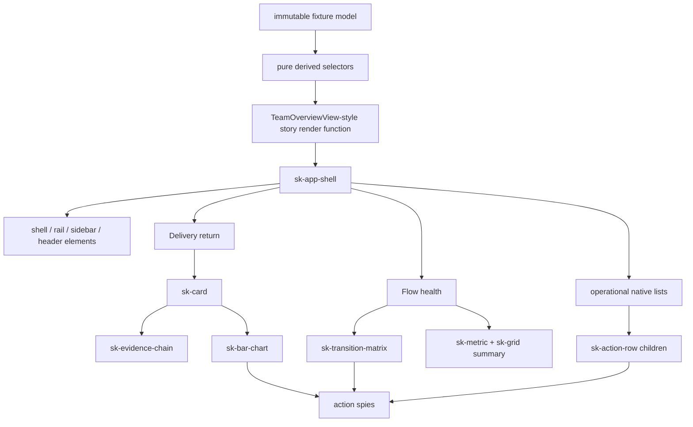

# Mission Specification: Team overview pattern story

**Mission Branch**: `mission/team-overview-pattern-story`  
**Created**: 2026-09-07  
**Status**: Specification complete — ready for planning  
**Input**: GitHub issue #150 under epic #144, the complete child-mission contracts, ADR-9,
ADR-10, ADR-11, the #76 authoring recipe, and the operator-approved Stitch references  
**Target**: One aggregate pull request into `train/elements-first` with `Refs #150`  
**Squad tier**: C — three independent Codex lenses pre-merge

## Outcome

Prove that the approved Team overview can be assembled in Storybook from the small public
elements delivered by #79 and #145–#149. The mission adds an immutable fixture, pure derived
selectors, a non-element render function, required pattern stories, interaction examples, and
focused accessibility/semantic/visual checks. It publishes no `sk-team-overview` element and owns
no application state, fetching, routing, timers, relative-time calculation, or product actions.

## Resolved decisions

- **RD-001 — Composition, not component:** the overview is a Storybook pattern composed from
  existing public elements and native semantic containers. The render function is not registered
  as a custom element and is not package API.
- **RD-002 — One source model:** one immutable raw fixture is the source of every repeated count,
  amount, label, date, route total, status total, and feed string. Pure selectors derive display
  projections; stories do not carry parallel hand-copied totals.
- **RD-003 — Honest arithmetic:** €1,840 total less €166 unattributed yields €1,674 attributed;
  `round(1674 / 1840 × 100)` yields 91%. The four full-coverage buckets sum to €1,674.
- **RD-004 — Items are not moves:** 50 open WPs derives only from status inventory; 62 moves derives
  only from transition cells. The story never reconciles or subtracts one from the other.
- **RD-005 — Stable dates:** `Tue 1`, `Wed 2`, `Thu 3`, and `Today · Fri 4` are fixture strings,
  not values generated from the runtime clock.
- **RD-006 — Controlled intent:** row, bar, and route events are connected to Storybook action spies.
  The story may project selected values from its controlled story args/harness, but no child or
  render helper silently owns application selection.
- **RD-007 — Existing public surfaces only:** composition uses the public properties, attributes,
  slots, events, parts, and tokens of the child missions. It does not pierce shadow roots or patch a
  child component to achieve page-specific styling.
- **RD-008 — Visual authority:** “Team overview — final review v4 approved” governs the complete
  screen; “Team overview — final review · clean v4” governs Flow health readability.
- **RD-009 — Dependency state:** #79 and #145–#149 are closed and their delivered commits are on the
  train before this mission starts. #150 is therefore unblocked at train commit `2bbbd7b`.
- **RD-010 — Delivery boundary:** merge only into `train/elements-first`; do not merge train to
  `main`, publish packages, or deploy Team Kitty.

## Product composition

The arrows describe ownership: fixture data flows downward and typed user intent flows outward.
No arrow represents child-owned fetching, routing, timers, or retained product selection.

## User Scenarios & Testing

### User Story 1 — Reproduce the approved overview honestly (Priority: P1)

As a Team Kitty integrator, I can inspect the approved dark overview assembled from public elements
and trust that repeated figures come from one coherent fixture.

**Why this priority**: the pattern exists to prove composition and content integrity before product
adoption; a visually accurate but arithmetically inconsistent mock is not evidence.

**Independent Test**: render the 1280px and 1440px approved stories, query the exported raw fixture
and selectors, and assert all displayed amounts/counts/labels equal the derived values and approved
references without private shadow-root reach-through.

**Acceptance Scenarios**:

1. **Given** total investment €1,840 and €166 unattributed, **when** Delivery return renders,
   **then** it displays €1,674 attributed through a rounded 91% label and the four full-window
   buckets sum exactly to €1,674.
2. **Given** evidence stages 1,840 → 42 → 6 → 2, **when** the card renders, **then** the labels frame
   these as investment, completed work, deployed missions, and verified outcomes—not guaranteed ROI.
3. **Given** quiet annotations `34 first pass` and `4 awaiting evidence`, **when** displayed,
   **then** they remain subordinate to their primary totals.
4. **Given** the approved component tree, **when** inspected, **then** every custom tag is an existing
   public element and there is no `sk-team-overview` definition.

---

### User Story 2 — Read flow health without conflating units (Priority: P1)

As an engineering lead, I can distinguish movement during the last 72 hours from the current open
inventory and read the transition matrix at both normal and 50-WP scale.

**Why this priority**: mixing moves with work items produces a convincing but false operational
story; the clean Flow health reference specifically exists to prevent that collapse.

**Independent Test**: assert the 62 transition moves from cells, the 50 open WPs from status counts,
the static date columns, legend vocabulary, route grammar, and the Scale50WPs geometry/semantics.

**Acceptance Scenarios**:

1. **Given** transition cells totalling 62, **when** Flow health renders, **then** it says
   `62 moves · last 72 hours` and does not derive this number from the open inventory.
2. **Given** status counts 12 planned, 21 in progress, 13 for review, and 4 blocked, **when** the
   current summary renders, **then** it displays 50 open WPs derived from exactly those counts.
3. **Given** fixed columns `Tue 1`, `Wed 2`, `Thu 3`, `Today · Fri 4`, **when** the runtime clock
   or timezone changes, **then** the story output does not change.
4. **Given** the aggregate scale fixture, **when** rendered narrowly and at product width, **then**
   routes retain `A → B` grammar, recovery/backward paths remain distinct, and no edge crossings,
   floating labels, or unreadable matrix cells appear.

---

### User Story 3 — Exercise controlled intent at the product seam (Priority: P1)

As an application implementer, I can activate a work row, chart datum, and transition route and see
their typed intent reach action spies without a child becoming the source of truth.

**Why this priority**: the story is the executable proof of the design/application boundary the
epic exists to establish.

**Independent Test**: activate each surface by its documented pointer/keyboard path, inspect the
action records, and verify the rendered selected projection changes only when the story harness
feeds a new controlled value back into the child.

**Acceptance Scenarios**:

1. **Given** the interaction story, **when** a selectable row, bar, or route is activated, **then**
   exactly the documented bubbling/composed event and detail reaches its named action spy.
2. **Given** an emitted selection intent, **when** the consumer has not changed the controlled
   value, **then** the child does not retain the new selection.
3. **Given** the story harness deliberately updates the controlled value, **when** rerendered,
   **then** visible and programmatic selection agree with that consumer value.

---

### User Story 4 — Preserve the composition across themes and narrow widths (Priority: P2)

As a reader using a light theme, keyboard, screen reader, or narrow viewport, I can navigate the
same information and actions without clipped regions, duplicate landmarks, hidden identity, or
color-only meaning.

**Why this priority**: a full-screen pattern can expose accessibility and reflow failures that each
child story cannot reveal in isolation.

**Independent Test**: render the identical fixture in LightMode and at 390px, run axe on every
pattern story, inspect keyboard/document order and overflow, and compare full-page plus high-risk
visual crops.

**Acceptance Scenarios**:

1. **Given** dark and LightMode stories, **when** their semantic content is compared, **then** text,
   counts, route cells, list order, and action names are identical; only theme presentation differs.
2. **Given** the 390px Narrow story, **when** traversed in document order, **then** shell, chart,
   matrix, summaries, and operational rows remain reachable and usable without page-level
   horizontal overflow.
3. **Given** the personal rail, **when** landmarks and links are enumerated, **then** exactly one
   account identity anchor appears in the bottom utility group immediately above logout.
4. **Given** every required story, **when** axe runs, **then** the render is non-empty and reports
   zero WCAG 2.1 AA violations.

---

### User Story 5 — Represent incomplete evidence without pretending completeness (Priority: P2)

As a reviewer, I can inspect empty or partial overview data and understand what is missing without
fabricated totals, unlabeled gaps, or unavailable actions disguised as links.

**Why this priority**: the overview is explicitly an evidence surface; missing proof must remain
visible rather than being smoothed into the approved happy path.

**Independent Test**: render the EmptyPartialData story and assert missing stages/buckets/rows carry
explicit labels, full-coverage arithmetic is not claimed, and non-link warnings are not link styled.

**Acceptance Scenarios**:

1. **Given** time buckets cover only part of the attribution window, **when** the chart renders,
   **then** the partial coverage is labelled next to it and no unexplained remainder is implied.
2. **Given** missing outcome evidence or operational rows, **when** rendered, **then** explicit empty
   or pending language replaces the absent content without inventing actions.
3. **Given** a warning that has no navigation target, **when** inspected, **then** it has no link
   role, href, underline affordance, or pointer-only interaction.

### Edge Cases

- Investment zero or less than unattributed is rejected by selectors instead of producing a false
  percentage; approved stories retain the binding positive values.
- Full-coverage time buckets must sum exactly to the attributed amount; partial coverage must carry
  a visible qualifier and may not reuse the full-coverage claim.
- Empty arrays yield deliberate empty states; missing fixture fields fail closed in tests instead of
  printing `undefined`, `NaN`, or guessed fallback totals.
- Only tones actually present in the transition fixture appear in the legend.
- The first Recent activity row may refer to the same underlying event as In flight only when its
  fixture identity and status pills remain consistent and a documented reason explains repetition;
  it may never be copied byte-for-byte accidentally.
- Lowercase commit hashes remain exact fixture strings through rendering.
- Attention amber represents at most two documented meanings across the composition; status change,
  off-branch information, and review state cannot all collapse into amber.
- Long team/repo/row labels wrap or truncate only under an existing public child contract and do not
  reorder marker → name → monospace reference → pills → right-aligned time.
- Removing or reordering raw rows, transition cells, or chart data recomputes every derived total and
  list projection without stale parallel constants.

## Requirements

### Functional Requirements

| ID | Title | Requirement / User Story | Priority | Status |
|---|---|---|---|---|
| FR-001 | Pattern-only surface | Add a Storybook Team overview pattern and fixtures without defining or exporting a `sk-team-overview` custom element. (US1) | High | Open |
| FR-002 | Immutable fixture | Export one deeply readonly raw fixture model for delivery, flow, shell, and operational content. (US1/US2) | High | Open |
| FR-003 | Pure selectors | Derive every repeated total, percentage, legend entry, chart series, matrix projection, and status summary through deterministic pure selectors. (US1/US2) | High | Open |
| FR-004 | Delivery arithmetic | Derive €1,674 and rounded 91% from €1,840/€166; full-coverage bucket values sum to €1,674. (US1) | High | Open |
| FR-005 | Evidence path | Render `€1,840 → 42 WPs → 6 missions → 2 verified`, the `Illustrative data` tag, evidence/proof framing, and subordinate 34/4 annotations. (US1) | High | Open |
| FR-006 | Bar composition | Compose the Delivery return card from `sk-card`, `sk-evidence-chain`, and `sk-bar-chart` through public inputs only. (US1) | High | Open |
| FR-007 | Separate flow units | Derive 62 moves only from transition cells and 50 open WPs only from status inventory. (US2) | High | Open |
| FR-008 | Fixed date columns | Supply the four binding date labels as fixture data with no clock or timezone dependency. (US2) | High | Open |
| FR-009 | Honest legend/routes | Show only present tones; use `A → B` grammar; distinguish recovery and explicit backward routes. (US2) | High | Open |
| FR-010 | Scalable matrix | Render aggregate route cells for the 50-WP scale without one edge/row per work package. (US2) | High | Open |
| FR-011 | Current summary | Compose 12/21/13/4 status counts and derived 50 total using `sk-metric` and `sk-grid` public surfaces. (US2) | High | Open |
| FR-012 | Shell composition | Compose `sk-app-shell` and the public rail/sidebar/header/navigation elements with exactly one account anchor above logout. (US1/US4) | High | Open |
| FR-013 | Operational grammar | Render native semantic lists whose `sk-action-row` children preserve marker → name → monospace reference → pills → right-aligned time. (US1) | High | Open |
| FR-014 | Feed integrity | Prevent byte-identical accidental duplication between In flight and Recent activity; preserve shared-event metadata when intentional. (US1) | High | Open |
| FR-015 | Color vocabulary | Limit attention amber to at most two documented meanings and retain distinct visual/semantic treatment for other states. (US1/US4) | High | Open |
| FR-016 | Controlled event demo | Wire row, bar, and route events to separately named Storybook action spies and demonstrate consumer-controlled selection. (US3) | High | Open |
| FR-017 | Approved stories | Provide `ApprovedDark`, including 1280px reference and 1440px product-width variants, plus `LightMode` with the same fixture. | High | Open |
| FR-018 | Responsive/scale stories | Provide `Narrow` at 390px and `Scale50WPs`, proving usable shell/chart/matrix/rows and readable aggregate cells. | High | Open |
| FR-019 | Interaction story | Provide an interaction story covering row, bar, and route intent with no child-owned selection. | High | Open |
| FR-020 | Empty/partial story | Provide an empty/partial-data story that labels missing evidence and partial chart coverage honestly. (US5) | High | Open |
| FR-021 | Theme/data parity | Reuse the exact raw fixture across ApprovedDark and LightMode and assert an identical semantic/data signature. (US4) | High | Open |
| FR-022 | Public-boundary proof | Compose through public element APIs with zero private shadow-root styling/query reach-through in story code. | High | Open |
| FR-023 | Story ratchet | Add every new pattern story ID to the committed story ratchet and make missing required stories fail by name. | High | Open |
| FR-024 | Pattern validation | Add explicit arithmetic, selector-purity, content-integrity, semantic, controlled-event, 390px reflow, and Scale50WPs assertions. | High | Open |
| FR-025 | Visual evidence | Add CI-authoritative full-composition baselines and focused crops for rail identity, delivery arithmetic, bar comparison, and matrix readability. | High | Open |
| FR-026 | Accessibility coverage | Run axe against every ratcheted pattern story and fail on load/empty-render errors. | High | Open |

### Non-Functional Requirements

| ID | Title | Requirement | Category | Priority | Status |
|---|---|---|---|---|---|
| NFR-001 | Arithmetic exactness | All full-coverage currency sums and all transition/status totals equal their raw fixture reductions exactly; the attribution label is the rounded percentage of raw values. | Correctness | High | Open |
| NFR-002 | Determinism | Repeated rendering under different clocks/timezones produces byte-identical dates, hashes, amounts, counts, row order, and derived selectors. | Reliability | High | Open |
| NFR-003 | Accessibility | Every required pattern story has a non-empty render and zero WCAG 2.1 AA axe violations. | Accessibility | High | Open |
| NFR-004 | Keyboard parity | Every documented interactive row/bar/route is keyboard reachable through the child contract and emits one event per activation with no story-only keyboard fork. | Accessibility | High | Open |
| NFR-005 | Narrow usability | At 390 × 844, all primary regions and actions remain reachable in document order with zero page-level horizontal overflow; child-owned internal scroll regions remain operable. | Usability | High | Open |
| NFR-006 | Scale readability | The 50-WP matrix has zero crossing edges, zero detached/floating labels, and every non-empty cell/route label remains visually and programmatically associated. | Usability | High | Open |
| NFR-007 | Theme parity | ApprovedDark and LightMode use one fixture and expose identical ordered semantic content before theme-only computed-style differences. | Visual | High | Open |
| NFR-008 | Visual coverage | CI records approved full-page dark 1280, dark 1440, light 1440, narrow 390, scale, interaction, and partial-data baselines plus four high-risk crops named in FR-025. | Visual | High | Open |
| NFR-009 | Storybook budget | The repository's checked Storybook build completes successfully below the enforced 180-second ceiling on the final rebased PR head. | Performance | Medium | Open |
| NFR-010 | Cross-browser | Semantic, controlled-event, and layout assertions pass in locally available Chromium/Firefox and in Chromium/Firefox/WebKit on exact-head CI. | Compatibility | High | Open |
| NFR-011 | Gate integrity | Type, lint, Storybook, story-ratchet, axe, visual, Playwright, release, security, generated-drift, behavior/mutation, and aggregate gates remain green after the final train rebase. | Maintainability | High | Open |

### Constraints

| ID | Title | Constraint | Category | Priority | Status |
|---|---|---|---|---|---|
| C-001 | Presentational boundary | No fetching, store, router, polling, timer, relative-time clock, product selector, or application action function enters the design library. | Architecture | High | Binding |
| C-002 | No public page element | Do not register, export, document, or generate a wrapper for `sk-team-overview`. | Scope | High | Binding |
| C-003 | Existing children | Reuse `sk-card`, `sk-grid`, `sk-button`, `sk-pill-tag`, `sk-nav-pill`, and all #145–#149 elements; do not create replacements or new design tokens for the composition. | Scope | High | Binding |
| C-004 | Child ownership | Do not modify another mission's component implementation or style through a private shadow-root seam. File a follow-up if a missing reusable contract is discovered. | Scope | High | Binding |
| C-005 | No Team Kitty coupling | No import, type, route, store, API model, or asset from Team Kitty is added. | Architecture | High | Binding |
| C-006 | Honest evidence | Do not imply guaranteed ROI, reconcile moves with items, hide missing evidence, or leave a full-coverage arithmetic gap. | Product integrity | High | Binding |
| C-007 | Warning semantics | A warning without a navigation target must not use link styling or link semantics. | Accessibility | High | Binding |
| C-008 | One aggregate mission PR | All #150 WPs consolidate into `mission/team-overview-pattern-story` and one PR targets `train/elements-first` with `Refs #150`; never use `Closes #150` on a pre-merge WP surface. | Delivery | High | Binding |
| C-009 | Serial final integration | Before final review, rebase the clean mission branch onto latest `origin/train/elements-first`, regenerate any shared committed artifacts, and rerun the complete repository-prescribed gates on the exact head. | Delivery | High | Binding |
| C-010 | No main/release/deploy | Never merge to `main`, merge train into main, publish packages, or deploy Team Kitty. | Authorization | High | Binding |
| C-011 | Codex-only review | Use Codex agents only; run three independent pre-merge lenses at the exact candidate SHA and preserve actionable findings through remediation/re-review. | Governance | High | Binding |

### Key Entities

- **TeamOverviewFixture**: deeply readonly raw content for shell, delivery, flow, and operational
  sections; the only source of repeated display facts.
- **DeliveryProjection**: pure derived totals, attribution percentage, evidence stages, and ordered
  bar series.
- **FlowProjection**: pure derived transition cells, 62-move total, present-tone legend, status
  inventory, and 50-open total.
- **OperationalEvent**: stable event identity, marker, name, lowercase reference, pills, timestamp,
  section membership, and optional documented repeat rationale.
- **TeamOverviewView**: non-registered story render result that feeds values into public children.
- **InteractionRecord**: Storybook action-spy observation of typed row, bar, or route intent.

## Success Criteria

### Measurable Outcomes

- **SC-001**: All required stories render from one fixture and all arithmetic/content assertions pass.
- **SC-002**: Delivery return displays €1,840, €166, €1,674, rounded 91%, 42, 6, 2, 34, and 4 with
  the exact required relationships and no unexplained €34 gap.
- **SC-003**: Flow health independently derives 62 moves and 50 open WPs (12 + 21 + 13 + 4), with
  the four exact fixture date columns and only present legend tones.
- **SC-004**: Row, bar, and route activations each reach a distinct action spy and no child changes
  controlled selection before a consumer value is supplied.
- **SC-005**: Exactly one account identity anchor appears above logout and no operational row is an
  unexplained byte-for-byte duplicate.
- **SC-006**: Every required pattern story passes axe with zero WCAG 2.1 AA violations.
- **SC-007**: At 390 × 844 there is zero page-level horizontal overflow and all regions/actions are
  reachable in document order.
- **SC-008**: Scale50WPs has zero crossing edges, floating labels, or unreadable/unowned cells.
- **SC-009**: All full-page and targeted CI-authoritative baselines receive explicit visual-review
  disposition against the approved Stitch references.
- **SC-010**: The final branch is rebased on latest train, all mandatory local/exact-head CI gates
  pass, three Codex lenses approve, and only `train/elements-first` is merged.
