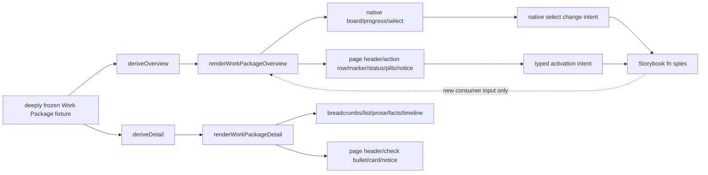

# Implementation Plan: Work Package overview/detail pattern stories

**Branch**: `mission/work-package-view-pattern-stories` | **Date**: 2026-09-07 | **Spec**:
`kitty-specs/work-package-view-pattern-stories-01M1YNPC/spec.md`  
**Input**: GitHub issue #214, epic #208, closed predecessors #178/#209–#213, ADR-9/10/11,
the current authoring recipe, and the approved T10/T11 references  
**Planning base**: `origin/train/elements-first@f026d6939e0a6037b8b5ad04cc97d53e3e7eecec`

## Summary

Add one Storybook-only Work Package views composition module under
`packages/elements/src/patterns/`. Keep its deeply readonly fixture graph, pure selectors,
overview/detail render functions, route-state projections, story args, and action spy wiring in
the excluded `*.stories.ts` file so Team Kitty-shaped sample data cannot enter the published
elements build. Load the predecessor styles-only CSS only from Storybook's sanctioned preview
seam. Exercise the built stories through a dedicated cross-browser Playwright suite, ratchet every
new story into axe, append composition-level visual cases and CI-authoritative baselines, and add a
short public composition/ownership section to the usage guide.

One cohesive work package owns this story/test/documentation slice. Separating fixture/selectors
from renderers would either publish domain-shaped helpers accidentally or create independently
unacceptable partial stories; separating overview and detail would duplicate the same fixture and
break #214's one-source condition.

## Technical Context

**Language/Version**: TypeScript 5.x, Lit 3.3 templates, modern browser JavaScript, HTML/CSS  
**Primary Dependencies**: Storybook 10.6 web-components/Vite, `storybook/test` spies, existing
`@spec-kitty/styles` and `@spec-kitty/elements` public surfaces, Playwright 1.62, axe-playwright,
Vitest 4.1  
**Storage**: N/A; deterministic deeply frozen in-memory story fixtures only  
**Testing**: Storybook play assertions, focused Chromium/Firefox/WebKit Playwright semantic and
interaction checks, existing axe scanner over the story ratchet, Chromium visual regression,
repository generation/quality/behavior/mutation/release/security gates  
**Target Platform**: built static Storybook and evergreen Chromium/Firefox/WebKit  
**Project Type**: Nx monorepo; documentation-only Storybook pattern composition  
**Performance Goals**: existing fail-closed Storybook build under 180 seconds  
**Constraints**: no custom element, package API, token, copied component CSS, private shadow-root
selector, Team Kitty import, router, fetch/store, timer, clock, parsing, trust inference, or
application-owned transition  
**Scale/Scope**: fifteen discoverable stories; eight-item T10 base fixture with five complete;
fifty-item scale fixture; one populated T11 Work Package; desktop, narrow/mobile, and 200% zoom

## Planning decisions

### PD-001 — Story discovery and package exclusion

Create `packages/elements/src/patterns/work-package-views.stories.ts` with Storybook title
`Patterns/Work Package Views`. `packages/elements/tsconfig.lib.json` excludes `src/**/*.stories.ts`
and both bundle entry points reach only their explicit package barrels, so the fixture, selectors,
and render helpers remain Storybook-only. Do not create an ordinary helper module or add a package
barrel export.

### PD-002 — One fixture graph, explicit projections

Define one `WORK_PACKAGE_VIEW_FIXTURE` and freeze it recursively. The root owns consumer-supplied
lane definitions/order, a fixture-owned fifty-record Work Package catalog (with the T10 eight-item
view expressed as fixture-owned membership), a consumer-supplied `completedLaneId`, the selected
Work Package's subtasks/prompt/facts/history, claim classifications/text, snapshot/retention
messages, actor/time/trust strings, and default controlled selection. From it:

- `deriveOverview(fixture, options)` projects only fixture-owned records, flattens lane items once,
  counts the fixture-supplied `completedLaneId` without interpreting a hard-coded lane value,
  computes `total`, `completed`, and `Math.round(completed / total * 100)` with a zero-total branch, derives
  per-lane counts, and returns the consumer-selected visible-lane projection;
- `deriveDetail(workPackage, options)` projects supplied subtasks/prompt/facts/events in source
  order and derives checklist complete/total without interpreting content;
- route-state options select fixture-owned membership/availability flags from the same graph.
  They neither synthesize extra domain records nor carry independent visible totals.

Invalid duplicate Work Package IDs, duplicate DOM IDs, membership in more than one lane, or an
unknown selected lane fail closed in selector/play evidence rather than silently producing a
convincing story.

### PD-003 — Fifteen separately addressable stories

The planned CSF exports are:

1. `Default` — T10 populated, default dark;
2. `LightMode` — the identical T10 fixture in `.sk-light`;
3. `AllLanesEmpty`;
4. `Scale50WorkPackages`;
5. `LiveClaim`;
6. `StaleClaim`;
7. `SnapshotBehindLog`;
8. `NarrowOverview`;
9. `DetailPopulated` — T11 default dark;
10. `DetailLightMode` — identical T11 fixture in `.sk-light`;
11. `DetailNoSubtasks`;
12. `DetailAbsentPrompt`;
13. `DetailHistoryUnavailable`;
14. `DetailLongContent`;
15. `DetailNarrow`.

The CSF `meta.excludeStories` enumerates every exported fixture, selector, and render helper so
only the fifteen named story exports enter discovery. The built `index.json` owns the final
normalized IDs. After rebasing the current train and building, add those exact fifteen IDs beneath
a `work-package-views` key in the authored `expected-stories.json`, updating its total from the
then-current train total by exactly +15. Generated docs entries and helper exports are not counted.

### PD-004 — Styles-only CSS enters at the Storybook seam

Add imports for `workflow-board`, `workflow-lane`, `progress`, `form-field`, `form-select`,
`breadcrumbs`, `prose`, and `event-timeline` CSS to `apps/storybook/.storybook/preview.ts`, beside
the existing facts/disclosure/empty-state imports. This is the only project layer permitted to
reach both styles and elements. All selectors are component-scoped, so unrelated stories are
unchanged. The pattern file may author only composition layout rules and every design value in
those rules must be an existing `var(--sk-*)`; it never copies a predecessor declaration.

### PD-005 — Native overview structure and conditional overflow

Render `.sk-workflow-board` with a heading and `.sk-workflow-board__scroller`. Each lane is a native
`section` named by its heading and contains one native `ol`; each Work Package is one direct `li`
containing `sk-action-row[layout="card"]` and public child slots. Empty lanes retain the list and add
the passive `.sk-empty-state--inline` content outside the empty `ol` but inside the named section.

The ordinary desktop story does not add a redundant region/tab stop when its board fits. The scale
and narrow scenarios that demonstrably overflow add the exact conditional triad to the scroller:
`role="region"`, a distinct accessible name, and `tabindex="0"`. Live/stale claim meaning is
supplied visible text; only live adds the public `pulsing` presentation.

Progress is exactly `label[for] + progress[id][value][max] + span`; visible counts/percentage and
non-empty DOM values come from the derived projection. For visible `0 of 0`/`0%`, set valid native
DOM properties `value=0` and `max=1` and prove the properties, avoiding the browser's invalid zero
maximum fallback. The narrow selector is a native labelled `select` with real options and
renders only the selected lane supplied by args/options; its `change` intent is logged but does not
become an application router.

### PD-006 — Controlled activation proof

Story args carry `selectedWorkPackageId`, `visibleLaneId`, and distinct `fn()` callbacks for work
item activation and lane choice. Render helpers assign `selected` from the controlled ID. The
listener records the exact public event detail and never writes that ID. A play function and the
real Playwright suite activate cards by pointer, Enter, and Space, assert one event per activation,
and assert selected presentation is unchanged until the story is rendered with another supplied
ID.

### PD-007 — Native detail structure and availability states

Render breadcrumb `nav > ol > li > a` with one `aria-current="page"` terminal crumb, then a public
page header. The subtask area is a native `ul` whose direct children are passive
`sk-check-bullet[state][role="listitem"]`; do not add wrapper `li`, checkbox semantics, controls, or
a host tabindex. Prompt content is consumer-authored
Lit HTML placed under `.sk-prose`; no string-to-HTML parser exists. Facts remain a native `dl`
inside base `sk-card`. History is a native `.sk-event-timeline` ordered list preserving input order,
with supplied marker text.

No-subtasks and absent-prompt use the existing empty-state treatment. Unavailable retained history
uses `sk-notice` only when the fixture marks the message for announcement. Long prompt code is
contained by `pre`; long event metadata stays within its event. Narrow detail uses an explicit
single-column render option rather than a JavaScript viewport observer.

### PD-008 — Visual intent and provenance

The named T10/T11 Stitch URLs currently expose only the generic unauthenticated app shell, so no
unseen pixel value is copied or claimed. Compare the composed views qualitatively against #208's
transcribed intent and quantitatively against the accepted child components' committed Ubuntu
baselines. CI-authoritative captures are added only for new #214 story IDs; all legacy snapshot
bytes must remain unchanged.

Planned visual cases cover:

- full T10 dark desktop, T10 light desktop, and narrow overview;
- scale board overflow and progress crops;
- live and stale claim crops;
- full T11 dark desktop, T11 light desktop, and narrow detail;
- mixed checklist and event-history connector crops;
- long prompt/code containment.

The exact case count may consolidate multiple focused targets into one route-state image when the
selector makes both risks unambiguous, but every named risk remains independently asserted.

### PD-009 — Documentation seam

Append a concise “Work Package view patterns” section to
`docs/design-system/using-components.md`. It links the two Storybook patterns, shows the immutable
fixture → pure selectors → render functions relationship, lists the public composed surfaces, and
states that routing, fetching, timers, claim expiry, progress inputs, Markdown/sanitization, event
ordering/trust, and selected state remain application-owned. It documents no package import for the
Storybook-only helpers.

## Architecture and data flow



## Test strategy

### Story/play invariants

- prove root and nested fixture values, including all fifty scale records, are frozen;
- prove overview 5/8 and its rounded percentage from lane items and supplied `completedLaneId`,
  empty visible 0/0 with DOM `value=0,max=1`, scale total 50 without fabricated records, and
  every visible lane count;
- prove detail checklist totals from its subtask array and event order/string identity;
- prove dark/light semantic signatures are byte-equivalent;
- prove no `sk-work-package-*`, stateful Kanban, Team Kitty import, clock/timer/fetch/router/parser,
  or private shadow selector occurs in the source;
- prove action and select intent never mutate controlled args.

### Dedicated Storybook Playwright suite

Create `apps/storybook/src/tests/sk-work-package-view-patterns.spec.ts` and exercise the real built
stories in Chromium, Firefox, and WebKit. It asserts:

- exactly fifteen story-state entries, with all helper exports absent, and non-empty upgraded content;
- native landmark/list/progress/select/options/checklist/timeline semantics and label associations,
  including direct-child check bullets with `role=listitem` and no checkbox/tabindex;
- 5/8 arithmetic from supplied completion semantics, valid zero-state progress DOM properties,
  fixture-owned 50-item derivation, per-lane/list count equality, and unique IDs;
- live/stale supplied text and animation/static distinction without a clock;
- snapshot/history messages use real `sk-notice`, ordinary absence does not;
- pointer/Enter/Space action-row activation and unchanged controlled selection;
- native select keyboard choice and one-lane projection;
- breadcrumb-to-content keyboard walkthrough and visible focus geometry;
- dark/light data signature equality and token-resolved presentation difference;
- desktop/narrow/200%-zoom page containment, with only board/code scrollers permitted to overflow;
- long code/history local containment and metadata attachment.

### Axe and visual

After the final train rebase, exactly the fifteen built story IDs enter the authored
`expected-stories.json`; the total moves from that train's current value by +15, putting every
state under the existing non-empty, zero-WCAG-2.1-AA axe gate. Extend `apps/storybook/src/tests/visual.spec.ts` with the new
full-route and focused captures in PD-008. Obtain snapshots from the Ubuntu CI artifact, inspect
them, commit only the intended new files, and rerun the exact-head workflow.

### Regression and drift gates

Run focused pattern tests first. Regenerate CSS modules, static markup/barrels, CEM, React wrappers,
Vue types, and the size report, but expect byte-zero product drift in all of them. Run all exact
repository gates: type checks, `quality:all`, behavior, mutation/selftest, Storybook build, axe,
full Playwright, visual regression, release packaging/offline checks, security/audit, and
commitlint. A train rebase or later push invalidates CI, desktop zoom, and all adversarial reviews.

## Charter Check

| Charter / doctrine gate | Plan |
|---|---|
| Token authority | Reuse existing tokens for pattern layout; no raw design constants or token changes. |
| Elements-first boundary | Compose public elements and native styles; no page element or wrapper. |
| Accessibility | Native relationships, every story in axe, keyboard/focus and overflow checks. |
| Behavior proof | Exercise existing action-row/select behavior; no new behavior-registry subject. |
| Generated fidelity | Regenerate and require no unintended CEM/React/Vue/CSS/markup/SIZES drift. |
| Canonical markup | One story module authors each composition; tests exercise it through Storybook. |
| Review | Tier C plus mandatory four-lens exact-head Codex adversarial gate. |
| Delivery | One PR into train only; no main, publish, release, or deployment. |

No charter exception or new architectural decision is required.

## Project Structure

### Documentation (this mission)

```text
kitty-specs/work-package-view-pattern-stories-01M1YNPC/
├── spec.md
├── plan.md
├── research.md
├── data-model.md
├── quickstart.md
├── tasks.md
├── acceptance-matrix.json
├── issue-matrix.json
└── tasks/
    └── WP01-work-package-view-patterns-and-proof.md
```

### Source code

```text
packages/elements/src/patterns/
└── work-package-views.stories.ts

apps/storybook/.storybook/
└── preview.ts

apps/storybook/src/tests/
├── sk-work-package-view-patterns.spec.ts
├── visual.spec.ts
└── visual.spec.ts-snapshots/
    └── work-package-*.png

docs/design-system/
└── using-components.md

expected-stories.json
```

**Structure Decision**: keep all domain-shaped pattern implementation in one excluded story file,
load native styles at the existing Storybook-only cross-layer seam, and keep executable acceptance
at the real built-story layer.

## Implementation Concern Map

### IC-01 — Immutable fixture and derived projections

- **Purpose**: make every repeated count, percentage, lane, checklist, claim, and history output
  traceable to one immutable consumer input.
- **Relevant requirements**: FR-002–FR-005, FR-010; NFR-001–NFR-002, NFR-007.
- **Affected surfaces**: `work-package-views.stories.ts`.
- **Sequencing/depends-on**: none.
- **Risks**: copied totals, duplicate IDs, accidental mutation, clock-derived claim state.

### IC-02 — Public overview/detail composition

- **Purpose**: assemble T10/T11 through native semantics and predecessor APIs only.
- **Relevant requirements**: FR-001, FR-004, FR-007–FR-014, FR-017–FR-018.
- **Affected surfaces**: story module, preview CSS seam, usage guide.
- **Sequencing/depends-on**: IC-01.
- **Risks**: shadow reach-through, copied CSS, dead scroller tab stop, wrong empty/notice choice,
  page-element invention.

### IC-03 — Controlled intent and native keyboard behavior

- **Purpose**: demonstrate events without adding routing or retained story/application state.
- **Relevant requirements**: FR-006, FR-008, FR-015; NFR-004.
- **Affected surfaces**: story args/play function and focused Playwright suite.
- **Sequencing/depends-on**: IC-01, IC-02.
- **Risks**: action logging mistaken for state ownership, duplicate activation, synthetic-only proof.

### IC-04 — Accessibility, responsive, and visual acceptance

- **Purpose**: prove the complete routes at scale/theme/width/zoom, not just isolated children.
- **Relevant requirements**: FR-014–FR-020; NFR-003, NFR-005–NFR-011.
- **Affected surfaces**: expected-stories, Playwright suite, visual suite/snapshots, repository gates.
- **Sequencing/depends-on**: IC-02, IC-03.
- **Risks**: page overflow, clipped focus, inaccessible native relationships, stale/host-specific
  baselines, legacy snapshot drift.

## Work-package shape

One work package, `WP01 — Work Package views patterns and proof`, covers implementation and
verification. It is independently testable only as a complete composition slice: fixture,
selectors, both renderers, all required state stories, documentation, semantic/interaction tests,
axe ratchet, and visual evidence. Partial WPs would be fakeable or duplicate the canonical fixture.

## Complexity Tracking

No charter violation requires justification.
