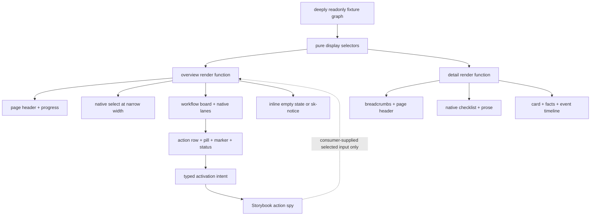

# Mission Specification: Work Package overview/detail pattern stories

**Mission Branch**: `mission/work-package-view-pattern-stories`  
**Created**: 2026-09-07  
**Status**: Specification complete — ready for planning  
**Input**: GitHub issue #214 under epic #208, closed predecessors #178 and #209–#213,
ADR-9, ADR-10, ADR-11, the current component-authoring recipe, and the approved T10/T11
Stitch references named by #208  
**Target**: One pull request into `train/elements-first` with `Refs #214` and `part of #208`  
**Squad tier**: C — pre-merge

## Outcome

Prove that the approved T10 Work Package overview and T11 Work Package detail routes can be
assembled in Storybook from public design-system surfaces. The mission adds non-registered
pattern render functions, deeply immutable fixture data, deterministic pure display selectors,
required route-state stories, and composition-level semantic, interaction, accessibility,
responsive, and visual evidence.

It does not publish a Work Package page element or introduce application behavior. Team Kitty
continues to own data loading, routing, mutable application state, lane definitions and changes,
claim and heartbeat expiry, time formatting, event ordering and trust decisions, progress
arithmetic outside the fixture selectors, and prompt parsing or sanitization.

## Authority and source evidence

- GitHub issue #214 is the binding implementation and acceptance contract; epic #208 fixes the
  programme-wide ownership boundary.
- T10 screen `ac34a994f4eb4c058d0744bf757713ab` and T11 screen
  `cd2b2a22c0cc43d6b53c69a76dd6df7d` in Stitch project `13081441628826430456` supply approved
  visual intent only.
- Both screen URLs were probed directly on 2026-09-07. The unauthenticated response returned the
  generic Stitch application shell and Google account-login wiring, not a project screen payload.
  Checked-in predecessor evidence records the same limitation. This mission therefore makes no
  claim about unseen pixel measurements and does not invent replacement design values.
- The accepted public surfaces on the current train, their maintained stories, and their
  CI-authoritative baselines provide the executable visual and behavior vocabulary. Where the
  external reference is unavailable, existing authoritative `--sk-*` tokens and #214's explicit
  state contract govern the composition.

## Binding decisions already made

- **BD-001 — Pattern, never page element:** overview and detail are Storybook-only compositions.
  No `sk-work-package-overview`, `sk-work-package-detail`, `sk-work-package-card`, stateful
  `sk-kanban`, or other page-level custom element is registered or exported.
- **BD-002 — Public composition only:** use the public classes, slots, properties, attributes,
  events, parts, and native semantics delivered by #178 and #209–#213. The pattern neither reaches
  through shadow roots nor copies component CSS.
- **BD-003 — One immutable source model:** one deeply readonly fixture graph supplies Work
  Packages, lanes, subtasks, claims, prompt markup inputs, actors, times, event ordering, and trust
  labels. Pure selectors derive every repeated completion count and percentage; stories do not
  maintain parallel display totals.
- **BD-004 — Supplied decisions remain supplied:** live/stale claim classification, stale advisory
  copy, actor/time text, trust tier, history availability, prompt HTML, and lane value are fixture
  inputs. No selector reads a clock, verifies a transition, parses Markdown, or moves a Work
  Package.
- **BD-005 — Controlled intent:** overview card activation reaches a named Storybook action spy.
  Selected presentation is supplied explicitly by story input and does not change merely because
  an activation event fired. The story owns no router or retained application store.
- **BD-006 — Native relationships survive:** board lanes remain native sections and lists; progress
  remains a labelled native `progress`; the narrow chooser remains a light-DOM `select` with real
  options; breadcrumbs, checklist, prompt prose/code, facts, and history retain the native
  relationships their public surfaces require.
- **BD-007 — Existing notice authority:** snapshot-behind-log and retention-unavailable messages
  use `sk-notice` only when announcement semantics are required. No local banner/notice is built.
- **BD-008 — Delivery boundary:** merge only into `train/elements-first`; do not merge the train to
  `main`, publish, release, tag, deploy, or adopt the patterns in Team Kitty.

## Composition map

The arrows are ownership boundaries: fixture values flow inward and typed intent flows outward.
There is no application feedback loop inside the library pattern.

## User Scenarios & Testing

### User Story 1 — Inspect the approved Work Package overview composition (Priority: P1)

As a Team Kitty integrator, I can inspect the populated T10 overview assembled from public
surfaces and trust that its lane inventory, count text, and completion progress describe one
coherent fixture.

**Why this priority**: the overview composition is half of the epic's proof and is the only place
the independent TKW primitives demonstrate their intended shared layout.

**Independent Test**: render the populated overview, inspect the accessibility tree and exported
fixture/selectors, and assert the five lanes, native lists, 5-of-8 count, native progress values,
visible percentage, work-item content, and activation evidence all agree without private API use.

**Acceptance Scenarios**:

1. **Given** eight fixture Work Packages with five in the completed lane, **when** the overview
   renders, **then** the label says `5 of 8 Work Packages done`, native progress has `value=5` and
   `max=8`, and visible metadata contains the selector-derived rounded percentage.
2. **Given** the five consumer-supplied lanes, **when** the board is inspected, **then** each lane is
   a labelled native section with a native ordered list and the visible count equals its list.
3. **Given** a claimed Work Package, **when** its compact card is read, **then** marker, title,
   reference, tags, metadata, controls, and supplied claim status follow the public action-row
   composition and no status-toned Work Package card is invented.
4. **Given** a selectable overview item, **when** it is activated by pointer, Enter, or Space,
   **then** its documented intent is logged once while selected presentation remains controlled by
   the story input.

---

### User Story 2 — Inspect the approved Work Package detail composition (Priority: P1)

As a Team Kitty integrator, I can inspect the populated T11 detail route with stable orientation,
read-only execution content, supplied metadata, and trustworthy native reading order.

**Why this priority**: the detail composition is the second half of the epic's proof and must show
that no execution-panel or full-page component is needed.

**Independent Test**: render the populated detail route and assert breadcrumb navigation, heading
hierarchy, native checklist state, prompt prose/code, facts, and ordered event history against the
same Work Package fixture.

**Acceptance Scenarios**:

1. **Given** repository, mission, and Work Package labels, **when** the detail renders, **then** a
   labelled breadcrumb navigation contains native links and exactly one terminal current crumb.
2. **Given** mixed complete and pending fixture subtasks, **when** the checklist is read, **then** it
   remains a native list of passive `sk-check-bullet` items whose announced states and ordering
   match the immutable data and offer no toggle control.
3. **Given** supplied prompt HTML containing prose and code, **when** rendered, **then** `.sk-prose`
   owns readable layout and code overflow while the story performs no Markdown parsing,
   sanitization, highlighting, or copy behavior.
4. **Given** ordered supplied events with actor/time/trust labels, **when** the timeline renders,
   **then** the native ordered list preserves those strings and order verbatim without sorting,
   verification, tone inference, or clock access.

---

### User Story 3 — Review required empty, degraded, claim, and scale states (Priority: P1)

As a reviewer, I can inspect every route state named by #214 without the pattern fabricating
missing data or hiding stale/unavailable evidence.

**Why this priority**: a happy-path-only pattern cannot demonstrate the application/library seam or
the resilience requirements of the approved views.

**Independent Test**: render separately addressable overview and detail stories for every required
state and verify their semantic content, fixture derivation, notice choice, overflow ownership, and
absence of application behavior.

**Acceptance Scenarios**:

1. **Given** empty lane arrays, **when** the all-lanes-empty overview renders, **then** each labelled
   lane retains its native empty list context and uses the public inline empty-state treatment.
2. **Given** fifty Work Packages, **when** the scale overview renders, **then** lane counts and
   progress derive from the fixture and board overflow remains reachable inside the board rather
   than widening the page.
3. **Given** fixture-supplied live and stale claims, **when** their stories render, **then** live uses
   the public pulsing marker plus visible text, stale is a static advisory and never blocks card
   activation, and neither state is calculated from runtime time.
4. **Given** a snapshot-behind-log condition that requires announcement, **when** rendered, **then**
   the message is an `sk-notice` and not local banner markup.
5. **Given** no subtasks, no prompt, or unavailable retained history, **when** each detail state
   renders, **then** deliberate public empty/notice compositions replace absent data and no content
   is guessed.
6. **Given** long prompt/code and long history, **when** the detail is narrow, **then** code/timeline
   overflow is locally contained and event metadata remains attached to its event.

---

### User Story 4 — Preserve semantics and content across themes and narrow routes (Priority: P2)

As a keyboard, screen-reader, zoom, light-theme, or narrow-screen user, I can reach and understand
the same supplied Work Package data without clipped focus or page-level horizontal scrolling.

**Why this priority**: full-route composition exposes landmark, source-order, focus, and overflow
failures that isolated child stories cannot reveal.

**Independent Test**: run axe on every pattern story; compare dark and LightMode semantic/data
signatures; execute a keyboard walkthrough from breadcrumbs through overview items and detail
content; measure document overflow at approved desktop and narrow/mobile widths.

**Acceptance Scenarios**:

1. **Given** default dark and `LightMode`, **when** their semantic/data signatures are compared,
   **then** fixture-derived text, counts, selected item, lists, subtasks, events, and order are
   identical; only token-resolved theme presentation differs.
2. **Given** the narrow overview, **when** the consumer-selected native lane option is changed,
   **then** exactly one supplied lane is visible and the native select remains keyboard/typeahead
   operable; the story demonstrates intent without taking route ownership.
3. **Given** desktop and narrow layouts, **when** focus moves from breadcrumb links through
   overview items and detail controls/links, **then** every focus indicator remains visible and no
   interactive descendant receives an unintended duplicate stop.
4. **Given** any required route-state story, **when** axe runs, **then** the rendered root is
   non-empty and reports zero WCAG 2.1 AA violations.
5. **Given** approved desktop width, narrow/mobile width, and 200% browser zoom, **when** document
   geometry is measured, **then** the page scroll width does not exceed its viewport; only the
   board and code block may own reachable horizontal overflow.

### Edge Cases

- A fixture with zero Work Packages derives zero completed, zero total, and a supported zero
  progress presentation without dividing by zero or printing `NaN`.
- Moving an item between fixture lanes or changing a subtask state recomputes every affected count
  and percentage; no stale display constant remains.
- Unknown lane values are not inferred into a color or status vocabulary by the pattern.
- Live and stale claim strings are stable fixture content; changing wall-clock time does not change
  the rendered classification.
- Empty histories that are ordinary absence use `.sk-empty-state`; only a supplied condition that
  genuinely needs announcement uses `sk-notice`.
- Absent prompt content does not render an empty code region or parse a fallback string.
- Long breadcrumb labels preserve their full accessible names while visual overflow remains inside
  the breadcrumb region.
- Long code lines can scroll inside `pre`; the document cannot scroll sideways.
- Event sequence, actor, time, and trust labels remain in fixture order even if lexical or
  chronological sorting would produce a different order.
- An activation event never updates selected state unless a new controlled value is supplied to a
  subsequent render.

## Requirements

### Functional Requirements

| ID | Title | Requirement | Priority | Status |
|---|---|---|---|---|
| FR-001 | Pattern-only exports | Add Storybook pattern render functions and stories without registering or publishing a Work Package overview/detail element. | High | Open |
| FR-002 | Immutable fixture graph | Export one deeply readonly fixture graph containing overview lanes/items and the populated detail Work Package with subtasks, prompt, facts, claims, and history. | High | Open |
| FR-003 | Pure derivation | Derive completed/total/percentage, per-lane counts, visible-lane projection, and checklist summaries with deterministic side-effect-free selectors. | High | Open |
| FR-004 | Populated T10 overview | Compose page header, labelled native progress, five-lane workflow board, compact action-row items, pills, markers, statuses, and inline empty treatment from public surfaces. | High | Open |
| FR-005 | Overview progress integrity | Render every overview count and percentage from the same Work Package arrays that populate the lanes. | High | Open |
| FR-006 | Controlled activation | Log the documented action-row activation intent once and require selected presentation to come from explicit story input. | High | Open |
| FR-007 | Overview state stories | Provide populated, all-empty, 50-WP scale, live-claim, stale-claim, snapshot-behind-log, and narrow-one-visible-lane stories. | High | Open |
| FR-008 | Native narrow selector | Compose the public light-DOM form-select structure with real options; selected lane and visibility are consumer-supplied inputs. | High | Open |
| FR-009 | Populated T11 detail | Compose breadcrumbs, page header, native passive checklist, prose/code, card, facts, and native event timeline from public surfaces. | High | Open |
| FR-010 | Detail input fidelity | Render supplied subtask state, prompt HTML, fact values, event order, actor/time text, and trust labels verbatim from the fixture. | High | Open |
| FR-011 | Detail state stories | Provide populated, no-subtasks, absent-prompt, unavailable-history, long-prompt/code-and-history, and narrow-single-column stories. | High | Open |
| FR-012 | Notice reuse | Use `sk-notice` for snapshot/retention messages only where the fixture requests announcement semantics; create no local banner. | High | Open |
| FR-013 | Theme parity | Provide default dark and required `LightMode` stories that consume identical fixture data and selector outputs. | High | Open |
| FR-014 | Native structure | Preserve native navigation, headings, sections, lists, list items, labels, progress, select/options, facts, prose, code, and time relationships. | High | Open |
| FR-015 | Keyboard walkthrough | Prove keyboard traversal from breadcrumb through overview activation and detail links/content without clipped focus or unintended stops. | High | Open |
| FR-016 | Overflow ownership | Keep horizontal overflow inside board/code regions; the composed page never exceeds the viewport at required widths or zoom. | High | Open |
| FR-017 | Public-surface guard | Verify the composition uses no private shadow selector, copied component CSS, Team Kitty import, or unregistered invented component. | High | Open |
| FR-018 | Ownership documentation | Document fixture/selector/pattern inputs and the boundary between library presentation/intent and Team Kitty application behavior. | High | Open |
| FR-019 | Visual evidence | Add CI-authoritative desktop and narrow visual baselines plus focused crops for board overflow, progress, claims, checklist state, and history connector. | High | Open |
| FR-020 | Story accessibility | Ratchet every new story into the existing axe scan and require a non-empty render with zero WCAG 2.1 AA violations. | High | Open |

### Non-Functional Requirements

| ID | Title | Requirement | Category | Priority | Status |
|---|---|---|---|---|---|
| NFR-001 | Determinism | Repeated rendering of one fixture and selector input produces byte-equivalent semantic/data content and does not read time, random values, network, storage, or route state. | Reliability | High | Open |
| NFR-002 | Fixture coherence | 100% of displayed completion totals, percentages, and lane/checklist counts reconcile with the raw fixture in executable tests. | Data integrity | High | Open |
| NFR-003 | Accessibility | Every emitted pattern story is non-empty and axe-clean at WCAG 2.1 AA; required landmarks and native relationships are asserted explicitly. | Accessibility | High | Open |
| NFR-004 | Keyboard parity | Pointer, Enter, and Space activation each emit one equivalent public intent; native select keyboard behavior remains platform-owned. | Accessibility | High | Open |
| NFR-005 | Responsive containment | At approved desktop, narrow/mobile, and 200% zoom widths, document scroll width is no greater than viewport width; only named board/code containers may overflow. | Responsive | High | Open |
| NFR-006 | Theme equivalence | Dark and LightMode semantic/data signatures are exactly equal while at least one authoritative theme token resolves differently. | Theming | High | Open |
| NFR-007 | Scale | The 50-WP fixture renders exact list/count/progress totals without clipping, duplicate IDs, or page-level overflow. | Scale | High | Open |
| NFR-008 | Visual coverage | CI-authoritative Chromium baselines cover required complete routes and focused board/progress/claim/checklist/timeline risks at desktop and narrow widths. | Visual | High | Open |
| NFR-009 | Build budget | Storybook remains under the repository's enforced 180-second CI ceiling. | Performance | Medium | Open |
| NFR-010 | Cross-browser | Focused composition tests pass in Chromium, Firefox, and WebKit with documented engine-inapplicable skips only. | Compatibility | High | Open |
| NFR-011 | Repository gates | Generation drift, type, lint, behavior, mutation, Storybook, axe, Playwright, visual, quality, release, and security gates pass on the exact PR head. | Quality | High | Open |

### Constraints

| ID | Title | Constraint | Category | Priority | Status |
|---|---|---|---|---|---|
| C-001 | Token authority | Every composition design value uses an existing authoritative `--sk-*` token; no new raw color, spacing, radius, typography, shadow, motion, or z-index value is introduced. | Architecture | High | Open |
| C-002 | Dependency direction | Preserve tokens → styles → elements → generated React wrappers; this story-only mission adds no reverse dependency or framework wrapper source. | Architecture | High | Open |
| C-003 | No page component | Do not register/export a Work Package page, card, Kanban, execution panel, metadata panel, checklist, or status-card component. | Scope | High | Open |
| C-004 | No application state | No router, fetch/store, timer, polling, live update, claim expiry, lane transition, drag/drop, filter logic, or progress arithmetic beyond pure fixture selectors. | Scope | High | Open |
| C-005 | No content interpretation | No Markdown parser/sanitizer, syntax highlighter, relative-time formatter, event sorter/verifier, trust inference, or domain-to-tone mapping. | Scope | High | Open |
| C-006 | Existing ownership | Do not duplicate #177 card-tone ownership, #178 notice ownership, or any public surface owned by #209–#213. | Architecture | High | Open |
| C-007 | Light DOM | Preserve light-DOM relationships for lists, breadcrumbs, progress, select/options, prompt markup, facts, and history. | Accessibility | High | Open |
| C-008 | Generated artifacts | Regenerate applicable artifacts using repository tools and never hand-edit generated CSS modules, markup/barrels, CEM, React/Vue output, ratchets, or size reports. | Delivery | High | Open |
| C-009 | Visual provenance | Treat T10/T11 as qualitative visual intent; record the unavailable authenticated payload and do not claim unseen pixel fidelity. | Evidence | High | Open |
| C-010 | Frozen records | Do not modify existing historical validation, learning, or unrelated mission records. | Governance | High | Open |
| C-011 | Train delivery | Rebase on the latest train before final evidence; PR and merge target only `train/elements-first`; never touch `main`. | Delivery | High | Open |

### Key Entities

- **WorkPackageFixture**: immutable Work Package identity, title/reference, lane value, supplied
  status/tags, optional claim classification/text, subtasks, prompt input, facts, and event history.
- **LaneFixture**: immutable consumer-defined lane id/label/order and its Work Package membership.
- **ClaimFixture**: supplied `live` or `stale` classification plus stable actor/time/advisory text;
  never calculated by the pattern.
- **SubtaskFixture**: supplied label/order and passive `complete` or `pending` state.
- **HistoryEventFixture**: supplied transition summary, actor/time strings, optional content, and
  trust/status label in consumer order.
- **OverviewProjection**: pure derived totals, percentage, lane counts, visible lane, and selected
  Work Package id consumed by the overview renderer.
- **DetailProjection**: pure selected Work Package detail plus derived checklist counts consumed by
  the detail renderer.

## Success Criteria

### Measurable Outcomes

- **SC-001**: Every required T10 and T11 route state named by #214 is independently discoverable in
  the built Storybook index.
- **SC-002**: Executable fixture tests prove 100% reconciliation among raw Work Packages/subtasks,
  displayed lane/checklist totals, native progress values, and visible percentages, including empty
  and 50-item cases.
- **SC-003**: The populated overview and detail render from public library surfaces with zero
  definitions or exports for a Work Package page/card/Kanban/checklist component and zero Team
  Kitty imports.
- **SC-004**: Pointer, Enter, and Space each log exactly one action-row activation with documented
  detail, and activation alone changes zero controlled selection inputs.
- **SC-005**: Every pattern story renders non-empty and reports zero axe WCAG 2.1 AA violations.
- **SC-006**: Chromium, Firefox, and WebKit focused tests preserve native navigation/list/progress/
  select/checklist/history semantics and required keyboard behavior.
- **SC-007**: At approved desktop width, required narrow/mobile widths, and 200% zoom, page-level
  horizontal overflow is zero; board and code overflow remain independently reachable.
- **SC-008**: Dark and LightMode use identical fixture data and have identical semantic/data
  signatures while token-resolved theme presentation differs.
- **SC-009**: CI-authoritative visual baselines cover both composed routes and the required
  board/progress/live-stale-claim/checklist/history high-risk states without changing any unrelated
  legacy baseline.
- **SC-010**: Snapshot/retention announcement states contain `sk-notice`; ordinary empty states use
  the public empty-state primitive; no local notice/banner implementation exists.
- **SC-011**: Full repository generation, type, quality, behavior, mutation, Storybook, axe,
  Playwright, visual, release, security, and CI gates pass on the exact final PR head after the last
  train rebase.

## Explicit non-goals

Team Kitty adoption; API contracts; networking; storage; routing; retained application state;
polling or timers; lane mutation; drag/drop; virtualization; Markdown parsing/sanitization; time
formatting; trust verification; package publishing; release/tag creation; deployment; a new token,
component, public package export, or framework wrapper.
